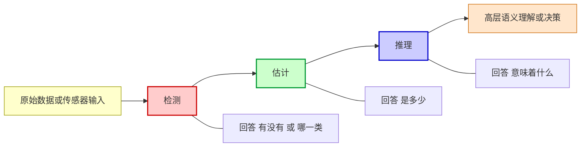
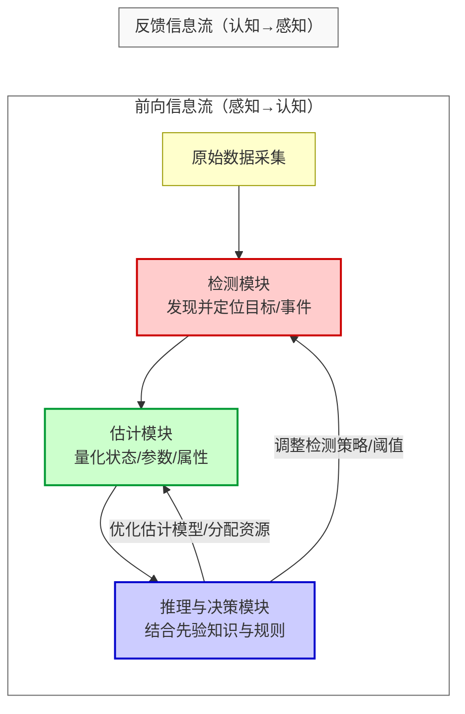

# 第一章 检测、估计与推理概述

## 1. 背景与研究意义

### 1.1 科学与工程中的“感知—理解”任务

在现代科学与工程领域——无论是物理实验、金融交易，还是自动驾驶、医疗诊断——人类与机器所面对的很多核心任务，都可以抽象为这样一个信息处理链路：

1. **获取信息**：通过摄像机、雷达、医学成像设备、传感探针等传感器收集原始数据；  
2. **识别和检测**：在海量、嘈杂的数据中判断关心的目标、事件或模式是否存在，并定位区域；  
3. **参数或状态估计**：在观测不完备且受随机扰动影响的情况下，尽可能精确地推测目标特征、系统状态或环境变量；  
4. **推理与决策**：结合已知信息和不确定性，得出进一步的结论并选择行动策略。

这种从**感知到理解**的多层次信息处理流程，在不同学科有不同的表述：
- 在**统计学**，对应“假设检验—参数估计—统计推断”；
- 在**信号处理**，对应“信号检测—参数估计—跟踪与预测”；
- 在**人工智能**，对应“感知—理解—推理与决策”。

---

### 1.2 三大核心任务的定义与问题类型

在人工智能（Artificial Intelligence）、模式识别（Pattern Recognition）、计算机视觉（Computer Vision）以及信号处理（Signal Processing）等领域，“**检测（Detection）**”、“**估计（Estimation）**”与“**推理（Inference）**”是三类**既相互独立又互相关联**的基础概念，是智能系统实现从采集信号到高层认知的核心环节：

- **检测**  
  目标：发现并分类感兴趣的目标或事件。  
  本质上回答“**有没有、哪一类**”的问题。  
  例：雷达中判断目标是否存在；图像中人脸识别。

- **估计**  
  目标：在检测或观测的基础上，对目标状态、参数或属性进行定量推断。  
  本质上回答“**是多少**”的问题。  
  例：利用测距信号估计目标距离、速度；从医学影像中测量肿瘤直径。

- **推理**  
  目标：在检测与估计的基础上，结合先验知识、逻辑规则或统计模型，得出新的结论或决策。  
  本质上回答“**意味着什么**”的问题。  
  例：基于交通参与者位置与速度推断碰撞风险；基于病灶特征分析恶性可能性。

三者的关系可用下图示意：

**图 1.1**  检测–估计–推理的三级关系示意图

三者之间**相互依存、层层递进**：检测提供感知入口，估计给出精确刻画，推理产出综合判断与决策。它们的协同作用，使智能系统能够从低层信号中提炼有意义的信息，并逐步形成对复杂场景与任务的高层理解和智能反应。

---

### 1.3 技术发展中的地位

自 20 世纪初以来，随着**信息论**、**概率统计**以及**计算技术**的进步，检测–估计–推理已成为现代信息与智能系统的三大核心支柱之一：

- **通信系统**：检测决定符号判决正确率，估计用于信道特征恢复，推理决定自适应编码和调制策略；
- **雷达/声纳/红外探测**：检测判断目标存在与否，估计其方位、距离与速度，推理用于目标分类和威胁评估；
- **医学成像**：检测识别病灶区域，估计其尺寸与演化速率，推理用于疾病分级和治疗方案制定；
- **商业与金融场景**：检测识别异常交易，估计市场指标趋势，推理分析背后因果和风险。

从科研与工程角度，深入研究这三类任务的理论与方法，不仅能显著提升感知与识别性能，还能直接支撑**自动化决策、智能控制、复杂系统优化**等应用。

---

### 1.4 学术源流与研究挑战

如果从学术史看，三者的核心思想源自不同的历史阶段：
- **检测理论**：起源于二战雷达信号目标检测的概率方法，Neyman–Pearson 提出最优假设检验准则；Shannon 的信息论为通信检测提供了理论上界。
- **估计理论**：Fisher 的最大似然估计（MLE）及充分性、Cramér–Rao 下界为估计精度奠基；后来发展出贝叶斯估计、鲁棒估计及高维收缩估计（如 James–Stein）。
- **推理理论**：由贝叶斯公式、统计推断和逻辑推理融合发展，到 21 世纪结合概率图模型、因果推理与深度学习，形成现代智能推理体系。

当前仍面临的核心挑战包括：
1. **噪声与不确定性建模**：如何刻画与抑制多源、不确定的随机扰动；
2. **性能极限分析**：有限观测下，可达到的检测概率、估计误差界限；
3. **计算可行性与实时性**：在保持精度的同时降低计算和存储消耗；
4. **多源信息融合与时变推理**：跨模态、多传感器异构数据如何在闭环系统中进行实时融合与更新；
5. **可解释性与鲁棒性**：尤其在基于深度模型的应用中，推理的可解释性与可靠性是重要瓶颈。

---

## 2. 检测、估计、推理的定义与核心问题

### 2.1 检测（Detection）

**内涵与定义**  
检测是**在给定观测数据的前提下，判断特定假设是否成立**的过程，其本质是回答“有没有？”和“在哪里？”的问题。它涉及从背景数据中发现感兴趣的目标、事件、模式或异常，并在空间或时间上予以定位。  
例如，在图像中检测人脸，就是判断图像中是否存在人脸，以及给出人脸所在的矩形框或掩膜区域；在雷达中检测目标，就是判定接收的回波中是否存在特定信号。

在数学抽象上，经典的二元假设检测框架为：
- **假设 H₀**（零假设）：如“信号不存在”；
- **假设 H₁**（备择假设）：如“信号存在”；
- 输入观测 \(x\) 经检测统计量 \(T(x)\) 与阈值 \(\eta\) 比较，根据准则作出判断：
  \[
  \text{若} \quad T(x) \ge \eta \ \Rightarrow \ 判为 H_1
  \]
  \[
  \text{若} \quad T(x) < \eta \ \Rightarrow \ 判为 H_0
  \]

**核心性能指标**  
- **检测概率** \(P_D\)：当 H₁ 为真时正确判为 H₁ 的概率；
- **虚警概率** \(P_{FA}\)：当 H₀ 为真时误判为 H₁ 的概率；
- **ROC 曲线**：刻画 \(P_D\) 与 \(P_{FA}\) 的折衷关系，反映检测器综合性能。

**意义与作用**  
检测是信息处理链的第一道关卡。它将海量数据中感兴趣的信息提取出来，为后续的识别、跟踪、分析打下基础，减少无关数据对计算和存储的占用。工业质检中的缺陷检测、安防系统的入侵检测、天文学的瞬变信号发现等都高度依赖检测准确性。检测性能的好坏直接制约整个系统的可靠性与效率。

**典型问题和方法**  
- 高斯白噪声中已知波形检测（匹配滤波是最优解）；
- 色噪声中未知幅度信号检测（需用卡亨南–洛维展开或广义似然比检验 GLRT）；
- 分布式多传感器网络的联合检测与信息融合。

---

### 2.2 估计（Estimation）

**内涵与定义**  
估计是指**根据观测数据推断未知参数、状态或属性**的过程，包括：
- **点估计**（point estimation）：给出一个最可能的数值；
- **区间估计**（interval estimation）：给出置信区间和置信度。

它的核心任务是量化回答“是多少？”的问题。例如，姿态估计会返回人体骨骼关键点的二维或三维坐标；相机位姿估计会输出位置与朝向参数；自动驾驶中会实时估算前方车辆的距离和相对速度。

数学模型设定为：
- 未知参数 \(\theta\)，观测数据 \(x\) 来自分布 \(p(x|\theta)\)；
- 设计估计器 \(\hat\theta(x)\) ，根据最优准则（如最小均方误差、最大似然）来最小化如下代价：
  \[
  \min_{\hat\theta} E\left[ L(\theta, \hat\theta(x))\right]
  \]
  其中 \(L\) 是损失函数。

**核心准则与性质**  
- **无偏性**：\(E[\hat\theta] = \theta\)；
- **有效性**：方差达到 Cramér–Rao 下界；
- **鲁棒性**：对模型失配和异常值不敏感（M 估计、RANSAC 等）。

**意义与作用**  
检测告诉我们“有一个目标”，而估计则提供数字化刻画：目标的精确位置、速度、大小、形状等。很多实际系统的决策是直接基于估计结果的。例如：
- 自动驾驶中，刹车和转向控制依赖于对障碍物距离与速度的估计；
- 医学影像中，肿瘤体积的估计直接关系到病情评估与治疗方案选择；
- 雷达和声纳中，目标方位、航迹估计决定防御与跟踪策略。

**典型问题和方法**  
- 参数估计：信道参数估计、频率/相位估计；
- 状态估计：卡尔曼滤波、扩展卡尔曼滤波、粒子滤波等；
- 高维估计：经验贝叶斯与 James–Stein 收缩估计在多维参数估计中的优越性。

---

### 2.3 推理（Inference）

**内涵与定义**  
推理是在已有观测和先验知识的基础上，推导未知事实、潜在结构或预测未来的过程。它整合检测与估计结果，形成高层语义理解和决策，是回答“意味着什么？”的问题。

推理的数学表述通常基于概率模型：
- 已知先验 \(p(\theta)\) 及观测得到的似然 \(p(x|\theta)\)，利用贝叶斯公式：
  \[
  p(\theta|x) = \frac{p(x|\theta)p(\theta)}{p(x)}
  \]
  得到后验分布，用于进一步决策或预测；
- 在复杂系统中，推理往往通过概率图模型（如贝叶斯网络、马尔可夫随机场）进行，结合精确推理（belief propagation）或近似方法（变分推理、MCMC）。

在人工智能范畴，推理还包括：
- **逻辑推理**：基于规则集合进行演绎与归纳；
- **因果推理**：基于因果图或结构方程模型推估干预的效果；
- **深度模型前向推理**：神经网络前向传播得到输出结果。

**意义与作用**  
推理是从“数据”到“知识”的桥梁，它不仅汇总低层信号处理结果，还结合背景知识、情境信息，为复杂环境提供智能化的响应。例如：
- 安防场景中，摄像头检测到深夜门窗开启（检测）、估计室内出现移动轨迹（估计），推理得出“可能存在非法入侵”的结论（推理）；
- 智能客服中，理解用户输入背后的意图和需求，推导出最合适的回复或操作。

**核心问题**  
- **不确定性量化**：如何用概率刻画推理结果的置信度；
- **可解释性**：如何让推理过程与因果链条对应起来；
- **动态性**：如何在时变环境中增量更新推理结果。

---

## 3. 三者的关系与 **检测–估计–推理闭环处理模式**

### 3.1 相互依赖关系  

在智能信息处理流程中，**检测**、**估计**与**推理**三者既有明确的分工，又存在紧密的衔接与反馈：

- **检测依赖于估计**  
  例如雷达信号检测，需要先**估计**噪声方差或背景分布，才能设定合理的检测阈值，提高检测的信噪比。
  
- **估计依赖于检测**  
  在多目标情境中，系统必须先**检测**出哪些测量数据真正属于目标，再进行参数或状态的精确估计，否则估计容易受背景干扰。

- **推理依赖于检测与估计**  
  推理通常基于目标**是否存在**（检测结果）、目标的精确**属性与状态**（估计结果），才能在此基础上综合先验知识、逻辑规则或概率模型，形成完整的结论和决策。

这意味着三者在一个真实系统中往往无法严格分割，而是通过**信息交互和反馈**共同实现感知与认知任务。

---

### 3.2 闭环模式与动态交互  

在理想的顺序处理模型中，三者呈现如下链路：

> 检测 → 估计 → 推理

即：先检测目标，再估计参数，最后基于结果进行推理与决策。

然而在**实际系统**中，这种单向流程很少出现，更常见的是一个**有前向与反馈通道的闭环**：

- **前向通道**（自底向上）：  
  原始数据 → 检测模块：发现并定位目标或事件  
  → 估计模块：测算状态、参数、属性  
  → 推理模块：综合信息得出高层理解与决策。  

- **反馈通道**（自顶向下）：  
  高层推理结果 → 调整检测策略（注意力机制、ROI 限定、阈值动态调整）  
  → 优化估计模块的计算精度与资源分配。  

**示例**：
- 在**自动驾驶**中： 推理发现前方有复杂交叉路口 → 反向要求检测器提高对行人和自行车的灵敏度，同时指令估计模块更高频率测量运动目标的速度变化。
- 在**医学诊断**中：推理提示某处肺部阴影疑似恶性 → 指令系统在该区域进行二次高分辨率扫描与更精细的测量分析。

---

### 3.3 Mermaid 闭环示意图  

**图 3.1**  “检测–估计–推理”闭环信息处理模式

该模式直观展示了：
- **前向链路**：自底向上的感知与处理流程；
- **反馈链路**：推理结果反向优化检测与估计，这是复杂动态环境下实现鲁棒性和效率的关键。

---

### 3.4 协同与性能优化  

采用闭环设计，相较于静态的顺序处理，有以下优势：

1. **鲁棒性提高**  
   推理可动态调整检测阈值以适应噪声环境或任务优先级变化，避免固定参数导致性能下降。
   
2. **资源利用优化**  
   仅在推理判断必要时，才启用高复杂度的精确估计算法，大幅降低运算和功耗。

3. **精度提升**  
   估计结果的可靠度可作为先验信息输入到检测器，提高下一轮检测的正确率。

4. **实时自适应**  
   在外部环境突变（如光照变化、信道恶化）时，可通过快速的反馈调整保持性能稳定。

**小结** 
现实中的检测、估计、推理系统更像是**动态的、具有双向信息流的循环网络**，而不是单向的信息流水线。通过前向的逐级抽象与反馈的策略优化，系统能在不确定性、动态性和多源复杂环境下，更智能、更高效地完成感知与决策任务。

---

## 4. 发展脉络与经典理论源流

为了理解今天的**检测–估计–推理**体系，有必要从两个层次回溯其发展历程：  
① 整体上按时间阶段划分的跨领域演化路径；  
② 三大核心任务（检测、估计、推理）在各自领域的理论与技术演进。

---

### 4.1 按时间阶段的总体发展脉络

#### （1）经典统计学阶段（20世纪初–中期）  
- **1900年代**：Karl Pearson 创立假设检验（卡方检验），Fisher 建立最大似然估计（MLE）、充分性等基本概念，为检测与估计奠定统计基础。  
- **1933年**：Neyman 与 Pearson 提出最优假设检验准则（N–P 准则），成为现代检测理论基石。  
- **1940年代**：二战期间，雷达、声纳等推动检测概率分析和信号估计理论飞速发展，Wiener 提出随机过程的最优滤波理论（Wiener Filter）。

#### （2）信息论与信号处理阶段（1948–1970年代）  
- **1948年**：Shannon 发表《A Mathematical Theory of Communication》，提出信道容量、信息熵，建立通信检测与编码的数学基础。  
- **1950–60年代**：Kay、Van Trees 等将贝叶斯方法引入检测与估计，系统化随机信号处理。  
- **1960年**：Kalman 提出卡尔曼滤波，实现动态系统状态的最优估计，革命性地应用于导航、跟踪等。

#### （3）现代统计与计算阶段（1980年代–2010年）  
- **鲁棒统计**（Huber）：增强估计对模型失配/异常值的抗干扰性。  
- **经验贝叶斯**与 **James–Stein估计**：解决多维参数估计的抗过拟合。  
- **EM算法/广义EM**：隐变量模型的高效最大似然估计。  
- **图模型与概率推理**（Pearl, 1988）：贝叶斯网络、马尔可夫随机场广泛应用于不确定性推断。  
- **变分推理、采样方法**（90年代起）：支持大规模近似贝叶斯推断。

#### （4）智能化与深度学习阶段（2010年至今）  
- CNN、RNN、Transformer 等深度结构实现端到端的检测与估计。  
- 深度生成模型（VAE、GAN）与概率图模型的融合，支持不确定性建模。  
- 强化学习+深度感知实现闭环检测–估计–推理的实时优化。  
- 神经符号推理兴起，尝试将逻辑可解释性引入深度定义域。

---

### 4.2 三大任务的各自发展轨迹与融合

#### （1）检测的发展  

**a. 信号检测理论**  
- **早期**：以雷达、通信中的二元假设检验为原型，提出 N–P 准则、似然比检验（LRT）。  
- **性能指标**：检测概率 \(P_D\) 与虚警概率 \(P_{FA}\)，通过 ROC 曲线分析折衷。  
- **复杂情况**：  
  - 复合假设检验（信号/噪声特性未知）→ 广义似然比检验（GLRT）；  
  - 贝叶斯检测（结合先验概率最小化平均错误概率/MAP）。  

这些理论在雷达回波检测、通信信号检测等奠定了通用数学框架。

**b. 计算机视觉目标检测**  
- **传统阶段**（人工特征+分类器）：Haar+AdaBoost（Viola–Jones，人脸检测），HOG+SVM（行人检测）。  
- **深度学习驱动**（2014–）：R-CNN 系列、YOLO、SSD 实现实时高精度检测；近年有 Transformer 检测架构（DETR）直接预测位置与类别。  

---

#### （2）估计的发展  

**a. 信号估计理论**  
- **经典方法**：最小二乘（LS）、最大似然（MLE）、贝叶斯估计（MAP、MMSE）。  
- **动态系统**：卡尔曼滤波、EKF、UKF、粒子滤波实现状态递推估计。  
- **鲁棒估计**：M估计、RANSAC 等提升对异常值的抗干扰性。

**b. 计算机视觉估计**  
- **几何驱动**：PnP 问题解位姿、立体匹配测深度；光流估计像素运动。  
- **优化驱动**：Bundle Adjustment 等全局优化估计。  
- **深度学习驱动**：端到端预测深度、姿态、光流等（Monodepth、HRNet）。

---

#### （3）推理的发展  

**a. 信号与统计推理**  
- **起源**：假设检验（N–P 框架）、贝叶斯推理（MAP/最小风险）。  
- **扩展**：复合假设、多假设推理、动态推理（贝叶斯滤波）。

**b. 视觉与 AI 推理**  
- **符号逻辑推理**（专家系统、规则库）；  
- **概率图模型推理**（贝叶斯网络、MRF、CRF）；  
- **深度推理**：模型前向推理阶段（如 CNN 分类输出）；  
- **神经符号推理**：感知–逻辑融合，多模态推理、因果推断。

---

### 4.3 学科交叉与趋势  

- **跨领域迁移**：雷达检测思想指导视觉目标检测；视觉估计中的几何优化被用于机器人导航信号融合。  
- **混合建模**：深度网络学习观测模型，统计推理提供不确定性评估（贝叶斯深度学习）。  
- **因果与可解释性**：推理不仅给出结论，还需解释原因（因果图+神经网络）。  
- **端到端闭环系统**：融合检测–估计–推理，提高动态环境下的鲁棒性与资源利用效率。

---

## 5. 应用领域

**检测（Detection）**、**估计（Estimation）**与**推理（Inference）**是人工智能、模式识别、计算机视觉、信号处理等领域的核心环节。它们不仅在各自任务中独立发挥作用，更常以组合的方式形成贯通的**智能处理链条**，实现从低层感知到高层决策的闭环，使系统具备实时性、鲁棒性与自适应能力。下面按典型应用领域说明三者如何协同落地。

---

### 5.1 自动驾驶与智能交通

- **检测**：识别与定位前方车辆、行人、交通标志、信号灯等关键交通元素；摄像头、毫米波雷达和激光雷达的多传感器融合提升环境覆盖和全天候可靠性。  
- **估计**：实时推算相对速度、距离、加速度、车道线曲率等动态参数。例如，激光雷达提供精确距信息，视觉光流估计运动趋势，毫米波雷达提供速度分量。  
- **推理**：基于多目标运动状态预测潜在冲突点和危险行为，生成安全路径和速度规划；在复杂场景下执行交通法规逻辑判断。  
- **闭环特征**：高层路径规划（推理结果）可反向调整低层传感器的采样频率、关注区域与检测灵敏度，将计算资源集中在安全关键物体上。

---

### 5.2 医学影像分析

- **检测**：在 X 光、CT、MRI、超声影像中快速定位肿瘤、出血点或器官边界，深度学习可在短时间自动标注可疑区域。  
- **估计**：对病灶进行体积、密度、形状、血流速度等定量测算，用于评估病变程度与演化趋势。  
- **推理**：结合患者病史、检查结果与临床知识，推断病灶良恶性、制定个体化治疗方案。  
- **特点**：现代影像 AI 在检测与估计精度方面已接近或超过基层医生水平，但推理与临床决策仍需结合大量非显性知识与专业经验。

---

### 5.3 安全监控与视频分析

- **检测**：在公共安全场景中识别入侵目标、人脸、异常行为（如奔跑、跌倒、聚集）。  
- **估计**：跟踪目标的路径、速度、停留时长等动态特征，结合多摄像机实现跨镜追踪。  
- **推理**：评估安全威胁等级、生成警报策略，并在必要时分页现场资源（安保调度）。  
- **延伸**：视频分析可与声学检测、红外热成像等多模态感知结合，推理层综合多源信息实现更准确判断。

---

### 5.4 工业质检与预测性维护

- **检测**：在生产线上快速发现产品表面瑕疵、裂纹、划痕，或传感网络中检测设备异常振动、温度等信号。  
- **估计**：测算缺陷的尺寸、位置或设备健康参数、故障发展速率。  
- **推理**：根据状态演化预测剩余使用寿命，自动生成维修或替换计划，实现从事后维修转向预测性维护。  
- **典型价值**：降低停机损失、延长设备寿命、提高全生命周期运维效率。

---

### 5.5 遥感监测与地理信息

- **检测**：在卫星或无人机影像中识别地物变化（植被覆盖减少、建筑增加、洪水淹没范围）。  
- **估计**：计算变化区域的面积、建筑高度、地形高程等精确地理参数。  
- **推理**：结合气象、水文、土地利用等多源数据，分析变化原因（如自然灾害、城市扩张、非法采伐）。  
- **特点**：常需跨模态信息融合（如光学成像 + SAR雷达），且检测/估计结果需适配复杂环境后再进入推理步骤。

---

### 5.6 机器人与增强/虚拟现实（AR/VR）

- **检测**：识别环境中的物体、障碍物、用户手势和姿态。  
- **估计**：实时计算机器人自定位与障碍物位置、AR/VR 场景中的头部与手部姿态关键点。  
- **推理**：在机器人中，推理模块规划避障路径和操作顺序；在 AR/VR 系统中，推理用户意图并触发相应虚拟交互。  
- **闭环应用**：推理生成的操作指令会调整机器人传感器采样策略或虚拟引擎渲染视角，实现沉浸式和高效行动。

---

## 6. 图像智能分析实例  

图像智能分析是检测（Detection）、估计（Estimation）与推理（Inference）三者协同作用的典型舞台。图像数据中蕴含着丰富的视觉信息，但要让机器理解这些信息，需要从低层像素到高层语义逐级处理。检测用于发现感兴趣的目标或区域，估计用于量化描述这些目标的属性，推理则将多种信息结合起来，得出更深层次的结论。  

在计算机视觉领域，目标分类（Classification）、目标检测（Object Detection）与图像分割（Segmentation）是三类重要任务，它们分别体现了三者在不同层次上的价值。下面我们结合实例，深入分析它们与检测、估计、推理的关系及实际应用价值。  

---

### 6.1 分类（Classification）  

**任务定义**  
分类任务是给定一张图像，判断它属于哪一类别。例如，判断图片中是猫、狗还是汽车。在单标签分类中，每张图像只对应一个类别；在多标签分类中，一张图像可能同时包含多个类别标签。  

**与三者的关系**  
- **检测**：在纯分类任务中，检测的作用可以退化为“整幅图像是否包含某类目标”的判断。例如，判断一张照片中是否有猫，其实就是在全图范围内进行目标存在性检测。  
- **估计**：分类本质上是对类别标签的概率分布进行估计，模型会给出每个类别的置信度。例如，猫 0.85、狗 0.10、其他 0.05。  
- **推理**：在多标签、多任务场景中，分类结果可能与上下文信息、其他感知结果结合进行推理。例如，检测到雪山背景和滑雪板，再结合分类结果推理出“滑雪运动”场景；或者在电商平台中，识别出商品类别后结合用户行为数据推理用户兴趣。  

**技术要点**  
常用的分类模型包括卷积神经网络（CNN）、视觉 Transformer（ViT）等。训练时需要大量标注好的样本，损失函数常用交叉熵（Cross Entropy）。在实际系统中，分类往往是更复杂任务的一个子模块，例如自动驾驶中对交通标志的分类。  

**应用示例**  
- 电商商品自动分类  
- 医学影像疾病类型识别  
- 卫星遥感地物分类  
- 社交平台图片内容审核  

**价值分析**  
分类提供了最基础的语义标签，是后续检测、分割、检索等任务的基础。即使在没有明确目标位置需求的场景中，分类也能为内容管理、推荐系统、统计分析提供有力支持。  

---

### 6.2 检测（Detection）  

**任务定义**  
目标检测是在图像或视频中找到所有感兴趣目标的位置与类别，通常以边界框（Bounding Box）的形式表示位置，并附带类别标签。  

**典型示例：自动驾驶中的行人检测**  
- **检测**：识别并框出每个行人的位置，输出边界框和类别（行人）。  
- **估计**：在检测结果的基础上，进一步估计行人的速度、朝向、步态等属性。这些信息可通过多帧跟踪计算得到。  
- **推理**：结合道路结构、交通规则、行人位置和速度，推理其未来路径，并判断是否存在与车辆的碰撞风险，从而触发减速或停车策略。  

**技术要点**  
常用检测算法包括两阶段方法（如 Faster R-CNN）和单阶段方法（如 YOLO、SSD）。前者精度较高，后者速度更快。在视频检测中，还会结合多目标跟踪（MOT）技术保持目标 ID 的一致性。  

**应用场景**  
- 智能交通：车辆、行人、交通标志检测  
- 安防监控：入侵检测、遗留物检测  
- 工业质检：缺陷检测、零件检测  
- 零售行业：货架商品检测、顾客行为检测  

**价值分析**  
- **安全性**：及时发现潜在危险目标，例如自动驾驶中的行人、自行车。  
- **效率**：为后续任务（如跟踪、识别）提供输入，减少搜索范围。  
- **可扩展性**：检测框结果可以输入到其他模型进行属性分析，如姿态估计、行为识别。  

---

### 6.3 分割（Segmentation）  

**任务定义**  
分割任务将图像划分为若干区域，每个区域对应一个语义类别（语义分割）或实例（实例分割）。语义分割关注类别，实例分割还需区分同类的不同个体。  

**典型示例：医学影像中的肿瘤分割**  
- **检测**：先粗略定位肿瘤的大致区域，缩小分析范围。  
- **估计**：精确估计肿瘤的边界形状、面积、体积等参数，这些量化指标对于治疗评估至关重要。  
- **推理**：结合患者病史、影像特征、实验室检查结果，推理肿瘤的类型（良性/恶性）、分期以及发展趋势，为医生制定治疗方案提供依据。  

**技术要点**  
常用分割网络包括 U-Net、Mask R-CNN、DeepLab 系列等。训练需要像素级标注数据，成本较高。分割结果可直接用于测量、三维重建等任务。  

**应用场景**  
- 医学影像分析：器官、病灶分割  
- 自动驾驶：道路、车道线、障碍物分割  
- 遥感影像：地物分类、农作物识别  
- 工业检测：表面缺陷精确定位  

**价值分析**  
- **精细化**：像素级分析为精确测量提供基础。  
- **决策支持**：为医生、工程师提供量化指标。  
- **自动化**：减少人工标注与分析工作量，提高效率。  

---

### 4. 综合示例：智慧安防系统  

智慧安防系统是检测、估计与推理协同工作的典型案例。系统通过部署在公共场所的摄像头采集视频流，实时分析画面，保障安全。  

**流程**  
1. **检测**：发现画面中的人、车辆、遗留物品等目标，并标注位置。  
2. **估计**：对检测到的人员进行数量统计、速度估计、行为模式分析（如走路、奔跑、徘徊）。  
3. **推理**：结合时间、地点、历史数据推理出异常事件，例如深夜在限制区域出现人员、在地铁站长时间徘徊、在商场出口聚集等。  

**技术实现**  
- 检测阶段可使用 YOLOv8、Faster R-CNN 等目标检测算法。  
- 估计阶段结合光流分析、姿态估计、轨迹拟合等方法。  
- 推理阶段可基于规则引擎（如 IF-THEN 规则）或机器学习模型（如异常检测算法、图神经网络）进行综合判断。  

**价值**  
- **实时预警**：提前发现潜在威胁，减少事故发生。  
- **资源优化**：根据推理结果动态调整安保力量部署。  
- **证据留存**：检测与估计结果可作为事后分析的证据。  

---

## 7. 总结与展望

检测、估计与推理是智能系统从感知到决策的三大支柱。检测负责发现目标，估计负责量化属性，推理负责综合判断。三者相辅相成，构成了完整的信息处理链条。

随着深度学习、传感器技术、计算硬件的发展：
- 检测将更快、更准、更鲁棒
- 估计将更精细、更全面
- 推理将更智能、更可解释

未来，结合多模态感知、知识图谱、因果推断等技术，检测、估计与推理将进一步融合，推动人工智能向类人认知迈进。在图像智能分析中，这种融合将带来更高的自动化程度、更强的环境适应性和更丰富的应用场景，从而在工业、医疗、安防、交通等领域创造更大价值。

---
