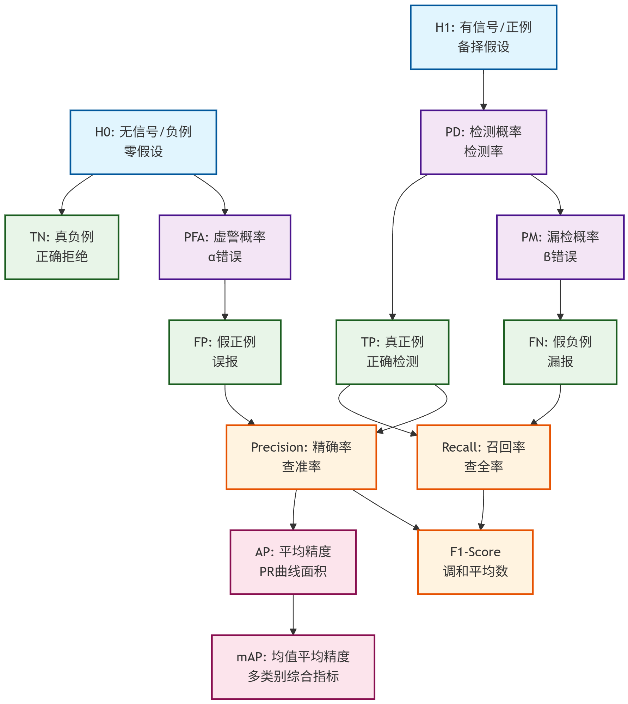
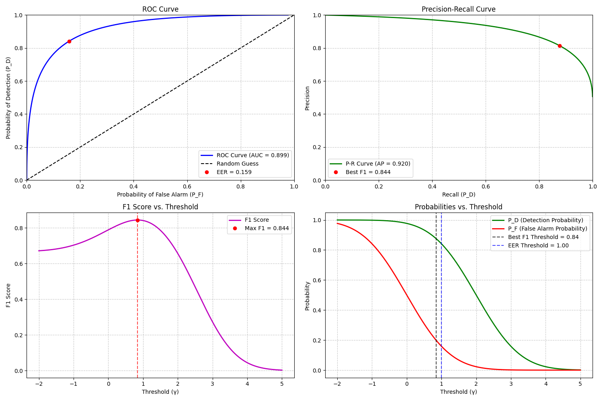

# 第三章 假设检验与信号检测理论


本章系统介绍统计假设检验与信号检测理论的基本原理与方法，旨在建立从数学建模、最优决策准则到实际检测器实现的完整框架。检测问题的核心是区分不同假设下的观测信号，典型情形由**随机信号加随机噪声**构成。我们首先从统计描述入手，给出随机信号与噪声的概率模型，并将检测问题抽象为**二元假设检验**（如有无目标）、**多元假设检验**（如多类目标分类）两类数学模型。这类模型的基本要素包括假设集合、观测数据分布、先验概率和代价函数。

在理论部分，本章比较了多种常用检测准则及其适用条件。**贝叶斯准则**以最小化平均风险为目标，考虑先验知识与不同错误类型代价；在其框架下，**最大后验概率（MAP）准则**等价于最小错误概率决策，是工程实践的常用形式。**纽曼–皮尔逊（Neyman–Pearson）准则**则聚焦在给定虚警概率下最大化检测概率，是雷达、通信等领域标准的假设检验方法；**极大极小（minimax）准则**适用于先验信息极不确定的场景，通过最优应对最坏情况来保障鲁棒性。我们讨论了这些准则与贝叶斯检测模型的对应关系和异同。

在似然比检验部分，本章给出基本**似然比检验（LRT）**的数学公式与几何解释，说明它在高斯背景下的简单形式。对于涉及未知参数的**复合假设**问题，介绍了**广义似然比检验（GLRT）**，通过用最大似然估计替代未知量获得可实现的检测器。我们进一步引入**ROC曲线**（Receiver Operating Characteristic），作为综合评估检测概率与虚警概率关系的工具，分析性能权衡和阈值选择。

针对已知信号在噪声背景下的最优检测问题，本章推导了**匹配滤波器**，并证明在白噪声条件下它能够最大化输出信噪比（SNR），且与高斯假设下的似然比检验等价。这一部分展现了检测理论与信号处理（滤波设计）的自然联系。在色噪声情况下，引入噪声协方差描述和**Karhunen–Loève**展开，通过白化变换将色噪声检测问题等效为白噪声情形，从而设计有色环境下的匹配滤波器。

对于**复合假设与不确定性处理**，本章讨论了当信号参数（如幅度、相位、到达角）未知时的检测策略比较，分析了GLRT在此类问题中的准最优性与鲁棒性特征，并介绍了其他鲁棒检测方法在先验不足、模型失配情况下的表现。

最后，本章探讨了检测理论与现代机器学习的联系，将假设检验的**决策边界**和**似然比阈值**与统计分类器的判别函数对应起来，比较ROC、PR曲线在机器学习系统评估中的应用价值，说明传统检测性能分析工具如何无缝对接当前数据驱动的分类与识别任务。

通过理论公式的推导和性能指标的比较，读者可以掌握检测系统的建模方法、准则选择原则及在不确定性条件下的合理应对策略，从而为通信、雷达、声纳、生物医学信号分析和模式识别等领域的实际检测问题建立坚实的理论基础。


---

## 3.1 检测问题的统计建模


在实际信号处理系统中，**从噪声中检测信号**是一个普遍而重要的任务。无论是雷达目标探测、无线通信符号判决，还是声纳搜索、水下定位或医学成像，核心问题都是在干扰和噪声背景下，依据有限观测数据，判断所关心的信号是否存在以及其类别。  

这类问题具有突出的**统计不确定性特征**：观测数据通常受到不可控的随机噪声污染，而信号本身也可能随时间、空间或其他环境因素变化。因此，必须通过**统计建模**来刻画数据产生的机制，并据此设计检测算法。  

在统计假设检验框架下，检测问题可抽象为**一组互斥假设**的竞争判决过程。每个假设描述一种可能的信号状态及其对应的概率模型。例如，在二元假设检验中：
- \(H_0\)：信号不存在，观测数据服从“仅噪声”分布；
- \(H_1\)：信号存在，观测数据服从“信号+噪声”的分布。  

建模的第一步是明确假设集合，并利用物理模型或历史数据确定噪声与信号的统计特性（均值、方差、功率谱等）。如果存在多种信号可能性，则形成多元假设检验模型。  

在模型给定的基础上，检测问题转化为**基于观测值选择最合理假设的决策过程**。判决准则的设计可能遵循不同目标：最大化检测概率、约束虚警概率、最小化平均风险，或在缺乏先验信息时追求鲁棒性。  

这种基于概率模型的抽象，为分析检测器性能、比较不同算法以及优化系统设计提供了统一的理论基础，使雷达、通信、声纳、医学影像等应用中的检测任务能够在严谨的数学框架下展开。


---

### 3.1.1 信号与噪声的数学描述

在一般加性噪声模型中：

\[
x(t) = s(t) + n(t)
\]

- \( s(t) \)：待检测信号，信号参量可能已知或未知。  
- \( n(t) \)：噪声，通常建模为随机过程。常假设零均值、平稳、方差有限，有时是高斯过程。

对数字化后的系统，采样得到离散观测向量：

\[
\mathbf{x} = [x_1, x_2, \dots, x_N]^T
\]

噪声统计特性：
- 均值向量：\(\boldsymbol{\mu}_n = E[\mathbf{n}]\)  
- 协方差矩阵：\(\mathbf{R}_n = E[(\mathbf{n}-\boldsymbol{\mu}_n)(\mathbf{n}-\boldsymbol{\mu}_n)^T]\)

特别地，若 \(\mathbf{R}_n = \sigma^2 \mathbf{I}\)，则噪声是**白噪声**。

---

### 3.1.2 二元假设检验模型


二元假设检验是最基本的统计检测模型，可写为：

\[
\begin{cases}
H_0: \mathbf{x} = \mathbf{n} & \text{（无信号，仅噪声）} \\
H_1: \mathbf{x} = \mathbf{s} + \mathbf{n} & \text{（有信号）}
\end{cases}
\]

其中：
- \(\mathbf{x} \in \mathbb{R}^N\) 或 \(\mathbb{C}^N\) 为观测向量；
- \(\mathbf{n}\) 为噪声向量，统计特性（如 PDF、均值、方差、协方差矩阵）已知；
- \(\mathbf{s}\) 可能是完全已知的波形矢量，也可能包含未知参数（如幅度、相位），稍后可结合相应估计方法处理。

**统计建模关键点**：
1. **似然函数（Likelihood Function）**  
   在不同假设下，观测数据的条件概率密度函数为：
   \[
   p(\mathbf{x} | H_0) \quad\text{和}\quad p(\mathbf{x} | H_1)
   \]
   当噪声高斯、方差 \(\sigma^2\) 已知时，通常有：
   \[
   p(\mathbf{x}|H_0) = \frac{1}{(2\pi\sigma^2)^{N/2}} \exp\left(-\frac{\lVert \mathbf{x} \rVert^2}{2\sigma^2}\right)
   \]
   \[
   p(\mathbf{x}|H_1) = \frac{1}{(2\pi\sigma^2)^{N/2}} \exp\left(-\frac{\lVert \mathbf{x} - \mathbf{s} \rVert^2}{2\sigma^2}\right)
   \]
   这里的 \(p(\mathbf{x}|H_i)\) 就是**似然函数**，它反映了在特定假设成立时，产生当前观测数据的概率大小。

2. **后验概率（Posterior Probability）**  
   如果先验概率 \(P(H_0)\)、\(P(H_1)\) 已知，则可用贝叶斯公式得到：
   \[
   P(H_i | \mathbf{x}) = \frac{p(\mathbf{x} | H_i) \, P(H_i)}{p(\mathbf{x})}
   \]
   其中：
   \[
   p(\mathbf{x}) = p(\mathbf{x}|H_0)P(H_0) + p(\mathbf{x}|H_1)P(H_1)
   \]
   后验概率用于贝叶斯和最大后验（MAP）判决准则，是基于观测值对假设进行概率更新的核心量。

---

### 3.1.3 多元假设检验模型

在更一般的情形中，假设检验包含 **多种可能信号状态**，例如通信系统中 \(M\) 进制调制符号的判决问题：

\[
H_i: \mathbf{x} = \mathbf{s}_i + \mathbf{n}, \quad i = 0, 1, \dots, M-1
\]
- \(\mathbf{s}_i\)：假设 \(H_i\) 下的信号矢量（例如不同调制符号对应的已知波形）
- \(\mathbf{n}\)：噪声向量，统计特性已知

**似然函数**
在多假设条件下，每个假设对应一个条件概率密度：
\[
p(\mathbf{x}|H_i), \quad i = 0, \dots, M-1
\]
若噪声为协方差矩阵 \(\mathbf{C}_n\) 的高斯矢量，则：
\[
p(\mathbf{x}|H_i) = \frac{1}{(2\pi)^{N/2} |\mathbf{C}_n|^{1/2}} \exp\left[ -\frac{1}{2} (\mathbf{x}-\mathbf{s}_i)^\mathrm{T} \mathbf{C}_n^{-1} (\mathbf{x}-\mathbf{s}_i) \right]
\]

**后验概率分布**
如果各个假设有已知先验概率 \(P(H_i)\)，则可用贝叶斯公式计算：
\[
P(H_i|\mathbf{x}) = \frac{p(\mathbf{x}|H_i)P(H_i)}{\sum_{k=0}^{M-1} p(\mathbf{x}|H_k)P(H_k)}
\]
这一步将先验概率与当前观测的似然结合，得到各个假设的后验分布，使判决能够依据“观测+先验”的综合信息进行。

---

## 3.2 检测的最优决策原则


在统计信号检测中，所谓“最优决策”本质上是：基于观测数据及其统计模型，在一组候选假设中按照预先设定的数学准则选择最优结果。该过程可抽象为一个优化问题。  

首先，构建互斥且完备的假设集合  
\[
\{H_0, H_1, \dots, H_{M-1}\}
\]  
并在每个假设下给出观测数据的概率模型 \(p(\mathbf{x} \mid H_i)\)，同时结合先验概率 \(P(H_i)\) 或判决代价矩阵 \(C_{ij}\)。  

其次，需要用数学形式刻画性能指标，如风险函数、期望判决代价、错误概率，或在约束条件下最大化某项检测性能。判决规则可视为从观测空间到假设集合的映射，等价于将观测空间划分为 \(M\) 个互不重叠的决策区域。  

最终目标是选择使期望性能最优的划分，即  
\[
\min_{\{\mathcal{R}_j\}} \; \mathbb{E}[\text{损失}], \quad \text{s.t. 约束条件}
\]  

统计与优化理论表明，在许多常见准则下，该类最优划分问题可化简为：对某个适当的统计量与阈值进行比较，从而得到满足设定准则的最优判决规则。  

---

### 3.2.1 贝叶斯准则与似然比检验（LRT）


#### 1）问题模型

考虑二元假设检验：
\[
\begin{cases}
\mathcal{H}_0: \mathbf{x} \sim p(\mathbf{x}|\mathcal{H}_0) \\[2mm]
\mathcal{H}_1: \mathbf{x} \sim p(\mathbf{x}|\mathcal{H}_1)
\end{cases}
\]
其中：  
- \(\mathbf{x}\) 为观测向量（可能是多维的信号或特征）；  
- \(p(\mathbf{x}|\mathcal{H}_i)\) 是观测在假设 \(\mathcal{H}_i\) 下的**已知概率密度**；  
- \(\pi_i = P(\mathcal{H}_i)\)  为先验概率，\(\pi_0+\pi_1=1\)；  
- \(C_{ji}\) 为**代价系数**：真为 \(H_i\) 时判为 \(H_j\) 所付出的代价（\(i,j \in \{0,1\}\)）。
  

  - **正确判决代价**：\(C_{ii}\)，即判决与真实假设一致时的代价。通常取为零或一个很小的值，表示无损失或仅有微小消耗。  
  - **错误判决代价**：\(C_{ji}\)（\(j \neq i\)），即发生误判时的代价。通常远大于正确判决代价，反映错误带来的性能或经济损失。  

  - **常见关系**：
  \[
  C_{ii} < C_{ji}, \quad j \neq i
  \]
  即正确判决的代价低于错误判决的代价。这是大多数检测问题的自然假设。  


---

#### 2）平均风险 (Bayes Risk)

平均风险定义为：
\[
R = \sum_{i=0}^1\sum_{j=0}^1 C_{ji} \pi_i \int_{\mathcal{R}_j} p(\mathbf{x}|\mathcal{H}_i)\,d\mathbf{x}
\]
其中 \(\mathcal{R}_j\) 为决策区域（观测值落在 \(\mathcal{R}_j\) 时就判为 \(H_j\)）。

**目标**：选择决策区域 \(\mathcal{R}_0, \mathcal{R}_1\) 使 \(R\) 最小。

---

#### 3）条件风险与逐点最优决策

对于给定的 \(\mathbf{x}\)：  
- 若判为 \(H_0\)，条件风险：
\[
r_0(\mathbf{x}) = C_{00} \pi_0 p(\mathbf{x}|\mathcal{H}_0) + C_{01} \pi_1 p(\mathbf{x}|\mathcal{H}_1)
\]
- 若判为 \(H_1\)，条件风险：
\[
r_1(\mathbf{x}) = C_{10} \pi_0 p(\mathbf{x}|\mathcal{H}_0) + C_{11} \pi_1 p(\mathbf{x}|\mathcal{H}_1)
\]

贝叶斯准则：在每一点 \(\mathbf{x}\) 上，选择条件风险更小的决策即可：
\[
\text{若 } r_1(\mathbf{x}) < r_0(\mathbf{x}) \ \Rightarrow\ \text{判 } H_1; \quad \text{否则判 } H_0.
\]

---

#### 4）似然比判决的推导

比较 \(r_1(\mathbf{x})\) 与 \(r_0(\mathbf{x})\)：
\[
C_{10} \pi_0 p(\mathbf{x}|\mathcal{H}_0) + C_{11} \pi_1 p(\mathbf{x}|\mathcal{H}_1) \quad \overset{H_1}{\underset{H_0}{\lessgtr}} \quad C_{00} \pi_0 p(\mathbf{x}|\mathcal{H}_0) + C_{01} \pi_1 p(\mathbf{x}|\mathcal{H}_1)
\]
整理得到：
\[
\big[ C_{10} - C_{00} \big]\, \pi_0 p(\mathbf{x}|\mathcal{H}_0) \quad \overset{H_1}{\underset{H_0}{\lessgtr}} \quad \big[ C_{01} - C_{11} \big]\, \pi_1 p(\mathbf{x}|\mathcal{H}_1)
\]
两边同时除以 \(p(\mathbf{x}|\mathcal{H}_0)\,(C_{01}-C_{11})\,\pi_1\)（假定 $C_{01}\neq C_{11}$）可得：
\[
\frac{p(\mathbf{x}|\mathcal{H}_1)}{p(\mathbf{x}|\mathcal{H}_0)} \quad \overset{H_1}{\underset{H_0}{\gtrless}} \quad \frac{[C_{10}-C_{00}]\,\pi_0}{[C_{01}-C_{11}]\,\pi_1}
\]

**最终一般形式**：
\[
\boxed{ \Lambda(\mathbf{x}) \triangleq \frac{p(\mathbf{x}|\mathcal{H}_1)}{p(\mathbf{x}|\mathcal{H}_0)} \ \overset{H_1}{\underset{H_0}{\gtrless}} \ \eta_{\text{Bayes}}, \quad \eta_{\text{Bayes}} = \frac{[C_{10}-C_{00}]\,\pi_0}{[C_{01}-C_{11}]\,\pi_1} }
\]

---

#### 5）特殊情况简化

- **对称代价**（正确判决代价为 0，错误代价为 1）：
  \[
  C_{00}=C_{11}=0,\quad C_{01}=C_{10}=1
  \]
  阈值公式化为：
  \[
  \eta_{\text{Bayes}} = \frac{\pi_0}{\pi_1}
  \]
  特别地，若 $\pi_0=\pi_1=0.5$，则 $\eta_{\text{Bayes}} = 1$，贝叶斯判决退化为最大似然（ML）判决：
  \[
  \frac{p(\mathbf{x}|H_1)}{p(\mathbf{x}|H_0)} \gtrless 1
  \]

---

#### 6）拓展到多元假设

假设有 $M$ 个互斥且完备的假设：
\[
\mathcal{H}_0,\ \mathcal{H}_1,\ \dots,\ \mathcal{H}_{M-1}
\]
- 先验概率：\(\pi_i\)；
- 模型：\(p(\mathbf{x}|\mathcal{H}_i)\)；
- 代价矩阵：$C_{ji}$，真为 \(H_i\) 而判为 \(H_j\) 的代价。

平均风险：
\[
R = \sum_{i=0}^{M-1} \sum_{j=0}^{M-1} C_{ji}\, \pi_i \int_{\mathcal{R}_j} p(\mathbf{x}|\mathcal{H}_i)\,d\mathbf{x}
\]
点态条件风险：
\[
r_j(\mathbf{x}) = \sum_{i=0}^{M-1} C_{ji} \,\pi_i \, p(\mathbf{x}|\mathcal{H}_i)
\]
**最优判决**：
\[
\boxed{\text{在每个 $\mathbf{x}$ 上选 $j$ 使 $r_j(\mathbf{x})$ 最小}}
\]
- 如果 $C_{ji}$ 对称（$C_{ii}=0, C_{ji}=1$ ），则此规则等价于：
   $$
   \boxed{\text{选择后验概率 } P(H_j \mid \mathbf{x}) \ \text{最大者作为判决假设 } H_j \quad (\text{MAP 判决})}
   $$
   其中 $P(H_j|\mathbf{x}) \propto \pi_j p(\mathbf{x}|\mathcal{H}_j)$。

#### 7) 举例


**例题3.1**  
已知接收机输出观测 \(x\) 在两种假设下分布：
\[
\mathcal{H}_0: x \sim \mathcal{N}(0,1),\quad
\mathcal{H}_1: x \sim \mathcal{N}(1,1)
\]
先验概率：\(\pi_0=0.7\), \(\pi_1=0.3\)，错误代价：\(C_{10}=1\), \(C_{01}=2\)。  
求贝叶斯最优检测门限。


**解答**

1. **似然比**
   \[
   \Lambda(x) = \frac{p(x|\mathcal{H}_1)}{p(x|\mathcal{H}_0)} = \frac{\frac{1}{\sqrt{2\pi}}e^{-(x-1)^2/2}}{\frac{1}{\sqrt{2\pi}}e^{-x^2/2}} = e^{[ - (x-1)^2 + x^2 ]/2}
   \]
   整理指数：
   \[
   -(x-1)^2+x^2 = -(x^2 - 2x + 1) + x^2 = 2x - 1
   \]
   所以：
   \[
   \Lambda(x) = e^{(2x-1)/2}
   \]

2. **贝叶斯阈值**
   \[
   \eta_{\text{Bayes}} = \frac{\pi_0 C_{10}}{\pi_1 C_{01}} = \frac{0.7 \times 1}{0.3 \times 2} = \frac{0.7}{0.6} \approx 1.167
   \]

3. **决策条件**
   \[
   e^{(2x-1)/2} \underset{\mathcal{H}_0}{\overset{\mathcal{H}_1}{\gtrless}} 1.167
   \]
   两边取自然对数：
   \[
   \frac{2x-1}{2} \gtrless \ln(1.167) \approx 0.154
   \]
   所以：
   \[
   2x - 1 \gtrless 0.308 \ \Rightarrow\ x \gtrless 0.654
   \]

**答**：当 \(x>0.654\) 判 \(\mathcal{H}_1\)，否则判 \(\mathcal{H}_0\)。


---

**例题 3.2**  
已知接收机输出观测向量 \(\mathbf{x} = [x_1, x_2]^T\)  

在两种假设下的分布为：
\[
\mathcal{H}_0: \mathbf{x} \sim \mathcal{N}\left( \begin{bmatrix}0\\0\end{bmatrix},\mathbf{I}_2 \right), \quad
\mathcal{H}_1: \mathbf{x} \sim \mathcal{N}\left( \begin{bmatrix}1\\1\end{bmatrix},\mathbf{I}_2 \right)
\]
其中 \(\mathbf{I}_2\) 是 \(2\times 2\) 单位矩阵（方差均为 1，独立噪声分量）。  

先验概率：\(\pi_0=0.5,\ \pi_1=0.5\)；错误代价：\(C_{10} = 1, \ C_{01} = 2\)。

**求**：贝叶斯最优检测门限与判决规则。

---

**解答**

1. **似然比**  
二维高斯 PDF 为：
\[
p(\mathbf{x}|\mathcal{H}_i) = \frac{1}{2\pi} \exp\left( -\frac{1}{2} (\mathbf{x} - \boldsymbol{\mu}_i)^T \mathbf{I}^{-1} (\mathbf{x} - \boldsymbol{\mu}_i) \right)
\]
均值：\(\boldsymbol{\mu}_0 = [0,0]^T\)，\(\boldsymbol{\mu}_1 = [1,1]^T\)。

似然比：
\[
\Lambda(\mathbf{x}) = \frac{p(\mathbf{x}|\mathcal{H}_1)}{p(\mathbf{x}|\mathcal{H}_0)}
= \frac{\frac{1}{2\pi} e^{ -\frac12 (\mathbf{x}-\mu_1)^T (\mathbf{x}-\mu_1) }}{\frac{1}{2\pi} e^{ -\frac12 (\mathbf{x}-\mu_0)^T (\mathbf{x}-\mu_0)} }
\]
化简指数部分：
\[
-(\mathbf{x}-\mu_1)^T(\mathbf{x}-\mu_1) + (\mathbf{x}-\mu_0)^T(\mathbf{x}-\mu_0)
\]
代入 \(\mu_0=[0,0]^T, \ \mu_1=[1,1]^T\)：
- \((\mathbf{x}-\mu_1)^T(\mathbf{x}-\mu_1) = (x_1-1)^2 + (x_2-1)^2 = x_1^2 - 2x_1 + 1 + x_2^2 - 2x_2 + 1\)
- \((\mathbf{x}-\mu_0)^T(\mathbf{x}-\mu_0) = x_1^2 + x_2^2\)

差为：
\[
[\,x_1^2+x_2^2 - 2x_1 - 2x_2 + 2\,] - [\,x_1^2+x_2^2\,] = - 2x_1 - 2x_2 + 2
\]
注意我们要的是：
\[
-(x_1-1)^2-(x_2-1)^2 + x_1^2 + x_2^2 = 2x_1 + 2x_2 - 2
\]
所以：
\[
\Lambda(\mathbf{x}) = \exp\left( \frac{2x_1+2x_2 - 2}{2} \right) = \exp\left( x_1 + x_2 - 1 \right)
\]

2. **贝叶斯阈值**  
\[
\eta_{\text{Bayes}} = \frac{\pi_0 C_{10}}{\pi_1 C_{01}} = \frac{0.5 \times 1}{0.5 \times 2} = \frac{0.5}{1} = 0.5
\]

3. **决策条件**  
判决规则为：
\[
\Lambda(\mathbf{x}) \underset{\mathcal{H}_0}{\overset{\mathcal{H}_1}{\gtrless}} \ \eta_{\text{Bayes}}
\]
即：
\[
e^{x_1+x_2-1} \gtrless 0.5
\]
取对数：
\[
x_1 + x_2 - 1 \gtrless \ln(0.5) \approx -0.693
\]
因此：
\[
x_1 + x_2 \gtrless 0.307
\]

4. **等效统计量**  
这里的  
\[
T(\mathbf{x}) = x_1 + x_2
\]  
就是**等效的一维判决统计量**（对应于把观测向量在 \([1,1]^T\) 方向上投影，再按噪声方差加权）。判决过程就是比较 \(T(\mathbf{x})\) 与门限 \(0.307\)。  

**答**：
\[
T(\mathbf{x}) = x_1 + x_2 \gtrless_{H_0}^{H_1} \; 0.307
\]  
当投影和大于 0.307 判 \(\mathcal{H}_1\)，否则判 \(\mathcal{H}_0\)。


---

### 3.2.2 最大后验（MAP）准则


#### **1） 定义**  
最大后验概率（MAP）准则是统计检测理论中最常用的判决规则之一。其思想是：  
> 已知各假设的先验概率和观测数据的条件概率模型，选择**后验概率**最大的假设。

换句话说，MAP 判决是：
\[
\hat{\mathcal{H}} = \arg\max_{i \in \{0,1,\dots,M-1\}} P(\mathcal{H}_i | \mathbf{x})
\]
它直接回答了：“在观测结果 \(\mathbf{x}\) 已经发生之后，哪个假设成立的概率最大？”。

---

#### **2）数学基础：贝叶斯公式**  
根据贝叶斯定理：
\[
P(\mathcal{H}_i|\mathbf{x}) = \frac{\pi_i \, p(\mathbf{x}|\mathcal{H}_i)}{\sum\limits_{k=0}^{M-1} \pi_k \, p(\mathbf{x}|\mathcal{H}_k)}
\]
其中：
- \(\pi_i = P(\mathcal{H}_i)\) 为假设 \(H_i\) 的先验概率；
- \(p(\mathbf{x}|\mathcal{H}_i)\) 为在假设 \(H_i\) 成立下观测 \(\mathbf{x}\) 的条件概率密度函数；
- 分母为联合概率密度 \(p(\mathbf{x})\)，对于给定的 \(\mathbf{x}\) 是常数。

---

#### **3）判决条件（以二元检测为例）**  
MAP 判决即：
\[
\text{若 } P(\mathcal{H}_1|\mathbf{x}) > P(\mathcal{H}_0|\mathbf{x}) \ \Rightarrow \ \mathcal{H}_1
\]
利用贝叶斯公式:
\[
\frac{\pi_1 p(\mathbf{x}|\mathcal{H}_1)}{\pi_0 p(\mathbf{x}|\mathcal{H}_0)} \underset{\mathcal{H}_0}{\overset{\mathcal{H}_1}{\gtrless}} 1
\]
再整理成似然比形式：
\[
\frac{p(\mathbf{x}|\mathcal{H}_1)}{p(\mathbf{x}|\mathcal{H}_0)} \underset{\mathcal{H}_0}{\overset{\mathcal{H}_1}{\gtrless}} \frac{\pi_0}{\pi_1}
\]
可以看到：  
- **比较对象**：观测数据在两种假设下的似然比；
- **比较方式**：与阈值比对，阈值由先验概率比决定；
- **阈值意义**：如果 \(\pi_0\) 大（先验偏向 \(H_0\)），阈值大，倾向判 \(H_0\)。

---

#### **4） 与贝叶斯准则的关系**  


在统计信号检测中，**贝叶斯一般判决准则**通过引入**代价矩阵**  
\[
C_{ij}, \quad i,j \in \{0,1,\dots,M-1\}
\]  
来量化不同判决结果的损失，其中 \(C_{ij}\) 表示真实假设为 \(H_j\) 时判决为 \(H_i\) 的代价。贝叶斯判决的目标是**最小化平均风险（Bayes risk）**：  
\[
R = \sum_{j=0}^{M-1} \sum_{i=0}^{M-1} C_{ij} \, P(H_j) \int_{\mathcal{R}_i} p(\mathbf{x} \mid H_j) \, d\mathbf{x}
\]  
其中 \(\mathcal{R}_i\) 为判决区域。  


**MAP 判决作为贝叶斯准则的特例**  

当代价矩阵满足  
\[
C_{ii} = 0, \quad C_{ij} = 1 \quad (j \neq i)
\]  
即正确判决无代价、所有类型的错误判决代价相等时，平均风险退化为整体错误概率：  
\[
R = P_e
\]  
此时，最小化平均风险等价于最小化错误概率。由贝叶斯准则可得判决规则：  
\[
\text{选择使后验概率 } P(H_i \mid \mathbf{x}) \text{ 最大的假设}
\]  
这正是**最大后验概率（MAP）准则**。  

因此，MAP 判决可以看作贝叶斯判决在代价矩阵取值  
\[
C_{ii}=0,\; C_{ij}=1
\]  
时的一个特例，其目标是**在所有假设中选取后验概率最大的假设，从而使整体误判概率最小**。  


#### **5）举例**

**例题3.3**  
沿用例题3.1的观测分布和先验概率，但代价函数改为对称：\(C_{10}=C_{01}=1\)。求MAP门限。


**解答**

阈值：
\[
\eta_{\text{MAP}} = \frac{\pi_0}{\pi_1} = \frac{0.7}{0.3} \approx 2.333
\]
LRT：
\[
e^{(2x-1)/2} \gtrless 2.333
\]
取对数：
\[
\frac{2x-1}{2} \gtrless \ln(2.333) \approx 0.847
\]
即：
\[
x \gtrless 1.347
\]

**答**：当 \(x>1.347\) 判 \(\mathcal{H}_1\)。

---

### 3.2.3 最小错误概率准则（MAP 准则）

#### 1) 错误概率


**定义**  
在统计检测问题中，**最小错误概率准则**是指：  
在所有可能的判决规则中，选择使**总体判错概率** \(P_e\) 最小的判决规则。这里的“错误”包含两类：  
- 虚警（在 \(H_0\) 成立时错误地判为 \(H_1\)）  
- 漏检（在 \(H_1\) 成立时错误地判为 \(H_0\)）  

**数学表达**  

设：
- \(\pi_0 = P(H_0)\)、\(\pi_1 = P(H_1)\) 为先验概率；
- \(P_F = P(\text{判}\, H_1 \mid H_0)\) 为虚警概率；
- \(P_M = P(\text{判}\, H_0 \mid H_1)\) 为漏检概率。

则**总错误概率**为：
\[
P_e = \pi_0 P_F + \pi_1 P_M
\]

**最小错误概率准则**定义为：
\[
\min_{\text{判决规则}} P_e
\]
即在所有可能的判决器中，那一个能使 \(\pi_0 P_F + \pi_1 P_M\) 达到最小值的，被称为**最小错误概率检测器**。

---


#### 2) 与 MAP 完全等价

在二元假设检验中，若两类错误的代价相同（即**对称代价**），代价矩阵可写为：  
\[
C_{00} = C_{11} = 0, \quad C_{01} = C_{10} = C
\]  
此时，贝叶斯平均风险为  
\[
R = C \cdot \pi_0 \cdot P_F + C \cdot \pi_1 \cdot P_M
\]  
其中：
- \(\pi_0, \pi_1\) 为两假设的先验概率；  
- \(P_F\) 为虚警概率（在 \(H_0\) 下误判为 \(H_1\)）；  
- \(P_M\) 为漏检概率（在 \(H_1\) 下误判为 \(H_0\)）。  

由于在对称代价下平均风险正好等于总错误概率：
\[
R \equiv P_e
\]
最小化平均风险等价于最小化总错误概率 \(P_e\)。根据贝叶斯判决规则，此时的最优判决即为**选择后验概率最大的假设**，也就是**最大后验概率（MAP）准则**。  

因此：
\[
\boxed{\text{最小错误概率准则} \;\equiv\; \text{MAP 准则} \quad (\text{在对称代价条件下})}
\]


#### 3）举例

**例题3.4**  
例题3.3中求出MAP门限后，计算总错误概率 \(P_e\)。


**解答**

1. 虚警概率：
\[
P_F = P(x>1.347 | \mathcal{H}_0) = Q(1.347) \approx 0.0889
\]
（Q函数是高斯右尾概率）

2. 漏检概率：
\[
P_M = P(x\le1.347 | \mathcal{H}_1) = P\left(Z \le \frac{1.347-1}{1}\right) = P(Z\le0.347) \approx 0.636
\]
（查标准正态分布表：\(\Phi(0.347) \approx 0.636\)）

3. 总错误率：
\[
P_e = 0.7\times 0.0889 + 0.3\times 0.636 \approx 0.0622 + 0.1908 \approx 0.253
\]

**小结**：总错误概率约为 25.3%。


---

### 3.2.4 纽曼–皮尔逊（Neyman–Pearson）准则

#### 1) 基本思想

当先验概率与代价函数均未知，且某类错误（如虚警）必须被严格限制在预定水平 \(\alpha\) 以内时，应采用奈曼-皮尔逊（NP）准则：

**目标：**
\[
\max_{\delta} \ P_D \quad \text{满足约束：} \quad P_F \le \alpha
\]
其中：
- \(P_D = P(\text{判为}~\mathcal{H}_1 \mid \mathcal{H}_1)\) 是检测概率；
- \(\alpha\) 为虚警概率的上限。

#### 2) NP 引理与似然比检验

**Neyman–Pearson 引理**指出：  
在两个简单假设下，能够在约束 \(P_F \le \alpha\) 下最大化 \(P_D\) 的最优检验，是如下形式的似然比检验：
\[
\Lambda(\mathbf{x}) = \frac{p(\mathbf{x} \mid \mathcal{H}_1)}{p(\mathbf{x} \mid \mathcal{H}_0)} \underset{\mathcal{H}_0}{\overset{\mathcal{H}_1}{\gtrless}} \eta_{\text{NP}}
\]
其中阈值 \(\eta_{\text{NP}}\) 通过满足 \(P_F = \alpha\) 的条件确定。

因此，NP准则下的最优检测结构仍是似然比检验（LRT），但其阈值不再依赖于先验概率或代价函数，而是由所允许的虚警概率上限 \(\alpha\) 反推确定。


#### 3）举例

**例题3.5**  
观测分布同例题3.1，虚警概率要求 \(P_F \le 0.1\)。求 NP 准则下的门限及检测概率。

---

**解答**

1. **虚警约束**：
\[
P_F = P(x > \gamma | \mathcal{H}_0) = Q(\gamma) = 0.1
\]
查表得 \(Q^{-1}(0.1) \approx 1.2816\)，因此门限 \(\gamma = 1.2816\)。

2. **检测概率**：
\[
P_D = P(x > 1.2816 | \mathcal{H}_1) = Q(1.2816 - 1) = Q(0.2816) \approx 0.389
\]

**答**：门限约 1.282，对应检测概率约 38.9%。


---

### 3.2.5 各准则与贝叶斯准则的对应关系

| 准则 | 使用先验概率 | 使用代价函数 | 阈值确定依据 | 与贝叶斯准则的关系 |
|------|--------------|--------------|--------------|---------------------|
| 贝叶斯准则 | 有 | 有 | \(\eta=\frac{\pi_0 (C_{10}-C_{00})}{\pi_1 (C_{01}-C_{11})}\) | 贝叶斯原型 |
| MAP | 有 | 对称 错误代价 | \(\eta=\frac{\pi_0}{\pi_1}\) | 贝叶斯特例 |
| 最小错误概率 | 有 | 对称 错误代价 | 同 MAP | 与 MAP 等价 |
| Neyman–Pearson | 无 | 无 | 由虚警约束 \(P_F\) 设置阈值 | LRT 结构，非贝叶斯阈值 |


---

## 3.3 似然比检验（LRT）与检测性能


### 3.3.1 基本似然比检验公式与直观解释


#### 1）二元假设检验模型

在统计检测理论中，最基础的任务是进行**假设检验（Hypothesis Testing）**。  
对于二元情形（两种可能状态），模型为：
\[
\begin{cases}
\mathcal{H}_0: \mathbf{x} \sim p(\mathbf{x}|\mathcal{H}_0) \\[2mm]
\mathcal{H}_1: \mathbf{x} \sim p(\mathbf{x}|\mathcal{H}_1)
\end{cases}
\]
其中：
- \(\mathbf{x} \in \mathbb{R}^n\) 是观测向量；  
- \(p(\mathbf{x}|\mathcal{H}_i)\) 是假设 \(\mathcal{H}_i\) 下的**已知**概率密度函数（简单假设情形）；  
- 目标：给定观测 \(\mathbf{x}\) 后，判断应当选择 \(\mathcal{H}_0\) 还是 \(\mathcal{H}_1\)。

---

#### 2）似然函数与似然比

**似然函数（Likelihood Function）**：  
\[
\mathcal{L}(\mathbf{x}|\mathcal{H}_i) = p(\mathbf{x}|\mathcal{H}_i)
\]
它刻画了当前观测 \(\mathbf{x}\) 在假设 \(\mathcal{H}_i\) 下出现的“可能性”大小。

**似然比（Likelihood Ratio, LR）**定义为：  
\[
\Lambda(\mathbf{x}) = \frac{p(\mathbf{x}|\mathcal{H}_1)}{p(\mathbf{x}|\mathcal{H}_0)}
\]
它衡量“观测支持 \(\mathcal{H}_1\) 相对支持 \(\mathcal{H}_0\) 的程度”。  
- 若 \(\Lambda(\mathbf{x}) > 1\)：\(\mathcal{H}_1\) 更可能；  
- 若 \(\Lambda(\mathbf{x}) < 1\)：\(\mathcal{H}_0\) 更可能。

---

#### 3）贝叶斯准则（Bayes）

**条件与目标**：
- 已知各假设的先验概率 \(\pi_0, \pi_1\)；
- 已知判决代价矩阵 \(C_{ji}\)（真实假设 \(H_i\) 下判为 \(H_j\) 的代价）；  
- 目标：最小化贝叶斯平均风险：
\[
R = \sum_{i=0}^1\sum_{j=0}^1 \pi_i C_{ji} P(\text{判}\, \mathcal{H}_j \mid \mathcal{H}_i)
\]

**贝叶斯最优判决**的似然比形式：
\[
\boxed{\Lambda(\mathbf{x}) \underset{\mathcal{H}_0}{\overset{\mathcal{H}_1}{\gtrless}} \eta_{\mathrm{Bayes}}}
\]
其中阈值：
\[
\eta_{\mathrm{Bayes}} = \frac{\pi_0\,(C_{10} - C_{00})}{\pi_1\,(C_{01} - C_{11})}
\]
对于**对称代价**（$C_{10}=C_{01}=1$, $C_{00}=C_{11}=0$）时：
\[
\eta_{\mathrm{Bayes}} = \frac{\pi_0}{\pi_1}
\]
此时贝叶斯准则退化为 MAP 判决。

---

#### 4）Neyman–Pearson（NP）准则

**背景与动机**
在统计信号检测中，**贝叶斯准则**需要已知：
1. 各假设的先验概率；
2. 判决代价矩阵。

然而在很多实际场景中，这些信息往往**无法准确获得**，例如：
- 雷达探测中，目标出现的概率未知；
- 通信接收机中，误码代价难以量化；
- 医学检测中，漏检与虚警的社会成本难以精确赋值。

在这种情况下，工程上常会优先关注某类错误（例如虚警）必须被控制在可接受范围内，并在此约束下尽可能提高另一类性能指标（例如检测概率）。这就引出了 **Neyman–Pearson（NP）准则**。

**基本思想**
NP 准则的核心目标是：
> **在严格限制虚警概率 \(P_F\) 不超过给定阈值 \(\alpha\) 的条件下，使检测概率 \(P_D\) 最大化。**

数学表述：
\[
\begin{aligned}
&\max_{\delta(\cdot)} \quad P_D = P(\text{判为}~\mathcal{H}_1 \mid \mathcal{H}_1) \\
&\text{s.t.} \quad P_F = P(\text{判为}~\mathcal{H}_1 \mid \mathcal{H}_0) \le \alpha
\end{aligned}
\]
其中：
- \(\delta(\cdot)\) 表示判决规则；
- \(\alpha\) 为允许的虚警概率上限（由系统设计或任务需求给出）。


**Neyman–Pearson引理**
**结论：**  
在两个**简单假设**（即各假设下的概率模型完全已知）条件下，能够在约束 \(P_F \le \alpha\) 下最大化 \(P_D\) 的最优判决规则是 **似然比检验（Likelihood Ratio Test, LRT）**：
\[
\boxed{\Lambda(\mathbf{x}) \underset{\mathcal{H}_0}{\overset{\mathcal{H}_1}{\gtrless}} \eta_{NP}}
\]
其中：
\[
\Lambda(\mathbf{x}) = \frac{p(\mathbf{x} \mid \mathcal{H}_1)}{p(\mathbf{x} \mid \mathcal{H}_0)}
\]
是**似然比**，衡量观测数据在两种假设下的相对支持度。

**阈值确定**
NP 准则的关键在于 **阈值 \(\eta_{NP}\) 的设定**，它不是由先验概率或代价函数决定，而是由虚警概率约束反推得到：
\[
P_F = P\!\left(\Lambda(\mathbf{x}) > \eta_{NP} \ \big| \ \mathcal{H}_0\right) = \alpha
\]
即：
1. 在 \(H_0\) 条件下，计算似然比 \(\Lambda(\mathbf{x})\) 的分布；
2. 选取阈值 \(\eta_{NP}\)，使得在 \(H_0\) 下超过该阈值的概率恰好等于允许虚警率 \(\alpha\)。

**直观解释**
NP 准则的思想可以类比为“守门员策略”：
- **虚警约束**：守门员不能让对方随便进球（虚警率必须低于某个限度）；
- **检测概率最大化**：在满足这个防守要求的同时，尽量多地拦截到真正的威胁（提高检测率）。

在工程中，这种准则尤其适用于：
- **雷达/声纳**：虚警会导致误报目标，增加后续跟踪负担；
- **医学筛查**：虚警会导致不必要的进一步检查；
- **安防监控**：虚警会触发错误报警，浪费资源。


---

#### 5）判决式对照表

| 框架 | 已知条件 | 目标 | 判决形式 | 阈值来源 |
|------|----------|------|----------|---------|
| **贝叶斯准则** | 先验概率 $\pi_i$；代价矩阵 $C_{ji}$；$p(\mathbf{x}\|\mathcal{H}_i)$ | 最小化平均风险 $R$ | $\Lambda(\mathbf{x}) \underset{\mathcal{H}_0}{\overset{\mathcal{H}_1}{\gtrless}} \eta_{\mathrm{Bayes}}$ | $\eta_{\mathrm{Bayes}} = \frac{\pi_0 (C_{10}-C_{00})}{\pi_1 (C_{01}-C_{11})}$ |
| **Neyman–Pearson准则** | $p(\mathbf{x}\|\mathcal{H}_i)$；允许虚警概率 $\alpha$ | 在 $P_F \le \alpha$ 下最大化 $P_D$ | $\Lambda(\mathbf{x}) \underset{\mathcal{H}_0}{\overset{\mathcal{H}_1}{\gtrless}} \eta_{NP}$ | $\eta_{NP}$ 由 $P_F=\alpha$ 确定 |

---

#### 6） 参数已知条件下的高斯信号检测示例


**例题3.6**  
一次观测 \(x\) 用于在两个假设间决策：
\[
\mathcal{H}_0: x \sim \mathcal{N}(0, \sigma_0^2), \quad \mathcal{H}_1: x \sim \mathcal{N}(0, \sigma_1^2),
\]
其中 \(\sigma_1^2 > \sigma_0^2\) 已知。假设判决代价为对称：
\[
C_{00} = C_{11} = 0,\quad C_{01} = C_{10} = 1.
\]
**(a)** 若已知先验概率 \(\pi_0\) 与 \(\pi_1 = 1 - \pi_0\)，在贝叶斯准则下求最优判决规则；  
**(b)** 若未知先验，采用 NP 准则，在规定虚警概率 \(\alpha\) 下求检测规则。

---

**(a) 贝叶斯准则解法**

1. **似然比**
   在两种假设下的概率密度分别为：
   \[
   p(x|H_0) = \frac{1}{\sqrt{2\pi}\sigma_0} e^{-\frac{x^2}{2\sigma_0^2}},\quad
   p(x|H_1) = \frac{1}{\sqrt{2\pi}\sigma_1} e^{-\frac{x^2}{2\sigma_1^2}}.
   \]
   似然比：
   \[
   \Lambda(x) = \frac{p(x|H_1)}{p(x|H_0)}
   = \frac{\sigma_0}{\sigma_1} \exp\left( -\frac{x^2}{2\sigma_1^2} + \frac{x^2}{2\sigma_0^2} \right)
   \]
   化简：
   \[
   \Lambda(x) = \frac{\sigma_0}{\sigma_1} \, \exp\left[ x^2 \cdot \frac{\sigma_1^2 - \sigma_0^2}{2\sigma_1^2\sigma_0^2} \right].
   \]

2. **贝叶斯阈值**（对称代价）  
   阈值为：
   \[
   \eta_{\mathrm{Bayes}} = \frac{\pi_0}{\pi_1} = \frac{\pi_0}{1-\pi_0}.
   \]
   判决条件：
   \[
   \Lambda(x) \underset{H_0}{\overset{H_1}{\gtrless}} \frac{\pi_0}{1-\pi_0}.
   \]

3. **求判决区间**  
   因 \(\sigma_1 > \sigma_0\)，\(\Lambda(x)\) 随 \(|x|\) 增大而增大。取对数：
   \[
   \ln \frac{\sigma_0}{\sigma_1} + \frac{\sigma_1^2 - \sigma_0^2}{2\sigma_1^2\sigma_0^2} x^2 \underset{H_0}{\overset{H_1}{\gtrless}} \ln \frac{\pi_0}{1-\pi_0}.
   \]
   由此可得临界值：
   \[
   x_0 = \sqrt{\frac{2\sigma_1^2\sigma_0^2}{\sigma_1^2 - \sigma_0^2} \left[ \ln\frac{\pi_0}{1-\pi_0} - \ln\frac{\sigma_0}{\sigma_1} \right]}.
   \]
   **最终判决式**：
   \[
   \text{若 } |x| > x_0 \ \Rightarrow H_1; \quad |x| \le x_0 \ \Rightarrow H_0.
   \]


**(b) NP 准则解法**

1. **设计目标**  
   固定虚警概率：
   \[
   P_F = P(|x| > x_0 \mid H_0) = \alpha.
   \]

2. **在 $H_0$下的虚警概率**
   因 $x \sim \mathcal{N}(0, \sigma_0^2)$：
   \[
   P_F = 2\left[1 - \Phi\left( \frac{x_0}{\sigma_0} \right)\right] = \alpha
   \]
   其中 \(\Phi(\cdot)\) 是标准正态 CDF。

3. **由 $P_F = \alpha$求$x_0$：**
   \[
   \Phi\left( \frac{x_0}{\sigma_0} \right) = 1 - \frac{\alpha}{2}
   \]
   \[
   \Rightarrow \frac{x_0}{\sigma_0} = \Phi^{-1}\left( 1 - \frac{\alpha}{2} \right)
   \]
   故：
   \[
   x_0 = \sigma_0 \, \Phi^{-1}\left( 1 - \frac{\alpha}{2} \right).
   \]

4. **NP 判决式：**
   \[
   \text{若 } |x| > x_0 \ \Rightarrow H_1; \quad |x| \le x_0 \ \Rightarrow H_0.
   \]
   其中 \(x_0\) 按上述虚警约束计算。

5. **在 NP 条件下的检测概率**（可选计算）：
   \[
   P_D = P(|x|>x_0 \mid H_1) = 2\left[1 - \Phi\left( \frac{x_0}{\sigma_1} \right)\right].
   \]


**(c) 总结对照**

| 准则 | 已知条件 | 阈值来源 | 判决规则 |
|------|----------|----------|----------|
| 贝叶斯（对称代价） | $\pi_0,\pi_1$ | $\ln\frac{\pi_0}{\pi_1}-\ln\frac{\sigma_0}{\sigma_1}$ 进入公式求$x_0$ | 若 $\|x\|>x_0$ 判 $H_1$ |
| NP  | $\alpha$（允许虚警率） | $\Phi^{-1}(1-\alpha/2)$ | 若 $\|x\|>x_0$ 判 $H_1$ |


---
### **3.3.2 广义似然比检验（GLRT）**

#### **1）引言**

在前文所讨论的**似然比检验（LRT）**中，我们假设数据在两种假设下的**全部统计特性（包括分布类型与参数）均为已知**。这类问题属于**简单假设检验**（Simple Hypothesis Testing）。

然而，实际工程中的许多检测问题往往具有以下特点：**分布形式已知，但部分参数未知**。典型例子包括：
- 噪声功率（方差）未知；
- 信号幅度、相位未知；
- 干扰的协方差矩阵未知。

这类假设被称为**复合假设**（Composite Hypothesis），其一般形式为：
\[
\begin{cases}
\mathcal{H}_0: \mathbf{x} \sim p(\mathbf{x} \mid \boldsymbol{\theta}_0),\quad \boldsymbol{\theta}_0 \in \Theta_0 \\
\mathcal{H}_1: \mathbf{x} \sim p(\mathbf{x} \mid \boldsymbol{\theta}_1),\quad \boldsymbol{\theta}_1 \in \Theta_1
\end{cases}
\]
其中：
- \(\boldsymbol{\theta}_i\) 表示未知参数向量；
- \(\Theta_i\) 为该参数所有可能取值的集合。

由于参数未知，经典的似然比统计量  
\[
\Lambda(\mathbf{x}) = \frac{p(\mathbf{x} \mid \mathcal{H}_1)}{p(\mathbf{x} \mid \mathcal{H}_0)}
\]
无法直接计算。因此，需要引入新的方法进行处理。

**广义似然比检验（GLRT）** 是处理此类问题最常用的方法之一。

---

#### **2）GLRT 原理与公式**

**GLRT 基本思想**

GLRT 通过以下步骤构建检验统计量：

1. **在每个假设下对未知参数进行极大似然估计（MLE）**：
   \[
   \hat{\boldsymbol{\theta}}_i = \arg\max_{\boldsymbol{\theta}_i \in \Theta_i} \, p(\mathbf{x} \mid \boldsymbol{\theta}_i, \mathcal{H}_i)
   \]
2. **将估计值代入，得到相应假设下的极大似然函数值**：
   \[
   p(\mathbf{x} \mid \mathcal{H}_i, \hat{\boldsymbol{\theta}}_i)
   \]
3. **构造广义似然比**：
   \[
   \Lambda_{\text{GLRT}}(\mathbf{x}) =
   \frac{ p(\mathbf{x} \mid \mathcal{H}_1, \hat{\boldsymbol{\theta}}_1) }
        { p(\mathbf{x} \mid \mathcal{H}_0, \hat{\boldsymbol{\theta}}_0) }
   \]
4. **通过与阈值比较做出判决**：
   \[
   \Lambda_{\text{GLRT}}(\mathbf{x}) \underset{\mathcal{H}_0}{\overset{\mathcal{H}_1}{\gtrless}} \eta
   \]
   其中阈值 \(\eta\) 由所需的检测性能（如虚警概率或检测概率）确定。

---

**直观理解**

- LRT 在**参数完全已知**的前提下计算似然比；
- GLRT 则先利用样本对未知参数进行极大似然估计，再用估计值构造似然比，可视为一种“先估计再检测”（Estimate-then-Detect）的策略。

---

**GLRT 的性质与适用性**

- **适用性强**：无需未知参数的先验分布，适用于分布形式已知、参数未知的检测问题；
- **渐近最优性**：当样本量 \(N \to \infty\) 时，GLRT 的性能趋近于 Neyman–Pearson 最优检验；
- **与 LRT 的关系**：若参数已知，GLRT 自然退化为标准 LRT；
- **计算可行性**：多数情况下 MLE 存在解析解，否则可借助数值优化方法；
- **小样本特性**：样本量较小时，GLRT 的虚警概率可能依赖于真实参数，不具备恒虚警（CFAR）特性。

---

**典型应用场景**：
1. 雷达信号检测：背景噪声功率未知；
2. 通信系统同步：载波相位或频率偏移未知；
3. 医学信号处理：基线漂移或噪声方差未知；
4. 生物统计检验：总体方差未知时的均值差异分析。

---

#### **3）推导示例 1：单样本情形，方差未知**

**问题设置**  
考虑单个观测样本 \(x\)，假设：
\[
\mathcal{H}_0: x \sim \mathcal{N}(0, \sigma^2),\quad
\mathcal{H}_1: x \sim \mathcal{N}(\mu, \sigma^2)
\]
其中 \(\mu > 0\) 已知，但方差 \(\sigma^2\) 未知。

**推导过程**：

（1） **在 \(\mathcal{H}_0\) 假设下**：
   \[
   \hat{\sigma}_0^2 = \arg\max_{\sigma^2} p(x \mid \sigma^2, \mathcal{H}_0) = x^2
   \]

（2） **在 \(\mathcal{H}_1\) 假设下**：
   \[
   \hat{\sigma}_1^2 = \arg\max_{\sigma^2} p(x \mid \mu, \sigma^2, \mathcal{H}_1) = (x - \mu)^2
   \]

（3） **构建广义似然比**：
   高斯分布的概率密度函数为：
   \[
   p(x \mid m, \sigma^2) = \frac{1}{\sqrt{2\pi\sigma^2}} \exp\left( -\frac{(x - m)^2}{2\sigma^2} \right)
   \]
   代入极大似然估计值，忽略常数因子后可得：
   \[
   \Lambda_{\text{GLRT}}(x) = \frac{|x|}{|x - \mu|}
   \]

（4） **判决规则**：
   \[
   \frac{|x|}{|x - \mu|} \underset{\mathcal{H}_0}{\overset{\mathcal{H}_1}{\gtrless}} \eta
   \]
   阈值 \(\eta\) 需根据虚警概率 \(P_F\) 等性能要求确定。

---

#### **4）推导示例 2：多样本情形，均值与方差均未知**

**问题设置**  
设有 \(N\) 个独立同分布样本 \(X_1, \dots, X_N\)，假设：
\[
\mathcal{H}_0: X_i \sim \mathcal{N}(0, \sigma^2),\quad
\mathcal{H}_1: X_i \sim \mathcal{N}(\mu, \sigma^2)
\]
其中均值 \(\mu\)（仅存在于 \(\mathcal{H}_1\)）与方差 \(\sigma^2\) 均未知。

**推导过程**：

（1） **在 \(\mathcal{H}_0\) 下**：
   \[
   \hat{\sigma}_0^2 = \frac{1}{N} \sum_{i=1}^N X_i^2
   \]

（2） **在 \(\mathcal{H}_1\) 下**：
   \[
   \hat{\mu} = \frac{1}{N} \sum_{i=1}^N X_i = \bar{X},\quad
   \hat{\sigma}_1^2 = \frac{1}{N} \sum_{i=1}^N (X_i - \bar{X})^2
   \]

（3） **广义似然比统计量**：
   \[
   \Lambda_{\text{GLRT}}(\mathbf{X}) = \left( \frac{\hat{\sigma}_0^2}{\hat{\sigma}_1^2} \right)^{N/2}
   \]

（4） **化简分析**：
   注意到：
   \[
   \hat{\sigma}_0^2 = \hat{\sigma}_1^2 + \bar{X}^2
   \]
   因此 \(\Lambda_{\text{GLRT}}\) 是 \(|\bar{X}|\) 的单调函数，检验等价于：
   \[
   |\bar{X}| \underset{\mathcal{H}_0}{\overset{\mathcal{H}_1}{\gtrless}} \gamma
   \]

（5） **结论**：
   在此设定下，GLRT 等价于基于样本均值的检测器，其中方差通过样本进行估计。


### **3.3.3 检测性能指标与性能权衡**


#### **1） 性能指标**


**假设检验中的性能指标**

在二元假设检验（Binary Hypothesis Testing）中，我们通常定义两个假设：

\[
\begin{cases}
\mathcal{H}_0: \text{无信号（负例）} \\
\mathcal{H}_1: \text{有信号（正例）}
\end{cases}
\]

检测器的性能可通过以下概率指标量化：

**虚警概率（Probability of False Alarm, \(P_{\mathrm{FA}}\)）**
\[
P_{\mathrm{FA}} = P(\text{判决为 } \mathcal{H}_1 \mid \mathcal{H}_0 \text{ 为真})
\]
即在实际无信号时，错误地判为有信号的概率。

**检测概率（Probability of Detection, \(P_{\mathrm{D}}\)）**
\[
P_{\mathrm{D}} = P(\text{判决为 } \mathcal{H}_1 \mid \mathcal{H}_1 \text{ 为真})
\]
即在实际有信号时，正确检测出信号的概率。

**漏检概率（Probability of Miss, \(P_{\mathrm{M}}\)）**
\[
P_{\mathrm{M}} = 1 - P_{\mathrm{D}}
\]
即在实际有信号时未能检测出的概率。

**混淆矩阵相关指标**

在现代检测与识别系统（如机器学习、模式识别）中，常用基于**混淆矩阵**的性能指标：

设：
- **TP**（True Positive）：正例被正确判为正例
- **FP**（False Positive）：负例被错误判为正例
- **FN**（False Negative）：正例被错误判为负例
- **TN**（True Negative）：负例被正确判为负例

记：
\[
\pi_1 = P(\mathcal{H}_1) \quad\text{(正例先验概率)}, \quad
\pi_0 = P(\mathcal{H}_0) \quad\text{(负例先验概率)}
\]

**精确率（Precision）**
\[
\mathrm{Precision} = \frac{\mathrm{TP}}{\mathrm{TP} + \mathrm{FP}}
= \frac{P_{\mathrm{D}} \cdot \pi_1}{P_{\mathrm{D}} \cdot \pi_1 + P_{\mathrm{FA}} \cdot \pi_0}
\]
表示所有被判为正例样本中，真正为正例的比例。

**召回率（Recall）**
\[
\mathrm{Recall} = \frac{\mathrm{TP}}{\mathrm{TP} + \mathrm{FN}} = P_{\mathrm{D}}
\]
表示所有正例样本中被正确检测出的比例。

**F1 分数（F1-Score）**
\[
F_1 = 2 \cdot \frac{\mathrm{Precision} \times \mathrm{Recall}}{\mathrm{Precision} + \mathrm{Recall}}
\]
为精确率与召回率的调和平均，用于综合评估检测性能。

**检测系统综合评估指标**

**平均精度（Average Precision, AP）**
\[
\mathrm{AP} = \int_{0}^{1} \mathrm{Precision}(r) \, dr
\]
其中 \(r\) 为召回率（Recall）。AP 通过在不同召回率水平下计算精确率并积分得到，常用于单一类别的检测性能评估。

**均值平均精度（mean Average Precision, mAP）**
\[
\mathrm{mAP} = \frac{1}{N} \sum_{i=1}^{N} \mathrm{AP}_i
\]
其中 \(N\) 为类别总数，\(\mathrm{AP}_i\) 为第 \(i\) 类的平均精度。mAP 是多类别检测系统的核心评估指标。



---

#### **2） ROC 曲线与性能曲线**

**接收者操作特性曲线（Receiver Operating Characteristic, ROC）** 是评估二元分类器或检测器性能的重要工具，其描绘了**检测概率 \(P_D\)** 随**虚警概率 \(P_F\)** 变化的关系。

**绘制方法**：
(1) 固定检测器结构，选择不同的判决阈值 \(\eta\)；
(2) 对于每个阈值，计算对应的 \(P_F(\eta)\) 和 \(P_D(\eta)\)；
(3) 在二维平面上以 \(P_F\) 为横轴、\(P_D\) 为纵轴，描点并连接成曲线。

**ROC 曲线的性质**：
- 曲线越靠近左上角（即 \(P_D\) 高而 \(P_F\) 低），检测性能越好；
- 对角线 \(P_D = P_F\) 表示检测性能等同于随机猜测，是性能下限；
- 曲线下面积（AUC, Area Under Curve）也可用于量化整体性能，AUC 越大性能越好。

---

#### **3） 高斯检测问题的全面性能评估**

**例题3.7**  
考虑一个高斯分布下的检测问题：
\[
\mathcal{H}_0: x \sim \mathcal{N}(0, 1), \quad \mathcal{H}_1: x \sim \mathcal{N}(2, 1)
\]
假设先验概率 \(P(\mathcal{H}_0) = P(\mathcal{H}_1) = 0.5\)，使用检测统计量 \(T(x) = x\)，在不同阈值 \(\gamma\) 下：
(1) 绘制 ROC 曲线并计算 AUC
(2) 计算精确率-召回率曲线并计算 AP
(3) 计算 F1 分数随阈值变化曲线
(4) 计算所有关键性能指标

---

**解答与完整代码（Python）**

```python
import numpy as np
import matplotlib.pyplot as plt
from scipy.stats import norm
from sklearn.metrics import auc

# 定义检测假设：H0 ~ N(0,1), H1 ~ N(2,1)
mu0, sigma0 = 0, 1
mu1, sigma1 = 2, 1

# 先验概率
prior_H0 = 0.5
prior_H1 = 0.5

# 生成一系列阈值 gamma（覆盖分布的主要范围）
gammas = np.linspace(-2, 5, 1000)

# 计算每个阈值下的性能指标
P_F = norm.sf(gammas, mu0, sigma0)  # P_F = P(T > gamma | H0)
P_D = norm.sf(gammas, mu1, sigma1)  # P_D = P(T > gamma | H1)

# 计算精确率 (假设先验概率相等)
Precision = (P_D * prior_H1) / (P_D * prior_H1 + P_F * prior_H0)

# 计算召回率 (等于P_D)
Recall = P_D

# 计算F1分数
F1_scores = 2 * (Precision * Recall) / (Precision + Recall + 1e-8)  # 避免除零

# 计算AUC (ROC曲线下面积)
roc_auc = auc(P_F, P_D)

# 计算AP (精确率-召回率曲线下面积)
# 需要对召回率从高到低排序
sorted_indices = np.argsort(Recall)[::-1]
sorted_recall = Recall[sorted_indices]
sorted_precision = Precision[sorted_indices]
ap = auc(sorted_recall, sorted_precision)

# 寻找最佳F1分数和对应阈值
best_f1_idx = np.argmax(F1_scores)
best_f1 = F1_scores[best_f1_idx]
best_gamma = gammas[best_f1_idx]
best_precision = Precision[best_f1_idx]
best_recall = Recall[best_f1_idx]

# 计算等错误率(EER)
eer_idx = np.argmin(np.abs(P_F - (1 - P_D)))
eer = (P_F[eer_idx] + (1 - P_D[eer_idx])) / 2
eer_gamma = gammas[eer_idx]

# 绘制多子图性能分析
plt.figure(figsize=(15, 10))

# 1. ROC曲线
plt.subplot(2, 2, 1)
plt.plot(P_F, P_D, 'b-', linewidth=2, label=f'ROC Curve (AUC = {roc_auc:.3f})')
plt.plot([0, 1], [0, 1], 'k--', label='Random Guess')
plt.plot(P_F[eer_idx], P_D[eer_idx], 'ro', label=f'EER = {eer:.3f}')
plt.xlabel('Probability of False Alarm (P_F)')
plt.ylabel('Probability of Detection (P_D)')
plt.title('ROC Curve')
plt.legend()
plt.grid(True, linestyle='--', alpha=0.7)
plt.axis([0, 1, 0, 1])

# 2. 精确率-召回率曲线
plt.subplot(2, 2, 2)
plt.plot(Recall, Precision, 'g-', linewidth=2, label=f'P-R Curve (AP = {ap:.3f})')
plt.plot(best_recall, best_precision, 'ro', label=f'Best F1 = {best_f1:.3f}')
plt.xlabel('Recall (P_D)')
plt.ylabel('Precision')
plt.title('Precision-Recall Curve')
plt.legend()
plt.grid(True, linestyle='--', alpha=0.7)
plt.axis([0, 1, 0, 1])

# 3. F1分数随阈值变化
plt.subplot(2, 2, 3)
plt.plot(gammas, F1_scores, 'm-', linewidth=2, label='F1 Score')
plt.plot(best_gamma, best_f1, 'ro', label=f'Max F1 = {best_f1:.3f}')
plt.axvline(x=best_gamma, color='r', linestyle='--', alpha=0.7)
plt.xlabel('Threshold (γ)')
plt.ylabel('F1 Score')
plt.title('F1 Score vs. Threshold')
plt.legend()
plt.grid(True, linestyle='--', alpha=0.7)

# 4. 检测概率与虚警概率随阈值变化
plt.subplot(2, 2, 4)
plt.plot(gammas, P_D, 'g-', linewidth=2, label='P_D (Detection Probability)')
plt.plot(gammas, P_F, 'r-', linewidth=2, label='P_F (False Alarm Probability)')
plt.axvline(x=best_gamma, color='k', linestyle='--', alpha=0.7, label=f'Best F1 Threshold = {best_gamma:.2f}')
plt.axvline(x=eer_gamma, color='b', linestyle='--', alpha=0.7, label=f'EER Threshold = {eer_gamma:.2f}')
plt.xlabel('Threshold (γ)')
plt.ylabel('Probability')
plt.title('Probabilities vs. Threshold')
plt.legend()
plt.grid(True, linestyle='--', alpha=0.7)

plt.tight_layout()
plt.show()

# 输出关键性能指标
print("==================== 性能指标汇总 ====================")
print(f"ROC曲线下面积 (AUC): {roc_auc:.4f}")
print(f"平均精度 (AP): {ap:.4f}")
print(f"最佳F1分数: {best_f1:.4f} (阈值γ = {best_gamma:.3f})")
print(f"最佳F1对应精确率: {best_precision:.4f}")
print(f"最佳F1对应召回率: {best_recall:.4f}")
print(f"等错误率 (EER): {eer:.4f} (阈值γ = {eer_gamma:.3f})")
print(f"EER处检测概率: {P_D[eer_idx]:.4f}")
print(f"EER处虚警概率: {P_F[eer_idx]:.4f}")

# 输出特定阈值下的性能
print("\n==================== 特定阈值性能 ====================")
thresholds_to_check = [0.5, 1.0, 1.5, 2.0]
for th in thresholds_to_check:
    idx = np.argmin(np.abs(gammas - th))
    print(f"阈值γ = {th:.1f}: P_F = {P_F[idx]:.4f}, P_D = {P_D[idx]:.4f}, "
          f"Precision = {Precision[idx]:.4f}, F1 = {F1_scores[idx]:.4f}")
```
**输出图**



**输出结果**
==================== 性能指标汇总 ====================
ROC曲线下面积 (AUC): 0.8986
平均精度 (AP): 0.9204
最佳F1分数: 0.8443 (阈值γ = 0.845)
最佳F1对应精确率: 0.8148
最佳F1分数: 0.8443 (阈值γ = 0.845)
最佳F1对应精确率: 0.8148
最佳F1对应召回率: 0.8760
等错误率 (EER): 0.1587 (阈值γ = 0.999)
最佳F1对应召回率: 0.8760
等错误率 (EER): 0.1587 (阈值γ = 0.999)
EER处检测概率: 0.8416
EER处虚警概率: 0.1589
EER处检测概率: 0.8416
EER处虚警概率: 0.1589

==================== 特定阈值性能 ====================
阈值γ = 0.5: P_F = 0.3080, P_D = 0.9330, Precision = 0.7518, F1 = 0.8327
阈值γ = 1.0: P_F = 0.1589, P_D = 0.8416, Precision = 0.8412, F1 = 0.8414
阈值γ = 1.5: P_F = 0.0673, P_D = 0.6927, Precision = 0.9115, F1 = 0.7872
阈值γ = 2.0: P_F = 0.0227, P_D = 0.4996, Precision = 0.9565, F1 = 0.6564

**代码输出说明**：
1. **四幅子图**：
   - ROC曲线：展示检测概率与虚警概率的关系，标注AUC和EER点
   - 精确率-召回率曲线：展示精确率与召回率的关系，标注AP和最佳F1点
   - F1分数曲线：展示F1分数随阈值变化的趋势，标注最大值点
   - 概率曲线：展示P_D和P_F随阈值变化的趋势，标注最佳F1和EER对应的阈值

2. **性能指标汇总**：
   - 输出AUC、AP、最佳F1分数、EER等关键指标
   - 提供最佳F1和EER对应的阈值及其它性能值

3. **特定阈值性能**：
   - 输出几个典型阈值下的完整性能指标，便于对比分析

---

#### **4） 性能权衡与分析**

通过上述全面性能评估，我们可以深入理解检测系统中的性能权衡：

(1) **ROC曲线分析**：
   - AUC值越接近1，检测器性能越好
   - EER点表示虚警概率等于漏检概率的位置，是常用的性能比较点

(2) **精确率-召回率分析**：
   - AP值综合反映了在不同召回率水平下的精确率性能
   - 曲线越靠近右上角，性能越好

(3) **F1分数分析**：
   - 最佳F1分数提供了精确率和召回率的最佳平衡点
   - 在实际应用中，可根据具体需求选择合适的工作点

(4) **阈值选择策略**：
   - **高安全性应用**：选择较高阈值，降低虚警概率
   - **高检出率应用**：选择较低阈值，提高检测概率
   - **平衡型应用**：选择最佳F1分数对应的阈值

---

#### **5） GLRT 的全面性能评估**

对于GLRT检测器，性能评估方法类似，但需要注意：
(1) **参数估计影响**：GLRT的性能受参数估计精度影响，小样本时性能可能下降
(2) **分布特性**：GLRT统计量的分布可能不同于简单假设情况，需通过理论分析或蒙特卡洛仿真确定
(3) **多指标综合评估**：应结合ROC曲线、PR曲线和F1分数等多指标全面评估性能
(4) **计算复杂度**：GLRT的MLE步骤可能增加计算复杂度，需在实际应用中权衡性能与复杂度

通过这种全面的性能评估方法，可以更准确地理解和比较不同检测算法的性能，为实际工程应用提供科学依据。

---

## 3.4 复合假设与不确定性处理


### 3.4.1  **引言**

在统计假设检验中，如果假设下的概率分布完全已知，属于简单假设检验，可以直接套用贝叶斯准则或Neyman–Pearson准则求解。  
然而在实际问题中，不确定性无处不在：有时是假设模型参数未知，有时是概率模型本身就与真实情况存在差异。  
根据**不确定性的来源**，可将复杂情形分为两类：

---

**1）复合假设检验（参数不确定性）**

当分布族已知，但假设中至少一方包含**未知参数**时，属于复合假设检验。其核心是如何在参数未知的条件下设计和评价检验性能。典型方法包括：

- **广义似然比检验（GLRT）**：先用最大似然估计替代未知参数，再进行假设检验；  
- **贝叶斯方法**：为未知参数设置先验分布，对其进行概率平均（边缘化）；  
- **Minimax 检测**：在无可靠先验的情况下，以参数空间中的最坏点为基准优化在最不利参数条件下的检测性能。

这三种方法共同应对的是**参数不确定性**，其中 GLRT 和贝叶斯属于依赖信息进行调整的“适应性”策略，而 Minimax 检测则偏向保守设计。


**2）其他不确定性（模型结构或数据分布的不确定性）**

不仅参数未知，连概率模型结构或数据分布本身都可能偏离真实情况。例如：  
- 噪声分布非高斯化；  
- 信道或传感器响应特性不精确；  
- 干扰类型随环境变化。

常见策略包括：

- **自适应策略**  
  - 根据观测数据动态更新模型假设，实现在线学习或分布修正。
- **保守策略**  
  - 针对可能的最坏模型或干扰情形优化检验性能，保证在极端条件下也不失效。
- **稳健策略**  
  - 引入模型集合描述不确定性，在集合内实现性能下界最优化，例如**稳健检测**同时借鉴了保守与自适应思想，通过估计过程增强鲁棒性。


**策略思想与不确定性来源的交叉关系**

| 不确定性来源 \ 策略类型 | 自适应策略 | 保守策略 | 稳健策略 |
|------------------|------------|----------|----------|
| 参数不确定性     | GLRT、贝叶斯 | Minimax  | 集合化参数鲁棒检测 |
| 其他不确定性     | 模型自适应修正 | 最坏情况模型优化 | 稳健检测（模型集合+估计） |

这种二维交叉分类既明确了**问题来源**（参数 / 其他），又突出了**应对思路**（自适应 / 保守 / 稳健），有助于在后续章节中对方法进行系统展开。


---

### 3.4.2 复合假设问题


在统计假设检验中，任务是基于数据，在两个或多个竞争性假设间作出决策。  
按假设形式可分为：

- **简单假设检验**：假设下的概率分布完全已知，如 \(H_0: p_{\theta}(x|H_0), \theta = \theta_0\)。这是“已知对已知”的决策，可用贝叶斯最优检验。
- **复合假设检验**：至少一个假设包含未知参数，如 \(H_0: p_{\theta}(x|H_0),\theta \le 0,\,\sigma^2 \)未知。这是“已知对未知”或“未知对未知”的问题。

复合性的根源在于**不确定性**，可能来自：  
1. 信号的未知特征（幅度、相位等）；  
2. 噪声统计特性未知（如方差）；  
3. 信道或模型特性未知。

---

**主要方法（流派）**

针对未知参数，不同统计学派提出了多种方法，最常见的三类是：

1）**广义似然比检验（GLRT）** —— 频率学派的“估计替代”  
   - **假设**：参数固定存在但未知。  
   - **思路**：用最大似然估计（MLE）替代未知参数，将复合检验转化为简单检验。  
   - **特点**：不依赖先验信息，仅用数据和模型结构；在大样本下渐近最优。  
   - **局限**：样本少或模型失配时性能可能下降。


2）**贝叶斯方法** —— 概率化与平均  
   - **假设**：参数不确定，可用概率分布描述。  
   - **思路**：为参数设定先验分布，利用贝叶斯公式计算后验或边缘化后的观测分布，再进行检验。  
   - **优势**：理论自洽；先验准确时平均意义下最优；适用任意样本量。  
   - **局限**：对先验依赖较强，先验错误可能导致性能下降。


3）**Minimax 检测** —— 最坏情况最优  
   - **假设**：参数未知且无可靠先验，但假设族 \((\Theta_0, \Theta_1)\) 已知。  
   - **思路**：在控制 \(\sup_{\theta\in\Theta_0}\) 第一类错误率的前提下，使针对 \(H_1\) 最不利参数的功效最大化：  
     \[
     \max_\varphi \ \min_{\theta \in \Theta_1} \beta(\theta), \quad
     \text{s.t.} \ \sup_{\theta\in\Theta_0} P_\theta(\text{拒绝 } H_0) \le \alpha
     \]  
   - **优势**：在最坏条件下仍能保证性能下界，适合风险敏感的系统。  
   - **局限**：如果实际参数分布集中在非“最坏点”，平均性能可能较低。

---

**相互关系**

1. **思想互补**：  
   - GLRT 与贝叶斯都基于模型精确的假设：GLRT 用参数估计，贝叶斯用概率平均来处理未知；  
   - Minimax 属于更加保守的优化思路，面向最坏情况。

2. **GLRT 是贝叶斯的一种近似**：  
   - 贝叶斯方法在采用无信息先验且数据量很大时，后验会集中在 MLE 附近，其决策近似于 GLRT。

3. **方法选择的频谱**：  
   - 模型精确 + 有可靠先验 → 优先贝叶斯；  
   - 模型精确 + 无先验 + 样本量大 → GLRT；  
   - 无先验 + 风险敏感 → Minimax。


**总结**

复合假设检验中的不确定性催生了三种常用方法：**GLRT**（估计替代）、**贝叶斯方法**（概率平均）、**Minimax 检测**（最坏情况优化）。  
它们各有优势与局限，属于互补关系：GLRT 和贝叶斯在模型可信时追求不同形式的最优性，Minimax 在无先验且对风险敏感时提供性能下限保障。  
实际选择应考虑信息可靠性、样本量以及对平均性能与保守性能的权衡。


---

#### **1） 贝叶斯方法**


**问题定义**

在前面讨论的基本似然比检验（LRT）中，我们假设在 **两种假设下**，观测数据的概率密度函数  
\[
p(\mathbf{x}|\mathcal{H}_0),\quad p(\mathbf{x}|\mathcal{H}_1)
\]  
是**完全已知**的，包括形状和参数（如均值、方差）。

但是在很多工程场景中：
- 噪声的功率（方差）可能未知  
- 信号的幅度、相位、频率可能未知  
- 分布形式已知，但内部参数不确定  

这种情况下，问题就变成了**复合假设检验**（Composite Hypothesis Testing）。


**复合假设的二元形式**：
\[
\begin{cases}
\mathcal{H}_0: \mathbf{x} \sim p(\mathbf{x}|\theta_0),\quad \theta_0 \in \Theta_0 \\
\mathcal{H}_1: \mathbf{x} \sim p(\mathbf{x}|\theta_1),\quad \theta_1 \in \Theta_1 
\end{cases}
\]  
其中：
- \(\theta_i\) 为未知参数；
- \(\Theta_i\) 为可能的参数集合（可能是区间、离散点集等）。

当 \(\Theta_i\) 含多个可能值而不是单一点时，假设被称为**复合假设**（Composite Hypothesis）。


**复合假设检验的一般通式**

如果我们知道\(\theta_i\) 的**先验分布** \(p(\theta_i|\mathcal{H}_i)\)，可以采用**平均（边际）似然比检验**：

平均似然比：
\[
\Lambda_{\text{avg}}(\mathbf{x}) =
\frac{ \int_{\Theta_1} p(\mathbf{x} | \theta_1, \mathcal{H}_1) \, p(\theta_1|\mathcal{H}_1) \, d\theta_1 }
     { \int_{\Theta_0} p(\mathbf{x} | \theta_0, \mathcal{H}_0) \, p(\theta_0|\mathcal{H}_0) \, d\theta_0 }
\]

判决规则：
\[
\Lambda_{\text{avg}}(\mathbf{x}) \underset{\mathcal{H}_0}{\overset{\mathcal{H}_1}{\gtrless}} \eta
\]
阈值 \(\eta\) 可由虚警概率或贝叶斯风险准则设定。

优点：
- 最优（在贝叶斯意义下）；
- 能处理参数不确定性。

缺点：
- 必须有先验分布；
- 积分可能无闭式解。

**例题3.6**  

观测单个样本 \(x\)，模型：
\[
\begin{cases}
\mathcal{H}_0: x \sim \mathcal{N}(0,\sigma^2) \\
\mathcal{H}_1: x \sim \mathcal{N}(A,\sigma^2)
\end{cases}
\]
已知：
- 信号幅度 \(A>0\) 已知；
- 噪声方差 \(\sigma^2 > 0\) **未知**，但在两个假设下相同；
- 已知先验分布：\(\sigma^2 \sim \text{Inverse-Gamma}(\alpha,\beta)\)，即：
\[
p(\sigma^2) = \frac{\beta^\alpha}{\Gamma(\alpha)} (\sigma^2)^{-(\alpha+1)} e^{-\beta / \sigma^2} , \quad \sigma^2>0
\]

求：按照**平均似然比检验**，写出检验统计量并化简。


**步骤1：平均化似然函数**

在 \(\mathcal{H}_0\) 下：
\[
p(x|\mathcal{H}_0) = \int_{0}^{\infty} p(x|\sigma^2, \mathcal{H}_0) \, p(\sigma^2) \, d\sigma^2
\]
代入高斯密度：
\[
p(x|\sigma^2,\mathcal{H}_0) = \frac{1}{\sqrt{2\pi\sigma^2}} \exp\left( -\frac{x^2}{2\sigma^2} \right)
\]
于是：
\[
p(x|\mathcal{H}_0) = \frac{\beta^\alpha}{\Gamma(\alpha)\sqrt{2\pi}} \int_{0}^{\infty} (\sigma^2)^{-(\alpha+1+1/2)} \exp\left( -\frac{\beta + x^2/2}{\sigma^2} \right) d\sigma^2
\]

**步骤2：变量代换积分**

令 \(t = 1/\sigma^2 \Rightarrow \sigma^2 = 1/t, \ d\sigma^2 = -t^{-2} dt\)。  
积分上下限 \(0\to\infty\) 变为 \(\infty\to0\)，反向后上下限恢复 0 到 \(\infty\)：

\[
p(x|\mathcal{H}_0) = \frac{\beta^\alpha}{\Gamma(\alpha)\sqrt{2\pi}} \int_{0}^{\infty} t^{\alpha - 1/2 - 1} e^{-(\beta+x^2/2) t} \, dt
\]

**步骤3：Gamma函数积分**

回忆：
\[
\int_{0}^{\infty} t^{\nu-1} e^{-k t} dt = \frac{\Gamma(\nu)}{k^{\nu}},\ k>0,\ \nu>0
\]
现在 \(\nu = \alpha + \frac12\)，\(k = \beta + x^2/2\)。

因此：
\[
p(x|\mathcal{H}_0) = \frac{\beta^\alpha}{\Gamma(\alpha)\sqrt{2\pi}} \cdot \frac{\Gamma(\alpha + 1/2)}{(\beta+x^2/2)^{\alpha + 1/2}}
\]

**步骤4：在 \(\mathcal{H}_1\) 下同理**

换成均值 \(A\)：
\[
p(x|\mathcal{H}_1) = \frac{\beta^\alpha}{\Gamma(\alpha)\sqrt{2\pi}} \cdot \frac{\Gamma(\alpha + 1/2)}{(\beta+(x-A)^2/2)^{\alpha + 1/2}}
\]

**步骤5：平均似然比**

\[
\Lambda_{\text{avg}}(x) = \frac{p(x|\mathcal{H}_1)}{p(x|\mathcal{H}_0)}
= \frac{ (\beta+x^2/2)^{\alpha+1/2} }{ (\beta+(x-A)^2/2)^{\alpha+1/2} }
\]

**步骤6：判决规则**

\[
\left[ \frac{ \beta + x^2/2 }{ \beta + (x-A)^2/2 } \right]^{\alpha+1/2} \underset{\mathcal{H}_0}{\overset{\mathcal{H}_1}{\gtrless}} \eta
\]
其中 \(\eta\) 由设计需求决定（如控制 \(P_F\)）。

**结果讨论**

- 这里直接对未知方差积分（边际化），而不是用 MLE 替代 → **真正的平均似然比检验**；
- 当\(\alpha,\beta\) 先验固定时，统计量完全显式；
- 当 \(\beta \to 0\) 且 \(\alpha\) 较小，相当于无强先验，统计量接近 \(\frac{|x|}{|x-A|}\) 的形式（与 GLRT 类似）；
- 使用先验后，检测器对小样本和方差不确定性会更稳健。

---


#### 2） Minimax 检测


**1） Minimax 原理**

**思想**：  
我们希望找到一个检验，使得在最坏的参数情况下，风险依然最小。

**数学表达**：
\[
\varphi^* = \arg\min_{\varphi} \sup_{\theta \in \Theta} R(\theta, \varphi)
\]
或者在考虑两类错误时：
\[
\varphi^* = \arg\min_{\varphi} \max\left\{ \sup_{\theta \in \Theta_0} R(\theta, \varphi), \sup_{\theta \in \Theta_1} [1 - R(\theta, \varphi)] \right\}
\]

---

**2） 均值检测**


**例题3.6**  
观测分布同例题3.1，对称代价，先验未知。确定极大极小准则下的门限。

**解答**

在对称代价下，平均风险：
\[
R(\pi_0) = \pi_0 P_F + (1-\pi_0) P_M
\]
极大极小要求在门限选择时使得 \(P_F = P_M\)。

1. 假设门限为 \(\gamma\)，有：
\[
P_F = Q(\gamma), \quad P_M = \Phi(\gamma - 1)
\]
令 \(P_F = P_M\)：
\[
Q(\gamma) = \Phi(\gamma - 1)
\]
又 \(\Phi(\cdot) = 1- Q(\cdot)\)，等式变为：
\[
Q(\gamma) = 1 - Q(\gamma - 1) \ \Rightarrow\  Q(\gamma) + Q(\gamma - 1) = 1
\]

2. 数值解：尝试 \(\gamma=0.5\)：
\[
Q(0.5) \approx 0.3085, \quad Q(-0.5)=1-Q(0.5) \approx 0.6915
\]
和为 1，成立。

**答**：门限为 \(\gamma = 0.5\)，此时最坏平均错误概率最小。

---


**例题3.7**

**问题**：
\[
X_1, \dots, X_n \stackrel{i.i.d.}{\sim} N(\theta, 1)
\]
检验：
\[
H_0: \theta \leq 0 \quad \text{vs.} \quad H_1: \theta > 0
\]


**推导步骤**：

（1） **充分统计量**  
   由于 \(X_i\) 独立同分布且方差已知，样本均值：
   \[
   \bar{X} = \frac{1}{n} \sum_{i=1}^n X_i
   \]
   是 \(\theta\) 的充分统计量，并且：
   \[
   \bar{X} \sim N\left(\theta, \frac{1}{n}\right)
   \]

（2） **最难区分点（Least Favorable Parameter）**  
   - 在 \(H_0\) 中，\(\theta = 0\) 最接近 \(H_1\)，因此最难区分。
   - 在 \(H_1\) 中，\(\theta \to 0^+\) 最难区分。

（3） **构造检验统计量**  
   令：
   \[
   T = \sqrt{n} \bar{X} \sim N(\sqrt{n} \theta, 1)
   \]
   选择拒绝域：
   \[
   T > z_{1-\alpha}
   \]

（4） **风险函数计算**  
   当 \(\theta = 0\)：
   \[
   R(0, \varphi) = P_0(T > z_{1-\alpha}) = \alpha
   \]
   当 \(\theta > 0\)：
   \[
   R(\theta, \varphi) = 1 - \Phi(z_{1-\alpha} - \sqrt{n} \theta)
   \]

（5） **Minimax 平衡**  
   选择 \(\alpha\) 使得：
   \[
   \alpha = 1 - \Phi(z_{1-\alpha} - \sqrt{n} \theta_1)
   \]
   达到两类错误概率平衡。


**解释**：  
这种方法在边界点 \(\theta=0\) 控制第一类错误，并在接近边界的 \(\theta\) 下尽量提高功效。

---

### 3.4.3 不确定性处理


在假设检验中，**不确定性**的核心表现是：我们无法完全掌握观测数据的概率模型。  
这种不确定性既可能来自**参数未知**，也可能是**模型本身的不完美**——例如数据可能被污染、噪声特性波动，或实验条件与理论模型不一致。  

如果忽略不确定性，直接套用理想模型下推导出的检验规则，往往会在实际中遇到两个主要风险：  

1. **显著性水平失控**  
   - 在理论推导中，我们设定的是“在 \(H_0\) 为真时，拒绝它的概率 ≤ \(\alpha\)”；
   - 如果参数或模型不确定，这个条件可能在实际中被打破，导致第一类错误概率高于预设值，在关键应用（如医学诊断、安全检测）中这是不可接受的。  

2. **功效曲线变形**  
   - 理想条件下，我们期望检验对备择假设下的参数值有较高检出率（功效）；
   - 不确定性的存在可能使得检验在某些参数下性能明显下降，甚至完全失效。  

---

在面对不确定性时，不同的处理方法体现了不同的哲学思想和工程取舍：

**1. 保守检验设计（Conservative Design）——保障最坏情况的安全性**
- **思想**：不试图精确还原参数，仅关注在所有可能的参数取值中，**最不利（最坏）情况**仍然能满足显著性水平的约束。
- **做法**：在检验设计中施加更严格的约束，例如：
  \[
  \sup_{\theta \in \Theta_0} P_\theta(\text{拒绝 } H_0) \le \alpha
  \]
  这确保了**无论未知参数处于何值**，第一类错误概率都不超过\(\alpha\)。
- **意义**：提供了一种“保险型”的思路，尤其适用于安全敏感、容错空间小的领域（如航空航天、核安全、药品审批）。
- **代价**：统计功效较保守，存在一定性能损失。

**引入的原因**：  
保守设计关注“安全下限”，不求在某些情况下最优，而求在所有情况下“不那么差”。它是处理不确定性的硬防线。

---

**2. 自适应检验（Adaptive Testing）——利用数据主动适应不确定性**
- **思想**：未知参数通过数据部分估计，然后将估计值带入检验统计量，从而在不牺牲显著性的前提下提升性能。  
- **做法**：如方差未知时，先用样本方差替代理论方差并用 t 分布修正阈值；遇到干扰参数时，用极大似然估计消化这些不确定因素，再进行检验。  
- **意义**：自适应检验在理论模型和实际条件之间架起桥梁，可在较小性能损失的情况下显著提升鲁棒性。  
- **风险**：若估计不准确或有系统偏差，显著性水平仍有可能被破坏，但总体上更灵活。

**引入的原因**：  
自适应检验体现“用数据应对不确定性”的思路，适用于参数可由观测推断的情境，是保守设计的性能改良补充。

---

**3. 稳健检验（Robust Testing）——在模型集合内最优并防御失配**
- **思想**：假设真实分布并不等于某个理想模型，而是位于**一个模型集合** \(\mathcal{P}\) 内（例如围绕理想分布的邻域或球体内）。
- **目标**：在显著性约束下，使对集合\(\mathcal{P}_1\)（备择假设下的可能模型）的最不利分布的功效最大化：
  \[
  \max_\varphi \ \min_{P \in \mathcal{P}_1} \beta(P), \quad \text{s.t.} \ \sup_{Q \in \mathcal{P}_0} P_Q(\text{拒绝 }H_0) \le \alpha
  \]
- **意义**：稳健检验综合了保守和自适应的优点：  
  - 对**最不利模型**的保守防护思想；  
  - 可在模型集合内使用参数估计或调整，提高平均情况下的性能。  
- **应用**：特别适用于模型失配不可避免的复杂环境（如非高斯噪声通信系统、分布漂移的工业检测）。

**引入的原因**：  
稳健检验面向**模型不确定性 + 参数不确定性**的混合情境，在最坏模型下保性能，又允许在可信的模型集合内进行适配与优化。

---

**三者关系与互补性**

- **保守检验**：城墙先修到足够高，防御所有可能的最坏敌人；
- **自适应检验**：边防御边侦察，获取信息并调整策略；
- **稳健检验**：假设敌人可能属于某一类已知范围内的多种类型，同时兼顾最坏防御和有针对性的适配。

在实际系统中，三者可以**单独使用**，也可以**组合使用**：  
- 高安全性要求：保守原则设下限；  
- 可观测到不确定性特征：引入自适应环节提升实际性能；  
- 假设敌人性质多变且有界：引入稳健框架，平衡防御与适配。


#### **1） 保守检验**

---

**目标**：
\[
\sup_{\theta \in \Theta_0} P_\theta(\text{拒绝 } H_0) \leq \alpha
\]
这意味着：无论 \(\Theta_0\) 中的真实参数取什么值，第一类错误概率都不超过 \(\alpha\)。

---

**方法**：
- **Bonferroni 修正**：在多重检验中，将显著性水平除以检验次数。
- **Scheffé 方法**：在多重比较中保证整体置信水平。

---

**解释**：  
保守检验的代价是功效下降，但它保证了显著性水平的严格控制，适合对第一类错误极度敏感的场景（如药品审批）。

---

**例题3.8** 多重比较中的 Bonferroni 保守检验


**背景**  
某实验同时比较 3 种药物与对照组的平均血压差异，显著性水平要求整体控制在 \(\alpha = 0.05\)。

检验：
\[
H_{0i}: \mu_i - \mu_0 = 0, \quad i = 1,2,3
\]
其中 \(\mu_0\) 是对照组均值，\(\mu_i\) 是第 \(i\) 种药物均值。

---

**推导步骤**

**1. 多重检验问题**
如果对每个假设都用显著性水平 0.05，则整体第一类错误概率（FWER）大于 0.05：
\[
FWER = 1 - (1 - 0.05)^3 \approx 0.143
\]
显著性水平严重失控。

---

**2. Bonferroni 修正**
为了保证整体 FWER ≤ 0.05，对每个检验使用：
\[
\alpha' = \frac{\alpha}{m} = \frac{0.05}{3} \approx 0.0167
\]
其中 \(m = 3\) 是检验次数。

---

**3. 单个检验统计量**


假设：
- 两组样本独立
- 总体方差已知且相同：\(\sigma^2\)
- 药物组样本量 \(n_i\)，对照组样本量 \(n_0\)

那么：
\[
\bar{X}_i \sim N\left(\mu_i, \frac{\sigma^2}{n_i}\right)
\]
\[
\bar{X}_0 \sim N\left(\mu_0, \frac{\sigma^2}{n_0}\right)
\]

因为两组独立，差的分布是：
\[
\bar{X}_i - \bar{X}_0 \sim N\left(\mu_i - \mu_0, \frac{\sigma^2}{n_i} + \frac{\sigma^2}{n_0}\right)
\]


在 \(H_{0i}\) 下，\(\mu_i - \mu_0 = 0\)，所以：
\[
\bar{X}_i - \bar{X}_0 \sim N\left(0, \frac{\sigma^2}{n_i} + \frac{\sigma^2}{n_0}\right)
\]

为了做 Z 检验，我们要把它标准化成**均值为 0、方差为 1**的形式：

标准化公式：
\[
Z_i = \frac{\text{观测值} - \text{假设下的均值}}{\text{标准差}}
\]

这里：
- 观测值 = \(\bar{X}_i - \bar{X}_0\)
- 假设下的均值 = 0
- 标准差 = \(\sigma \sqrt{\frac{1}{n_i} + \frac{1}{n_0}}\)

所以：
\[
Z_i = \frac{\bar{X}_i - \bar{X}_0 - 0}{\sigma \sqrt{\frac{1}{n_i} + \frac{1}{n_0}}}
\]


拒绝域：
\[
|Z_i| > z_{1-\alpha'/2} = z_{1-0.00835} \approx 2.39
\]

---

**4. 决策规则**
- 对每个 \(i\)，若 \(|Z_i| > 2.39\)，则拒绝 \(H_{0i}\)；
- 否则接受 \(H_{0i}\)。

---

**5. 结果解释**
- 这种方法保证了整体第一类错误概率 ≤ 0.05；
- 代价是单个检验的显著性水平更严格，功效下降。

---

**优劣分析**  
✅ 优点：简单易用，保证整体错误率控制；  
⚠️ 缺点：过于保守，尤其在检验次数多时功效显著降低。

---

#### **2） 自适应检验**


**核心思想：**

先用数据估计干扰参数，然后把估计值代入检验统计量，得到近似的检验分布。

**这样做的原因：**

- 如果直接用未知的干扰参数，检验统计量的分布未知，无法查表或计算 $p$ 值；
- 估计干扰参数后，检验统计量的分布往往可以近似为已知分布（例如 t 分布、卡方分布等）。

---

**例题3.9**：方差未知的均值检验

模型：
\[
X_i \sim N(\theta, \sigma^2), \quad \sigma^2 \ \text{未知}
\]
检验：
\[
H_0: \theta \leq \theta_0 \quad \text{vs.} \quad H_1: \theta > \theta_0
\]


**推导**：

1. 样本均值：
\[
\bar{X} \sim N\left(\theta, \frac{\sigma^2}{n}\right)
\]
2. 样本方差：
\[
S^2 = \frac{1}{n-1} \sum_{i=1}^n (X_i - \bar{X})^2
\]
3. 检验统计量：
\[
T = \frac{\bar{X} - \theta_0}{S / \sqrt{n}} \sim t_{n-1} \quad (\text{在 } H_0 \text{下})
\]
4. 拒绝域：
\[
T > t_{n-1, 1-\alpha}
\]


**解释**：  

这种方法先用数据估计未知方差，再用 t 分布修正自由度，保证在小样本下显著性水平的准确性。

---


#### **3） 稳健检验**


##### **a. 稳健检验的目标**

在稳健统计中，我们考虑的不仅是一个单一的概率分布，而是一个**分布集合**，用来表示模型可能的偏离和数据污染。

设：
- \(\mathcal{P}_\epsilon\) = 允许的概率分布集合（例如“污染模型”下的所有可能分布）
- \(H_0\) = 原假设（参数或分布满足某条件）
- \(H_1\) = 备择假设
- \(\varphi\) = 检验规则（test function），取值范围 \(\{0,1\}\)，1 表示拒绝 \(H_0\)，0 表示接受 \(H_0\)
- \(\alpha\) = 显著性水平（最大允许的第一类错误概率）

**稳健检验的约束目标**：
\[
\sup_{P \in \mathcal{P}_\epsilon \cap H_0} P(\text{拒绝 } H_0) \leq \alpha
\]
解释：
- 在所有可能的“污染”分布 \(P\) 中，只要它属于原假设集合 \(\mathcal{P}_\epsilon \cap H_0\)，检验的第一类错误率都不能超过 \(\alpha\)。
- 这是“最坏情况”控制第一类错误率。

**稳健检验的功效目标**：
\[
\max_{\varphi} \inf_{P \in \mathcal{P}_\epsilon \cap H_1} P(\text{拒绝 } H_0)
\]
解释：
- 在所有可能的检验规则中，选择能使**最坏情况下的功效**（即第二类错误率最低）最大化的检验。
- 这里的 \(\inf\) 表示在所有可能的污染分布 \(P\)（属于备择假设集合 \(\mathcal{P}_\epsilon \cap H_1\)）中，取功效的最小值。

这就是 **minimax（极小极大）稳健检验** 的思想：  
> 控制最坏情况下的第一类错误，同时在最坏情况下尽量提高功效。


##### **b. 污染模型（Contamination Model）**

Huber 在稳健统计中常用的污染模型定义为：
\[
\mathcal{P}_\epsilon = \left\{ P : P = (1 - \epsilon) P_0 + \epsilon Q, \; Q \text{ 为任意分布} \right\}
\]
解释：
- 数据中有 \(1-\epsilon\) 的比例来自理想模型 \(P_0\)；
- 有 \(\epsilon\) 的比例来自某个未知的“污染分布” \(Q\)（可能产生异常值）。
- 当 \(\epsilon\) 较小（例如 5%），模型轻微偏离；当 \(\epsilon\) 较大，污染严重。


##### **c. Huber 稳健似然比检验**

在经典似然比检验中：
\[
\Lambda(x) = \frac{\sup_{\theta \in \Theta_0} f(x; \theta)}{\sup_{\theta \in \Theta} f(x; \theta)}
\]
其中：
- 分子：原假设下的最大似然
- 分母：备择假设下的最大似然

在污染模型下，Huber 提出应当考虑**最坏情况下的似然**，定义为：
\[
\Lambda_\epsilon(x) = \frac{\inf_{P \in \mathcal{P}_\epsilon \cap H_0} f_P(x)}{\sup_{P \in \mathcal{P}_\epsilon \cap H_1} f_P(x)}
\]
解释：
- **分子**：在所有可能的污染分布中（且满足 \(H_0\)），取使似然最小的那一个（最不利于原假设的情况）。
- **分母**：在所有可能的污染分布中（且满足 \(H_1\)），取使似然最大的那一个（最有利于备择假设的情况）。
- 这样构造的似然比，保证了在极端值（outliers）存在时，检验性能不会崩溃。


**解释**：  
稳健检验特别适用于数据中可能存在异常值（outlier）的情况，避免传统似然比检验被极端值“拖垮”。


---

**例题3.10** Huber ε-污染模型下的均值检验

**背景**  

某传感器用于测量温度，理论上观测值应服从正态分布：
\[
X_i \stackrel{i.i.d.}{\sim} N(\mu, \sigma^2)
\]
但由于环境干扰或设备问题，部分数据可能是异常值（outliers）。此时实际观测分布可用**Huber污染模型（contamination model）** 表示为：
\[
F = (1 - \epsilon) \, N(\mu, \sigma^2) + \epsilon Q
\]
其中：
- \(\epsilon\) = 污染比例（例如 \(\epsilon=0.05\) 表示 5% 数据被污染）
- \(Q\) = 任意异常值分布（不做具体假设）
- \(N(\mu, \sigma^2)\) = 理想的正态分布部分

我们需要检验：
\[
H_0: \mu = \mu_0 \quad \text{vs.} \quad H_1: \mu \neq \mu_0
\]
已知方差 \(\sigma^2\)（简化情形）。


**推导步骤**

**1) 传统方法的问题**

经典 Z 检验统计量：
\[
Z = \frac{\bar{X} - \mu_0}{\sigma / \sqrt{n}}
\]
其中：
- \(\bar{X}\) = 样本均值
- \(n\) = 样本容量

问题：
- 样本均值 \(\bar{X}\) 对异常值极不稳健：少量极端值就能大幅度拉动均值。
- 在污染模型下，第一类错误率可能远超预设的显著性水平 \(\alpha\)，并且检验功效下降。


**2) 稳健估计替代**

Peter J. Huber 提出，用**稳健位置估计**替代样本均值，例如：
- 截尾均值（trimmed mean）
- M-估计（Huber M-estimator）


**Huber M-估计**定义为：

令 \(\hat{\mu}\) 满足：
\[
\sum_{i=1}^n \psi\left(\frac{x_i - \hat{\mu}}{\sigma}\right) = 0
\]
其中：
\[
\psi(u) =
\begin{cases}
u, & \text{若 } |u| \leq c \\[6pt]
c \cdot \mathrm{sign}(u), & \text{若 } |u| > c
\end{cases}
\]
符号解释：
- \(\psi(u)\) 称为“影响函数”（influence function），定义了每个观测值对估计的贡献。
- \(u = \frac{x_i - \hat{\mu}}{\sigma}\) 为标准化残差。
- \(\mathrm{sign}(u)\) 为符号函数：
  \[
  \mathrm{sign}(u) = \begin{cases}
  1, & u > 0 \\[4pt]
  0, & u = 0 \\[4pt]
  -1, & u < 0
  \end{cases}
  \]
- 常数 \(c\) 称为截断阈值，控制异常值的影响。常用 \(c = 1.345\)，在正态分布下有约 95% 的效率。

含义：
- 当标准化残差较小（\(|u| \leq c\)），保留线性贡献（类似于均值）；
- 当残差较大（异常值），贡献被截断为常数 \(c\)，防止异常值产生巨大影响。


**3) 稳健检验统计量**

用稳健位置估计 \(\hat{\mu}\) 替代均值计算 Z 检验的形式，得到：
\[
Z_{\text{robust}} = \frac{\hat{\mu} - \mu_0}{\hat{\sigma}_\psi / \sqrt{n}}
\]
其中：
- \(\hat{\sigma}_\psi\) = 稳健尺度估计（robust scale estimator），测量数据的离散程度
    - 常用 **MAD**（median absolute deviation）：
      \[
      \hat{\sigma}_{\text{MAD}} = 1.4826 \cdot \mathrm{median}_i \left| x_i - \mathrm{median}(x) \right|
      \]
    - 也可用其他稳健的标准差估计。

**4) 决策规则**


在大样本下，稳健统计量的抽样分布近似标准正态：
\[
Z_{\text{robust}} \overset{approx}{\sim} N(0, 1)
\]
设显著性水平 \(\alpha\)，则拒绝域为：
\[
|Z_{\text{robust}}| > z_{\,1-\alpha/2}
\]
其中：
- \(z_{\,1-\alpha/2}\) = 标准正态分布的 \((1-\alpha/2)\) 分位数，例如：
    - \(\alpha = 0.05\) 时，\(z_{0.975} \approx 1.96\)
    - \(\alpha = 0.01\) 时，\(z_{0.995} \approx 2.576\)


**5) 结果解释**
- 在无污染数据时，稳健检验与 Z 检验性能接近；
- 在有污染数据时，稳健检验能保持显著性水平不被破坏。


---

## **3.5 匹配滤波器：高斯白噪声条件下的信号检测**


匹配滤波器（Matched Filter）是信号检测与估计理论中的一个基本工具，其核心思想是在已知信号模板和噪声统计特性（特别是 AWGN）条件下，利用线性滤波实现最优检测。它广泛应用于雷达、声纳、通信接收机、图像模板匹配等领域。


---

### 3.5.1 连续时间检测模型


我们考虑的检测问题是典型的**二元假设检验**（binary hypothesis testing）模型：

\[
\begin{cases}
H_0 : x(t) = n(t), \\
H_1 : x(t) = s(t) + n(t), \quad 0 \le t \le T
\end{cases}
\]

其中：

- **\(H_0\)** —— 噪声假设（Null Hypothesis）：  
  在区间 \(0 \le t \le T\) 内，接收端观测到的信号 \(x(t)\) 只是噪声 \(n(t)\)，不存在有用信号成分。

- **\(H_1\)** —— 信号+噪声假设（Alternative Hypothesis）：  
  在同样的时间区间内，接收到的是确定性已知信号 \(s(t)\) 与噪声 \(n(t)\) 的叠加。


---

### 3.5.3 最大 SNR 法推导结果


**推导目标**
从检测模型出发：
\[
\begin{cases}
H_0: x(t) = n(t), \\
H_1: x(t) = s(t) + n(t), \quad 0\le t \le T
\end{cases}
\]
设计一个线性时不变滤波器（冲激响应 \(h(t)\)），在观测截止时间 \(T\) 时采样输出 \(y(T)\)，使**输出信噪比（SNR）最大化**。


**1. 滤波器输出表达式**

滤波器输出在 \(t = T\) 时刻为：
\[
y(T) = \int_{0}^{T} h(\tau)\, x(T-\tau) \, d\tau
\tag{1}
\]
这是卷积积分在固定时间的形式。


**2. 输出均值（信号部分）**

- 若 \(x(t) = s(t) + n(t)\)（在 \(H_1\) 下）：
\[
\mathbb{E}[y(T)|H_1] = \int_{0}^{T} h(\tau) \, s(T-\tau) \, d\tau
\tag{2}
\]
- 若 \(x(t) = n(t)\)（在 \(H_0\) 下）：
\[
\mathbb{E}[y(T)|H_0] = 0
\tag{3}
\]
因为噪声零均值。

因此，**信号成分的输出幅值**：
\[
\mu_s \;=\; \int_{0}^{T} h(\tau)\, s(T-\tau) \, d\tau
\tag{4}
\]

**3. 输出方差（噪声部分）**

噪声是零均值、功率谱密度 \(N_0/2\) 的**白高斯噪声**。

线性滤波器的输出噪声均方为：
\[
\sigma_n^2 = \frac{N_0}{2} \int_{0}^{T} h^2(\tau) \, d\tau
\tag{5}
\]
**解释**：
- 白噪声通过冲激响应 \(h(t)\) 后，输出功率等于输入 PSD 乘以滤波器能量。

**4. 输出 SNR 定义**

我们定义输出 SNR（在采样点）为：
\[
\mathrm{SNR}_{\mathrm{out}} = 
\frac{\mu_s^2}{\sigma_n^2}
= \frac{\left[ \int_{0}^{T} h(\tau) s(T-\tau) \, d\tau \right]^2}{\frac{N_0}{2} \int_{0}^{T} h^2(\tau) \, d\tau}
\tag{6}
\]

**目标**：选取 \(h(t)\)，使式 (6) 最大。

**5. 应用 Cauchy–Schwarz 不等式**

**Cauchy–Schwarz**：
\[
\left[ \int f(\tau) g(\tau) \, d\tau \right]^2 \le 
\left[\int f^2(\tau) \, d\tau \right]
\left[ \int g^2(\tau) \, d\tau \right]
\tag{7}
\]
当且仅当 \(f(\tau) = k g(\tau)\)（常数 \(k\)）时取等号。

令：
\[
f(\tau) = h(\tau), \quad g(\tau) = s(T-\tau)
\tag{8}
\]
代入 (7)：
\[
\left[ \int_0^T h(\tau) s(T-\tau)\, d\tau \right]^2 \le 
\left[ \int_0^T h^2(\tau) \, d\tau \right]
\left[ \int_0^T s^2(T-\tau) \, d\tau \right]
\tag{9}
\]

**6. 信号能量平移不变性**

因为平移不改变能量：
\[
\int_0^T s^2(T-\tau) \, d\tau = \int_0^T s^2(t) \, dt = E_s
\tag{10}
\]
其中 \(E_s\) 为信号能量。

**7. 最大化的条件**

将 (9)、(10) 代入 (6)：
\[
\mathrm{SNR}_{\mathrm{out}} \le 
\frac{\left[ \int h^2(\tau)\,d\tau \right] E_s}{\frac{N_0}{2} \int h^2(\tau)\, d\tau}
= \frac{2 E_s}{N_0}
\tag{11}
\]
等号成立当且仅当：
\[
h(\tau) = k\, s(T-\tau)
\tag{12}
\]
这就是**匹配滤波器的冲激响应形式**：**将已知信号时间反转并延迟对齐**（再乘一常数）。

**8. 最大输出 SNR 结果**

在 (12) 条件下，输出 SNR 达到上限：
\[
\mathrm{SNR}_{\max} = \frac{2E_s}{N_0}
\tag{13}
\]
**物理解释**：
- \(E_s\)：信号总能量，决定信号强度；
- \(N_0/2\)：单边白噪声功率谱密度；
- 系数 2 由定义和 PSD 的单/双边关系产生。


---

### 3.5.4 LRT 方法推导结果


**1. 检测模型**

在二元假设检验框架下，我们的观测信号：

\[
\begin{cases}
H_0: x(t) = n(t), \\
H_1: x(t) = s(t) + n(t), \quad 0\le t \le T
\end{cases}
\]
其中：
- \( s(t) \)：已知确定性信号，能量有限 \(E_s = \int_0^T s^2(t)dt\)；
- \( n(t) \)：零均值、功率谱密度 \(N_0/2\) 的**白高斯噪声**（AWGN）。

**目标**：设计最优（最大似然或 NP 判决）检测器，判定 \(H_0\) 还是 \(H_1\) 成立。

**2. 高斯假设下的联合概率密度函数**

由于 \(n(t)\) 是**零均值高斯过程**，\(\{ x(t) \}\) 在任意离散采样集合上也服从**多元高斯分布**。在连续时间内，我们可以用内积的方式表述概率密度。

**协方差算子和高斯过程密度**
对于一个零均值宽平稳高斯过程，协方差函数为：
\[
R_n(\tau) = \frac{N_0}{2} \delta(\tau)
\]
其逆协方差算子对应于频域常数（白噪声 → 协方差算子为比例单位阵）。

**3. LRT 定义**

根据贝叶斯准则，构造**似然比**：
\[
\Lambda(x) = \frac{p(x|H_1)}{p(x|H_0)}
\]
若 \(\Lambda(x) \underset{\mathcal{H}_0}{\overset{\mathcal{H}_1}{\gtrless}} \eta\) ，判决为 \(H_1\) 或 \(H_0\)。

因为是高斯过程，可以写出观测信号的 PDF：

在 \(H_0\) 下：
\[
x(t) \sim \mathcal{GP}\left( 0, \; \frac{N_0}{2} \delta(t-t') \right)
\]

在 \(H_1\) 下：
\[
x(t) \sim \mathcal{GP}\left( s(t), \; \frac{N_0}{2} \delta(t-t') \right)
\]

**4. 高斯随机向量的似然比**

对于离散化版本（便于推导），设我们在时间区间 \([0,T]\) 内以间隔 \(\Delta t\) 采样，得到向量：
\[
\mathbf{x} = [x(t_1), \dots, x(t_N)]^T
\]
噪声为白高斯，协方差矩阵：
\[
\mathbf{C} = \frac{N_0}{2\Delta t} \, \mathbf{I}_N
\]

**高斯 PDF**：
\[
p(\mathbf{x}|\mu, \mathbf{C}) = \frac{1}{(2\pi)^{N/2} |\mathbf{C}|^{1/2}} \exp\left[ -\frac12 (\mathbf{x} - \mu)^T \mathbf{C}^{-1} (\mathbf{x} - \mu) \right]
\]


**在 \(H_0\)**： \(\mu_0 = \mathbf{0}\)  
**在 \(H_1\)**： \(\mu_1 = \mathbf{s} \)（采样的 \(s(t)\)）

**5. 构造似然比**

\[
\ln \Lambda(\mathbf{x})
= -\frac12 (\mathbf{x} - \mathbf{s})^T \mathbf{C}^{-1} (\mathbf{x} - \mathbf{s}) + \frac12 \mathbf{x}^T \mathbf{C}^{-1} \mathbf{x}
\]

展开第一项：
\[
(\mathbf{x} - \mathbf{s})^T \mathbf{C}^{-1} (\mathbf{x} - \mathbf{s}) = \mathbf{x}^T \mathbf{C}^{-1} \mathbf{x} - 2\mathbf{s}^T \mathbf{C}^{-1} \mathbf{x} + \mathbf{s}^T \mathbf{C}^{-1} \mathbf{s}
\]

代入到 \(\ln\Lambda\)：
\[
\ln \Lambda(\mathbf{x}) = \mathbf{s}^T \mathbf{C}^{-1} \mathbf{x} - \frac12 \mathbf{s}^T \mathbf{C}^{-1} \mathbf{s}
\]
后项与 \(\mathbf{x}\) 无关，可吸收到判决阈值中。

**6. 白噪声情况下的简化**

白噪声：\(\mathbf{C} = \sigma_n^2 \mathbf{I}\)，其中\(\sigma_n^2 = \frac{N_0}{2 \Delta t}\)。  

由此：
\[
\mathbf{C}^{-1} = \frac{1}{\sigma_n^2} \mathbf{I}
\]
因此：
\[
\ln \Lambda(\mathbf{x}) \propto \mathbf{s}^T \mathbf{x} = \sum_{i=1}^N s(t_i) x(t_i)
\]

**7. 回到连续时间**

当 \(\Delta t \to 0\)：
\[
\mathbf{s}^T \mathbf{x} \to \int_0^T s(t)\, x(t) \, dt
\]
系数 \(1/\sigma_n^2 = \frac{2 \Delta t}{N_0} \to \frac{1}{N_0}\) 在连续时间极限中体现。

于是：
\[
\ln \Lambda(x) = \frac{1}{N_0} \int_0^T x(t) s(t) \, dt + \text{常数}
\]
常数项（与信号能量 \(-\frac{1}{2N_0}E_s\) 有关）可并入阈值。

**8. 等价于匹配滤波器**

积分 \(\int_0^T x(t) s(t) dt\) 可以改写成卷积（相关）形式：
令 \(\tau = T - t'\)：
\[
\int_0^T x(t) s(t)\, dt 
= \int_0^T x(T - \tau) s(T - \tau) \, d\tau
\]
这正是**将 \(x(t)\) 输入一个冲激响应为**
\[
h(\tau) = s(T - \tau)
\]
的线性滤波器，并在输出时刻 \(t = T\) 对输出采样。

因此：
- **滤波操作**：\(h(t) = s(T - t)\)，即时间反转延迟的模板信号；
- **采样**：在 \(t = T\) 取输出值；
- **判决**：与阈值比较（由 \(\eta\) 和 \(P_{\mathrm{FA}}\) 决定）。

**9. 结论**
- 在 AWGN + 已知信号的高斯假设下，最优 LRT 检验统计量是信号与观测的**内积**；
- 该内积等价于匹配滤波器在特定时刻的输出；
- 这直接说明：  
  **“LRT → 匹配滤波器”**，与“最大输出 SNR 推导 → 匹配滤波器”是一致的。


---

### 3.5.5 匹配滤波器性质


**1. 最优性**  
在 AWGN 环境下，已知确定性信号 \(s(t)\) 时，匹配滤波器是在所有线性时不变（LTI）滤波器中最优的检测器。由最大 SNR 推导可得其冲激响应为  
\[
h_{\mathrm{opt}}(t) = k\, s(T-t)
\]  
其中 \(k\) 为比例系数。由 贝叶斯准则推导的似然比检验也得到相同结构，证明了其在最大 SNR 与最小错误概率意义下的最优性。  


**2. SNR 最大化**  
匹配滤波器在采样时刻将信号波形完全相干叠加，输出信噪比达到理论上限  
\[
\mathrm{SNR}_{\max} = \frac{2E_s}{N_0}, \quad E_s=\int_0^T s^2(t)\,dt
\]  
这是 AWGN 下任意线性滤波器无法超越的极限值。  


**3. LRT 等价性**  
在高斯噪声下的似然比检验为  
\[
\ln \Lambda(x) = \frac{1}{N_0} \int_0^T x(t) s(t)\, dt - \frac{E_s}{2N_0}
\]  
除去常数项，检验量正是信号与观测的内积，等价于匹配滤波器在 \(t=T\) 时刻的输出。因此匹配滤波器在最大似然意义下也是最优检测器。  


**4. 时移不变性**  
若输入信号延迟 \(\Delta t\)：  
\[
x(t) = s(t-\Delta t) + n(t)
\]  
则匹配滤波器输出的相关峰将延迟相同的 \(\Delta t\)，且峰值幅度不变。该特性直接用于雷达测距与通信同步，其本质是卷积/相关运算的平移不变性。  


**5. 频移不适应性**  
若输入信号存在频偏 \(\Delta f\)：  
\[
x(t) = s(t) e^{j 2\pi \Delta f t} + n(t)
\]  
则匹配滤波器输出峰值幅度会乘上因子  
\[
\rho(\Delta f) = \frac{\sin (\pi \Delta f T)}{\pi \Delta f T}
\]  
频偏导致不同采样点相位不再对齐，相干叠加效果下降，从而使输出 SNR 降低。  


**6. 时域特性**  
匹配滤波器的冲激响应  
\[
h(t) = s(T-t)
\]  
是模板信号的时间反转延迟版本。时间反转确保信号到达滤波器时按顺序与权值对齐，延迟 \(T\) 保证输出峰值出现在指定采样时刻。本质上这是对信号与模板进行滑动相关的物理实现。  


**7. 频域特性**  
匹配滤波器的频域传输函数为  
\[
H(f) \propto S^*(f) e^{-j2\pi f T}
\]  
幅频响应与信号频谱 \(S(f)\) 的复共轭成正比，相位响应为线性延迟项 \(-2\pi f T\)，可消除信号原有相位旋转并使各频率分量在输出端相干叠加。  


**8. 鲁棒性**  
在模板信号精确已知时，匹配滤波器性能最优；若模板失配（波形变形、频偏、多径扩展等），相关峰值下降，输出 SNR 减小。有色噪声环境下需使用**广义匹配滤波器**：  
\[
h_{\mathrm{GMF}}(t) = h_w(t) * s_w(T-t)
\]  
其中 \(h_w(t)\) 为噪声白化滤波器，\(s_w(t)\) 为白化后的信号模板。  


---

### 3.5.6 随机振幅与随机相位情况下的匹配滤波检测


#### 1）已知相位、随机振幅的 AWGN 检测问题

##### **模型设定**

- **已知信号模板**：  
  \[
  s(t), \quad 0 \le t \le T
  \]  
  持续时间： \(T\)  
  能量：  
  \[
  E_s \triangleq \int_0^T s^2(t)\, dt
  \]

- **噪声模型**：  
  加性白高斯噪声（AWGN）：
  \[
  n(t) \sim \mathcal{N}\big(0, \sigma_n^2\big), \quad \sigma_n^2 = \frac{N_0}{2}
  \]
  其中 \(N_0\) 是双边功率谱密度（one-sided PSD 为 \(N_0\)）。

- **假设检验**：
  \[
  \begin{cases}
  H_0: x(t) = n(t) \\
  H_1: x(t) = A\, s(t) + n(t)
  \end{cases}
  \]
  其中：
  - \(A\)：随机振幅，已知概率分布（可零均值或非零均值）
  - **相位已知**，因此信号可直接与模板匹配滤波

##### **匹配滤波器输出**

匹配滤波器冲激响应：
\[
h(t) = s(T - t)
\]

在采样时刻 \(t=T\) 的输出作为检验统计量：
\[
Y \triangleq \int_0^T x(t) \, s(t)\, dt
\]

---

**在 \(H_0\) 下：**
\[
Y|H_0 = \int_0^T n(t) s(t) \, dt
\]
由内积性质及噪声为零均值白高斯过程：
\[
Y|H_0 \sim \mathcal{N}\left(0, \frac{N_0}{2} E_s\right)
\]
> 方差公式：  
> \(\mathrm{Var}(Y) = \sigma_n^2 \cdot E_s = \frac{N_0}{2} E_s\)

---

**在 \(H_1\) 下：**
\[
Y|H_1 = A \int_0^T s^2(t)\, dt + \int_0^T n(t) s(t)\, dt
\]
\[
= A E_s + w
\]

其中：
$$
w \sim \mathcal{N}\left(0, \frac{N_0}{2} E_s\right)
$$
并且 $w$ 与 $A$ 相互独立。


- **条件分布**（给定 \(A\)）：
  \[
  Y \mid H_1, A \ \sim \ \mathcal{N}\left(A E_s, \frac{N_0}{2} E_s\right)
  \]

- 若 \(A\) 服从零均值分布且方差 \(\sigma_A^2\)，则**非条件化分布**：
  \[
  Y|H_1 \ \sim \ \mathcal{N}\left(0, \ \sigma_A^2 E_s^2 + \frac{N_0}{2} E_s \right)
  \]

---

#### **输出 SNR**

定义 \(E[A^2] = \mu_A^2 + \sigma_A^2\)，其中：
- \(\mu_A = \mathbb{E}[A]\)  
- \(\sigma_A^2 = \mathrm{Var}(A)\)

等效信号能量：
\[
E_s^\prime = E[A^2] \cdot E_s
\]
匹配滤波器输出端的信噪比：
\[
\mathrm{SNR}_{\text{out}}
= \frac{E[A^2] \cdot E_s}{N_0/2}
= \frac{(\sigma_A^2 + \mu_A^2) \, E_s}{N_0/2}
\]
与确定振幅情形相比，只需将固定振幅的平方替换为 \(E[A^2]\)。

---


#### **2) 随机相位（Rayleigh / Rician 模型）**


##### **模型设定**

- **已知模板波形**：  
  \[
  s(t), \quad 0 \le t \le T
  \]  
  能量：
  \[
  E_s \ \triangleq\ \int_0^T s^2(t) \, dt
  \]

- **正交模板**：  
  \[
  s_I(t) = s(t),
  \]
  \[
  s_Q(t) = s_{90^\circ}(t) \ \text{与 } s(t) \ \text正交：\ 
  \int_0^T s_I(t) s_Q(t) \, dt = 0,
  \]
  且能量相同：
  \[
    \int_0^T s_I^2(t) \, dt = \int_0^T s_Q^2(t) \, dt = E_s.
  \]

- **噪声模型**：  
  白高斯噪声：
  \[
  n(t) \sim \mathcal{N}(0, N_0/2)
  \]
  独立于信号成分。

- **假设**：
  \[
  \begin{cases}
  H_0: x(t) = n(t), \\
  H_1: x(t) = A \cos\phi \, s_I(t) - A \sin\phi \, s_Q(t) + n(t),
  \end{cases}
  \]
  其中：
  - \(A > 0\) 固定，或随机幅度（分布已知）
  - \(\phi \sim U[0, 2\pi)\) 为**未知随机相位**


#####  **检测思路**

相位均匀未知 → **相干匹配滤波失效**。最优贝叶斯检测为**非相干能量检测**：

- 分别将 \(x(t)\) 与 \(s_I(t)\) 和 \(s_Q(t)\) 匹配滤波：
  \[
  Y_I = \int_0^T x(t)\, s_I(t) \, dt
  \]
  \[
  Y_Q = \int_0^T x(t)\, s_Q(t) \, dt
  \]

- **在 \(H_0\) 下**：
  匹配滤波器输出服从：
  \[
  Y_I, Y_Q \stackrel{\text{i.i.d.}}{\sim} \mathcal{N}\left(0, \frac{N_0}{2} E_s\right)
  \]

- **在 \(H_1\) 下（给定 \(\phi\)）**：
  \[
  Y_I = A E_s \cos\phi + w_I
  \]
  \[
  Y_Q = -A E_s \sin\phi + w_Q
  \]
  其中：
  \[
  w_I, w_Q \stackrel{\text{i.i.d.}}{\sim} \mathcal{N}\left(0, \frac{N_0}{2} E_s\right),
  \quad w_I \perp w_Q
  \]

---

##### **非相干统计量**

构造平方和统计量：
\[
T \ \triangleq\ Y_I^2 + Y_Q^2
\]
这等价于输出向量 \(\mathbf{Y} = (Y_I, Y_Q)\) 的模平方：
\[
T = \|\mathbf{Y}\|^2
\]

---

##### **统计量概率分布**

为了统一刻度，定义：
\[
\sigma_Y^2 \ \triangleq\ \frac{N_0}{2} E_s
\]

**在 \(H_0\) 下**  
\(Y_I, Y_Q\) 独立零均值高斯 → 两个方差 \(\sigma_Y^2\) 的平方和：
\[
\frac{T}{\sigma_Y^2} \ \sim\ \chi^2_{(k=2)}
\]
即**中心卡方分布**，自由度 \(k=2\)。

其 PDF：
\[
f_{T|H_0}(t) = \frac{1}{\sigma_Y^2} \exp\left(-\frac{t}{\sigma_Y^2}\right), \quad t \ge 0
\]
是指数分布，均值 \(2\sigma_Y^2\)。

---

**在 \(H_1\) 下（固定幅度 \(A\)）**

均值向量：
\[
\mu_I = A E_s \cos\phi,\quad \mu_Q = -A E_s \sin\phi
\]
模长：
\[
\|\boldsymbol{\mu}\|^2 = A^2 E_s^2
\]

由于 \(\phi\) 随机，但向量模长固定，故平方和落在非中心卡方分布：
\[
\frac{T}{\sigma_Y^2} \ \sim\ \chi'^2_{(k=2,\ \lambda)},\qquad \lambda = \frac{\|\boldsymbol{\mu}\|^2}{\sigma_Y^2} = \frac{A^2 E_s^2}{\sigma_Y^2} = \frac{2 A^2 E_s}{N_0}
\]
其 PDF：
\[
f_{T|H_1}(t) = \frac{1}{\sigma_Y^2} \exp\left(-\frac{t + \sigma_Y^2 \lambda}{\sigma_Y^2}\right) I_0\left( \frac{2\sqrt{\lambda t}}{\sigma_Y} \right), \quad t \ge 0
\]
其中 \(I_0(\cdot)\) 为零阶修正贝塞尔函数。

---

##### **检测概率与虚警概率**

**虚警概率**  
虚警概率定义：
\[
P_{\mathrm{FA}} = \Pr\{T > \eta \mid H_0\}
\]
在 \(H_0\) 下，\(T\) 服从指数分布：
\[
P_{\mathrm{FA}} = \exp\left(-\frac{\eta}{\sigma_Y^2}\right)
\]
因此给定目标虚警概率：
\[
\eta = -\sigma_Y^2 \ln P_{\mathrm{FA}}
\]
这是阈值的显式公式。

---

**检测概率（固定 A）**  
在 \(H_1\) 下， \(T/\sigma_Y^2 \sim \chi'^2_{2}(\lambda)\)，于是：
\[
P_{\mathrm{D}} = \Pr\{T > \eta \mid H_1\} = Q_1\left( \sqrt{\lambda}, \sqrt{\frac{\eta}{\sigma_Y^2}} \right)
\]
其中 \(Q_1(\alpha, \beta)\) 是 **一阶 Marcum Q 函数**：
\[
Q_1(\alpha, \beta) \equiv \int_{\beta}^{\infty} x \exp\left( -\frac{x^2+\alpha^2}{2} \right) I_0(\alpha x) \, dx
\]

代入：
\[
\lambda = \frac{2A^2 E_s}{N_0}, \quad \sigma_Y^2 = \frac{N_0}{2} E_s,\quad \eta = -\sigma_Y^2 \ln P_{\mathrm{FA}}
\]
即可根据 \(A, E_s, N_0, P_{\mathrm{FA}}\) 计算 \(P_{\mathrm{D}}\)。

---

**随机幅度（如 Rayleigh, Rician）**  
如果 \(A\) 是随机的，\(\lambda\) 也成为随机变量。则：
\[
P_{\mathrm{D}} = \int_0^{\infty} Q_1\!\left( \sqrt{\lambda(a)},\ \sqrt{\frac{\eta}{\sigma_Y^2}} \right) f_A(a) \, da
\]
这是条件检测概率对幅度分布的平均，可根据幅度分布 \(f_A(a)\)（Rayleigh、Rician 等）解析或数值求解。

---

##### **性能比较**

- 相干匹配滤波器的输出 SNR：
  \[
  \mathrm{SNR}_{\text{coherent}} = \frac{A^2 E_s}{N_0/2}
  \]
- 非相干能量检测的等效性能相差约 **3 dB**（因正交分量需共同检测，噪声方差加倍）。


### 3.5.7 正弦信号的匹配滤波器设计

**例题3.11**：已知信号  
\[
s(t) = A \cos(2\pi f_0 t), \quad 0 \le t \le T
\]  
噪声为功率谱密度 \(N_0/2\) 的 AWGN，设计匹配滤波器。

**解**：

1. **冲激响应**：
\[
h(t) = k \, s(T - t) = k A \cos\left[ 2\pi f_0 (T-t) \right]
\]
其中 \(0 \le t \le T\)。

2. **频域形式**：  
在频域上，匹配滤波器幅频特性为：
\[
H(f) \propto S^*(f) e^{-j 2 \pi f T}
\]
对实正弦信号，匹配滤波相当于带通滤波 + 相位延迟。

3. **采样与判决**：  
在 \(t = T\) 取输出样值，与阈值比较决定检测结果。

---

**说明**：
- 时间反转并延时的操作保证信号在输出采样点以最大相干和的方式叠加；
- 噪声经过匹配操作后，其功率与滤波器能量成正比，而信号功率随相干叠加平方增长 → SNR 最大化。

---

## 3.6 高斯色噪声条件下的信号检测

### **3.6.1 问题背景**

前面推导的匹配滤波器最优性是假设噪声为 **白高斯噪声（AWGN）**。  
然而在很多场景中，噪声并非白噪声，而具有相关性，即**高斯色噪声**，例如：

- **通信**：带限热噪声、相位噪声；
- **雷达/声纳**：海杂波；
- **成像**：像素间相关噪声。

如果在色噪声中直接用 AWGN 匹配滤波器公式，会导致检测性能下降（虚警率不可控）。  
因此，必须先对白化（whitening）——把色噪声转化为方差单位、相互独立的白噪声——再使用 AWGN 的最优检测规则。

---

### **3.6.2 色噪声的白化与白化匹配滤波器**

#### **1）观测模型**

离散情况下：
\[
\begin{cases}
\mathcal{H}_0: \mathbf{x} = \mathbf{n} \\
\mathcal{H}_1: \mathbf{x} = \mathbf{s} + \mathbf{n}
\end{cases}
\]
其中：
- \(\mathbf{x} \in \mathbb{R}^N\)：观测向量；
- \(\mathbf{s}\)：已知信号模板；
- \(\mathbf{n}\)：零均值、色高斯噪声，协方差矩阵 \(\mathbf{R}_n = E[\mathbf{n} \mathbf{n}^T]\)，**正定**。

#### **2）白化矩阵构造**

对 \(\mathbf{R}_n\) 做特征分解：
\[
\mathbf{R}_n = \mathbf{U} \Lambda \mathbf{U}^T
\]
其中：
- \(\mathbf{U}\) 为正交矩阵（列是单位正交特征向量）；
- \(\Lambda = \text{diag}(\lambda_1, \dots, \lambda_N)\) 为特征值，对正定矩阵，\(\lambda_i > 0\)。

定义白化矩阵：
\[
\mathbf{W} = \Lambda^{-1/2} \mathbf{U}^T
\]
满足：
\[
E[(\mathbf{W}\mathbf{n})(\mathbf{W}\mathbf{n})^T] = \mathbf{W} \mathbf{R}_n \mathbf{W}^T = \mathbf{I}_N
\]
即变换后的噪声是方差为 1 的白高斯噪声。

#### **3）白化后的检测模型**

经过白化：
\[
\tilde{\mathbf{x}} = \mathbf{W} \mathbf{x}, \quad \tilde{\mathbf{s}} = \mathbf{W} \mathbf{s}, \quad \tilde{\mathbf{n}} = \mathbf{W}\mathbf{n} \sim \mathcal{N}(\mathbf{0}, \mathbf{I}_N)
\]
变成 AWGN 模型：
\[
\begin{cases}
\mathcal{H}_0: \tilde{\mathbf{x}} = \tilde{\mathbf{n}} \\
\mathcal{H}_1: \tilde{\mathbf{x}} = \tilde{\mathbf{s}} + \tilde{\mathbf{n}}
\end{cases}
\]

#### **4）白化匹配滤波器**

在 AWGN 模型下，NP 检验（最优似然比检测器）的形式为：
\[
T(\tilde{\mathbf{x}}) = \tilde{\mathbf{s}}^T \tilde{\mathbf{x}} \ \mathop{\gtrless}_{\mathcal{H}_0}^{\mathcal{H}_1} \ \eta
\]
由于 \(\tilde{\mathbf{x}} = \mathbf{W} \mathbf{x}\)，
\[
T(\mathbf{x}) = (\mathbf{W}\mathbf{s})^T (\mathbf{W}\mathbf{x}) = \mathbf{s}^T (\mathbf{W}^T \mathbf{W}) \mathbf{x} = \mathbf{s}^T \mathbf{R}_n^{-1} \mathbf{x}
\]
结论：
- 色噪声下的最优检测器 = 原信号和观测信号之间的 **加权相关**，加权矩阵为 \(\mathbf{R}_n^{-1}\)；
- 对应物理操作：**先用白化滤波器（逆滤波器）处理信号，再匹配滤波**。

#### **5）例题**

**例题3.12**  
观测三维向量：
\[
\mathcal{H}_0:\mathbf{x} = \mathbf{n}, \quad \mathcal{H}_1: \mathbf{x} = \mathbf{s} + \mathbf{n}
\]  
已知：
\[
\mathbf{s} = [1,~2,~0]^T, \quad
\mathbf{R}_n =
\begin{bmatrix}
4 & 2 & 0 \\
2 & 3 & 1 \\
0 & 1 & 2
\end{bmatrix}
\]

**求** 最优检测统计量。

---

**解：**

直接利用公式：
\[
T(\mathbf{x}) = \mathbf{s}^T \mathbf{R}_n^{-1} \mathbf{x}
\]

计算 \(\mathbf{R}_n^{-1}\)：  
对称矩阵可直接手算或用伴随矩阵法：
\[
\det(\mathbf{R}_n) = 4(3\cdot 2 - 1\cdot 1) - 2(2\cdot 2 - 0) + 0 = 4(5) - 2(4) = 20 - 8 = 12
\]
伴随矩阵 \( \text{adj}(\mathbf{R}_n) \) 为：
\[
\begin{bmatrix}
5 & -4 & 2 \\
-4 & 8 & -4 \\
2 & -4 & 8
\end{bmatrix}
\]
因此：
\[
\mathbf{R}_n^{-1} = \frac{1}{12}
\begin{bmatrix}
5 & -4 & 2 \\
-4 & 8 & -4 \\
2 & -4 & 8
\end{bmatrix}
\]

计算：
\[
\mathbf{s}^T \mathbf{R}_n^{-1} =
[1,2,0] \cdot \frac{1}{12}
\begin{bmatrix}
5 & -4 & 2 \\
-4 & 8 & -4 \\
2 & -4 & 8
\end{bmatrix}
= \frac{1}{12} \, [ -3,\, 12,\, -6 ]
\]
即：
\[
T(\mathbf{x}) = \frac{-3 x_1 + 12 x_2 - 6 x_3}{12}
\]
最优检测器为：
\[
T(\mathbf{x}) \ \mathop{\gtrless}_{\mathcal{H}_0}^{\mathcal{H}_1} \ \eta
\]
其中 \(\eta\) 按所需虚警概率设定。


### **3.6.3 Karhunen–Loève 展开与白化**


#### **1）KL 展开定理的离散类比**

连续时间高斯过程 \(n(t)\) 在区间 \([0, T]\) 上的 Karhunen–Loève (KL) 展开，本质上与高维高斯随机向量的特征分解完全类似。为了更直观，我们先将连续问题离散化。

##### **（1）时间离散化**
将区间 \([0, T]\) 以采样间隔 \(\Delta t\) 离散为 \(N\) 个采样点：
\[
t_1, t_2, \dots, t_N
\]
高斯过程 \(n(t)\) 可以近似为一个 \(N\) 维高斯随机向量：
\[
\mathbf{n} = [n(t_1), n(t_2), \dots, n(t_N)]^T
\]

##### **（2）协方差函数与协方差矩阵**
连续的自协方差函数：
\[
R_n(t_i, t_j) = E[n(t_i) n(t_j)]
\]
在离散化后对应一个 \(N \times N\) 的协方差矩阵：
\[
\mathbf{R} = E[\mathbf{n} \mathbf{n}^T]
\]
由于 \(R_n(t_i, t_j) = R_n(t_j, t_i)\)，\(\mathbf{R}\) 是**实对称正定矩阵**。

##### **（3）特征方程与矩阵特征分解**
连续特征方程：
\[
\int_0^T R_n(t,\tau) \phi_k(\tau) \, d\tau = \lambda_k \phi_k(t)
\]
离散化后变为矩阵特征值分解：
\[
\mathbf{R} \mathbf{v}_k = \lambda_k \mathbf{v}_k
\]
其中：
- \(\mathbf{v}_k = [\phi_k(t_1), \dots, \phi_k(t_N)]^T / \sqrt{N}\) 为第 \(k\) 个特征向量（近似连续特征函数）。
- \(\lambda_k > 0\) 为第 \(k\) 个特征值。
- 特征向量正交归一：\(\mathbf{v}_k^T \mathbf{v}_m = \delta_{km}\)。

##### **（4）KL 展开与投影**
连续形式：
\[
n(t) = \sum_{k=1}^\infty z_k \phi_k(t)
\]
离散形式：
\[
\mathbf{n} = \sum_{k=1}^N z_k \mathbf{v}_k = \mathbf{V} \mathbf{z}
\]
其中 \(\mathbf{V} = [\mathbf{v}_1, \dots, \mathbf{v}_N]\)，系数：
\[
z_k = \mathbf{v}_k^T \mathbf{n}
\]
等价于连续的积分投影。

##### **（5）系数的统计特性**
系数互不相关，方差等于特征值：
\[
E[\mathbf{z} \mathbf{z}^T] = \mathbf{\Lambda} = \text{diag}(\lambda_1, \dots, \lambda_N)
\]
即：
\[
E[z_k z_m] = \lambda_k \delta_{km}
\]

---

### **2）白化思想的离散实现**

白化的目标：将相关的观测向量 \(\mathbf{n}\) 线性变换为一个各分量方差为 1 且互不相关的新向量 \(\mathbf{y}\)。

1. **计算 KL 系数**  
   \(\mathbf{z} = \mathbf{V}^T \mathbf{n}\)

2. **方差归一化**  
   \[
   y_k = \frac{z_k}{\sqrt{\lambda_k}}
   \]
   矩阵形式：
   \[
   \mathbf{y} = \mathbf{\Lambda}^{-1/2} \mathbf{z} = \mathbf{\Lambda}^{-1/2} \mathbf{V}^T \mathbf{n}
   \]
   其中 \(\mathbf{\Lambda}^{-1/2} = \text{diag}(1/\sqrt{\lambda_1}, \dots, 1/\sqrt{\lambda_N})\)。

3. **白化矩阵**  
   定义：
   \[
   \mathbf{W} = \mathbf{\Lambda}^{-1/2} \mathbf{V}^T
   \]
   白化过程：
   \[
   \mathbf{y} = \mathbf{W} \mathbf{n}
   \]

4. **验证白化效果**  
   \[
   E[\mathbf{y} \mathbf{y}^T] = \mathbf{W} \mathbf{R} \mathbf{W}^T = \mathbf{I}
   \]
   说明 \(\mathbf{y}\) 为单位方差、互不相关的白噪声向量，可直接用于 AWGN 检测。

---

### **3）KL 变换的性质**

KL 变换（也称为 Karhunen–Loève 变换，KLT）具有以下重要性质：

（1） **最优能量压缩性**  
   - 对于任意零均值随机过程，KL 变换能在正交变换中**最大化前若干系数所包含的能量**。
   - 这意味着在信号压缩或降维时，KL 变换是均方误差意义下的最优选择。


（2） **系数统计独立性**  
   - 对于**任意零均值高斯过程**，KL 变换不仅能使系数**互不相关**，而且还能使系数**统计独立**。  
   - 这是因为高斯随机变量的“互不相关”与“独立”是等价的（非高斯情况下仅能保证不相关性）。

（3） **最优去相关**  
   - KL 变换可以完全对角化协方差矩阵，使得变换后的随机向量的协方差矩阵为对角阵。  
   - 这意味着它是**去相关（decorrelation）** 意义下的最优正交变换。

（4） **能量保持性**  
   - KL 变换是一个正交变换（矩阵 \(\mathbf{V}\) 正交），因此满足：
     \[
     \|\mathbf{n}\|_2^2 = \|\mathbf{z}\|_2^2
     \]
     即信号的总能量在变换前后保持不变。

（5） **与 PCA 的关系**  
   - 离散情形下，KL 变换与主成分分析（PCA）完全等价：  
     - 特征向量 = 主成分方向  
     - 特征值 = 主成分方差  
   - 因此，KL 变换不仅用于信号处理，还广泛用于模式识别、数据压缩、机器学习等领域。

（6） **白化能力**  
   - 在进行方差归一化（\(\mathbf{\Lambda}^{-1/2}\)）后，KL 变换可以将任意零均值高斯向量变为方差为 1、互不相关的白噪声向量。  
   - 这在检测理论、估计理论以及通信系统中非常重要，因为许多算法在白噪声假设下才能达到最优性能。


#### **3）优化例题：离散计算示例**
好的，我帮你把这个例子整理成一个完整的 **“题目 + 解答”** 格式，并对表达进行润色，让它在教材或讲义中更易读。  

---

**例题3.13**  KL 展开与白化的离散实现

已知在区间 \([0, 1]\) 上的零均值平稳高斯过程 \(n(t)\) 具有协方差函数：
\[
R_n(t_1, t_2) = e^{-|t_1 - t_2|}
\]
试在离散化条件下（取 \(N = 4\) 个等间隔采样点）完成以下任务：  

1. 离散化时间点并构造协方差矩阵 \(\mathbf{R}\)；  
2. 对 \(\mathbf{R}\) 做特征值分解，得到特征值与归一化特征向量矩阵 \(\mathbf{V}\)；  
3. 构造白化变换矩阵 \(\mathbf{W} = \mathbf{\Lambda}^{-1/2} \mathbf{V}^T\)；  
4. 说明如何对白化观测噪声向量。  

**解：**

**（1）离散化时间点**  
将区间 \([0, 1]\) 等分为 \(N = 4\) 段，采样点为：
\[
t = \left[0, \frac{1}{3}, \frac{2}{3}, 1\right]
\]

**（2）构造协方差矩阵**  
由 \(R_{ij} = e^{-|t_i - t_j|}\) 得：
\[
\mathbf{R} =
\begin{bmatrix}
e^{0} & e^{-1/3} & e^{-2/3} & e^{-1} \\
e^{-1/3} & e^{0} & e^{-1/3} & e^{-2/3} \\
e^{-2/3} & e^{-1/3} & e^{0} & e^{-1/3} \\
e^{-1} & e^{-2/3} & e^{-1/3} & e^{0}
\end{bmatrix}
\]
数值近似：
\[
\mathbf{R} \approx
\begin{bmatrix}
1.0000 & 0.7165 & 0.5134 & 0.3679 \\
0.7165 & 1.0000 & 0.7165 & 0.5134 \\
0.5134 & 0.7165 & 1.0000 & 0.7165 \\
0.3679 & 0.5134 & 0.7165 & 1.0000
\end{bmatrix}
\]
该矩阵为实对称正定矩阵。

**（3）特征值分解**  
利用数值计算工具（如 NumPy、MATLAB）对 \(\mathbf{R}\) 做特征分解：
\[
\mathbf{R} \mathbf{v}_k = \lambda_k \mathbf{v}_k
\]
得到特征值：
\[
\mathbf{\Lambda} \approx \text{diag}(2.6214,\ 0.8626,\ 0.4233,\ 0.0927)
\]
归一化特征向量矩阵：
\[
\mathbf{V} \approx
\begin{bmatrix}
0.4561 & -0.5698 & -0.5509 & 0.3827 \\
0.5384 & -0.2280 & 0.3384 & -0.7327 \\
0.5384 & 0.2280 & 0.3384 & 0.7327 \\
0.4561 & 0.5698 & -0.5509 & -0.3827
\end{bmatrix}
\]
并且 \(\mathbf{V}^T \mathbf{V} = \mathbf{I}\)。

**（4）构造白化矩阵**  
首先计算：
\[
\mathbf{\Lambda}^{-1/2} \approx \text{diag}(0.6179,\ 1.0765,\ 1.5379,\ 3.2835)
\]
然后：
\[
\mathbf{W} = \mathbf{\Lambda}^{-1/2} \mathbf{V}^T \approx
\begin{bmatrix}
0.2816 & 0.3324 & 0.3324 & 0.2816 \\
-0.6134 & -0.2455 & 0.2455 & 0.6134 \\
-0.8472 & 0.5204 & 0.5204 & -0.8472 \\
1.2563 & -2.4054 & 2.4054 & -1.2563
\end{bmatrix}
\]

**（5）白化操作**  
对于任何观测噪声向量 \(\mathbf{n}_{obs} \in \mathbb{R}^4\)，白化过程为：
\[
\mathbf{y} = \mathbf{W} \mathbf{n}_{obs}
\]
结果 \(\mathbf{y}\) 的各分量为方差 1、互不相关的高斯随机变量，即白噪声。这样后续检测或估计可在 AWGN 假设下进行，简化算法设计。


## **3.7 检测理论与现代机器学习的联系**


### 3.7.1 背景与动机

**统计检测理论**（Statistical Detection Theory）源于香农之后的通信与雷达研究，以**似然比检验（Likelihood Ratio Test, LRT）** 为核心，用来解决信号存在性检验问题，强调在**已知统计特性**下，在虚警率受限情况下最大化检测概率（Neyman–Pearson 准则）、或最小化平均错误概率（Bayes 准则）。

**现代机器学习**，特别是**监督分类** 问题，在数学结构上与检测理论高度类似：给定特征向量 \(\mathbf{x}\)，判断其类别 \(y \in \{0,1\}\) 或多类标签。不同的是，ML 通常不假设“类条件分布”先验可知，而是从**数据样本** 中直接学习一个判决函数 \(g(\mathbf{x})\)。

**为什么要比较？**
- 机器学习是经验驱动，强调泛化性能和计算方法；  
- 检测理论是演绎推导，强调性能边界与可控指标；  
- 二者可互补，ML 可替代未知似然的建模，检测理论可为 ML 提供系统性能指标分析框架。

---


### 3.7.2 数学对应关系


在统计检测理论中，二元假设检验问题的LRT 判决：
\[
\Lambda(\mathbf{x}) = \frac{p(\mathbf{x}|\mathcal{H}_1)}{p(\mathbf{x}|\mathcal{H}_0)} \underset{\mathcal{H}_0}{\overset{\mathcal{H}_1}{\gtrless}} \eta
\]

在机器学习二分类中，训练一个判决函数 \(g(\mathbf{x})\)，并对其施加阈值：
\[
g(\mathbf{x}) \underset{\text{类 0}}{\overset{\text{类 1}}{\gtrless}} \tau
\]

如果**类条件密度**和先验概率已知，并且训练目标是最小化错误率，最优的 ML 分类面就是 LRT 产生的面：
\[
g(\mathbf{x}) = \log \frac{p(\mathbf{x}|\mathcal{H}_1) P_1}{p(\mathbf{x}|\mathcal{H}_0) P_0} \quad\text{（对数似然比）}
\]
其中 \(P_i\) 为先验概率。

---

### 3.7.3 相似性

| 对比要素 | 检测理论 | 机器学习 |
|----------|----------|----------|
| 判决形式 | LRT：比较似然比与阈值 | 分类器输出分数与阈值 |
| 最优条件 | 类条件分布已知时， Bayes 最优 | 类条件分布未知时，近似最优 |
| 性能描述 | \(P_\mathrm{FA}\)、\(P_\mathrm{D}\)、Bayes风险 | Precision、Recall、AUC、Loss |
| 阈值调节 | 控制虚警率 | 改变偏置调整混淆矩阵 |
| 训练目标 | 最小化错误概率或在约束下最大化检出率 | 最小化经验风险（如交叉熵） |

**关键相似点**：
1. LRT ↔ 最优分类器（条件分布已知时等价）；  
2. 阈值调节在两者中都用于平衡检出与误报。

---

### 3.7.4 差异

1. **模型假设**  
   - 检测理论：假设生成模型已知（生成式推导）。  
   - ML：不假设具体分布，直接从数据学习（判别式训练）。

2. **性能指标关注点**  
   - 检测理论：关注 \(P_\mathrm{FA}, P_\mathrm{D}\) 的可控性（如 NP 检测固定虚警率）。  
   - ML：更常用 Accuracy、F1 等统计平均指标。

3. **数据需求**  
   - 检测理论：可用少量样本求性能解析式。  
   - ML：需大量标注数据估计决策面。

4. **可解释性**  
   - LRT：判决面解析形式明确。  
   - 深度网络：判决面高维复杂，缺乏解析表达。


---

### 3.7.5 融合点

#### 1) 用机器学习近似未知的似然比
当 \(p(\mathbf{x}|\mathcal{H}_i)\) 无法准确建模时，可以用深度网络 \(f_\theta(\mathbf{x})\) 去近似 \(\log \Lambda(\mathbf{x})\)。这样本质上是将 LRT 的解析推导转为函数逼近问题。

#### 2) 基于贝叶斯检测理论设计损失函数
定义加权交叉熵：
\[
\mathcal{L} = - w_1 y \log \hat{y} - w_0 (1-y) \log (1-\hat{y})
\]
其中 \(w_i\) 与 Bayes 决策代价 \(C_{ij}\) 对应，通过权重控制错报代价。

#### 3) 在 ML 框架中施加 NP 限制
采用约束优化：
\[
\max_\theta P_D(\theta) \quad \text{s.t.}\quad P_{FA}(\theta) \le \alpha
\]
以满足工程需求中明确的虚警率限制。

#### 4) 深度学习与检测信号处理融合实例
- **雷达目标检测**：卷积神经网络结合信号预处理；
- **通信调制分类**：深度时序模型估似然比分布；
- **医学影像病灶检测**：分割后进行检测判决，控制 \(P_{FA}\)。

---

### 3.7.6 案例分析：深度网络近似 SAR 雷达的最优检测器


#### 1️⃣ 背景与问题定义

**SAR（Synthetic Aperture Radar，合成孔径雷达）**是一种主动成像雷达系统，能够在昼夜、各种天气条件下获取高分辨率图像。在**海上场景**中，SAR 信号常受到**海杂波（Sea Clutter）** 的干扰。海杂波通常具有以下特点：
- **非高斯分布**：可能呈现尖峰、厚尾特性（如 K 分布、Weibull、复 t 分布等）。
- **空间相关性（Colored Noise）**：海杂波在空间上存在显著相关性，协方差结构复杂且随观测条件变化。  

这些特性会显著影响目标检测性能（如舰船、冰山等的检测），尤其是在低信噪比条件下。

在**统计检测理论** 框架下，如果假设海杂波服从已知分布（如复高斯），且协方差矩阵 \(\mathbf{C}\) 已知，那么在 **Neyman–Pearson** 意义下（固定虚警率、最大化检测概率）的最优检测器为**似然比检验器**（Likelihood Ratio Test, LRT）：

\[
\Lambda(\mathbf{x}) = \frac{p(\mathbf{x} | \mathcal{H}_1)}{p(\mathbf{x} | \mathcal{H}_0)}
\underset{\mathcal{H}_0}{\overset{\mathcal{H}_1}{\gtrless}} \eta
\]


在复高斯假设下，LRT 会退化为**匹配滤波器**（Matched Filter, MF）或其白化版本**白化匹配滤波器**（Whitened Matched Filter, WMF）：  
- 匹配滤波器在已知目标模板且噪声为白噪声时性能最优；  
- 白化匹配滤波器通过协方差矩阵的逆平方根变换去除噪声的相关性，使得检测统计量服从独立同分布的高斯分布，从而保证 Neyman–Pearson 最优性。  

然而，在真实 SAR 海杂波中存在以下困难：  
- 协方差矩阵 \(\mathbf{C}\) 会随方位角、海况、极化状态等变化而动态改变；  
- 海杂波分布可能严重偏离高斯假设，表现为尖峰、厚尾等非高斯特性；  
- 因此，精确建模 \(p(\mathbf{x}|\mathcal{H}_i)\) 难度极大，解析形式的 LRT 在工程上往往不可实现。  

基于此，我们考虑**用深度网络近似未知的 LRT 决策面**，并结合检测理论思想来控制性能指标。

---

#### **2️⃣ 融合方案分解**

**步骤 1：前端 KL 白化**  
- 海杂波的空间相关性会影响检测器的性能，最优检测理论中通常首先进行**白化处理**：
\[
\mathbf{x}' = \mathbf{C}^{-\frac12} \mathbf{x}
\]
- 白化的作用是消除数据中的相关性，使噪声近似服从独立同分布的标准分布，便于后续特征提取与判决。  
- 实际中，\(\mathbf{C}\) 可通过背景区域的样本协方差估计获得；也可以采用 KL（Karhunen–Loève）变换实现白化，相当于对协方差矩阵做特征分解并归一化。

---

**步骤 2：CNN 特征提取与分数输出**  
- **输入**：白化后的 SAR 图像 patch（例如 \(32\times 32\) 或 \(64\times 64\) 像素区域）。  
- **网络结构**：卷积层（捕捉局部纹理与空间特征） + 批归一化（BN，稳定训练） + ReLU（引入非线性） + 全连接层（输出一个标量分数 \(f_\theta(\mathbf{x})\)）。  
- **意义**：
  - 传统 LRT 的统计量是信号与模板的内积（匹配滤波输出）；  
  - CNN 可以自适应学习一组更复杂的滤波器，自动提取最能区分目标与噪声的特征表示；  
  - 网络最后一层的输出分数可视为**未知对数似然比的单调变换**：
    \[
    f_\theta(\mathbf{x}) \approx a \cdot \log \Lambda(\mathbf{x}) + b
    \]
  - 由于 ROC/AUC 性能只依赖统计量的单调性，这种近似在检测理论中是合理的。

---

**步骤 3：阈值调整（控制虚警率 \(P_{FA} \le \alpha\)）**  
- 检测理论强调虚警率的可控性，即在 Neyman–Pearson 框架下：
\[
P_{FA} = P(f_\theta(\mathbf{x}) > \tau \mid \mathcal{H}_0) \le \alpha
\]
- 实现方法：
  1. 在背景数据（\(\mathcal{H}_0\) 条件下）上统计网络输出分数的分布；  
  2. 找到使 \(P_{FA} = \alpha\) 的阈值 \(\tau\)；  
  3. 在线检测时，直接比较 \(f_\theta(\mathbf{x})\) 与该阈值。  
- 好处：阈值直接与工程指标（如军事雷达要求 \(P_{FA} = 10^{-6}\)）对齐，而不是依赖 Accuracy/F1 这类平均性能指标。

---

#### **3️⃣ 性能分析**

- **理论最优性**：在已知分布的理想条件下，LRT 在固定 \(P_{FA}\) 下的检测概率 \(P_D\) 是最优的；  
- **现实可行性**：CNN 能学习比匹配滤波器更复杂的非线性特征组合，即便真实分布未知，也可逼近最优判决统计量；  
- **ROC 表现**：实验表明，深度网络的 ROC 曲线接近理论 LRT（假设已知分布）的理想曲线，说明 CNN 学到的是似然比的单调函数；  
- **鲁棒性优势**：在分布失配（如风速变化、极化方式改变）时，传统 LRT 性能下降明显，而 CNN 由于端到端学习，适应性更强。

---

#### **4️⃣ 为什么“输出分数 ≈ 似然比单调变换”？**

- Neyman–Pearson 检测器只关心判决统计量的单调性：
\[
T(\mathbf{x}) \underset{\mathcal{H}_0}{\overset{\mathcal{H}_1}{\gtrless}} \tau
\]
只要 \(T(\mathbf{x})\) 是 \(\log \Lambda(\mathbf{x})\) 的递增函数，判决性能不变。  
- CNN 在二分类任务中常通过最小化**交叉熵损失**来逼近后验概率：
\[
\hat{y}(\mathbf{x}) \approx P(\mathcal{H}_1 | \mathbf{x})
\]
- 根据贝叶斯公式：
\[
\log\frac{P(\mathcal{H}_1|\mathbf{x})}{P(\mathcal{H}_0|\mathbf{x})} 
= \log \frac{p(\mathbf{x}|\mathcal{H}_1)P_1}{p(\mathbf{x}|\mathcal{H}_0)P_0}
\]
该表达式正是带先验的对数似然比。  
- 因此，CNN 输出的 logit 与对数似然比在理论上呈线性关系，这解释了“CNN ≈ LRT”的现象。

---

#### **5️⃣ 意义与推广**

**理论意义**  
- 证明了在分布未知的情况下，深度网络可以替代解析 LRT 实现近似最优检测；  
- 将检测理论的性能约束（如固定 \(P_{FA}\)）引入深度学习框架，实现指标可控的 ML 检测器。

**工程意义**  
- 为复杂环境下的近似最优检测提供了通用策略；  
- 可推广至其他雷达体制（MTI、ISAR）、通信信号调制识别、医学影像异常检测等任务。

**推广方向**  
- 在训练过程中直接引入 NP 约束，边训练边控制虚警率；  
- 对非高斯背景（如海杂波），可用 GAN/VAE 等生成模型扩充背景样本，增强检测器的抗失配能力。

---


### 3.7.7 小结与展望

- **一致性**：两者在二元判决结构上高度一致，LRT 是 ML 最优分类器的解析特例。  
- **互补性**：检测理论给出性能边界与指标约束，ML 提供未知分布决策面的高维逼近能力。  
- **趋势**：未来将更多采用“生成模型 + 判别模型”混合模式，用 ML 建模复杂信号/噪声，再套用检测理论控制性能。

---


## 习题  

1. 推导 AWGN 下等先验概率时，匹配滤波与 LRT 等价性。  
2. 给定色噪声协方差矩阵 \(\mathbf{R}_n\)，推导白化滤波器。  
3. 高斯模型下推 ROC 映射公式。  
4. 说明 NP 与 Minimax 检测的区别及应用场景。


