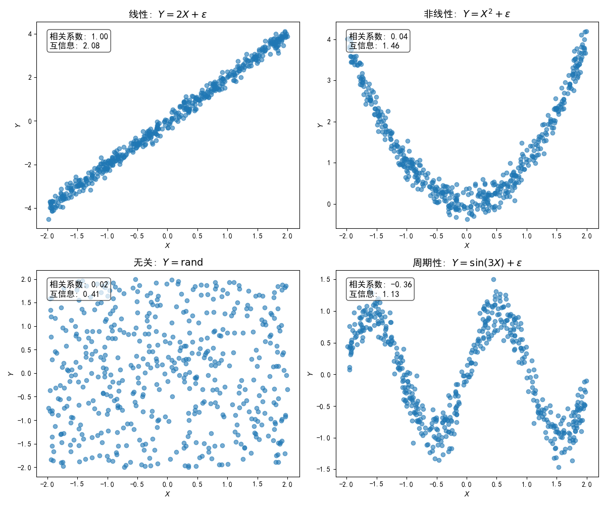

# **第二章 基础知识**

# 概率与统计基础

## 2.1 随机变量与常见分布

### 2.1.1 随机变量的定义

**定义**  
随机变量就是用数字来表示随机现象结果的“变量”。  
它把每次实验的结果，按照一定的规则，映射成一个数字。

**公式表达**  
如果 \(\Omega\) 是所有可能结果组成的集合（样本空间），那么随机变量 \(X\) 就是一个函数：
\[
X: \Omega \to \mathbb{R}
\]
也就是说，每个实验结果 \(\omega \in \Omega\)，都对应一个数 \(X(\omega)\)。

**举例说明**  
- 抛骰子：设 \(\Omega = \{1,2,3,4,5,6\}\)，随机变量 \(X(\omega) = \omega\)，表示抛出点数。
- 抛硬币：\(\Omega = \{\text{正面}, \text{反面}\}\)，可以定义 \(X(\text{正面}) = 1\)，\(X(\text{反面}) = 0\)。

**类型**  
- **离散型**：随机变量只能取有限或可数多个值，如骰子点数
  \[
  X \in \{1,2,3,4,5,6\}
  \]
- **连续型**：随机变量可以取某个区间内任意实数，如温度
  \[
  X \in [-40, 50]
  \]

**总结**  
随机变量就是用一个函数，把随机现象的结果“翻译”成数字，方便用数学方法来分析。

---

### 2.1.2 概率分布与概率函数

#### 离散型  
**概率质量函数（PMF）**  
描述随机变量 \(X\) 取某个具体值 \(x\) 的概率：
\[
p_X(x) = P(X = x), \quad \sum_x p_X(x) = 1
\]
即所有可能取值的概率加起来等于1。

#### 连续型  
**概率密度函数（PDF）**  
描述随机变量 \(X\) 在某个点附近取值的“密度”，而不是具体概率：
\[
p_X(x) \ge 0, \quad \int_{-\infty}^{\infty} p_X(x) dx = 1
\]
注意：对于连续型随机变量，\(P(X = x) = 0\)，只有区间概率有意义，如 \(P(a < X < b) = \int_a^b p_X(x) dx\)。

#### 分布函数（CDF）

**定义**  
无论离散还是连续，分布函数都定义为：
\[
F_X(x) = P(X \le x)
\]
即随机变量 \(X\) 取值小于等于 \(x\) 的概率。

#### 分布函数的性质

（1） **非减性（单调性）**  
   \[
   x_1 < x_2 \implies F_X(x_1) \le F_X(x_2)
   \]
   **解释**：随着 \(x\) 增大，\(X \le x\) 的事件只会变“更大”或“不变”，所以概率不会减少。

（2） **取值范围与极限**  
   \[
   F_X(-\infty) = 0,\quad F_X(+\infty) = 1
   \]
   **解释**：
   - 当 \(x\) 趋向负无穷，\(X \le x\) 不可能发生，所以概率为0。
   - 当 \(x\) 趋向正无穷，\(X \le x\) 一定发生，所以概率为1。
   - 因此，\(F_X(x)\) 的取值范围是 \([0, 1]\)。

（3） **右连续性**  
   \[
   \lim_{h \to 0^+} F_X(x + h) = F_X(x)
   \]
   **解释**：分布函数在每个点都是右连续的，即从右侧逼近时，值不会跳变。

（4） **离散型与连续型的区别**  
   - **离散型**：分布函数是“阶梯状”的，每遇到一个可取值就跳一下，跳跃的高度就是该点的概率。
     \[
     P(X = x) = F_X(x) - F_X(x^-)
     \]
   - **连续型**：分布函数是“平滑曲线”，没有跳跃。
     \[
     p_X(x) = \frac{d}{dx} F_X(x)
     \]
     即概率密度函数是分布函数的导数。

（5） **区间概率的计算**  
   - 对任意 \(a < b\)，有
     \[
     P(a < X \le b) = F_X(b) - F_X(a)
     \]
   - 对离散型，\(P(X = x) = F_X(x) - F_X(x^-)\)（\(F_X(x^-)\) 表示左极限）。

---

### 2.1.3 常见离散分布

#### 1）伯努利分布（Bernoulli distribution）

**由来**
伯努利分布是最简单的离散概率分布，由瑞士数学家 **雅各布·伯努利** 在 17 世纪提出。它描述了一次实验中只有两种可能结果的情形：**成功**（记为 1）或**失败**（记为 0）。  
例如：一次抛硬币，正面为 1，反面为 0。

**定义与公式**
若随机变量 \( X \) 取值为 1 的概率为 \( p \)，取值为 0 的概率为 \( 1-p \)，则：
\[
P(X = x) = p^x (1-p)^{1-x}, \quad x \in \{0, 1\}
\]
记作：
\[
X \sim \text{Bernoulli}(p)
\]

**性质**
- **期望**：
\[
E[X] = p
\]
- **方差**：
\[
\mathrm{Var}(X) = p(1-p)
\]
- **取值范围**：\( x \in \{0, 1\} \)
- **对称性**：当 \( p=0.5 \) 时分布对称。

**典型应用**
- 抛硬币（正面/反面）
- 产品合格（1）/不合格（0）
- 用户是否点击广告
- 病人是否康复

#### 2） 二项分布（Binomial distribution）

**由来**
二项分布是对伯努利分布的推广：如果我们进行 \( n \) 次**相互独立且成功概率相同**的伯努利试验，记录成功次数，就得到二项分布。  
由二项式定理得名，因为它的概率质量函数形式直接来源于二项展开式。

**定义与公式**
设 \( X \) 为 \( n \) 次独立试验中成功的次数，单次成功概率为 \( p \)，则：
\[
P(X = k) = \binom{n}{k} p^k (1-p)^{n-k}, \quad k = 0, 1, \dots, n
\]
记作：
\[
X \sim \text{Binomial}(n, p)
\]

**性质**
- **期望**：
\[
E[X] = np
\]
- **方差**：
\[
\mathrm{Var}(X) = np(1-p)
\]
- **取值范围**：\( k \in \{0, 1, \dots, n\} \)
- 当 \( n=1 \) 时，二项分布退化为伯努利分布。

**典型应用**
- 10 次抛硬币正面出现次数
- 抽检 \( n \) 件产品合格品数量
- 考试中答对题目数（每题独立且成功概率相同）
- 网络中数据包成功传输数

#### 3） 泊松分布（Poisson distribution）

**由来**
泊松分布由法国数学家 **西蒙·德尼·泊松** 在 19 世纪提出，最初用于研究稀有事件在固定时间或空间区间内发生的次数。  
它可以看作**二项分布的极限**：当试验次数 \( n \) 很大、单次成功概率 \( p \) 很小，且 \( \lambda = np \) 固定时，二项分布趋近于泊松分布。

**定义与公式**
若单位时间（或单位面积）内事件的平均发生次数为 \( \lambda > 0 \)，且事件独立发生，则：
\[
P(X = k) = \frac{\lambda^k e^{-\lambda}}{k!}, \quad k = 0, 1, 2, \dots
\]
记作：
\[
X \sim \text{Poisson}(\lambda)
\]

**性质**
- **期望**：
\[
E[X] = \lambda
\]
- **方差**：
\[
\mathrm{Var}(X) = \lambda
\]
- **无记忆性**：泊松过程的增量独立且平稳。
- **近似性质**：当 \( n \) 大、\( p \) 小且 \( np=\lambda \) 时，\(\text{Binomial}(n, p) \approx \text{Poisson}(\lambda)\)。

**典型应用**
- 一分钟内呼入电话次数
- 一天内公交到站次数
- 每秒网页访问次数
- 放射性粒子衰变计数
- 工厂生产线上的缺陷品出现次数

#### 4） 三者关系总结

| 分布       | 来源/背景 | 参数 | 适用场景 | 特点 |
|------------|----------|------|----------|------|
| 伯努利分布 | 单次二元试验 | \(p\) | 只有成功/失败两种结果的单次试验 | 最基本的离散分布 |
| 二项分布   | \(n\) 次独立伯努利试验成功次数 | \(n, p\) | 固定次数重复试验，统计成功数 | 伯努利分布的推广 |
| 泊松分布   | 稀有事件在固定区间内的发生次数 | \(\lambda\) | 时间/空间内的随机计数事件 | 二项分布的极限情形 |

---

### 2.1.4 常见连续分布

1） **均匀分布** \( X \sim U(a,b) \)
   \[
   f(x) = \frac{1}{b-a},\quad a \le x \le b
   \]
   - **含义**：在区间 \([a,b]\) 上每个值出现的概率都一样。
   - **典型应用**：随机抽取一个时间点、彩票号码、仿真中的“等概率噪声”等。
   - **期望/方差**：\(E[X] = \frac{a+b}{2}\)、\(\text{Var}(X) = \frac{(b-a)^2}{12}\)

2） **正态分布（高斯分布）** \( X \sim \mathcal{N}(\mu,\sigma^2) \)
   \[
   f(x) = \frac{1}{\sqrt{2\pi \sigma^2}} \exp\left( -\frac{(x-\mu)^2}{2\sigma^2} \right)
   \]
   - **含义**：数据围绕均值 \(\mu\) 呈“钟型”分布，标准差 \(\sigma\) 决定分布宽度。
   - **典型应用**：身高、考试分数、测量误差、信号噪声等大量自然和社会现象。
   - **期望/方差**：\(E[X]=\mu\)、\(\text{Var}(X)=\sigma^2\)

3） **指数分布** \( X \sim \text{Exp}(\lambda) \)
   \[
   f(x) = \lambda e^{-\lambda x},\quad x \ge 0
   \]
   - **含义**：描述“下一次事件”要等多久，具有无记忆性。
   - **典型应用**：灯泡寿命、排队等待时间、电子元件失效时间、地震间隔时间等。
   - **期望/方差**：\(E[X]=\frac{1}{\lambda}\)、\(\text{Var}(X)=\frac{1}{\lambda^2}\)

4） **卡方分布** \(\chi^2_k\)
   \[
   \chi^2 = \sum_{i=1}^k Z_i^2
   \]
   其中 \(Z_i\) 是独立标准正态分布。
   - **含义**：若干正态变量平方和的分布。
   - **典型应用**：假设检验（如卡方检验）、方差分析、置信区间估计等统计推断中经常出现。
   - **期望/方差**：\(E[X]=k\)、\(\text{Var}(X)=2k\)

---

### 2.1.5 例题

**例题2.1（二项分布）：**

> 某种药物的有效率为80%。现有5名病人接受治疗，假设每人是否治愈相互独立。  
> 问：至少有4人治愈的概率是多少？

**解析：**  
设“治愈”为一次伯努利试验，成功概率 \(p=0.8\)，总共 \(n=5\) 次。  
\(X\) 表示治愈人数，\(X \sim \text{Binomial}(5, 0.8)\)。

至少4人治愈，即4人或5人治愈：

\[
P(X \ge 4) = P(X=4) + P(X=5)
\]

\[
P(X=4) = \binom{5}{4} (0.8)^4 (0.2)^1 = 5 \times 0.4096 \times 0.2 = 0.4096
\]
\[
P(X=5) = \binom{5}{5} (0.8)^5 (0.2)^0 = 1 \times 0.32768 \times 1 = 0.32768
\]
\[
P(X \ge 4) = 0.4096 + 0.32768 = 0.73728
\]

**答：** 至少有4人治愈的概率约为0.737。

**例题2.2（泊松分布）：**

> 某路口平均每小时发生2起交通事故，假设事故发生服从泊松分布。  
> 问：某小时内恰好发生3起事故的概率是多少？

**解析：**  
设 \(X\) 表示一小时内事故数，\(X \sim \text{Poisson}(2)\)。

\[
P(X=3) = \frac{2^3 e^{-2}}{3!} = \frac{8 \times e^{-2}}{6} \approx \frac{8 \times 0.1353}{6} \approx 0.1804
\]

**答：** 恰好3起事故的概率约为0.18。

**例题2.3（正态分布）：**

> 某批产品长度服从正态分布，均值为100mm，标准差为2mm。  
> 问：抽到一件产品，其长度在98mm到102mm之间的概率是多少？

**解析：**  
设 \(X \sim \mathcal{N}(100, 2^2)\)。

标准化：
\[
P(98 < X < 102) = P\left(\frac{98-100}{2} < Z < \frac{102-100}{2}\right) = P(-1 < Z < 1)
\]
查标准正态分布表：
\[
P(-1 < Z < 1) = \Phi(1) - \Phi(-1) = 0.8413 - 0.1587 = 0.6826
\]

**答：** 产品长度在98mm到102mm之间的概率约为68.3%。

---

## 2.2 随机向量及协方差矩阵

### 2.2.1 随机向量与联合分布

**随机向量**  
\[
\mathbf{X} = [X_1, X_2, \dots, X_n]^T
\]
每个分量 \(X_i\) 都是随机变量，整个向量描述多个随机变量的联合行为。

**联合分布**
- **离散型**：联合概率质量函数 \( p_{\mathbf{X}}(x_1,\dots,x_n) \)
- **连续型**：联合概率密度函数 \( f_{\mathbf{X}}(x_1,\dots,x_n) \)

**边缘分布**  
通过对联合分布对其他变量求和（离散）或积分（连续），得到单个变量的分布。例如：
\[
f_X(x) = \int f_{X,Y}(x,y) dy
\]

**条件分布**  
在已知某些变量取值的条件下，其他变量的分布：
\[
f_{X|Y}(x|y) = \frac{f_{X,Y}(x,y)}{f_Y(y)}
\]

---

### 2.2.2 期望向量与协方差矩阵

**期望（数学期望）**

- **离散型随机变量**：  
\[
E[X] = \sum_x x\, p(x)
\]
其中 \(p(x)\) 是概率质量函数。

- **连续型随机变量**：  
\[
E[X] = \int_{-\infty}^{\infty} x\, f(x)\, dx
\]
其中 \(f(x)\) 是概率密度函数。

- **性质**：
  1. **线性性**：\(E[aX + bY] = aE[X] + bE[Y]\)
  2. **单调性**：若 \(X \leq Y\) 则 \(E[X] \leq E[Y]\)
  3. **Fubini–Tonelli 定理**：
     - **Tonelli 定理**（非负情形）：\(f(x,y) \ge 0\) 时积分/求和次序可交换，结果可能为无穷大。
     - **Fubini 定理**（绝对可积情形）：\(\iint |f| < \infty\) 时可交换次序，结果有限。

**期望向量**  
\[
E[\mathbf{X}] = \begin{bmatrix} E[X_1]\\ \vdots \\ E[X_n] \end{bmatrix}
\]

**方差**  
\[
\mathrm{Var}(X) = E[(X - \mu)^2] = E[X^2] - (E[X])^2
\]
- **性质**：
  1. \(\mathrm{Var}(aX + b) = a^2 \mathrm{Var}(X)\)
  2. \(\mathrm{Var}(X) \ge 0\)

**协方差**  
\[
\mathrm{Cov}(X, Y) = E[(X - E[X])(Y - E[Y])]
\]
- **性质**：
  1. \(\mathrm{Cov}(X, X) = \mathrm{Var}(X)\)
  2. \(\mathrm{Cov}(X, Y) = \mathrm{Cov}(Y, X)\)
  3. \(\mathrm{Cov}(aX + b, Y) = a\,\mathrm{Cov}(X, Y)\)

**协方差矩阵**  
\[
\Sigma_{\mathbf{X}} = E\left[ (\mathbf{X} - \mu)(\mathbf{X} - \mu)^T \right]
\]
其中 \(\mu = E[\mathbf{X}]\) 是期望向量，\(\Sigma_{ij} = \mathrm{Cov}(X_i, X_j)\)。

**相关系数**  
\[
\rho_{XY} = \frac{\mathrm{Cov}(X, Y)}{\sigma_X \sigma_Y}, \quad -1 \le \rho_{XY} \le 1
\]

---

### 2.2.3 协方差矩阵的性质

#### 1） **对称性**
\[
\Sigma = \Sigma^T
\]
- 任意 \(i, j\)，有 \(\Sigma_{ij} = \Sigma_{ji}\)。

#### 2） **半正定性**
\[
\mathbf{a}^T \Sigma \mathbf{a} \ge 0
\]
- 任意线性组合的方差非负，协方差矩阵的特征值不小于0。

#### 3） **对角线元素为方差**
\[
\Sigma_{ii} = \mathrm{Var}(X_i)
\]

#### 4） **正定性**
- 严格正定表示分量不存在线性相关；特征值为0表示存在线性关系。

#### 5） **迹与方差总和**
\[
\mathrm{Tr}(\Sigma) = \sum_{i=1}^n \mathrm{Var}(X_i)
\]

---

### 2.2.4 例题讲解

**例题2.4**  
二维向量 \((X,Y)\) 均值零，协方差矩阵  
\(\Sigma = \begin{bmatrix}2 & 1\\ 1 & 3\end{bmatrix}\)，求 \(\mathrm{Var}(X+Y)\)。

**解**：
\[
\mathrm{Var}(X+Y) = 2 + 3 + 2\times 1 = 7
\]

---

**例题2.5**  
已知二维随机向量 \((X,Y)\) 的协方差矩阵为  
\[
\Sigma = \begin{bmatrix}4 & -2\\ -2 & 9\end{bmatrix}
\]  
求 \(\mathrm{Cov}(X, 2Y)\) 和 \(\mathrm{Var}(X-2Y)\)。

**解**：  
\[
\mathrm{Cov}(X, 2Y) = 2\,\mathrm{Cov}(X,Y) = 2 \times (-2) = -4
\]  
\[
\mathrm{Var}(X-2Y) = \mathrm{Var}(X) + 4\,\mathrm{Var}(Y) - 4\,\mathrm{Cov}(X,Y) = 4 + 36 + 8 = 48
\]

---

**例题2.6**  
三维随机向量 \(\mathbf{X} = (X_1, X_2, X_3)^T\) 的协方差矩阵为  
\[
\Sigma = \begin{bmatrix}
1 & 0.5 & 0 \\
0.5 & 2 & 1 \\
0 & 1 & 3
\end{bmatrix}
\]  
求 \(\mathrm{Var}(X_1 + X_2 + X_3)\)。

**解**：  
\[
\mathrm{Var}(X_1 + X_2 + X_3) = \sum_{i=1}^3 \mathrm{Var}(X_i) + 2\sum_{1\leq i < j \leq 3} \mathrm{Cov}(X_i, X_j)
\]  
\[
= 1 + 2 + 3 + 2 \times [0.5 + 0 + 1] = 6 + 3 = 9
\]

---

**例题2.7**  
掷一标准骰子，令 \(X\) 为点数，求方差。

**解**：  
均值：  
\[
\mu = \frac{1+2+3+4+5+6}{6} = 3.5
\]  
平方期望：  
\[
E[X^2] = \frac{1^2 + 2^2 + 3^2 + 4^2 + 5^2 + 6^2}{6} = \frac{91}{6}
\]  
方差：  
\[
\mathrm{Var}(X) = \frac{91}{6} - (3.5)^2 = \frac{35}{12} \approx 2.92
\]

---

**例题2.8**  
抛两枚硬币，设 \(X\) 为正面数，求 \(E[X]\) 和 \(\mathrm{Var}(X)\)。

**解**：  
概率分布：  
\(P(X=0) = 1/4\)，\(P(X=1) = 1/2\)，\(P(X=2) = 1/4\)  

期望：  
\[
E[X] = 0 \times \frac14 + 1 \times \frac12 + 2 \times \frac14 = 1
\]  

平方期望：  
\[
E[X^2] = 0 + \frac12 + 1 = \frac32
\]  

方差：  
\[
\mathrm{Var}(X) = \frac32 - 1^2 = \frac12
\]

---

**例题2.9**  
已知随机变量 \(X\) 取值 1 和 -1，各概率均为 0.5，令 \(Y = 2X + 3\)，求 \(E[Y]\) 和 \(\mathrm{Var}(Y)\)。

**解**：  
\[
E[X] = 0.5 \times 1 + 0.5 \times (-1) = 0
\]  
\[
\mathrm{Var}(X) = 0.5 \times (1 - 0)^2 + 0.5 \times (-1 - 0)^2 = 1
\]  
\[
E[Y] = 2E[X] + 3 = 3
\]  
\[
\mathrm{Var}(Y) = 2^2 \times \mathrm{Var}(X) = 4
\]

---

## 2.3 条件概率、独立性、贝叶斯公式

### 条件概率：
\[
P(A|B) = \frac{P(A\cap B)}{P(B)}
\]

### 独立性：
\(P(A\cap B) = P(A)P(B)\)  
随机变量 X, Y 独立：\( f_{X,Y}(x,y) = f_X(x)f_Y(y) \)

### 全概率公式：
若 \(\{B_i\}\) 构成完备事件组：
\[
P(A) = \sum_i P(A|B_i)P(B_i)
\]

### 贝叶斯公式：
\[
P(B_i|A) = \frac{P(A|B_i)P(B_i)}{\sum_j P(A|B_j)P(B_j)}
\]
核心思想：**先验 + 似然 ⇒ 后验**。

---

**例题2.10**
某疾病检测试剂，阳性判病。已知患病率 1%，试剂灵敏度 0.99，假阳率 0.05。求阳性者真患病的概率。

**解**：
A=患病，B=阳性。  
\(P(B|A)=0.99, P(B|\bar{A})=0.05, P(A)=0.01\)
\[
P(A|B) = \frac{0.99 \cdot 0.01}{0.99\cdot0.01 + 0.05\cdot0.99} \approx 0.167
\]
**启示**：低患病率下，即便检测精度高，阳性预测值也可能不高。

---

## 2.4 条件期望与最小均方误差（MMSE）

### 2.4.1 条件期望：概念与定义

#### 1） 基本概念
条件期望是概率论中的核心概念，表示在给定某些信息条件下，随机变量的期望值。对于随机变量 Y 和 X，条件期望 E[Y|X] 表示在已知 X 取值的情况下，Y 的平均值。

#### 2） 数学定义
\[
E[Y|X] = \int y f_{Y|X}(y|X) dy
\]
其中 $f_{Y|X}(y|x)$ 是在给定 X = x 时 Y 的条件概率密度函数。

#### 3） 重要性质
- **线性性**：$E[(aY + bZ)|X] = aE[Y|X] + bE[Z|X]$
- **迭代期望定律**：$E[E[Y|X]] = E[Y]$
- **独立性**：若 Y 与 X 独立，则 $E[Y|X] = E[Y]$

### 2.4.2 最小均方误差（MMSE）准则

#### 1） 基本思想
MMSE是一种最优化准则，旨在找到使预测误差平方的期望值最小的估计器。对于基于X预测Y的问题，我们寻找函数$g(X)$使得：
\[
E[(Y - g(X))^2]
\]
最小化。

#### 2） MMSE定理
**定理**：在所有关于X的函数$g(X)$中，最小化均方误差
\[
E[(Y - g(X))^2]
\]
的最优函数是条件期望：
\[
g^*(X) = E[Y|X]
\]

### 2.4.3 二者关系

#### 1） 两种视角
条件期望和MMSE估计器不是两个独立概念，而是对"最优预测"问题的两种表述：

- **概率视角**：条件期望 $E[Y|X]$ 描述了给定X时Y的平均行为
- **优化视角**：MMSE估计器提供了最小化预测误差的具体方法

#### 2） 条件期望是最优估计

**直观解释**
将均方误差分解为：
\[
E[(Y - g(X))^2] = E[(Y - E[Y|X])^2] + E[(E[Y|X] - g(X))^2]
\]
- 第一项：不可减少的误差（Y自身随机性）
- 第二项：估计器不准确导致的误差

最小化整体误差只需令第二项为零，即选择 $g(X) = E[Y|X]$

**几何解释**
在希尔伯特空间框架下：
- 随机变量可视为向量
- 所有g(X)构成线性子空间
- 条件期望 E[Y|X] 是Y在该子空间上的正交投影
- 正交投影正是到子空间距离最短的点

### 2.4.4 实例
**例题2.11：** 线性模型

**模型**
考虑 Y = 2X + N，其中：
- X ∼ N(0,1)（标准正态分布）
- N ∼ N(0,1)（标准正态分布）
- X 与 N 相互独立

**求解 E[Y|X]**：
\[
E[Y|X] = E[2X + N|X] = 2E[X|X] + E[N|X] = 2X + E[N] = 2X
\]
这里利用了：
1. 已知X时，X的條件期望为自身
2. X与N独立，故$E[N|X] = E[N] = 0$

**误差分析**
最优估计的均方误差为：
\[
E[(Y - 2X)^2] = E[N^2] = 1
\]
这是任何基于X的预测都无法超越的性能下界。

---

## 2.5 参数空间与样本空间、似然函数的概念

### 2.5.1 参数空间与样本空间

在统计建模中，**参数空间**和**样本空间**是两个基础且密切相关的概念，它们分别对应模型中“未知的部分”和“观测到的部分”。

#### 1）样本空间 \(\Omega\)

- **定义**：样本空间是一次试验或观测中所有可能结果的集合。
- **举例**：
  - 离散情况：掷一枚硬币，样本空间为 \(\Omega = \{\text{正}, \text{反}\}\)。
  - 连续情况：测量某地气温，样本空间可为 \(\mathbb{R}\) 或某个区间 \([a, b]\)。
- **数学描述**：在概率空间 \((\Omega, \mathcal{F}, P)\) 中，\(\Omega\) 表示所有基本事件的集合。

#### 2）参数空间 \(\Theta\)

- **定义**：参数空间是统计模型中未知参数所有可能取值的集合。
- **举例**：
  - 伯努利分布中的成功概率 \(p\)，其参数空间为 \(\Theta = [0, 1]\)。
  - 正态分布的参数为 \((\mu, \sigma^2)\)，参数空间为 \(\Theta = \mathbb{R} \times (0, +\infty)\)。

#### 3）区别与联系

- **区别**：
  - 样本空间关注的是“数据可能如何出现”；
  - 参数空间关注的是“模型可能如何设定”。
- **联系**：
  - 参数 \(\theta \in \Theta\) 决定概率分布 \(p_\theta(x)\) 的形式；
  - 样本 \(x \in \Omega\) 用于估计或推断参数 \(\theta\) 的值。

### 2.5.2 似然函数（Likelihood Function）

#### 1）动机

在统计推断中，我们往往已经拥有观测数据，而模型参数未知。**似然函数**提供了一种基于数据“反推”参数合理取值的方法。

#### 2）定义

设观测样本为 \(x = (x_1, x_2, \dots, x_n)\)，概率模型为 \(p_\theta\)（离散）或 \(f_\theta\)（连续）。似然函数定义为：

\[
L(\theta; x) = 
\begin{cases} 
p_\theta(x) & \text{（离散情形）} \\
f_\theta(x) & \text{（连续情形）}
\end{cases}
\]

- **注意**：
  - 似然函数是参数 \(\theta\) 的函数，数据 \(x\) 视为固定；
  - 其数值大小反映在给定数据下，不同参数值的“合理性”或“解释力”。

#### 3）对数似然函数

为便于计算与优化，常使用**对数似然函数**：

\[
\ell(\theta; x) = \log L(\theta; x)
\]

- **优点**：
  - 将连乘转换为求和，避免数值下溢；
  - 求导更简便，常用于优化算法（如梯度下降）。

### 2.5.3 直观理解

似然函数可视为“概率函数的反向运用”：

- **概率问题**：已知参数 \(\theta\)，预测观测数据 \(x\) 的出现概率；
- **似然问题**：已知数据 \(x\)，评估不同参数 \(\theta\) 的相对合理性。

这种“由果推因”的思维是**最大似然估计（MLE）** 的核心。

### 2.5.4 举例说明

**例2.12：** 伯努利试验

假设投掷一枚硬币10次，出现7次正面、3次反面。若正面概率为 \(\theta\)，则似然函数为：

\[
L(\theta; x) = \theta^7 (1 - \theta)^3
\]

通过最大化该函数，可估计出 \(\theta \approx 0.7\) 时最符合观测。

**例2.13：** 正态分布估计

设样本 \(x_1, \dots, x_n \sim \mathcal{N}(\mu, \sigma^2)\)，若方差 \(\sigma^2\) 已知，关于均值 \(\mu\) 的似然函数为：

\[
L(\mu; x) = \prod_{i=1}^n \frac{1}{\sqrt{2\pi \sigma^2}} \exp\left(-\frac{(x_i - \mu)^2}{2\sigma^2}\right)
\]

其对数似然为：

\[
\ell(\mu; x) = -\frac{n}{2} \log(2\pi \sigma^2) - \frac{1}{2\sigma^2} \sum_{i=1}^n (x_i - \mu)^2
\]

最大化 \(\ell(\mu; x)\) 等价于最小化平方误差，解为样本均值 \(\hat{\mu} = \bar{x}\)。

---
# 信息论基础

## 2.6 熵、互信息、KL散度

### 2.6.1 熵 \(H(X)\)
\[
H(X) = -\sum_x p(x)\log p(x)
\]
**熵**衡量随机变量 \(X\) 的不确定性或信息量。熵越大，表示 \(X\) 的分布越分散、不确定性越高；熵越小，说明 \(X\) 越确定。

### 2.6.2 条件熵 \(H(Y|X)\)
\[
H(Y|X) = -\sum_{x,y} p(x,y) \log p(y|x)
\]
**条件熵**衡量在已知 \(X\) 的情况下，\(Y\) 仍有多少不确定性。可以理解为“剩余的不确定性”。

### 2.6.3 互信息 \(I(X;Y)\)

#### 1）定义
\[
I(X;Y) = H(X) - H(X|Y)
\]
互信息衡量两个变量之间“共享”的信息量。它表示知道 \(Y\) 后，关于 \(X\) 的不确定性减少了多少。互信息为零，表示 \(X\) 与 \(Y\) 完全独立；互信息越大，说明两者关联越紧密。

#### 2）互信息与相关系数的比较

- **互信息**是信息论中的概念，能够捕捉任意类型的统计依赖关系（不仅仅是线性关系），对变量之间的非线性、复杂关系也敏感。
- **相关系数**（如皮尔逊相关系数）只衡量变量之间的线性相关性。相关系数为零时，变量可能存在线性之外的其他依赖关系，但互信息仍可能大于零。
- 互信息总是非负，而相关系数可能为负（表示负相关）。
- 例如，对于两个变量 \(X\) 和 \(Y\)，如果 \(Y = X^2\)，则相关系数可能为零，但互信息却大于零，因为 \(Y\) 完全由 \(X\) 决定。

**可视化展示**

| 关系类型     | 相关系数 | 互信息 |
|--------------|----------|--------|
| 线性         | 高       | 高     |
| 非线性（如 \(Y=X^2\)） | 低/0     | 高     |
| 无关         | 0        | 0      |
| 周期/复杂    | 低/0     | 高     |

---

### 2.6.4 KL散度（Kullback-Leibler Divergence）

#### 1） 定义

给定两个定义在同一概率空间上的概率分布 \(P\) 与 \(Q\)，KL 散度定义为：

- **离散型变量**：  
\[
D_{\mathrm{KL}}(P\|Q) = \sum_{x} p(x) \, \log \frac{p(x)}{q(x)}
\]

- **连续型变量**（积分形式）：  
\[
D_{\mathrm{KL}}(P\|Q) = \int p(x) \, \log \frac{p(x)}{q(x)} \, dx
\]

这里的对数底数可选为 \(e\)（单位：**nats**）或 2（单位：**bits**）。

**直观理解**

KL 散度衡量**“用 \(Q\) 近似 \(P\) 时的信息损失”**。  
- 如果数据真实分布是 \(P\)，但我们用模型分布 \(Q\) 进行编码或推断，KL 散度刻画了额外消耗的平均信息量。  
- 它不是一个对称的距离度量，而是一个**方向性的信息差异度量**。

---

### 2）性质

（1） **非负性**（Gibbs 不等式）  
\[
D_{\mathrm{KL}}(P\|Q) \ge 0
\]
取等号当且仅当 \(P = Q\)（几乎处处），体现了KL散度的“最小性”——分布与自身的差异为零。

（2） **不对称性**  
\[
D_{\mathrm{KL}}(P\|Q) \neq D_{\mathrm{KL}}(Q\|P)
\]
交换顺序会得出不同结果，因此它不是严格意义的“距离”或“度量”。

（3） **为零的条件**  
\[
D_{\mathrm{KL}}(P\|Q) = 0 \quad \Leftrightarrow \quad P = Q
\]
（存在零概率集合除外）

（4） **与交叉熵的关系**  
交叉熵可写为：
\[
H(P,Q) = H(P) + D_{\mathrm{KL}}(P\|Q)
\]
其中 \(H(P)\) 是熵。即：交叉熵等于真实分布的信息熵加上 KL 散度。

---

#### 3） 应用场景

- **统计假设检验**  
似然比检验中的**对数似然比统计量**，在大样本下和 KL 散度密切相关；本质上是检测 "真分布 P" 与 "假设分布 Q" 的差别。

- **机器学习与信息论**  
  - **分布拟合**：最大似然估计等价于最小化经验分布对模型分布的 KL 散度。
  - **变分推断**：通过最小化近似后验与真实后验的 KL 散度，实现推断。
  - **损失函数**：许多算法的损失（如交叉熵损失）是 KL 散度的特例。
  - **生成模型训练**：GAN、VAE 等都会涉及 KL 散度或其变体（JS 散度）。

---

#### 4）例题
**例题2.12：** KL 散度计算

**已知**：  
\[
P = (0.4,\, 0.6), \quad Q = (0.5,\, 0.5)
\]

**计算**：  
\[
\begin{aligned}
D_{\mathrm{KL}}(P\|Q) &= 0.4 \log\frac{0.4}{0.5} + 0.6 \log\frac{0.6}{0.5} \\
&= 0.4 \cdot \log 0.8 + 0.6 \cdot \log 1.2 \\
&\approx -0.08924 + 0.10726 \\
&\approx 0.01802 \ \text{(nats)}
\end{aligned}
\]

**解释**：
- 结果正且接近于 0，说明两分布 \(P\) 与 \(Q\) 差异很小；
- 单位 “nats” 表示按自然对数计的信息量（若使用 \(\log_2\)，结果单位为 bits）。

> 小结：KL 散度度量的是“方向性信息差异”，其数值大小依赖于真实分布 \(P\) 与近似分布 \(Q\) 的差异，以及我们的方向选择。

---

# 矩阵与线性代数

## 2.7 矩阵的含义

### 2.7.1 从线性方程组引入

我们常见的线性方程组如下：

\[
\begin{aligned}
5x_1 - x_2 + 2x_3 + x_4 &= 7 \\
2x_1 + x_2 + 4x_3 - 2x_4 &= 1 \\
x_1 - 3x_2 - 6x_3 + 5x_4 &= 0
\end{aligned}
\]

可以将其写成矩阵与向量的乘积形式：

\[
\begin{bmatrix}
5 & -1 & 2 & 1 \\
2 & 1 & 4 & -2 \\
1 & -3 & -6 & 5
\end{bmatrix}
\begin{bmatrix}
x_1 \\
x_2 \\
x_3 \\
x_4
\end{bmatrix}
=\begin{bmatrix} 7 \\ 1 \\ 0 \end{bmatrix}
\]

记
\[
A = \begin{bmatrix}
5 & -1 & 2 & 1 \\
2 & 1 & 4 & -2 \\
1 & -3 & -6 & 5
\end{bmatrix}, \quad
x = \begin{bmatrix} x_1 \\ x_2 \\ x_3 \\ x_4 \end{bmatrix}, \quad
b = \begin{bmatrix} 7 \\ 1 \\ 0 \end{bmatrix}
\]
则有
\[
Ax = b
\]

### 2.7.2 向量内积的介绍

将矩阵与向量的乘积 \(Ax\) 展开来看，实际上就是矩阵 \(A\) 的每一行与向量 \(x\) 的内积。例如：

\[
Ax =
\begin{bmatrix}
a_1^T x \\
a_2^T x \\
a_3^T x
\end{bmatrix}=
\begin{bmatrix}
7 \\
1 \\
0
\end{bmatrix}
\]
其中，\(a_i^T\) 表示矩阵 \(A\) 的第 \(i\) 行向量。

向量内积 \(a^T x\) 的几何意义为：
\[
a^T x = \|a\|_2 \|x\|_2 \cos \theta
\]
即为向量 \(x\) 在向量 \(a\) 方向上的投影长度，再乘以 \(a\) 的模长，并带有正负号（由夹角 \(\theta\) 决定）。

### 2.7.3 矩阵的几何意义

因此，矩阵可以看作是对空间中向量的一种线性变换。矩阵的每一行对应一个方向，\(Ax\) 就是把向量 \(x\) 在这些方向上的投影长度组合起来，形成新的向量 \(b\)。更一般地说，\(m \times n\) 的矩阵可以把 \(n\) 维空间中的向量映射到 \(m\) 维空间，实现空间的线性变换。

## 2.8 矩阵乘法

### 2.8.1 定义

设 \(A\) 是 \(m \times k\) 阶矩阵，\(B\) 是 \(k \times n\) 阶矩阵，矩阵乘法 \(C = AB\) 定义为：\(C\) 是 \(m \times n\) 阶矩阵，其中
\[
c_{ij} = \sum_{l=1}^{k} a_{il} b_{lj}
\]
即 \(C\) 的第 \(i\) 行第 \(j\) 列的元素等于 \(A\) 的第 \(i\) 行与 \(B\) 的第 \(j\) 列对应元素乘积的和。

### 2.8.2 形式

\[
A =
\begin{bmatrix}
a_{11} & a_{12} & \cdots & a_{1k} \\
a_{21} & a_{22} & \cdots & a_{2k} \\
\vdots & \vdots & \ddots & \vdots \\
a_{m1} & a_{m2} & \cdots & a_{mk}
\end{bmatrix}
\]
\[
B =
\begin{bmatrix}
b_{11} & b_{12} & \cdots & b_{1n} \\
b_{21} & b_{22} & \cdots & b_{2n} \\
\vdots & \vdots & \ddots & \vdots \\
b_{k1} & b_{k2} & \cdots & b_{kn}
\end{bmatrix}
\]
\[
C = AB =
\begin{bmatrix}
c_{11} & c_{12} & \cdots & c_{1n} \\
c_{21} & c_{22} & \cdots & c_{2n} \\
\vdots & \vdots & \ddots & \vdots \\
c_{m1} & c_{m2} & \cdots & c_{mn}
\end{bmatrix}
\]
其中
\[
c_{ij} = a_{i1}b_{1j} + a_{i2}b_{2j} + \cdots + a_{ik}b_{kj}
\]

### 2.8.3 几何意义

矩阵乘法体现了线性变换的复合：  
- 矩阵 \(B\) 首先将向量进行一次线性变换，得到新的向量；
- 然后矩阵 \(A\) 再对变换后的向量进行第二次线性变换；
- 整体效果等同于先后作用于向量的两个线性变换的合成。

每个元素 \(c_{ij}\) 可以看作是 \(A\) 的第 \(i\) 行向量与 \(B\) 的第 \(j\) 列向量的内积。矩阵乘法不仅仅是元素相乘，更重要的是它描述了空间变换的过程。

---

## 2.9 矩阵的不变量

矩阵的不变量，是指在**更换坐标系**（基底变换）或进行**相似变换**时，依然保持不变的性质或数值。  
它们不仅是线性代数中的代数核心，还往往对应**明确的几何特征**和**物理量**，揭示了线性变换的“本质行为”。  

这些不变量，就像是变换的**DNA** —— 无论用什么坐标系描述，它们都不会改变。

---

### 2.9.1 相似矩阵  

**定义**  
若存在可逆矩阵 \(P\)，使得：
\[
B = P^{-1} A P
\]
则称 \(B\) 与 \(A\) **相似**，记作 \(A \sim B\)。

**几何意义**  
- 相似矩阵是**同一个线性变换在不同基底下的表现形式**。  
- 就像同一条直线，在不同坐标系下方程不同，但直线本身没变。  

**物理意义**  
- 在物理学中，相似变换对应于**更换参考系**或**重新定义基矢**，变换的本质（如能量、运动规律）保持不变。  

---

### 2.9.2 特征值与特征向量  

**定义**  
对于方阵 \(A\)，若存在非零向量 \(\mathbf{x}\) 和标量 \(\lambda\) 满足：
\[
A\mathbf{x} = \lambda \mathbf{x}
\]
则 \(\lambda\) 为特征值（eigenvalue），\(\mathbf{x}\) 为对应的特征向量（eigenvector）。

**几何意义**  
- 特征向量是在变换下**方向保持不变**的向量。  
- 特征值是沿该方向的**伸缩因子**：λ>1 表示拉伸；0<λ<1 表示压缩；负值表示方向翻转并缩放。

**物理意义**  
- 振动与波动：特征值对应固有频率，特征向量对应振型（mode shape）。  
- 量子力学：特征值是本征能量，特征向量是本征态。  
- 图论：特征值可反映网络的连通性、复杂度等结构特征。

**性质**  
- 不同特征值对应的特征向量线性无关。  
- 相似矩阵有相同的特征值（不变量）。  
- 若 \(A\) 可逆，\(A^{-1}\) 的特征值是 \(1/\lambda\)。

---

### 2.9.3 行列式（Determinant）

设单位立方体的边由标准基向量
\[
\mathbf{e}_1 = (1,0,\dots,0),\ 
\mathbf{e}_2 = (0,1,\dots,0),\ 
\cdots,\
\mathbf{e}_n = (0,\dots,0,1)
\]
构成。

经过矩阵 \(A\) 作用，这些基向量分别变成：
\[
\mathbf{u}_1 = A\mathbf{e}_1 = \text{第1列}  
\]
\[
\mathbf{u}_2 = A\mathbf{e}_2 = \text{第2列}  
\]
\[
\cdots\quad \mathbf{u}_n = \text{第n列}
\]

所以，变换后的“立方体”实际上是由列向量 \(\mathbf{u}_1, \dots, \mathbf{u}_n\) 张成的**平行多面体**。

在向量几何中，**由向量 \(\mathbf{u}_1, \dots, \mathbf{u}_n\) 张成的平行多面体的体积**等于：
\[
\text{体积} = |\det(\mathbf{u}_1, \dots, \mathbf{u}_n)|
\]
其中\(\det(\mathbf{u}_1, \dots, \mathbf{u}_n)\)就是以这组向量作为列构成的矩阵的行列式。

**几何意义**  
- \(|A|\) 的绝对值表示变换对单位立方体的**体积缩放因子**。  
- 符号表示是否翻转空间取向（右手系 ↔ 左手系）。

**物理意义**  
- 行列式为零：变换会把某些方向压缩到低维，信息丢失 → 奇异矩阵，无唯一逆解。  
- 在线性方程组中，行列式为零意味着无唯一解。

**性质**  
- 交换两行（列） → 行列式变号。  
- 某行（列）乘以 \(k\) → 行列式乘以 \(k\)。  
- 一行（列）加另一行（列）的倍数 → 行列式不变。

---

### 2.9.4 特征多项式与迹（Trace）  

**定义**  
特征多项式：
\[
f_A(\lambda) = |\lambda I - A| = \lambda^n - (\mathrm{tr}A)\lambda^{n-1} + \cdots + (-1)^n |A|
\]

**不变量关系**  
- **迹**：\(\mathrm{tr}(A) = \sum_{i=1}^n \lambda_i\)，等于特征值之和。  
- **行列式**：\(|A| = \prod_{i=1}^n \lambda_i\)，等于特征值的乘积。

**几何意义**  
- 迹：总的“尺度变化率”或拉伸总和。  
- 行列式：整体体积缩放因子。  
- 特征多项式的根（λ）直接揭示压缩/拉伸比例。

**物理意义**  
- 迹在物理中常与守恒量、总能量相关。  
- 行列式与系统的可逆性、能量流守恒有关。

---

### 2.9.5 奇异值分解（SVD）  

**定理**  
任意矩阵 \(A \in \mathbb{C}^{m\times n}\) 可写作：
\[
A = U \Sigma V^H
\]
其中：
- \(U, V\)：酉（正交）矩阵 → 旋转/反射变换；  
- \(\Sigma\)：对角矩阵，主对角线上的非负实数为奇异值（singular values）。

**几何意义**  
1. \(V^H\)：旋转输入坐标，使其与主方向对齐；  
2. \(\Sigma\)：在这些主方向上进行拉伸/压缩；  
3. \(U\)：旋转输出坐标到目标方向。

**物理意义**  
- 奇异值反映变换在各主方向上的强度（最大/最小伸缩因子）。  
- SVD揭示矩阵的有效秩，可用于降噪、压缩信息。  
- 在信号处理、PCA（主成分分析）、模式识别中，SVD提供最佳低秩近似的数学基础（Eckart–Young 定理）。

**Eckart–Young定理**：

设 \(A \in \mathbb{R}^{m\times n}\) 的 SVD 为：
\[
A = U \Sigma V^T, \quad \sigma_1 \ge \sigma_2 \ge \dots \ge \sigma_r > 0
\]

对给定的正整数 \(k < r\)，令：
\[
A_k = \sum_{i=1}^k \sigma_i \mathbf{u}_i \mathbf{v}_i^T
\]
即只保留前 \(k\) 个最大的奇异值及对应的奇异向量。

则有：
\[
\min_{\mathrm{rank}(B) \le k} \|A - B\|_F = \|A - A_k\|_F = \sqrt{\sum_{i=k+1}^r \sigma_i^2}
\]
以及：
\[
\min_{\mathrm{rank}(B) \le k} \|A - B\|_2 = \|A - A_k\|_2 = \sigma_{k+1}
\]

其中：
- \(\|\cdot\|_F\) 是 Frobenius 范数（平方和的平方根）。
- \(\|\cdot\|_2\) 是谱范数（最大奇异值）。
- \(\mathbf{u}_i, \mathbf{v}_i\) 分别是 \(U, V\) 的第 \(i\) 列。

---

### 🌟 全景总结：矩阵不变量一览表  

| 不变量         | 保持不变的变换   | 几何意义               | 物理意义 |
|----------------|----------------|-----------------------|----------|
| 特征值集合     | 相似变换        | 方向伸缩因子           | 固有频率 / 能级 |
| 特征向量子空间 | 相似变换        | 方向不变直线           | 模态形态 / 本征态 |
| 行列式         | 相似变换        | 体积缩放因子及方向翻转 | 可逆性 / 空间压缩 |
| 迹             | 相似变换        | 总伸缩率               | 总能量、守恒量 |
| 奇异值         | 正交等距变换    | 主方向伸缩强度         | 信号能量主分布 |

---

## 2.10 矩阵函数与导数

### 2.10.1 矩阵函数
矩阵函数泛指自变量是矩阵（或向量）、值域可以是标量、向量或矩阵的函数。例如：
- 二次型：\(f(x) = x^T A x\)
- 迹函数：\(f(X) = \mathrm{tr}(A^T X)\)
- 矩阵乘积：\(f(X) = AXB\)
- 矩阵范数：\(\|X\|_F^2 = \mathrm{tr}(X^T X)\)

本节重点介绍这些函数的矩阵导数公式。

---

### 2.10.2 矩阵导数

为了方便记忆，本节默认以下约定：
- \(x\)：\(n \times 1\) 列向量
- \(y\)：\(m \times 1\) 列向量
- \(A, B, C\)：常数矩阵（不依赖自变量）
- \(\alpha\)：标量（实数函数结果）
- 所有函数对自变量连续可微
- 采用常见的**分子布局（numerator-layout）** 记号，即  
  \(\frac{\partial f}{\partial x} = \left[ \frac{\partial f}{\partial x_1}, \dots, \frac{\partial f}{\partial x_n} \right]^T\)

---

#### 1）向量关于向量的导数

**线性函数：**
\[
y = A x ,\quad \frac{\partial y}{\partial x} = A
\]
其中 \(\frac{\partial y}{\partial x}\) 为 \(m \times n\) 矩阵（雅可比矩阵）。

**加常数：**
\[
y = A x + b ,\quad \frac{\partial y}{\partial x} = A
\]
常数项 \(b\) 的导数为零。

---

#### 2）标量关于向量的导数

**线性型：**
\[
\alpha = a^T x,\quad \frac{\partial \alpha}{\partial x} = a
\]
其中 \(a\) 为常数向量。

**双线性型：**
\[
\alpha = y^T A x ,\quad \frac{\partial \alpha}{\partial x} = A^T y,\quad \frac{\partial \alpha}{\partial y} = A x
\]
这一式在统计与优化中非常常用。

**二次型（对称矩阵）**：
- 若 \(A=A^T\)，
\[
\alpha = x^T A x,\quad \frac{\partial \alpha}{\partial x} = 2A x
\]
- 若 \(A\) 不一定对称，
\[
\frac{\partial (x^T A x)}{\partial x} = (A + A^T) x
\]

**平方范数：**
\[
\alpha = \|x\|_2^2 = x^T x,\quad \frac{\partial \alpha}{\partial x} = 2x
\]

---

#### 3）标量关于矩阵的导数

**迹形式的线性函数：**
\[
\alpha = \mathrm{tr}(A^T X),\quad \frac{\partial \alpha}{\partial X} = A
\]

**迹与矩阵乘积：**
\[
\alpha = \mathrm{tr}(X^T A X B),\quad \frac{\partial \alpha}{\partial X} = A X (B + B^T) / 2 \quad\text{（若对称可简化）}
\]
更一般地，
\[
\frac{\partial \mathrm{tr}(X^T A X B)}{\partial X} = A X B^T + A^T X B
\]

**Frobenius 范数平方：**
\[
\alpha = \|X\|_F^2 = \mathrm{tr}(X^T X),\quad \frac{\partial \alpha}{\partial X} = 2X
\]

---

#### 4）常用复合导数规则

- **链式法则（向量）**：
若 \(z = f(y),\ y = g(x)\)，则
\[
\frac{\partial z}{\partial x} = \frac{\partial y}{\partial x}^T \frac{\partial z}{\partial y}
\]
注意矩阵维度顺序，确保相乘得出正确形状。

- **链式法则（矩阵）**：
如 \(\alpha = \mathrm{tr}(A^T X)\), \(X = g(\theta)\)，  
\(\frac{\partial \alpha}{\partial \theta} = \mathrm{tr}\!\left(\left(\frac{\partial \alpha}{\partial X}\right)^T \frac{\partial X}{\partial \theta}\right)\)

---

### 2.10.3 常用导数对照表

| 函数形式 | 导数结果 | 备注 |
|----------|----------|------|
| \(y = Ax\) | \(\frac{\partial y}{\partial x} = A\) | \(y\) 向量，\(A\) 常矩阵 |
| \(a^T x\) | \(a\) | 标量对向量 |
| \(y^T A x\) | \(\frac{\partial}{\partial x} = A^T y\) | 双线性型 |
| \(x^T A x\) | \((A + A^T)x\) | 对称时为 \(2Ax\) |
| \(\mathrm{tr}(A^T X)\) | \(A\) | 线性迹函数 |
| \(\mathrm{tr}(X^T A X)\) | \(A X + A^T X\) | 对称 \(A\) 时为 \(2AX\) |
| \(\|x\|_2^2\) | \(2x\) | 二范数平方 |
| \(\|X\|_F^2\) | \(2X\) | Frobenius 范数平方 |

## **综合题**

### **例题2.13**  

某传感器测量系统中，真实信号 \(S\) 与噪声 \(N\) 独立，且：
\[
S \sim \mathcal{N}(\theta, \sigma_S^2), \quad N \sim \mathcal{N}(0, \sigma_N^2)
\]
传感器输出为：
\[
Y = S + N
\]
现有两类任务：

1. **估计任务**：已知 \(\sigma_S^2, \sigma_N^2\)，在给定观测 \(Y=y\) 的情况下，求最小均方误差（MMSE）估计 \(\hat{S}(y)\)。
2. **参数估计任务**：假设\(\sigma_S^2, \sigma_N^2\) 已知，但均值 \(\theta\) 未知，且有独立观测样本 \(y_1,\dots,y_n\)，求 \(\theta\) 的最大似然估计（MLE）。
3. **协方差矩阵分析**：构造二维随机向量 \(\mathbf{X} = \begin{bmatrix} S \\ Y \end{bmatrix}\)，写出其协方差矩阵，并验证其半正定性。

---

### **解答**

#### **1) MMSE 估计**

我们已知：
\[
S \sim \mathcal{N}(\theta, \sigma_S^2), \quad N \sim \mathcal{N}(0, \sigma_N^2), \quad Y = S + N
\]
由于 \(S\) 与 \(N\) 独立且均为高斯分布，\((S, Y)\) 联合分布是二维高斯。

- 均值向量：
\[
E[S] = \theta, \quad E[Y] = E[S] + E[N] = \theta
\]
- 协方差：
\[
\mathrm{Var}(S) = \sigma_S^2
\]
\[
\mathrm{Var}(Y) = \mathrm{Var}(S) + \mathrm{Var}(N) = \sigma_S^2 + \sigma_N^2
\]
\[
\mathrm{Cov}(S, Y) = \mathrm{Cov}(S, S+N) = \mathrm{Var}(S) + \underbrace{\mathrm{Cov}(S, N)}_{=0} = \sigma_S^2
\]

二维高斯条件期望公式：
\[
E[S|Y=y] = E[S] + \frac{\mathrm{Cov}(S, Y)}{\mathrm{Var}(Y)} (y - E[Y])
\]
代入：
\[
\hat{S}(y) = \theta + \frac{\sigma_S^2}{\sigma_S^2 + \sigma_N^2} (y - \theta)
\]

**解释**：这是一个**线性滤波器**，权重 \(\frac{\sigma_S^2}{\sigma_S^2 + \sigma_N^2}\) 决定了观测值 \(y\) 与先验均值 \(\theta\) 的融合程度。

---

#### **2) 最大似然估计（MLE）**

已知：
\[
Y \sim \mathcal{N}(\theta, \sigma_Y^2), \quad \sigma_Y^2 = \sigma_S^2 + \sigma_N^2
\]
样本 \(y_1,\dots,y_n\) 独立同分布，其似然函数：
\[
L(\theta) = \prod_{i=1}^n \frac{1}{\sqrt{2\pi\sigma_Y^2}} \exp\left( -\frac{(y_i - \theta)^2}{2\sigma_Y^2} \right)
\]
对数似然：
\[
\ell(\theta) = -\frac{n}{2} \log(2\pi\sigma_Y^2) - \frac{1}{2\sigma_Y^2} \sum_{i=1}^n (y_i - \theta)^2
\]
对 \(\theta\) 求导并令其为零：
\[
\frac{\partial \ell}{\partial \theta} = -\frac{1}{\sigma_Y^2} \sum_{i=1}^n (y_i - \theta) = 0
\]
得：
\[
\hat{\theta}_{\mathrm{MLE}} = \bar{y} = \frac{1}{n} \sum_{i=1}^n y_i
\]

**解释**：在高斯模型下，均值的 MLE 就是样本均值。

---

#### **3) 协方差矩阵**

\[
\mathbf{X} = \begin{bmatrix} S \\ Y \end{bmatrix}
\]
均值向量：
\[
E[\mathbf{X}] = \begin{bmatrix} \theta \\ \theta \end{bmatrix}
\]
协方差矩阵：
\[
\Sigma_{\mathbf{X}} =
\begin{bmatrix}
\mathrm{Var}(S) & \mathrm{Cov}(S, Y) \\
\mathrm{Cov}(Y, S) & \mathrm{Var}(Y)
\end{bmatrix}=
\begin{bmatrix}
\sigma_S^2 & \sigma_S^2 \\
\sigma_S^2 & \sigma_S^2 + \sigma_N^2
\end{bmatrix}
\]

验证半正定性：  
对任意向量 \(\mathbf{a} = [a_1, a_2]^T\)：
\[
\mathbf{a}^T \Sigma_{\mathbf{X}} \mathbf{a} = \sigma_S^2(a_1+a_2)^2 + \sigma_N^2 a_2^2 \ge 0
\]
因为平方项系数非负，故 \(\Sigma_{\mathbf{X}}\) 半正定。

---

### **总结**

1. **MMSE估计**：
\[
\boxed{\hat{S}(y) = \theta + \frac{\sigma_S^2}{\sigma_S^2 + \sigma_N^2} (y - \theta)}
\]
2. **MLE估计**：
\[
\boxed{\hat{\theta}_{\mathrm{MLE}} = \frac{1}{n} \sum_{i=1}^n y_i}
\]
3. **协方差矩阵**：
\[
\boxed{
\Sigma_{\mathbf{X}} =
\begin{bmatrix}
\sigma_S^2 & \sigma_S^2 \\
\sigma_S^2 & \sigma_S^2 + \sigma_N^2
\end{bmatrix}
}
\]
且它是半正定矩阵。

### **例题2.14**  
设 \(A\in \mathbb{R}^{n\times n}\) 为对称可逆矩阵，\(b\in\mathbb{R}^n\) 为常向量，定义函数  
\[
f(x) = \|A x - b\|_2^2 + \lambda\, x^T A^{-1} x
\]
其中 \(\lambda>0\) 为常数。

请完成以下问题：

1. 将 \(f(x)\) 化为二次型与常数项的形式：
   \[
   f(x) = x^T M x - 2 c^T x + \text{const}
   \]
   并写出矩阵 \(M\) 和向量 \(c\)。
2. 计算 \(\nabla_x f(x)\) 和 Hessian 矩阵 \(\nabla_x^2 f(x)\)。
3. 求使 \(f(x)\) 最小的 \(x^\star\) 的显式表达式，并说明该解与矩阵不变量（如正定性）的关系。
4. 解释这个优化问题的几何意义。

---

### **解答**

#### **1）化为二次型**

首先展开：
\[
\|A x - b\|_2^2 = (A x - b)^T (A x - b) = x^T A^T A x - 2 b^T A x + b^T b
\]
因 \(A\) 对称，\(A^T = A\)。  
再加上正则项：
\[
\lambda\, x^T A^{-1} x
\]
于是
\[
f(x) = x^T (A^2 + \lambda A^{-1}) x - 2 b^T A x + b^T b
\]
与题中给的形式对比：
\[
M = A^2 + \lambda A^{-1}, \quad c = A b, \quad \text{const} = b^T b
\]

---

#### **2）梯度与 Hessian**

梯度：
\[
\nabla_x f(x) = 2 M x - 2 c
\]
（因为 \(M\) 对称，二次型导数公式：\(\frac{\partial}{\partial x} (x^T M x) = 2 M x\)）

Hessian：
\[
\nabla_x^2 f(x) = 2 M = 2(A^2 + \lambda A^{-1})
\]

---

#### **3）最优解 \(x^\star\)**

由 \(\nabla_x f(x) = 0\) 得：
\[
2 M x - 2 c = 0  \quad \Rightarrow \quad M x = c
\]
即：
\[
(A^2 + \lambda A^{-1}) x = A b
\]
由于 \(A\) 可逆，可两边同乘 \(A^{-1}\)：
\[
(A + \lambda A^{-2}) x = b
\]
解为：
\[
x^\star = (A + \lambda A^{-2})^{-1} b
\]
这也可直接写成：
\[
x^\star = (A^2 + \lambda A^{-1})^{-1} A b
\]

**与矩阵不变量的关系**：  
- 若 \(A\) 是对称正定矩阵，则：
  1. \(A^{-1}\) 仍对称正定；
  2. \(A^2\) 对称正定；
  3. \(A^2 + \lambda A^{-1}\) 对称正定（正定矩阵的和仍正定）。
- 这保证了 Hessian 正定，从而 \(f(x)\) 是严格凸函数，最优解唯一。

---

#### **4）几何意义**

- 项 \(\|A x - b\|_2^2\)：先将 \(x\) 经过线性变换 \(A\)，再与 \(b\) 对比误差平方。
- 项 \(\lambda x^T A^{-1} x\)：是基于 \(A^{-1}\) 定义的“加权范数”正则化项，惩罚过大的 \(x\)。
- 总体来看，这是在加权欧式距离意义下拟合 \(A x \approx b\) 的最优解，权重矩阵与 \(A\) 的不变量（对称性、特征值）相关。
- 特征值角度：如果 \(A = Q \Lambda Q^T\)（特征分解），则问题在各特征向量方向上等价于**独立的标量二次优化**，每个方向的伸缩由对应特征值 \(\lambda_i\) 控制。

### **总结**

1.  
\[
M = A^2 + \lambda A^{-1}, \quad c = A b, \quad \text{const} = b^T b
\]
2.  
\[
\nabla_x f(x) = 2 M x - 2 c, \quad \nabla_x^2 f(x) = 2 M
\]
3.  
\[
x^\star = (A^2 + \lambda A^{-1})^{-1} A b
\]
唯一性由 \(A\) 的正定性保证。
4. **几何解释**：是在由 \(A\) 定义的加权空间里，寻找最接近 \(b\) 的线性变换逆解，同时加入 \(A^{-1}\) 加权的正则化抑制。

