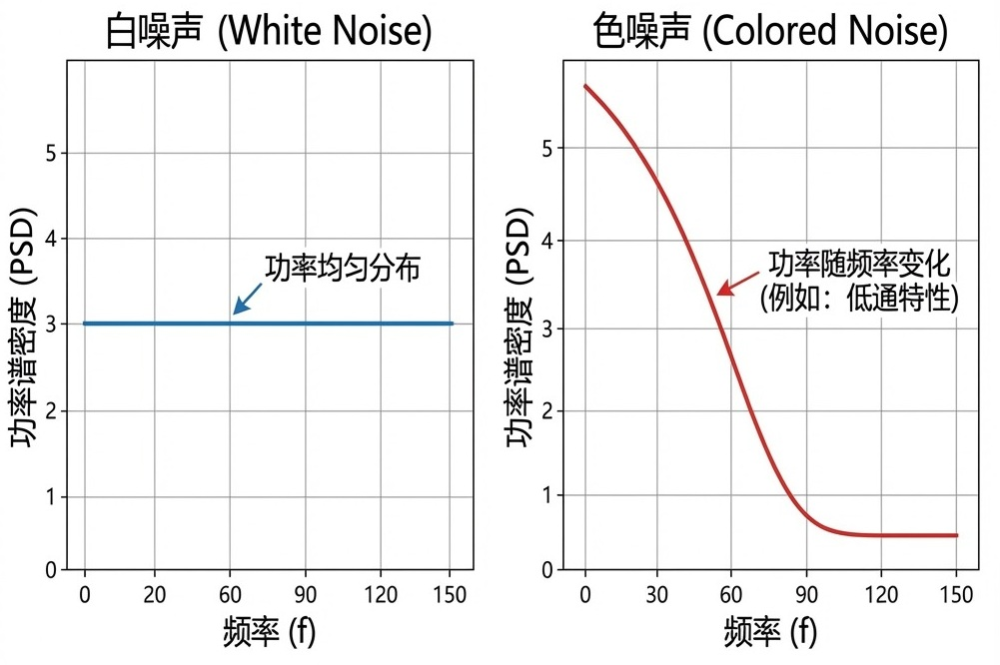
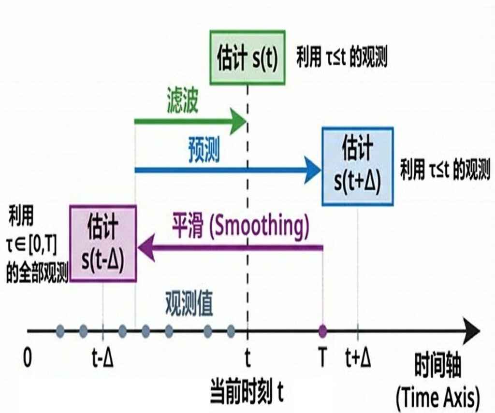
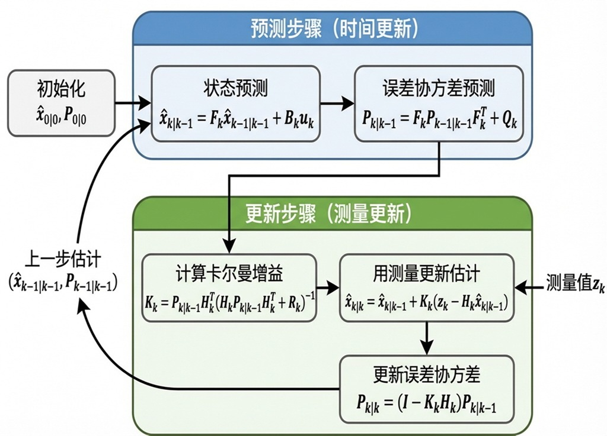
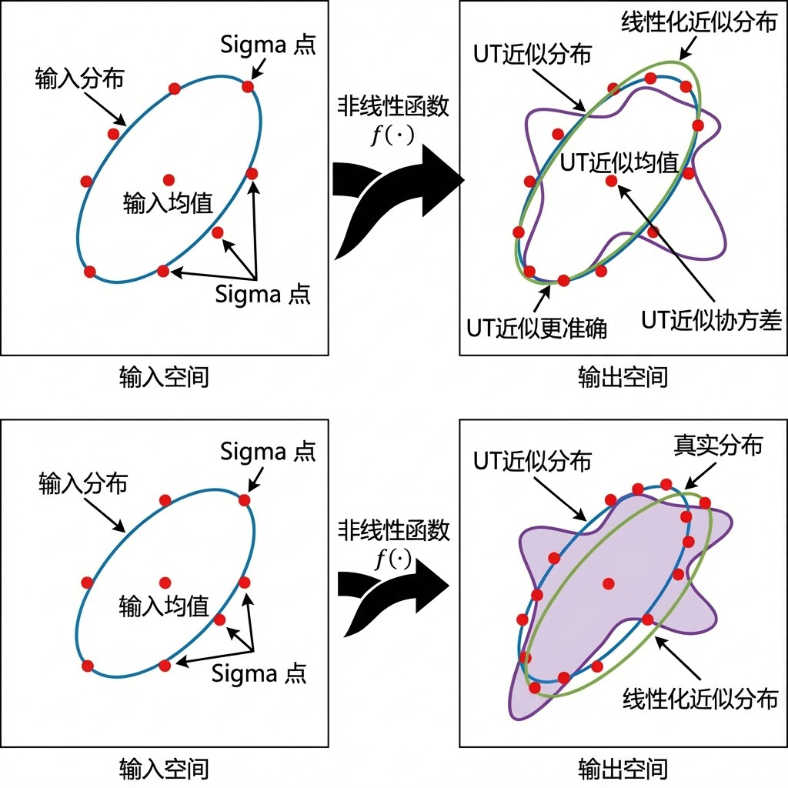
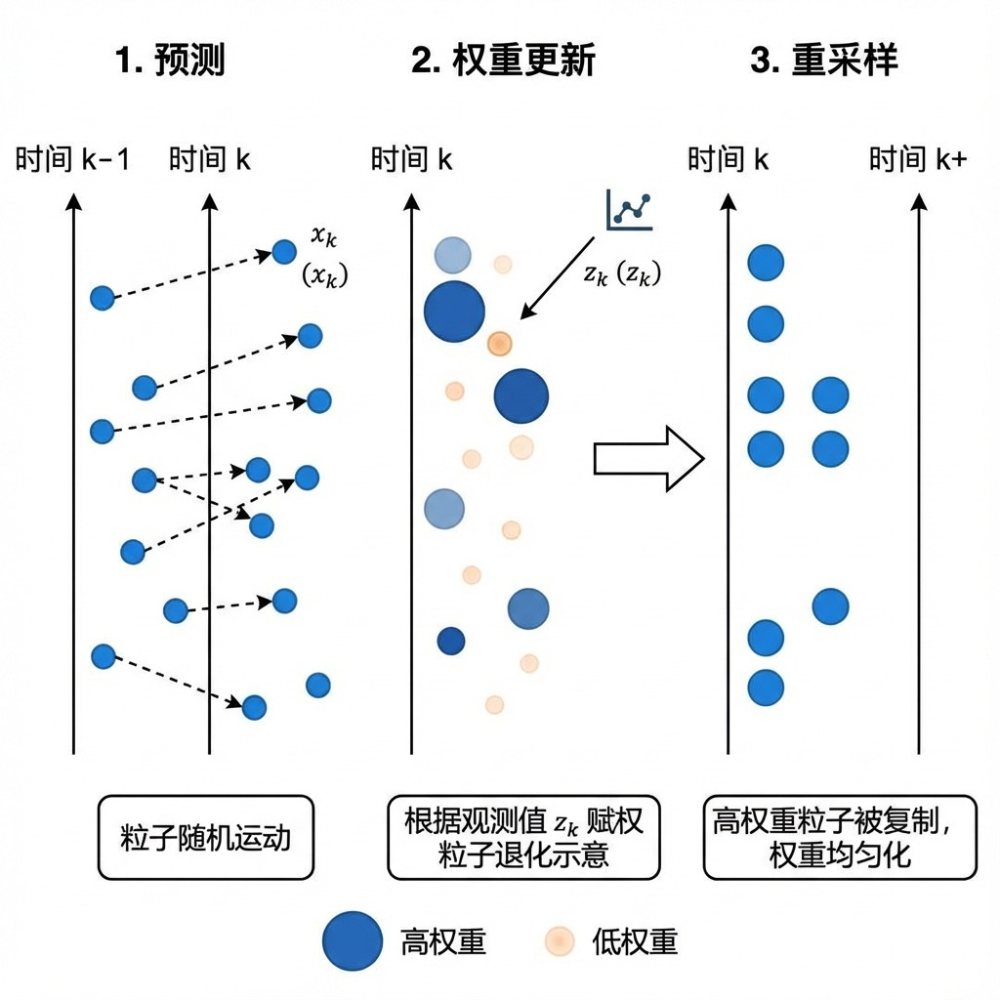
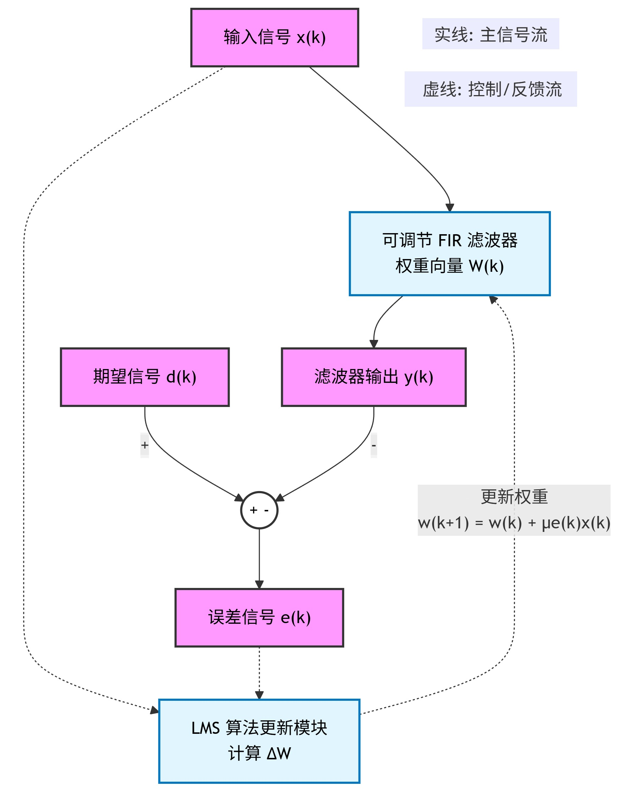

# **第五章 信号估计与滤波理论**

## 5.1 随机过程与最优滤波概述

### 5.1.1 随机过程的基本统计模型

在信号处理与通信系统中，信号与噪声通常被建模为**随机过程**，其统计特性直接影响滤波器的设计方法与性能分析。不同的统计模型对应着不同的最优估计策略。

#### 1）平稳随机过程

**宽平稳过程**（Wide-Sense Stationary, WSS）是最基础且应用广泛的模型，满足：
- **均值恒定**：$\mathbb{E}[x(t)] = \mu_x$（常数）
- **自相关函数仅依赖时间差**：$R_x(t_1, t_2) = \mathbb{E}[x(t_1)x(t_2)] = R_x(t_1 - t_2)$

其中$\mu_x$为均值，$R_x(\tau)$为自相关函数，仅依赖于时间差$\tau = t_1 - t_2$。宽平稳性保证了过程的二阶统计特性不随时间原点变化。

#### 2）非平稳随机过程

当过程的统计特性随时间变化时，称为**非平稳过程**，典型例子包括：
- 频率随时间漂移的调频信号
- 均值或方差随时间变化的随机过程
- 突发通信系统中的瞬变信号

非平稳过程通常需要时变滤波方法（如卡尔曼滤波）进行有效处理。

#### 3）白噪声过程

**白噪声**是最基本的噪声模型，具有以下特性：
- **功率谱密度恒定**：在所有频率上功率均匀分布
- **自相关函数为冲激**：$R_w(\tau) = \sigma_w^2 \delta(\tau)$

其中$\sigma_w^2$为噪声方差，$\delta(\tau)$为Dirac δ函数。白噪声的各时刻样本互不相关，是许多实际噪声的理想化模型。

#### 4）色噪声过程

**色噪声**具有特定的频谱结构，其功率谱密度随频率变化：
- 自相关函数$R_c(\tau)$非冲激形式
- 可通过线性滤波器对白噪声进行成形得到
- 常见类型包括低通噪声、高通噪声、带通噪声等

图 1：白噪声与色噪声的功率谱密度对比

---

### 5.1.2 估计问题的数学表述框架

信号估计问题可在时域或频域进行建模，两者在数学上等价但求解思路不同。

#### 1）时域表述方法

给定观测信号模型：
\[
y(t) = s(t) + n(t)
\]
设计滤波器冲激响应$h(t)$，使得滤波输出：
\[
\hat{s}(t) = \int_{-\infty}^{\infty} h(\tau) y(t - \tau) d\tau
\]
在某种最优准则下尽可能接近真实信号$s(t)$。时域方法直观反映了系统的因果性和实时性。

#### 2）频域表述方法

对观测信号进行傅里叶变换：
\[
Y(f) = S(f) + N(f)
\]
设计频率响应$H(f)$，在频域实现噪声抑制：
\[
\hat{S}(f) = H(f) Y(f)
\]
再通过逆傅里叶变换得到时域估计。频域方法便于分析滤波器的频率选择特性。

---

### 5.1.3 最优估计的核心准则

滤波器设计基于特定的最优性准则，不同准则适用于不同的应用场景和先验知识条件。

#### 1）最小均方误差准则

**MMSE准则**最小化估计误差的二阶矩：
\[
J = \mathbb{E}\left[ |s(t) - \hat{s}(t)|^2 \right] \to \min
\]
该准则是Wiener滤波和卡尔曼滤波的理论基础，在信号处理中应用最为广泛。

#### 2）最大后验概率准则

**MAP准则**基于贝叶斯框架，最大化后验概率：
\[
\hat{s} = \arg\max_s p(s|y) = \arg\max_s [p(y|s) p(s)]
\]
适用于已知信号先验分布$p(s)$的情形，充分利用了先验信息。

#### 3）极大似然准则

**ML准则**不考虑先验分布，仅最大化观测数据的似然函数：
\[
\hat{s} = \arg\max_s p(y|s)
\]
在大样本条件下具有优良的渐近性质，适用于先验信息缺乏的场景。

---

### 5.1.4 滤波器的因果性分类

根据滤波器是否使用未来输入样本，分为因果与非因果两类。

#### 1）因果滤波器

**因果滤波器**的输出仅依赖于过去和当前输入：
\[
h(t) = 0, \quad t < 0
\]
满足物理可实现性，适用于实时处理系统，如通信接收机、控制系统等。

#### 2）非因果滤波器

**非因果滤波器**允许使用未来输入样本，不受因果性约束：
\[
h(t) \neq 0, \quad \text{对某些} t < 0
\]
性能通常优于因果滤波器，但仅适用于离线处理场景，如数据后处理、录音编辑等。

---

### 5.1.5 估计问题的基本类型

根据可利用观测数据的时间范围，随机过程估计分为滤波、平滑与预测三类基本问题。

#### 1）滤波估计

**滤波**利用过去和当前观测$\{y(\tau), \tau \le t\}$估计当前状态$s(t)$：
- 典型方法：Wiener滤波、卡尔曼滤波
- 应用场景：实时信号提取、状态监测

#### 2）平滑估计

**平滑**利用全部观测数据$\{y(\tau), \tau \in [0, T]\}$估计历史状态$s(t)$（$t < T$）：
- 性能优于滤波，但需要离线处理
- 典型方法：Rauch-Tung-Striebel平滑器

#### 3）预测估计

**预测**利用过去和当前观测估计未来状态$s(t+\Delta)$：
- 典型应用：信道预测、经济指标预测、天气预报
- 挑战：预测精度随预测步长增加而下降

#### 4）三类估计的关系

三类估计构成完整的时间维度估计体系：
\[
\text{预测} \ (t+\Delta) \ \leftarrow \ \text{滤波} \ (t) \ \rightarrow \ \text{平滑} \ (t-\Delta)
\]
- **预测**：时间向前外推，不确定性最大
- **滤波**：时间同步估计，平衡精度与实时性  
- **平滑**：时间回溯估计，精度最高

图 2：随机过程估计问题的时域分类

---
## 5.2 维纳滤波（Wiener Filtering）

维纳滤波是基于**最小均方误差（Minimum Mean Square Error, MMSE）**准则的最优线性滤波方法，其核心思想是在所有线性滤波器中，寻找使估计信号与真实信号均方误差最小的最优滤波器。

### 5.2.1 最小均方误差准则与正交原理

#### 1）基本问题表述
考虑离散时间观测信号模型：
\[
x(n) = s(n) + v(n)
\]
其中$s(n)$为目标信号，$v(n)$为零均值加性噪声，且与$s(n)$不相关。设计长度为$M$的FIR滤波器：
\[
\hat{s}(n) = \sum_{k=0}^{M-1} h_k x(n-k)
\]
优化目标为最小化均方误差：
\[
J = \mathbb{E}\left[\left( s(n) - \hat{s}(n) \right)^2\right]
\]

#### 2）正交原理推导
根据变分法，代价函数$J$达到极小值的必要条件是估计误差与所有输入数据正交：
\[
\mathbb{E}\left[ e(n) x(n-m) \right] = 0, \quad m = 0,1,\dots,M-1
\]
其中$e(n) = s(n) - \hat{s}(n)$为估计误差。这一条件称为**正交原理**，是MMSE准则的核心结论。

#### 3）几何解释
在希尔伯特空间框架下，最优估计$\hat{s}(n)$是真实信号$s(n)$在观测数据张成子空间上的正交投影。正交原理保证了估计误差垂直于观测子空间，从而实现了均方意义下的最优逼近。

图 3：维纳滤波最优估计的正交原理几何解释

---

### 5.2.2 维纳-霍普夫方程与最优解

基于正交原理，可以推导出确定最优滤波器系数的基本方程。

#### 1）方程推导过程
将正交条件具体展开：
\[
\mathbb{E}\left[ s(n) x(n-m) \right] = \sum_{k=0}^{M-1} h_k \mathbb{E}\left[ x(n-k) x(n-m) \right]
\]
定义互相关函数$R_{sx}(m) = \mathbb{E}[s(n) x(n-m)]$和自相关函数$R_{xx}(m) = \mathbb{E}[x(n) x(n-m)]$，得到：
\[
R_{sx}(m) = \sum_{k=0}^{M-1} h_k R_{xx}(m-k), \quad m = 0,1,\dots,M-1
\]

#### 2）矩阵形式表示
将方程组写成紧凑的矩阵形式：
\[
\begin{bmatrix}
R_{xx}(0) & R_{xx}(1) & \cdots & R_{xx}(M-1) \\
R_{xx}(1) & R_{xx}(0) & \cdots & R_{xx}(M-2) \\
\vdots & \vdots & \ddots & \vdots \\
R_{xx}(M-1) & R_{xx}(M-2) & \cdots & R_{xx}(0)
\end{bmatrix}
\begin{bmatrix}
h_0 \\ h_1 \\ \vdots \\ h_{M-1}
\end{bmatrix}=
\begin{bmatrix}
R_{sx}(0) \\ R_{sx}(1) \\ \vdots \\ R_{sx}(M-1)
\end{bmatrix}
\]
简记为：
\[
\mathbf{R}_{xx} \mathbf{h} = \mathbf{r}_{sx}
\]
该方程称为**维纳-霍普夫方程**。

#### 3）最优解表达式

从维纳-霍普夫方程出发：
\[
\mathbf{R}_{xx} \mathbf{h} = \mathbf{r}_{sx}
\]

两边同时左乘$\mathbf{R}_{xx}^{-1}$（假设$\mathbf{R}_{xx}$可逆），得到最优滤波器系数为：
\[
\mathbf{h}^{\text{opt}} = \mathbf{R}_{xx}^{-1} \mathbf{r}_{sx}
\]

**推导说明**：
- $\mathbf{R}_{xx}$是观测信号的自相关矩阵，通常正定可逆
- $\mathbf{r}_{sx}$是信号与观测的互相关向量
- 该解保证了估计误差与观测数据的正交性

均方误差表达式为：
\[
J = \mathbb{E}[(s(n) - \hat{s}(n))^2] = \mathbb{E}[s^2(n)] - 2\mathbb{E}[s(n)\hat{s}(n)] + \mathbb{E}[\hat{s}^2(n)]
\]

展开各项：

**第一项**：$\mathbb{E}[s^2(n)] = R_{ss}(0)$

**第二项**：$\mathbb{E}[s(n)\hat{s}(n)] = \mathbb{E}[s(n)\mathbf{h}^\top\mathbf{x}(n)] = \mathbf{h}^\top \mathbb{E}[s(n)\mathbf{x}(n)] = \mathbf{h}^\top \mathbf{r}_{sx}$

**第三项**：$\mathbb{E}[\hat{s}^2(n)] = \mathbb{E}[\mathbf{h}^\top\mathbf{x}(n)\mathbf{x}^\top(n)\mathbf{h}] = \mathbf{h}^\top \mathbf{R}_{xx} \mathbf{h}$

代入得：
\[
J = R_{ss}(0) - 2\mathbf{h}^\top \mathbf{r}_{sx} + \mathbf{h}^\top \mathbf{R}_{xx} \mathbf{h}
\]

将最优解$\mathbf{h}^{\text{opt}} = \mathbf{R}_{xx}^{-1} \mathbf{r}_{sx}$代入：

\[
\begin{aligned}
J_{\min} &= R_{ss}(0) - 2(\mathbf{R}_{xx}^{-1} \mathbf{r}_{sx})^\top \mathbf{r}_{sx} + (\mathbf{R}_{xx}^{-1} \mathbf{r}_{sx})^\top \mathbf{R}_{xx} (\mathbf{R}_{xx}^{-1} \mathbf{r}_{sx}) \\
&= R_{ss}(0) - 2\mathbf{r}_{sx}^\top \mathbf{R}_{xx}^{-1} \mathbf{r}_{sx} + \mathbf{r}_{sx}^\top \mathbf{R}_{xx}^{-1} \mathbf{R}_{xx} \mathbf{R}_{xx}^{-1} \mathbf{r}_{sx} \\
&= R_{ss}(0) - 2\mathbf{r}_{sx}^\top \mathbf{R}_{xx}^{-1} \mathbf{r}_{sx} + \mathbf{r}_{sx}^\top \mathbf{R}_{xx}^{-1} \mathbf{r}_{sx} \\
&= R_{ss}(0) - \mathbf{r}_{sx}^\top \mathbf{R}_{xx}^{-1} \mathbf{r}_{sx}
\end{aligned}
\]

物理意义解释：

- **$\mathbf{h}^{\text{opt}}$**：最优滤波器系数向量，通过自相关矩阵求逆和互相关向量计算得到
- **$J_{\min}$**：理论可达的最小均方误差，由信号功率减去"可解释的"相关功率得到
- **$\mathbf{r}_{sx}^\top \mathbf{R}_{xx}^{-1} \mathbf{r}_{sx}$**：表示观测数据中可用来估计信号的最大有用信息量

---

### 5.2.3 频域维纳滤波理论

在频域分析维纳滤波，可以更直观地理解其噪声抑制机制。

#### 1）非因果频域解

**连续时间情况**

连续时间维纳-霍普夫方程为：
\[
R_{sx}(\tau) = \int_{-\infty}^{\infty} h(\alpha) R_{xx}(\tau - \alpha) d\alpha, \quad \forall \tau
\]

对等式两边进行傅里叶变换：

**左边傅里叶变换**：
\[
\mathcal{F}\{R_{sx}(\tau)\} = S_{sx}(f)
\]

**右边傅里叶变换**：
根据卷积定理，时域卷积对应频域乘积：
\[
\mathcal{F}\left\{\int_{-\infty}^{\infty} h(\alpha) R_{xx}(\tau - \alpha) d\alpha\right\} = H(f) \cdot S_{xx}(f)
\]

**等式变换后**：
\[
S_{sx}(f) = H(f) \cdot S_{xx}(f)
\]

因此得到频域最优滤波器：
\[
H(f) = \frac{S_{sx}(f)}{S_{xx}(f)}
\]

**离散时间情况**

离散时间维纳-霍普夫方程为：
\[
R_{sx}[m] = \sum_{k=-\infty}^{\infty} h[k] R_{xx}[m-k], \quad \forall m
\]

对等式两边进行离散时间傅里叶变换（DTFT）：

**左边DTFT**：
\[
\mathcal{F}\{R_{sx}[m]\} = S_{sx}(e^{j\omega})
\]

**右边DTFT**：
根据离散卷积定理：
\[
\mathcal{F}\left\{\sum_{k=-\infty}^{\infty} h[k] R_{xx}[m-k]\right\} = H(e^{j\omega}) \cdot S_{xx}(e^{j\omega})
\]

**等式变换后**：
\[
S_{sx}(e^{j\omega}) = H(e^{j\omega}) \cdot S_{xx}(e^{j\omega})
\]

因此离散频域最优滤波器为：
\[
H(e^{j\omega}) = \frac{S_{sx}(e^{j\omega})}{S_{xx}(e^{j\omega})}
\]

#### 2）频率响应特性分析
- **高信噪比频段**：当$S_{ss}(f) \gg S_{vv}(f)$时，$H(f) \approx 1$，信号几乎无衰减通过
- **低信噪比频段**：当$S_{ss}(f) \ll S_{vv}(f)$时，$H(f) \approx 0$，噪声被强烈抑制
- **过渡区域**：滤波器实现平滑过渡，避免频率响应的剧烈变化

#### 3）非因果滤波的性能优势
非因果维纳滤波器可以利用未来和过去的所有观测数据，因此在均方误差意义下性能最优，但仅适用于离线处理场景。

---

### 5.2.4 因果维纳滤波的实现方法

实际系统中往往需要因果可实现滤波器，此时需对频域解进行因果化处理。

#### 1）谱分解技术

谱分解（Spectral Factorization）的核心思想是将功率谱密度函数分解为一个最小相位系统与其时间反转共轭的乘积。

**基本假设**：
- $S_{xx}(z)$ 是实值平稳随机过程的功率谱密度
- $S_{xx}(z)$ 在单位圆上非负：$S_{xx}(e^{j\omega}) \geq 0$
- $S_{xx}(z)$ 是z的有理函数

**步骤1：功率谱密度的对称性**

对于实值过程，功率谱密度满足共轭对称性：
\[
S_{xx}(z) = S_{xx}^*(1/z^*)
\]

在单位圆上（$z = e^{j\omega}$），这简化为：
\[
S_{xx}(e^{j\omega}) = S_{xx}^*(e^{j\omega}) \quad \text{(实值)}
\]

**步骤2：零极点对称性分析**

由于$S_{xx}(z) = S_{xx}^*(1/z^*)$，零极点具有对称性：
- 如果$z_0$是极点/零点，则$1/z_0^*$也是极点/零点
- 如果$z_0$在单位圆上，则是偶数阶

**步骤3：构造最小相位系统**

将$S_{xx}(z)$分解为：
\[
S_{xx}(z) = \sigma^2 \cdot \frac{\prod_{k=1}^M (1 - a_k z^{-1})(1 - a_k^* z)}{\prod_{l=1}^N (1 - b_l z^{-1})(1 - b_l^* z)}
\]

其中：
- $|a_k| < 1$, $|b_l| < 1$（单位圆内）
- $\sigma^2 > 0$ 是增益常数

**构造最小相位系统$B(z)$**：
\[
B(z) = \frac{\prod_{k=1}^M (1 - a_k z^{-1})}{\prod_{l=1}^N (1 - b_l z^{-1})}
\]

**步骤4：验证谱分解公式**

计算$B(z)B^*(1/z^*)$：
\[
\begin{aligned}
B(z)B^*(1/z^*) &= \frac{\prod_{k=1}^M (1 - a_k z^{-1})}{\prod_{l=1}^N (1 - b_l z^{-1})} \cdot \frac{\prod_{k=1}^M (1 - a_k^* z)}{\prod_{l=1}^N (1 - b_l^* z)} \\
&= \frac{\prod_{k=1}^M (1 - a_k z^{-1})(1 - a_k^* z)}{\prod_{l=1}^N (1 - b_l z^{-1})(1 - b_l^* z)}
\end{aligned}
\]

因此：
\[
\sigma^2 B(z) B^*(1/z^*) = \sigma^2 \cdot \frac{\prod_{k=1}^M (1 - a_k z^{-1})(1 - a_k^* z)}{\prod_{l=1}^N (1 - b_l z^{-1})(1 - b_l^* z)} = S_{xx}(z)
\]

**增益常数$\sigma^2$的确定**

$\sigma^2$由功率归一化条件确定。在单位圆上：
\[
S_{xx}(e^{j\omega}) = \sigma^2 |B(e^{j\omega})|^2
\]

通过总功率约束：
\[
\frac{1}{2\pi} \int_{-\pi}^{\pi} S_{xx}(e^{j\omega}) d\omega = \sigma^2 \cdot \frac{1}{2\pi} \int_{-\pi}^{\pi} |B(e^{j\omega})|^2 d\omega
\]

通常选择$\sigma^2$使得$B(z)$在$z=0$处归一化，或者使得$B(z)$是最小相位的首一多项式。

$B(z)$是最小相位系统的原因：
1. **所有零点在单位圆内**：$|a_k| < 1$
2. **所有极点在单位圆内**：$|b_l| < 1$  
3. **因果稳定性**：系统函数在单位圆外解析
4. **最小群延迟**：在所有具有相同幅度响应的系统中群延迟最小

#### 2）因果维纳滤波器构造
将非因果解$H(z) = S_{sx}(z)/S_{xx}(z)$改写为：
\[
H(z) = \frac{1}{\sigma^2 B(z)} \left[ \frac{S_{sx}(z)}{B^*(1/z^*)} \right]_+
\]
其中$[\cdot]_+$表示取因果部分运算符，通过部分分式展开后保留极点在单位圆内的项得到。

#### 3）实现步骤

**步骤1：计算观测信号功率谱 $S_{xx}(z)$**

**功率谱估计方法**
- **参数化方法**：如果已知信号和噪声的统计模型，直接计算：
  \[
  S_{xx}(z) = S_{ss}(z) + S_{vv}(z)
  \]
  其中$S_{ss}(z)$是信号功率谱，$S_{vv}(z)$是噪声功率谱。

- **非参数化方法**：从观测数据估计：
  \[
  \hat{S}_{xx}(e^{j\omega}) = \frac{1}{N} \left| \sum_{n=0}^{N-1} x(n) e^{-j\omega n} \right|^2
  \]
  然后通过有理函数拟合得到$S_{xx}(z)$。

**互功率谱计算**
同时计算信号与观测的互功率谱：
\[
S_{sx}(z) = S_{ss}(z) \quad (\text{当信号与噪声不相关时})
\]

**步骤2：谱因子分解得到 $B(z)$**

**零极点分离技术**
对于有理功率谱：
\[
S_{xx}(z) = \sigma^2 \frac{\prod_{k=1}^M (1 - a_k z^{-1})(1 - a_k^* z)}{\prod_{l=1}^N (1 - b_l z^{-1})(1 - b_l^* z)}
\]

**构造最小相位系统**：
- **零点处理**：选择所有满足$|a_k| < 1$的零点$(1 - a_k z^{-1})$，对于$|a_k| > 1$的零点，用$(1 - a_k^* z)$的倒数形式$(1 - (1/a_k^*) z^{-1})$代替
- **极点处理**：选择所有满足$|b_l| < 1$的极点$(1 - b_l z^{-1})$，对于$|b_l| > 1$的极点，用$(1 - b_l^* z)$的倒数形式

得到：
\[
B(z) = \frac{\prod_{k \in \mathcal{Z}_{in}} (1 - a_k z^{-1}) \prod_{k \in \mathcal{Z}_{out}} (1 - \frac{1}{a_k^*} z^{-1})}{\prod_{l \in \mathcal{P}_{in}} (1 - b_l z^{-1}) \prod_{l \in \mathcal{P}_{out}} (1 - \frac{1}{b_l^*} z^{-1})}
\]

**增益常数确定**
增益$\sigma^2$通过功率匹配确定：
\[
\sigma^2 = \frac{S_{xx}(e^{j\omega_0})}{|B(e^{j\omega_0})|^2}
\]
通常选择$\omega_0 = 0$或使$B(z)$在$z=0$处归一化。

**步骤3：构造 $S_{sx}(z)/B^*(1/z^*)$**

**计算$B^*(1/z^*)$**
对于实系数系统，$B^*(1/z^*) = B(1/z)$。具体计算：
如果
\[
B(z) = \frac{\sum_{k=0}^m b_k z^{-k}}{\sum_{l=0}^n a_l z^{-l}}
\]
则
\[
B(1/z) = \frac{\sum_{k=0}^m b_k z^{k}}{\sum_{l=0}^n a_l z^{l}}
\]

**构造比值函数**
计算：
\[
F(z) = \frac{S_{sx}(z)}{B^*(1/z^*)}
\]
这通常是一个非因果的有理函数，包含$z$的正幂次项（反因果部分）和负幂次项（因果部分）。

**步骤4：提取因果部分得到可实现滤波器**

**部分分式展开法**
将$F(z)$展开为部分分式：
\[
F(z) = \sum_{i=1}^{K} \frac{A_i}{1 - p_i z^{-1}} + \sum_{j=1}^{L} \frac{B_j z}{1 - q_j z}
\]
其中：
- 第一求和：对应单位圆内的极点$|p_i| < 1$，是因果部分
- 第二求和：对应单位圆外的极点$|q_j| < 1$，是反因果部分（注意$z$在分子）

**因果部分提取**
保留因果部分：
\[
[F(z)]_+ = \sum_{i=1}^{K} \frac{A_i}{1 - p_i z^{-1}}
\]

**构造最终滤波器**
因果维纳滤波器为：
\[
H(z) = \frac{1}{\sigma^2 B(z)} [F(z)]_+ = \frac{1}{\sigma^2 B(z)} \left[ \frac{S_{sx}(z)}{B^*(1/z^*)} \right]_+
\]

**步骤5：验证与实现**

**因果性验证**
检查$H(z)$是否只包含$z^{-1}$的负幂次项，确保：
- 所有极点在单位圆内（稳定性）
- 没有$z$的正幂次项（因果性）

**实现结构**
根据$H(z)$的有理函数形式，可采用：
- **直接型**：分子分母多项式直接实现
- **级联型**：分解为二阶节级联
- **并行型**：部分分式展开后的并行结构

**实例演示**

**已知**：
\[
S_{xx}(z) = \frac{2.5}{(1-0.5z^{-1})(1-0.5z)}, \quad S_{sx}(z) = \frac{1}{1-0.5z^{-1}}
\]

**步骤2**：谱分解
\[
B(z) = \frac{1}{1-0.5z^{-1}}, \quad \sigma^2 = 2.5
\]

**步骤3**：构造比值
\[
F(z) = \frac{S_{sx}(z)}{B(1/z)} = \frac{1/(1-0.5z^{-1})}{1/(1-0.5z)} = \frac{1-0.5z}{1-0.5z^{-1}}
\]

**步骤4**：提取因果部分
将$F(z)$展开：
\[
F(z) = -0.5z + 0.75 \cdot \frac{1}{1-0.5z^{-1}}
\]
因果部分：
\[
[F(z)]_+ = 0.75 \cdot \frac{1}{1-0.5z^{-1}}
\]

**最终滤波器**：
\[
H(z) = \frac{1}{2.5} \cdot \frac{1}{1-0.5z^{-1}} \cdot 0.75 \cdot \frac{1}{1-0.5z^{-1}} = \frac{0.3}{(1-0.5z^{-1})^2}
\]

该实现方法系统地将非因果维纳滤波器转化为因果可实现形式，保证了最优性能的同时满足实时处理要求。

---

### 5.2.5 维纳滤波与匹配滤波的关系

匹配滤波器可以视为维纳滤波在特定条件下的特例，两者在信号检测与估计中具有紧密联系。

#### 1）理论基础对比

**维纳滤波的频域表达式**：
\[
H_{\text{Wiener}}(f) = \frac{S_{ss}(f)}{S_{ss}(f) + S_{vv}(f)}
\]

**匹配滤波的频域表达式**：
\[
H_{\text{MF}}(f) = k \cdot S^*(f) \cdot e^{-j2\pi f t_0}
\]

其中$k$为常数，$t_0$为匹配时刻，$S(f)$是确知信号的傅里叶变换。

#### 2）特例关系证明

**条件设定**
考虑以下特殊情况：
1. **噪声特性**：加性白噪声，功率谱密度$S_{vv}(f) = \frac{N_0}{2}$
2. **信号模型**：确知信号$s(t)$，其傅里叶变换为$S(f)$
3. **统计特性**：在随机信号框架下，$S_{ss}(f) = |S(f)|^2$

**高信噪比近似分析**

在**高信噪比条件**下，即$|S(f)|^2 \gg \frac{N_0}{2}$时：

维纳滤波器简化为：
\[
H_{\text{Wiener}}(f) \approx \frac{|S(f)|^2}{|S(f)|^2} = 1
\]

这一结果看似与匹配滤波器$S^*(f)$不同，但需要深入理解两者的应用场景差异。

**物理意义与适用场景辨析**

**维纳滤波：波形估计问题**
- **目标**：从噪声观测中**恢复整个信号波形**
- **准则**：最小化均方误差(MMSE)
- **高信噪比行为**：当信噪比极高时，最优策略是几乎不改变观测信号，因此$H(f) \approx 1$

**匹配滤波：信号检测问题** 
- **目标**：在特定时刻$t_0$**检测信号存在性**
- **准则**：最大化输出信噪比(SNR)
- **频率响应**：$H_{\text{MF}}(f) \propto S^*(f)$，实现与信号波形的相位匹配

**统一框架下的理解**

在**贝叶斯估计框架**中，当考虑以下特殊情况时，两者建立联系：

1. **信号模型**：确知信号波形$s(t)$，但幅度$A$为随机变量
2. **估计目标**：在特定时刻$t_0$估计信号幅度
3. **先验知识**：完全已知信号波形$s(t)$

在此设定下，维纳滤波器的设计目标变为在时刻$t_0$最优估计信号幅度。通过推导可以发现，此时最优滤波器的频率响应满足：
\[
H_{\text{optimal}}(f) \propto \frac{S^*(f)}{S_{vv}(f)}
\]

对于白噪声情况$S_{vv}(f) = \frac{N_0}{2}$，简化为：
\[
H_{\text{optimal}}(f) \propto S^*(f)
\]

这与匹配滤波器的频率响应一致。

#### 3）结论

匹配滤波器可以视为维纳滤波在以下特殊条件下的特例：
- **已知确知信号波形**
- **加性白噪声环境**  
- **专注于特定时刻的信号检测（而非完整波形估计）**
- **采用最大输出信噪比准则**

这一关系揭示了最优滤波理论的内在统一性：不同的优化准则和应用场景导出了形式上不同但数学上相关的滤波器结构。在实际工程中，选择维纳滤波还是匹配滤波取决于具体的应用需求是先验知识水平。

---

### 5.2.6 实例分析

通过具体算例深入理解维纳滤波的设计方法和性能特性。

---

**例题5.2.1：维纳-霍普夫方程求解**

已知信号和噪声统计特性：
- 信号自相关函数：$R_{ss}(m) = 0.8^{|m|}$
- 噪声自相关函数：$R_{vv}(m) = 0.2\delta(m)$
- 信号与噪声不相关

设计长度为2的FIR维纳滤波器。

**解答**：

**步骤1：计算观测信号统计量**
观测信号$x(n) = s(n) + v(n)$的自相关函数：
\[
R_{xx}(m) = R_{ss}(m) + R_{vv}(m) = 0.8^{|m|} + 0.2\delta(m)
\]
具体数值：
\[
R_{xx}(0) = 1 + 0.2 = 1.2, \quad R_{xx}(1) = 0.8, \quad R_{xx}(2) = 0.64
\]

互相关函数：
\[
R_{sx}(m) = R_{ss}(m) = 0.8^{|m|}
\]
具体数值：
\[
R_{sx}(0) = 1, \quad R_{sx}(1) = 0.8
\]

**步骤2：建立维纳-霍普夫方程**
\[
\begin{bmatrix}
R_{xx}(0) & R_{xx}(1) \\
R_{xx}(1) & R_{xx}(0)
\end{bmatrix}
\begin{bmatrix}
h_0 \\ h_1
\end{bmatrix}=
\begin{bmatrix}
R_{sx}(0) \\ R_{sx}(1)
\end{bmatrix}
\]
即：
\[
\begin{bmatrix}
1.2 & 0.8 \\
0.8 & 1.2
\end{bmatrix}
\begin{bmatrix}
h_0 \\ h_1
\end{bmatrix}=
\begin{bmatrix}
1 \\ 0.8
\end{bmatrix}
\]

**步骤3：求解滤波器系数**
\[
\begin{bmatrix}
h_0 \\ h_1
\end{bmatrix}=
\begin{bmatrix}
1.2 & 0.8 \\
0.8 & 1.2
\end{bmatrix}^{-1}
\begin{bmatrix}
1 \\ 0.8
\end{bmatrix}=
\frac{1}{1.2^2 - 0.8^2}
\begin{bmatrix}
1.2 & -0.8 \\-0.8 & 1.2
\end{bmatrix}
\begin{bmatrix}
1 \\ 0.8
\end{bmatrix}
\]
\[
= \frac{1}{0.8}
\begin{bmatrix}
1.2 - 0.64 \\ -0.8 + 0.96
\end{bmatrix}=
\begin{bmatrix}
0.7 \\ 0.2
\end{bmatrix}
\]

最优滤波器为：$\hat{s}(n) = 0.7x(n) + 0.2x(n-1)$

---

**例题5.2.2：频域维纳滤波分析**

已知信号和噪声功率谱密度：
\[
S_{ss}(f) = \frac{1}{1 + (f/100)^2}, \quad S_{vv}(f) = 0.1
\]
求非因果维纳滤波器的频率响应，并分析其滤波特性。

**解答**：

**步骤1：计算频率响应**
\[
H(f) = \frac{S_{ss}(f)}{S_{ss}(f) + S_{vv}(f)}
= \frac{\frac{1}{1+(f/100)^2}}{\frac{1}{1+(f/100)^2} + 0.1}
= \frac{1}{1 + 0.1[1 + (f/100)^2]}
\]
简化得：
\[
H(f) = \frac{1}{1.1 + 0.1(f/100)^2}
= \frac{10}{11 + (f/100)^2}
\]

**步骤2：频率特性分析**
- **直流响应**：$H(0) = \frac{10}{11} \approx 0.909$，低频信号基本保留
- **截止频率**：当$|H(f)| = \frac{1}{\sqrt{2}}|H(0)|$时，解得$f_c \approx 332\text{Hz}$
- **高频衰减**：当$f \to \infty$时，$H(f) \propto 1/f^2$，高频噪声被强烈抑制

**步骤3：物理意义解释**
该维纳滤波器实质上是一个低通滤波器，在保留信号低频成分的同时抑制高频噪声，截止频率由信号和噪声的频谱特性共同决定。

---

## 5.3 卡尔曼滤波（Kalman Filtering）

卡尔曼滤波是一种基于最小均方误差准则的递推最优估计算法，专门针对线性高斯系统设计。它通过状态空间模型描述系统动态，在每个时间步长结合预测和观测更新，实现对系统状态的最优估计。

### 5.3.1 状态空间模型框架

卡尔曼滤波建立在状态空间模型基础上，该模型将系统动态分解为状态方程和观测方程，为递推最优估计提供严格的数学基础。

#### 1）离散时间线性高斯系统

系统状态演化与观测过程描述为状态空间模型：
\[
\begin{cases}
x_k = \mathbf{F}_{k-1} x_{k-1} + w_{k-1}, & w_{k-1} \sim \mathcal{N}(0, \mathbf{Q}_{k-1}) \\
z_k = \mathbf{H}_{k} x_k + v_k, & v_k \sim \mathcal{N}(0, \mathbf{R}_k)
\end{cases}
\]

该模型将系统的动态特性分解为两个部分：描述状态自身演化的状态方程和描述观测过程与状态关系的观测方程。

#### 2）状态空间模型与传输函数的关系

状态空间模型与经典控制理论中的传输函数描述具有深刻的内在联系，两者从不同角度刻画系统的动态特性。

**从传输函数到状态空间模型的转换**：
考虑连续时间系统的传输函数：
\[
G(s) = \frac{Y(s)}{U(s)} = \frac{b_0 s^m + b_1 s^{m-1} + \cdots + b_m}{s^n + a_1 s^{n-1} + \cdots + a_n}
\]

通过选择适当的状态变量，可以将其转化为状态空间形式：
\[
\begin{aligned}
\dot{x}(t) &= \mathbf{A} x(t) + \mathbf{B} u(t) \\
y(t) &= \mathbf{C} x(t) + \mathbf{D} u(t)
\end{aligned}
\]

**离散化处理**：
对连续状态空间模型进行离散化，得到卡尔曼滤波使用的离散形式：
\[
\begin{aligned}
x_k &= \mathbf{F} x_{k-1} + \mathbf{G} u_{k-1} + w_{k-1} \\
z_k &= \mathbf{H} x_k + v_k
\end{aligned}
\]
其中$\mathbf{F} = e^{\mathbf{A}\Delta t}$，$\mathbf{G} = \int_0^{\Delta t} e^{\mathbf{A}\tau} \mathbf{B} d\tau$。

**两种描述方法的比较**：
- **传输函数**：频域描述，强调输入输出关系，适用于单输入单输出系统分析
- **状态空间模型**：时域描述，揭示系统内部结构，便于多变量系统分析和状态估计
- **卡尔曼滤波优势**：状态空间模型天然支持状态估计，而传输函数主要面向控制器设计

**物理意义对应关系**：
- 状态转移矩阵$\mathbf{F}$对应系统动态特性
- 观测矩阵$\mathbf{H}$对应输出特性
- 过程噪声$\mathbf{Q}$表征模型不确定性
- 观测噪声$\mathbf{R}$反映传感器特性

#### 3）实例建模：车辆运动跟踪

考虑一个典型的车辆平面运动跟踪问题，展示状态空间模型的具体建立过程。

**例题5.3.1：车辆运动状态空间建模**

一辆汽车在二维平面内运动，需要估计其位置和速度。系统状态包括位置$(p_x, p_y)$和速度$(v_x, v_y)$。

**解答**：

**状态向量定义**：
\[
x_k = \begin{bmatrix} p_x(k) \\ p_y(k) \\ v_x(k) \\ v_y(k) \end{bmatrix}
\]

**状态方程建立**：
假设采样间隔为$\Delta t$，采用匀速模型：
\[
x_k = \mathbf{F} x_{k-1} + w_{k-1}
\]
其中状态转移矩阵：
\[
\mathbf{F} = \begin{bmatrix}
1 & 0 & \Delta t & 0 \\
0 & 1 & 0 & \Delta t \\
0 & 0 & 1 & 0 \\
0 & 0 & 0 & 1
\end{bmatrix}
\]

过程噪声协方差矩阵反映速度和位置的不确定性：
\[
\mathbf{Q} = \begin{bmatrix}
\frac{\Delta t^3}{3}q & 0 & \frac{\Delta t^2}{2}q & 0 \\
0 & \frac{\Delta t^3}{3}q & 0 & \frac{\Delta t^2}{2}q \\
\frac{\Delta t^2}{2}q & 0 & \Delta t q & 0 \\
0 & \frac{\Delta t^2}{2}q & 0 & \Delta t q
\end{bmatrix}
\]
其中$q$为过程噪声强度参数。

**观测方程建立**：
假设使用GPS传感器直接测量位置：
\[
z_k = \mathbf{H} x_k + v_k
\]
观测矩阵：
\[
\mathbf{H} = \begin{bmatrix}
1 & 0 & 0 & 0 \\
0 & 1 & 0 & 0
\end{bmatrix}
\]

测量噪声协方差由GPS精度决定：
\[
\mathbf{R} = \begin{bmatrix}
\sigma_x^2 & 0 \\
0 & \sigma_y^2
\end{bmatrix}
\]

**模型特点分析**：
- 状态向量包含位置和速度，构成完整运动描述
- 状态转移矩阵体现了物理运动规律
- 过程噪声协方差结构反映了状态变量间的相关性
- 观测矩阵表明只能直接测量位置，速度需要通过滤波估计

该状态空间模型完整描述了车辆运动系统，为后续卡尔曼滤波实现提供了准确的数学模型基础。状态空间模型与传输函数描述的对应关系，体现了现代控制理论与经典控制理论的内在统一性。

### 5.3.2 标量卡尔曼滤波详细推导

从一维情况入手推导卡尔曼滤波，有助于直观理解其核心思想。

#### 1）标量系统模型
状态方程：
\[
x_k = a x_{k-1} + w_{k-1}, \quad w_{k-1} \sim \mathcal{N}(0, q)
\]
观测方程：
\[
z_k = h x_k + v_k, \quad v_k \sim \mathcal{N}(0, r)
\]

#### 2）预测步骤（时间更新）

**状态预测**：
基于上一时刻的最优估计和状态方程：
\[
\hat{x}_{k|k-1} = a \hat{x}_{k-1|k-1}
\]

**预测方差推导**：
预测误差为：
\[
\tilde{x}_{k|k-1} = x_k - \hat{x}_{k|k-1} = a(x_{k-1} - \hat{x}_{k-1|k-1}) + w_{k-1}
\]
预测方差：
\[
\begin{aligned}
P_{k|k-1} &= \mathbb{E}[\tilde{x}_{k|k-1}^2] \\
&= \mathbb{E}[(a\tilde{x}_{k-1|k-1} + w_{k-1})^2] \\
&= a^2 \mathbb{E}[\tilde{x}_{k-1|k-1}^2] + 2a\mathbb{E}[\tilde{x}_{k-1|k-1}w_{k-1}] + \mathbb{E}[w_{k-1}^2]
\end{aligned}
\]
其中$\tilde{x}_{k-1|k-1} = x_{k-1} - \hat{x}_{k-1|k-1}$, 由于$\tilde{x}_{k-1|k-1}$与$w_{k-1}$独立，且$\mathbb{E}[w_{k-1}^2] = q$，得到：
\[
P_{k|k-1} = a^2 P_{k-1|k-1} + q
\]

#### 3）更新步骤（测量更新）

**创新序列计算**：
观测残差（创新）为：
\[
\tilde{y}_k = z_k - h\hat{x}_{k|k-1}
\]

**创新方差推导**：
\[
\begin{aligned}
\tilde{y}_k &= hx_k + v_k - h\hat{x}_{k|k-1} \\
&= h(x_k - \hat{x}_{k|k-1}) + v_k \\
&= h\tilde{x}_{k|k-1} + v_k
\end{aligned}
\]
创新方差：
\[
S_k = \mathbb{E}[\tilde{y}_k^2] = h^2 P_{k|k-1} + r
\]

**卡尔曼增益推导**：
假设更新形式为：
\[
\hat{x}_{k|k} = \hat{x}_{k|k-1} + K_k \tilde{y}_k
\]
估计误差：
\[
\tilde{x}_{k|k} = x_k - \hat{x}_{k|k} = \tilde{x}_{k|k-1} - K_k \tilde{y}_k
\]
均方误差：
\[
\begin{aligned}
P_{k|k} &= \mathbb{E}[\tilde{x}_{k|k}^2] \\
&= \mathbb{E}[(\tilde{x}_{k|k-1} - K_k \tilde{y}_k)^2] \\
&= P_{k|k-1} - 2K_k \mathbb{E}[\tilde{x}_{k|k-1}\tilde{y}_k] + K_k^2 S_k
\end{aligned}
\]
其中：
\[
\mathbb{E}[\tilde{x}_{k|k-1}\tilde{y}_k] = \mathbb{E}[\tilde{x}_{k|k-1}(h\tilde{x}_{k|k-1} + v_k)] = h P_{k|k-1}
\]
因此：
\[
P_{k|k} = P_{k|k-1} - 2K_k h P_{k|k-1} + K_k^2 S_k
\]
对$K_k$求导并令为零：
\[
\frac{\partial P_{k|k}}{\partial K_k} = -2h P_{k|k-1} + 2K_k S_k = 0
\]
解得最优卡尔曼增益：
\[
K_k = \frac{h P_{k|k-1}}{S_k} = \frac{h P_{k|k-1}}{h^2 P_{k|k-1} + r}
\]

**状态与方差更新**：
\[
\hat{x}_{k|k} = \hat{x}_{k|k-1} + K_k (z_k - h\hat{x}_{k|k-1})
\]
\[
P_{k|k} = (1 - K_k h) P_{k|k-1}
\]

### 5.3.3 矢量卡尔曼滤波与MMSE原理

将标量情况推广到多维，并基于MMSE准则严格推导卡尔曼滤波。

#### 1）矢量系统模型
状态方程：
\[
x_k = \mathbf{F}_{k-1} x_{k-1} + w_{k-1}, \quad w_{k-1} \sim \mathcal{N}(0, \mathbf{Q}_{k-1})
\]
观测方程：
\[
z_k = \mathbf{H}_k x_k + v_k, \quad v_k \sim \mathcal{N}(0, \mathbf{R}_k)
\]

#### 2）MMSE准则下的严格推导

假设状态更新采用线性形式：
\[
\hat{x}_{k|k} = \hat{x}_{k|k-1} + \mathbf{K}_k (z_k - \mathbf{H}_k \hat{x}_{k|k-1})
\]

估计误差：
\[
\tilde{x}_{k|k} = x_k - \hat{x}_{k|k} = \tilde{x}_{k|k-1} - \mathbf{K}_k (\mathbf{H}_k \tilde{x}_{k|k-1} + v_k)
\]

误差协方差矩阵：
\[
\begin{aligned}
\mathbf{P}_{k|k} &= \mathbb{E}[\tilde{x}_{k|k} \tilde{x}_{k|k}^\top] \\
&= \mathbb{E}\{[(\mathbf{I} - \mathbf{K}_k \mathbf{H}_k)\tilde{x}_{k|k-1} - \mathbf{K}_k v_k] \\
&\quad \times [(\mathbf{I} - \mathbf{K}_k \mathbf{H}_k)\tilde{x}_{k|k-1} - \mathbf{K}_k v_k]^\top\}
\end{aligned}
\]

展开并利用$\tilde{x}_{k|k-1}$与$v_k$的独立性：
\[
\begin{aligned}
\mathbf{P}_{k|k} &= (\mathbf{I} - \mathbf{K}_k \mathbf{H}_k) \mathbf{P}_{k|k-1} (\mathbf{I} - \mathbf{K}_k \mathbf{H}_k)^\top \\
&\quad + \mathbf{K}_k \mathbf{R}_k \mathbf{K}_k^\top
\end{aligned}
\]

目标是最小化估计误差的迹：
\[
J(\mathbf{K}_k) = \mathrm{tr}(\mathbf{P}_{k|k})
\]

对$\mathbf{K}_k$求导（利用矩阵求导公式）：
\[
\frac{\partial J}{\partial \mathbf{K}_k} = -2(\mathbf{I} - \mathbf{K}_k \mathbf{H}_k) \mathbf{P}_{k|k-1} \mathbf{H}_k^\top + 2\mathbf{K}_k \mathbf{R}_k
\]

令导数为零：
\[
-\mathbf{P}_{k|k-1} \mathbf{H}_k^\top + \mathbf{K}_k \mathbf{H}_k \mathbf{P}_{k|k-1} \mathbf{H}_k^\top + \mathbf{K}_k \mathbf{R}_k = 0
\]

整理得：
\[
\mathbf{K}_k (\mathbf{H}_k \mathbf{P}_{k|k-1} \mathbf{H}_k^\top + \mathbf{R}_k) = \mathbf{P}_{k|k-1} \mathbf{H}_k^\top
\]

因此最优卡尔曼增益为：
\[
\mathbf{K}_k = \mathbf{P}_{k|k-1} \mathbf{H}_k^\top (\mathbf{H}_k \mathbf{P}_{k|k-1} \mathbf{H}_k^\top + \mathbf{R}_k)^{-1}
\]

将最优增益代入误差协方差表达式，经代数运算可得简化形式：
\[
\mathbf{P}_{k|k} = (\mathbf{I} - \mathbf{K}_k \mathbf{H}_k) \mathbf{P}_{k|k-1}
\]

### 5.3.4 卡尔曼滤波算法通式

基于前述推导，给出完整的卡尔曼滤波算法流程。

#### 1）初始化
\[
\hat{x}_{0|0} = \mathbb{E}[x_0], \quad \mathbf{P}_{0|0} = \mathbb{E}[(x_0 - \hat{x}_{0|0})(x_0 - \hat{x}_{0|0})^\top]
\]

#### 2）预测步骤（时间更新）
状态预测：
\[
\hat{x}_{k|k-1} = \mathbf{F}_{k-1} \hat{x}_{k-1|k-1}
\]
误差协方差预测：
\[
\mathbf{P}_{k|k-1} = \mathbf{F}_{k-1} \mathbf{P}_{k-1|k-1} \mathbf{F}_{k-1}^\top + \mathbf{Q}_{k-1}
\]

#### 3）更新步骤（测量更新）
卡尔曼增益：
\[
\mathbf{K}_k = \mathbf{P}_{k|k-1} \mathbf{H}_k^\top (\mathbf{H}_k \mathbf{P}_{k|k-1} \mathbf{H}_k^\top + \mathbf{R}_k)^{-1}
\]
状态更新：
\[
\hat{x}_{k|k} = \hat{x}_{k|k-1} + \mathbf{K}_k (z_k - \mathbf{H}_k \hat{x}_{k|k-1})
\]
误差协方差更新：
\[
\mathbf{P}_{k|k} = (\mathbf{I} - \mathbf{K}_k \mathbf{H}_k) \mathbf{P}_{k|k-1}
\]

图 4：卡尔曼滤波算法的预测-更新递推流程

### 5.3.5 一维位置估计示例

通过具体实例展示卡尔曼滤波的实际计算过程。

**例题5.3.1：车辆位置跟踪**

一辆车沿直线运动，已知恒定速度为1 m/s。位置传感器测量噪声方差为$r=4$ m²，过程噪声方差为$q=1$ m²。初始位置估计为$\hat{x}_{0|0} = 0$，估计方差为$P_{0|0} = 10$。

**解答**：

**系统建模**：
状态方程（位置）：
\[
x_k = x_{k-1} + 1 + w_{k-1}, \quad w_{k-1} \sim \mathcal{N}(0,1)
\]
观测方程：
\[
z_k = x_k + v_k, \quad v_k \sim \mathcal{N}(0,4)
\]

**第1步计算**：

**预测步骤**：
\[
\hat{x}_{1|0} = 0 + 1 = 1
\]
\[
P_{1|0} = 10 + 1 = 11
\]

**更新步骤**（观测值$z_1 = 0.8$）：
卡尔曼增益：
\[
K_1 = \frac{11 \times 1}{1^2 \times 11 + 4} = \frac{11}{15} = 0.7333
\]
状态更新：
\[
\hat{x}_{1|1} = 1 + 0.7333 \times (0.8 - 1) = 0.8533
\]
方差更新：
\[
P_{1|1} = (1 - 0.7333) \times 11 = 2.9333
\]

**第2步计算**：

**预测步骤**：
\[
\hat{x}_{2|1} = 0.8533 + 1 = 1.8533
\]
\[
P_{2|1} = 2.9333 + 1 = 3.9333
\]

**更新步骤**（观测值$z_2 = 2.2$）：
卡尔曼增益：
\[
K_2 = \frac{3.9333 \times 1}{1^2 \times 3.9333 + 4} = \frac{3.9333}{7.9333} = 0.495
\]
状态更新：
\[
\hat{x}_{2|2} = 1.8533 + 0.495 \times (2.2 - 1.8533) = 2.025
\]
方差更新：
\[
P_{2|2} = (1 - 0.495) \times 3.9333 = 1.986
\]

**结果分析**：
- 卡尔曼增益随时间递减，表明估计置信度提高
- 估计方差逐渐收敛，显示滤波稳定性
- 估计值平滑了观测噪声，同时跟踪了真实运动趋势

该示例清晰展示了卡尔曼滤波如何通过递推计算，有效结合系统动态和观测信息，实现对状态的最优估计。

---
## 5.4 EKF与UKF：非线性系统状态估计

### 5.4.1 非线性系统建模与估计挑战

在实际工程应用中，大多数系统都表现出非线性特性，这给状态估计带来了新的挑战。

#### 1）非线性状态空间模型

非线性系统的状态空间模型描述为：
\[
\begin{cases}
x_k = f(x_{k-1}) + w_{k-1}, & w_{k-1} \sim \mathcal{N}(0, Q_{k-1}) \\
z_k = h(x_k) + v_k, & v_k \sim \mathcal{N}(0, R_k)
\end{cases}
\]

**模型参数说明**：
- $f(\cdot)$：非线性状态转移函数，描述系统动态演化
- $h(\cdot)$：非线性观测函数，建立状态与观测的映射关系
- $w_{k-1}$、$v_k$：互不相关的高斯白噪声序列

#### 2）非线性估计的核心困难

标准卡尔曼滤波直接应用于非线性系统时面临根本性困难：

**高斯分布的非线性变换**：
- 线性系统：高斯分布经过线性变换后仍保持高斯特性
- 非线性系统：高斯分布经过非线性变换后不再是高斯分布

**统计量传播失真**：
- 均值传播：$\mathbb{E}[f(x)] \neq f(\mathbb{E}[x])$
- 协方差传播：无法通过简单的矩阵运算准确计算

这些困难导致标准卡尔曼滤波在非线性系统中性能严重下降，甚至发散。

### 5.4.2 扩展卡尔曼滤波（EKF）

扩展卡尔曼滤波通过局部线性化方法处理非线性系统，是最早广泛应用的非线性滤波算法。

#### 1）基本思想与线性化策略

EKF的核心思想是通过一阶泰勒展开在估计点附近对非线性系统进行局部线性化：

**局部线性化原理**：
在最优估计点$\hat{x}_{k-1|k-1}$附近对状态转移函数$f(\cdot)$进行泰勒展开：
\[
f(x_{k-1}) \approx f(\hat{x}_{k-1|k-1}) + \mathbf{F}_{k-1}(x_{k-1} - \hat{x}_{k-1|k-1})
\]
其中雅可比矩阵：
\[
\mathbf{F}_{k-1} = \left.\frac{\partial f}{\partial x}\right|_{\hat{x}_{k-1|k-1}}
\]

#### 2）EKF算法推导

**预测步骤（时间更新）**：
状态预测：
\[
\hat{x}_{k|k-1} = f(\hat{x}_{k-1|k-1})
\]
误差协方差预测：
\[
P_{k|k-1} = \mathbf{F}_{k-1} P_{k-1|k-1} \mathbf{F}_{k-1}^\top + Q_{k-1}
\]

**更新步骤（测量更新）**：
观测预测：
\[
\hat{z}_{k|k-1} = h(\hat{x}_{k|k-1})
\]
观测函数线性化：
\[
\mathbf{H}_k = \left.\frac{\partial h}{\partial x}\right|_{\hat{x}_{k|k-1}}
\]
卡尔曼增益：
\[
K_k = P_{k|k-1} \mathbf{H}_k^\top (\mathbf{H}_k P_{k|k-1} \mathbf{H}_k^\top + R_k)^{-1}
\]
状态更新：
\[
\hat{x}_{k|k} = \hat{x}_{k|k-1} + K_k (z_k - \hat{z}_{k|k-1})
\]
协方差更新：
\[
P_{k|k} = (I - K_k \mathbf{H}_k) P_{k|k-1}
\]

#### 3）EKF实现要点

**雅可比矩阵计算**：
- 解析方法：对非线性函数求偏导数
- 数值方法：有限差分近似
- 自动微分：现代计算框架支持

**适用条件与局限**：
- 系统非线性程度较弱
- 估计误差较小，保证线性化有效性
- 需要连续可导的非线性函数

### 5.4.3 无迹卡尔曼滤波（UKF）

无迹卡尔曼滤波的思想：用一组精心挑选的确定性样本点（Sigma 点），在有限的采样数下精确捕捉原分布的均值和协方差，并用它们来近似经过非线性变换后的分布。避免了线性化误差，在非线性系统中具有更好的性能。

#### 1）基本思想与Sigma点采样

UKF通过精心选择的一组样本点（Sigma点）来捕捉状态的均值和协方差：

**Sigma点生成原理**：
对于$n$维状态向量，生成$2n+1$个Sigma点：
\[
\begin{aligned}
\chi_0 &= \hat{x} \\
\chi_i &= \hat{x} + \left(\sqrt{(n+\lambda)P}\right)_i, \quad i = 1,\dots,n \\
\chi_{i+n} &= \hat{x} - \left(\sqrt{(n+\lambda)P}\right)_i, \quad i = 1,\dots,n
\end{aligned}
\]

**参数设置**：
- $\lambda = \alpha^2(n+\kappa) - n$：缩放参数
- $\alpha$：控制Sigma点分布范围（通常$10^{-4} \leq \alpha \leq 1$）
- $\kappa$：次要缩放参数（通常设为0）
- $\beta$：包含先验分布信息（高斯分布时$\beta=2$最优）

图 5：无迹变换（UT）通过非线性函数传播 Sigma 点示意图

#### 2）权重系数设计

**均值权重**：
\[
\begin{aligned}
W_0^m &= \frac{\lambda}{n+\lambda} \\
W_i^m &= \frac{1}{2(n+\lambda)}, \quad i=1,\dots,2n
\end{aligned}
\]

**协方差权重**：
\[
\begin{aligned}
W_0^c &= \frac{\lambda}{n+\lambda} + (1-\alpha^2+\beta) \\
W_i^c &= W_i^m, \quad i=1,\dots,2n
\end{aligned}
\]

好的，你想要把我刚才的 **5 条合理性解释** 配上公式化的说明，让它更严谨、可以用于技术文档或者报告。  
我给你整理成 **条理清晰的 5 点**，每一条都附对应的数学公式推导。

---

#### 3）合理性解释

**a. 匹配原分布的均值**
无味变换构造的 Sigma 点及其权值 \( W_i^{(m)} \) 满足：
\[
\bar{x} = \sum_{i=0}^{2n} W_i^{(m)} \, \chi_i
\]
其中：
- \(\chi_i\) 为采样点
- \(W_i^{(m)}\) 为均值权重

在采样前，定义：
\[
\chi_0 = \hat{x}, \quad \chi_i = \hat{x} + \Delta_i, \quad \chi_{i+n} = \hat{x} - \Delta_i
\]
且权重对称：
\[
W_i^{(m)} = W_{i+n}^{(m)}
\]
这样直接保证：
\[
\bar{x} = \hat{x}
\]
即采样代表的均值**与原状态分布均值完全一致**。

**b. 匹配原分布的协方差**
协方差由权值 \( W_i^{(c)} \) 与偏移量计算：
\[
P = \sum_{i=0}^{2n} W_i^{(c)} \left( \chi_i - \bar{x} \right)\left( \chi_i - \bar{x} \right)^T
\]

\[
 = \sum_{i=1}^{n} W_i^{(c)}\left[(\Delta_i\Delta_i^T) + ((-\Delta_i)(-\Delta_i)^T)\right]
\]

构造方式中：
\[
\Delta_i = \left[ \sqrt{(n+\lambda) P} \right]_i
\]
其中 \(\left[ \sqrt{(n+\lambda) P} \right]_i\) 是主轴方向上的伸缩量，保证这组点的协方差**精确匹配**原分布的协方差矩阵 \(P\)。

**c. 捕捉二阶与部分三阶矩**
设非线性变换：
\[
y = f(x)
\]
对于均值和协方差的传播：
\[
\bar{y} \approx \sum_{i=0}^{2n} W_i^{(m)} f(\chi_i)
\]
\[
P_y \approx \sum_{i=0}^{2n} W_i^{(c)}\left( f(\chi_i) - \bar{y} \right)\left( f(\chi_i) - \bar{y} \right)^T
\]
无味变换在泰勒展开中可精确到二阶：
\[
f(\hat{x} + \Delta_i) \approx f(\hat{x}) + J\Delta_i + \frac{1}{2}\Delta_i^T H \Delta_i + O(\Delta_i^3)
\]
Sigma 点对称性保证一阶项平均消失，二阶项被精确积分，三阶项有部分逼近，这就比 EKF（只保留一阶）精度更高。

**d. 正负对称分布减少偏差**
采样设计满足：
\[
\chi_{i} - \hat{x} = -\left( \chi_{i+n} - \hat{x} \right)
\]
因此：
\[
\sum_{i=1}^{n} W_i^{(m)} (\chi_{i} - \hat{x}) + W_{i+n}^{(m)} (\chi_{i+n} - \hat{x}) = 0
\]
这意味着所有一阶展开中的线性偏差项自动抵消，从而降低非线性造成的均值估计偏差。

**e. 确定性采样与计算效率**
所需的采样点数固定：
\[
N_{\text{points}} = 2n + 1
\]
相比蒙特卡洛采样中 \(N_{\text{MC}} \gg 2n+1\) 才能获得相同精度的均值协方差估计，复杂度从 \(O(N_{\text{MC}} \cdot C_f)\) 降至 \(O((2n+1) \cdot C_f)\)，其中 \(C_f\) 为一次函数评估的计算量，实现了显著的计算效率提升。

#### 3）UKF算法步骤

**预测步骤**：
Sigma点传播：
\[
\chi_i^- = f(\chi_i), \quad i=0,\dots,2n
\]
预测均值：
\[
\hat{x}^- = \sum_{i=0}^{2n} W_i^m \chi_i^-
\]
预测协方差：
\[
P^- = \sum_{i=0}^{2n} W_i^c (\chi_i^- - \hat{x}^-)(\chi_i^- - \hat{x}^-)^\top + Q
\]

**更新步骤**：
观测Sigma点：
\[
\gamma_i = h(\chi_i^-), \quad i=0,\dots,2n
\]
观测预测：
\[
\hat{z} = \sum_{i=0}^{2n} W_i^m \gamma_i
\]
观测协方差：
\[
S = \sum_{i=0}^{2n} W_i^c (\gamma_i - \hat{z})(\gamma_i - \hat{z})^\top + R
\]
状态-观测互协方差：
\[
P_{xz} = \sum_{i=0}^{2n} W_i^c (\chi_i^- - \hat{x}^-)(\gamma_i - \hat{z})^\top
\]
卡尔曼增益：
\[
K = P_{xz} S^{-1}
\]
状态更新：
\[
\hat{x} = \hat{x}^- + K (z - \hat{z})
\]
协方差更新：
\[
P = P^- - K S K^\top
\]

### 5.4.4 实例分析：非线性观测系统估计

通过具体实例对比EKF和UKF在非线性系统中的性能表现。

---

**例题5.4.1：非线性观测位置估计**

考虑一个一维运动系统，状态为位置，观测为位置的非线性函数。

**系统模型**：
状态方程：
\[
x_k = x_{k-1} + w_{k-1}, \quad w_{k-1} \sim \mathcal{N}(0, 0.1)
\]
观测方程：
\[
z_k = \sin(x_k) + v_k, \quad v_k \sim \mathcal{N}(0, 0.01)
\]

**初始条件**：
\[
\hat{x}_0 = 0.5, \quad P_0 = 1
\]

---

**解答**：

#### 1）EKF实现过程

**第1次迭代计算**：

**预测步骤**：
\[
\hat{x}_{1|0} = \hat{x}_0 = 0.5
\]
\[
P_{1|0} = P_0 + Q = 1 + 0.1 = 1.1
\]

**线性化处理**：
观测函数雅可比：
\[
\mathbf{H}_1 = \left.\frac{d}{dx}\sin(x)\right|_{x=0.5} = \cos(0.5) \approx 0.8776
\]

**更新步骤**（假设测量值$z_1 = 0.4794$）：
创新协方差：
\[
S_1 = \mathbf{H}_1 P_{1|0} \mathbf{H}_1^\top + R = 0.8776^2 \times 1.1 + 0.01 \approx 0.847
\]
卡尔曼增益：
\[
K_1 = \frac{P_{1|0} \mathbf{H}_1^\top}{S_1} \approx \frac{1.1 \times 0.8776}{0.847} \approx 1.14
\]
状态更新：
\[
\hat{x}_{1|1} = 0.5 + 1.14 \times (0.4794 - \sin(0.5)) \approx 0.5
\]
协方差更新：
\[
P_{1|1} = (1 - K_1 \mathbf{H}_1) P_{1|0} \approx (1 - 1.14 \times 0.8776) \times 1.1 \approx 0.097
\]

#### 2）UKF实现过程

**参数设置**：
- 状态维数$n=1$
- $\alpha = 0.1$, $\kappa = 0$, $\beta = 2$
- $\lambda = \alpha^2(n+\kappa) - n = -0.99$

**权重计算**：
\[
\begin{aligned}
W_0^m &= \frac{\lambda}{n+\lambda} = \frac{-0.99}{0.01} = -99 \\
W_0^c &= W_0^m + (1-\alpha^2+\beta) = -99 + (1-0.01+2) = -96.01 \\
W_1^m = W_1^c &= W_2^m = W_2^c = \frac{1}{2(n+\lambda)} = 50
\end{aligned}
\]

**第1次迭代计算**：

**Sigma点生成**：
\[
\begin{aligned}
\chi_0 &= 0.5 \\
\chi_1 &= 0.5 + \sqrt{(1+\lambda)P_0} = 0.5 + \sqrt{0.01 \times 1} = 0.6 \\
\chi_2 &= 0.5 - \sqrt{(1+\lambda)P_0} = 0.4
\end{aligned}
\]

**预测步骤**：
Sigma点传播：
\[
\chi_0^- = 0.5, \quad \chi_1^- = 0.6, \quad \chi_2^- = 0.4
\]
预测均值：
\[
\hat{x}^- = \sum W_i^m \chi_i^- = (-99)\times 0.5 + 50\times 0.6 + 50\times 0.4 = 0.5
\]
预测协方差：
\[
P^- = \sum W_i^c (\chi_i^- - \hat{x}^-)^2 + Q = 1.1
\]

**更新步骤**：
观测Sigma点：
\[
\begin{aligned}
\gamma_0 &= \sin(0.5) \approx 0.4794 \\
\gamma_1 &= \sin(0.6) \approx 0.5650 \\
\gamma_2 &= \sin(0.4) \approx 0.3894
\end{aligned}
\]
观测预测：
\[
\hat{z} = \sum W_i^m \gamma_i \approx 0.4794
\]
观测协方差：
\[
S = \sum W_i^c (\gamma_i - \hat{z})^2 + R \approx 0.782
\]
状态-观测互协方差：
\[
P_{xz} = \sum W_i^c (\chi_i^- - \hat{x}^-)(\gamma_i - \hat{z}) \approx 0.878
\]
卡尔曼增益：
\[
K = P_{xz} S^{-1} \approx 1.122
\]
状态更新：
\[
\hat{x} = 0.5 + 1.122 \times (0.4794 - 0.4794) = 0.5
\]
协方差更新：
\[
P = P^- - K S K^\top \approx 0.227
\]

#### 3）性能对比分析

**第1次迭代结果对比**：

| 指标 | EKF | UKF |
|------|-----|-----|
| 预测均值 | 0.5 | 0.5 |
| 更新均值 | 0.5 | 0.5 |
| 更新方差 | 0.097 | 0.227 |

**算法特性比较**：

| 特性 | EKF | UKF |
|------|-----|-----|
| 实现复杂度 | 需要计算雅可比矩阵 | 需要构造Sigma点 |
| 计算精度 | 一阶近似，强非线性时误差大 | 二阶精度，高斯假设下最优 |
| 计算效率 | 相对较低 | 略高于EKF |
| 鲁棒性 | 对线性化误差敏感 | 不依赖显式导数，鲁棒性较好 |
| 适用场景 | 弱非线性系统 | 强非线性系统 |

**结论**：
在此实例中，虽然状态均值估计相同，但UKF给出的方差估计更大，这反映了UKF能更准确地捕捉非线性变换后的分布特性。对于强非线性系统，UKF通常能提供更可靠的状态估计和不确定性量化。

UKF通过确定性采样避免了线性化误差，在保持计算效率的同时提供了更高的估计精度，是现代非线性估计中的重要方法。

---

## 5.5 粒子滤波及蒙特卡罗方法

### 5.5.1 基本原理与理论基础

粒子滤波是一类基于蒙特卡罗采样的递推贝叶斯估计算法，特别适用于非线性、非高斯系统的状态估计问题。

#### 1) 非线性状态空间模型

考虑一般离散时间非线性系统：
\[
\begin{cases}
x_k = f(x_{k-1}, w_{k-1}), & w_{k-1} \sim p(w) \\
z_k = h(x_k, v_k), & v_k \sim p(v)
\end{cases}
\]
其中：
- $x_k$：系统状态向量（可能为多维）
- $z_k$：观测向量
- $w_{k-1}$、$v_k$：过程噪声与观测噪声，服从任意分布

该模型突破了传统卡尔曼滤波对线性和高斯噪声的限制，能够描述更广泛的实际系统。

#### 2) 递推贝叶斯估计框架

粒子滤波基于贝叶斯估计理论，目标是计算后验概率密度函数：
\[
p(x_k|z_{1:k}) = \frac{p(z_k|x_k) p(x_k|z_{1:k-1})}{p(z_k|z_{1:k-1})}
\]
其中预测分布为：
\[
p(x_k|z_{1:k-1}) = \int p(x_k|x_{k-1}) p(x_{k-1}|z_{1:k-1}) dx_{k-1}
\]

由于非线性、非高斯情况下该积分无法解析求解，粒子滤波采用蒙特卡罗方法进行数值近似。

#### 3) 重要性采样原理

粒子滤波的核心思想是用一组带权重的随机样本（粒子）来近似后验分布：
\[
p(x_{0:k}|z_{1:k}) \approx \sum_{i=1}^N w_k^{(i)} \delta(x_{0:k} - x_{0:k}^{(i)})
\]

通过重要性采样，从易于采样的重要性分布$q(x_{0:k}|z_{1:k})$中抽取样本，权重计算公式为：
\[
w_k^{(i)} \propto \frac{p(x_{0:k}^{(i)}|z_{1:k})}{q(x_{0:k}^{(i)}|z_{1:k})}
\]

#### 4) 递推权重更新机制

将权重定义式写成递推形式：
\[
w_k^{(i)} \propto \frac{p(x_{0:k}^{(i)} \mid z_{1:k})}{q(x_{0:k}^{(i)} \mid z_{1:k})}
\]
代入分解式：
\[
w_k^{(i)} \propto \frac{p(z_k \mid x_k^{(i)}) \; p(x_k^{(i)} \mid x_{k-1}^{(i)}) \; p(x_{0:k-1}^{(i)} \mid z_{1:k-1})}{q(x_k^{(i)} \mid x_{0:k-1}^{(i)}, z_{1:k}) \; q(x_{0:k-1}^{(i)} \mid z_{1:k-1})}
\]

注意：
\[
\frac{p(x_{0:k-1}^{(i)} \mid z_{1:k-1})}{q(x_{0:k-1}^{(i)} \mid z_{1:k-1})} \propto w_{k-1}^{(i)}
\]
于是得到递推权重更新公式：
\[
w_k^{(i)} \propto w_{k-1}^{(i)} \cdot \frac{p(z_k \mid x_k^{(i)}) \; p(x_k^{(i)} \mid x_{k-1}^{(i)})}{q(x_k^{(i)} \mid x_{k-1}^{(i)}, z_k)}
\]

这一递推形式使得算法能够在线实时处理观测数据。

**重要性分布选择**：

如果选择 \( q(x_k \mid x_{k-1}, z_k) = p(x_k \mid x_{k-1}) \)（即使用状态转移模型作为重要性分布），公式会简化为：
  \[
  w_k^{(i)} \propto w_{k-1}^{(i)} \cdot p(z_k \mid x_k^{(i)})
  \]
  这就是经典的**Bootstrap Filter**。

### 5.5.2 SIR算法及Bootstrap Filter

#### 1）SIR算法

**SIR 粒子滤波**是最常用的粒子滤波框架，包含两个关键步骤：

1. **序贯重要性采样（Sequential Importance Sampling, SIS）**  
   按时间递推采样状态：
   \[
   x_k^{(i)} \sim q(x_k \mid x_{k-1}^{(i)}, z_k)
   \]
   并更新权重：
   \[
   w_k^{(i)} \propto w_{k-1}^{(i)} \cdot \frac{p(z_k \mid x_k^{(i)}) \, p(x_k^{(i)} \mid x_{k-1}^{(i)})}{q(x_k^{(i)} \mid x_{k-1}^{(i)}, z_k)}
   \]

2. **重采样（Resampling）**  
   当权重分布过于集中（粒子退化）时，根据权重分布重新采样粒子，并将权重重置为均匀值 \(1/N\)。

图 6：粒子滤波（PF）序贯重要性重采样过程

---

#### 2）Bootstrap Filter

**Bootstrap Filter** 是 SIR 的一个特殊情形：  
它选择**状态转移模型**作为重要性分布：
\[
q(x_k \mid x_{k-1}, z_k) = p(x_k \mid x_{k-1})
\]
即直接用系统的状态转移方程来采样，而不利用当前观测 \(z_k\) 来指导采样。

---

**公式简化**  
将 \( q = p(x_k \mid x_{k-1}) \) 代入权重更新公式：
\[
w_k^{(i)} \propto w_{k-1}^{(i)} \cdot p(z_k \mid x_k^{(i)})
\]
这就是 Bootstrap Filter 的权重更新公式——非常简单，只需要计算观测似然。

---

### 5.5.3 粒子退化问题与改进方法

粒子退化是粒子滤波面临的主要挑战，表现为权重集中在少数粒子上，严重影响估计性能。

#### 1) 退化现象分析

粒子退化的根本原因在于重要性权重方差随时间累积增长。有效粒子数度量：
\[
N_{\text{eff}} = \frac{1}{\sum_{i=1}^N (w_k^{(i)})^2}
\]
当$N_{\text{eff}} \ll N$时，表明大多数粒子对估计贡献微小，出现严重退化。

#### 2) 自适应重采样技术

基于有效粒子数的自适应重采样策略：
- 设置阈值$N_{\text{th}} = \alpha N$（通常$\alpha = 0.5$）
- 仅当$N_{\text{eff}} < N_{\text{th}}$时执行重采样
- 避免不必要的重采样，减少样本贫化

#### 3) 正则化粒子滤波

在重采样后对粒子位置添加小扰动：
\[
x_k^{(i)} \leftarrow x_k^{(i)} + \epsilon^{(i)}, \quad \epsilon^{(i)} \sim \mathcal{N}(0, \Sigma)
\]
其中协方差矩阵$\Sigma$根据粒子分布自适应确定，保持分布特性的同时增加多样性。

#### 4) 最优重要性分布设计

理论上的最优重要性分布为：
\[
q_{\text{opt}}(x_k|x_{k-1}, z_k) = p(x_k|x_{k-1}, z_k)
\]
对应的权重更新简化为：
\[
w_k^{(i)} \propto w_{k-1}^{(i)} \cdot p(z_k|x_{k-1}^{(i)})
\]
虽然实际中往往难以实现，但可作为设计改进重要性分布的指导原则。

### 5.5.4 高维状态空间处理

高维状态空间中的粒子滤波面临"维数灾难"，需要特殊处理策略。

#### **1) Rao-Blackwellized 粒子滤波（RBPF）**

**思想**  
当状态向量可以分解为非线性部分和线性部分：
\[
x_k = \begin{bmatrix} x_k^{\text{NL}} \\ x_k^{\text{L}} \end{bmatrix}
\]
且在给定 \( x_k^{\text{NL}} \) 条件下，线性部分 \( x_k^{\text{L}} \) 符合线性高斯系统模型时，我们可以对线性部分使用卡尔曼滤波的解析解，从而只对非线性部分采样。这减少了粒子采样的维度。

**状态模型分解**  
假设：
\[
p(x_k^{\text{NL}}, x_k^{\text{L}} \mid x_{k-1}^{\text{NL}}, x_{k-1}^{\text{L}}) 
= p(x_k^{\text{NL}} \mid x_{k-1}^{\text{NL}}) \; p(x_k^{\text{L}} \mid x_k^{\text{NL}}, x_{k-1}^{\text{L}})
\]
观测模型：
\[
p(z_k \mid x_k^{\text{NL}}, x_k^{\text{L}})
\]
其中 \( p(x_k^{\text{L}} \mid x_k^{\text{NL}}, x_{k-1}^{\text{L}}) \) 和 \( p(z_k \mid x_k^{\text{NL}}, x_k^{\text{L}}) \) 是线性高斯形式。

**后验分解**  
目标后验：
\[
p(x_k^{\text{NL}}, x_k^{\text{L}} \mid z_{1:k}) 
= p(x_k^{\text{L}} \mid x_k^{\text{NL}}, z_{1:k}) \; p(x_k^{\text{NL}} \mid z_{1:k})
\]
其中：
- \( p(x_k^{\text{NL}} \mid z_{1:k}) \) 用粒子滤波近似。
- \( p(x_k^{\text{L}} \mid x_k^{\text{NL}}, z_{1:k}) \) 用卡尔曼滤波精确计算。

**权重更新**  
对非线性部分粒子：
\[
w_k^{(i)} \propto w_{k-1}^{(i)} \cdot p(z_k \mid x_k^{\text{NL},(i)}, z_{1:k-1})
\]
其中似然项 \( p(z_k \mid x_k^{\text{NL},(i)}, z_{1:k-1}) \) 由条件卡尔曼滤波提供。

**优势**：采样维度降低，权重方差减小，尤其适用于 SLAM、目标跟踪等部分线性系统。

#### **2) 分层与局部化策略**

**思想**  
在高维状态空间中，如果状态向量可以分解为多个条件独立的子块：
\[
x_k = \left( x_k^{(1)}, x_k^{(2)}, \dots, x_k^{(M)} \right)
\]
且近似满足：
\[
p(x_k) \approx \prod_{j=1}^M p(x_k^{(j)})
\]
则可以对每个子块独立运行粒子滤波，最后在高层融合信息。

**推导依据**  
假设观测模型也可分解：
\[
p(z_k \mid x_k) \approx \prod_{j=1}^M p(z_k^{(j)} \mid x_k^{(j)})
\]
那么全局权重更新公式：
\[
w_k^{(i)} \propto w_{k-1}^{(i)} \cdot p(z_k \mid x_k^{(i)})
\]
可近似为：
\[
w_k^{(i)} \propto w_{k-1}^{(i)} \cdot \prod_{j=1}^M p(z_k^{(j)} \mid x_k^{(j),(i)})
\]
从而允许分块计算。

**优势**：降低单次采样的维度；局部化减少粒子退化；适合空间分布型状态（如气象场、海洋流场）。

#### **3) 并行计算架构**

**思想**  
粒子滤波的核心步骤（预测、权重计算、重采样）在粒子之间是独立的，适合并行化。

**数学结构**  
预测：
\[
x_k^{(i)} \sim p(x_k \mid x_{k-1}^{(i)})
\]
权重计算：
\[
w_k^{(i)} \propto w_{k-1}^{(i)} \cdot p(z_k \mid x_k^{(i)})
\]
这两个步骤对每个 \( i \) 独立，可以在 GPU 或多核 CPU 上并行执行。

**重采样**  
虽然重采样需要全局权重归一化：
\[
\tilde{w}_k^{(i)} = \frac{w_k^{(i)}}{\sum_{j=1}^N w_k^{(j)}}
\]
但归一化和采样也可以通过并行前缀和（prefix-sum）等并行算法实现。

**优势**：在数千甚至上百万粒子规模下显著提升速度，缓解高维空间需要大量粒子的计算压力。

#### **4) MCMC 移动步骤**

**思想**  
在重采样后，粒子可能集中在少数区域，导致多样性不足。插入 MCMC 步骤可以在后验分布内随机移动粒子，增加探索能力。

**Metropolis-Hastings 接受率公式**  
假设当前粒子为 \( x_k \)，提议分布为 \( K(\cdot \mid x_k) \)，得到新粒子 \( x_k' \)，接受率：
\[
\alpha = \min\left(1, \frac{p(x_k' \mid z_{1:k}) \; K(x_k \mid x_k')}{p(x_k \mid z_{1:k}) \; K(x_k' \mid x_k)}\right)
\]
其中：
\[
p(x_k \mid z_{1:k}) \propto p(z_k \mid x_k) \; p(x_k \mid x_{k-1})
\]
可直接用粒子滤波的预测和似然计算。

**优势**：  
- 改善粒子分布的覆盖范围  
- 减少粒子退化问题  
- 在高维空间中增加探索能力，降低维数灾难的影响

---

### 5.5.5 蒙特卡罗方法比较

不同蒙特卡罗方法在状态估计中各有优势和适用场景。

| 方法 | 核心思想 | 适用场景 | 计算复杂度 |
|------|----------|----------|------------|
| 粒子滤波(PF) | 序贯重要性采样与重采样 | 非线性、非高斯动态系统 | $O(N)$ |
| 马尔可夫链蒙特卡洛(MCMC) | 构造平稳分布为目标的马尔可夫链 | 静态分布采样、参数估计 | $O(N_{\text{burn-in}} + N)$ |
| 序贯蒙特卡洛(SMC) | 粒子滤波的广义框架 | 动态贝叶斯网络、状态估计 | $O(N)$ |

粒子滤波在动态系统状态估计中具有独特优势，特别适合实时处理和复杂系统建模。

### 5.5.6 实例分析：一维非线性系统估计

通过具体实例展示粒子滤波的实现过程和性能特点。

---

**例题5.5.1：一维非线性系统粒子滤波实现**

考虑经典的非线性系统状态估计问题，系统模型为：
\[
x_k = 0.5x_{k-1} + 25\frac{x_{k-1}}{1+x_{k-1}^2} + 8\cos(1.2k) + w_{k-1}
\]
\[
z_k = \frac{x_k^2}{20} + v_k
\]
其中$w_{k-1} \sim \mathcal{N}(0,1)$，$v_k \sim \mathcal{N}(0,1)$。

**解答**：

#### 1) 算法参数设置
- 粒子数：$N = 1000$
- 初始分布：$x_0 \sim \mathcal{N}(0, 5^2)$
- 初始权重：$w_0^{(i)} = \frac{1}{1000}$
- 重采样阈值：$N_{\text{th}} = 500$

#### 2) 第一次迭代计算过程

**预测步骤**：
对每个粒子执行状态转移：
\[
x_1^{(i)} = 0.5x_0^{(i)} + \frac{25x_0^{(i)}}{1+(x_0^{(i)})^2} + 8\cos(1.2) + w_0^{(i)}
\]
其中$w_0^{(i)} \sim \mathcal{N}(0,1)$。

**权重更新**（假设观测值$z_1 = 2.0$）：
\[
w_1^{(i)} \propto \exp\left(-\frac{(z_1 - (x_1^{(i)})^2/20)^2}{2}\right)
\]

**归一化处理**：
\[
w_1^{(i)} \leftarrow \frac{w_1^{(i)}}{\sum_{j=1}^{1000} w_1^{(j)}}
\]

**重采样决策**：
计算有效粒子数：
\[
N_{\text{eff}} = \frac{1}{\sum_{i=1}^{1000} (w_1^{(i)})^2}
\]
如果$N_{\text{eff}} < 500$，执行系统重采样。

#### 3) 状态估计输出
状态估计值：
\[
\hat{x}_1 = \sum_{i=1}^{1000} w_1^{(i)} x_1^{(i)}
\]
估计方差：
\[
P_1 = \sum_{i=1}^{1000} w_1^{(i)} (x_1^{(i)} - \hat{x}_1)^2
\]

#### 4) 性能分析
- **收敛性**：随着粒子数增加，估计逐渐收敛到真实值
- **鲁棒性**：对非线性观测函数具有良好的适应性
- **实时性**：递推计算适合在线应用

通过多步迭代，粒子滤波能够有效跟踪这个强非线性系统的状态变化，展示其在复杂环境下的估计能力。

---

粒子滤波通过蒙特卡罗采样突破了传统滤波方法的限制，为非线性非高斯系统的状态估计提供了强大工具。尽管面临粒子退化和高维挑战，但通过重采样、 Rao-Blackwellization 等改进策略，在实际应用中取得了显著成功。
## 5.6 滤波、检测与估计的一体化理论

### 5.6.1 贝叶斯统计的统一框架

从贝叶斯统计的视角来看，滤波、检测和估计本质上是同一理论框架下的不同表现形式，共同构建了完整的信号处理体系。

#### 1）贝叶斯基本理论框架

贝叶斯公式为信号处理提供了统一的数学基础：
\[
p(x|z) = \frac{p(z|x) p(x)}{p(z)}
\]
其中：
- $p(x|z)$：后验概率分布
- $p(z|x)$：似然函数
- $p(x)$：先验概率分布
- $p(z)$：证据项

这一公式构成了检测、估计和滤波的共同理论基础。

#### 2）检测问题的贝叶斯表述

检测问题可以表述为在多个假设（如二元假设 $H_0$ 和 $H_1$）之间做出决策。贝叶斯方法的核心是为不同的决策结果分配**代价**，并寻求**平均损失（即贝叶斯风险）最小化**。

**a) 贝叶斯风险与平均代价**

定义在给定假设 $H_j$ 下判决为 $H_i$ 的代价为 $C_{ij}$。给定观测 $z$，选择判决 $H_i$ 的**条件风险**（即期望代价）为：
\[
R(H_i | z) = \sum_j C_{ij} \ P(H_j | z)
\]
贝叶斯准则选择能使条件风险最小的假设。对于二元检测，该准则简化为比较两个假设的**后验概率**，并选择概率更大的一个。

**b) 似然比检验**

上述最小风险判决准则可以等价地表示为著名的**似然比检验**：
\[
\Lambda(z) = \frac{p(z|H_1)}{p(z|H_0)} \underset{H_0}{\overset{H_1}{\gtrless}} \eta
\]
其中，**判决阈值** $\eta$ 由先验概率和代价函数共同决定：
\[
\eta = \frac{P(H_0) (C_{10} - C_{00})}{P(H_1) (C_{01} - C_{11})}
\]
这个公式清晰地表明，最优的判决门限是**先验信息**（$P(H_0), P(H_1)$）和**决策后果**（$C_{ij}$）共同作用的平衡点。当采用(0,1)代价函数（正确判决无代价，错误判决代价为1）时，该准则退化为**最大后验概率准则**。

#### 3）估计问题的贝叶斯表述

估计问题的贝叶斯表述旨在将未知参数视为随机变量，并基于观测数据 \( z \) 和先验知识，通过优化某个贝叶斯准则来获得点估计或区间估计。

**a) 优化准则与贝叶斯估计器**

贝叶斯估计的核心是定义一个代价函数 \( C(\hat{x}, x) \) 来衡量估计误差，并寻求使**后验期望代价**最小的估计量：
\[
\hat{x} = \arg \min_{\hat{x}} \mathbb{E}[C(\hat{x}, x) | z] = \arg \min_{\hat{x}} \int C(\hat{x}, x) p(x|z) dx
\]
选择不同的代价函数，将导出不同的、具有明确最优性质的贝叶斯估计器。

**b) 典型的贝叶斯估计器**

*   **最大后验估计**：当选择“0-1”代价函数（估计完全正确时代价为0，否则为1）时，最小化后验期望代价等价于最大化后验概率密度，由此得到：
    \[
    \hat{x}_{\text{MAP}} = \arg\max_x p(x|z)
    \]
    该估计器倾向于寻找后验分布最可能的峰值。

*   **最小均方误差估计**：当选择二次代价函数 \( C(\hat{x}, x) = \|\hat{x} - x\|^2 \) 时，最小化后验期望代价等价于求取后验分布的均值：
    \[
    \hat{x}_{\text{MMSE}} = \mathbb{E}[x|z] = \int x p(x|z) dx
    \]
    该估计器给出了在均方误差意义下的最优估计。

#### 4）滤波问题的贝叶斯表述

滤波问题是在动态系统中，基于到当前时刻的所有观测 \( z_{1:k} \) 来递归地估计当前状态 \( x_k \) 的后验分布 \( p(x_k | z_{1:k}) \)。其贝叶斯表述通过递推关系有机地融合了系统模型与观测模型。

**a) 贝叶斯最优滤波的递推框架**

贝叶斯滤波通过一个“预测-更新”的循环来递推后验分布，其核心是贝叶斯定理在时序模型上的应用。

*   **预测步（Chapman-Kolmogorov 方程）**：利用上一时刻的后验 \( p(x_{k-1} | z_{1:k-1}) \) 和系统动态模型 \( p(x_k | x_{k-1}) \)，预测当前时刻的先验分布：
    \[
    p(x_k | z_{1:k-1}) = \int p(x_k | x_{k-1}) p(x_{k-1} | z_{1:k-1}) dx_{k-1}
    \]
    这一步传播了状态的不确定性。

*   **更新步（贝叶斯更新）**：利用当前时刻的观测 \( z_k \) 和观测模型 \( p(z_k | x_k) \)，对先验分布进行修正，得到当前时刻的后验分布：
    \[
    p(x_k | z_{1:k}) = \frac{p(z_k | x_k) p(x_k | z_{1:k-1})}{p(z_k | z_{1:k-1})} \propto p(z_k | x_k) p(x_k | z_{1:k-1})
    \]
    这一步将观测信息注入到状态估计中。

**b) 统一框架与具体实现**

上述递推公式 \( p(x_k|z_{1:k}) \propto p(z_k|x_k) \int p(x_k|x_{k-1}) p(x_{k-1}|z_{1:k-1}) dx_{k-1} \) 构成了贝叶斯最优滤波的统一框架。卡尔曼滤波器、粒子滤波器等都是在不同模型假设下（如线性高斯或非线性非高斯）对此框架的具体实现，其共同目标都是递归地计算状态的后验分布。

### 5.6.2 经典跟踪滤波器设计

经典跟踪滤波器在特定运动模型下提供了计算效率高且性能稳定的解决方案。

#### **1）α-β滤波器设计原理**

**背景与适用性**  
α-β滤波器可以看作是卡尔曼滤波在匀速模型下的一个简化版本。它假设目标的加速度为零且不建模噪声的统计变化，因此计算量非常小，非常适合硬件计算能力有限但采样频率较高的实时跟踪任务，比如雷达、光学跟踪、工业自动化等。

**状态向量**  
\[
x_k = \begin{bmatrix} p_k \\ v_k \end{bmatrix}
\]
其中  
- \(p_k\)：目标在时刻 \(k\) 的位置  
- \(v_k\)：目标在时刻 \(k\) 的速度  
- 采样周期 \(T\)：测量采样的时间间隔  

**状态转移矩阵**  
\[
F = \begin{bmatrix} 1 & T \\ 0 & 1 \end{bmatrix}
\]
代表匀速运动的离散迭代关系：位置每次由速度累加预测，速度保持不变。

**预测步骤意义**  
预测阶段使用运动模型预测下一个时刻的状态。例如在雷达跟踪中，如果当前速度为 20 m/s，采样周期 0.1 秒，那么位置会增加 2 m。

**更新步骤意义**  
更新阶段通过新测量值校正预测。在α-β滤波器中，  
- **α** 控制位置修正的比例：α越大，修正越快，但噪声影响也越大。  
- **β** 控制速度修正的强度：β过大可能导致速度明显跳动。

更新公式：
\[
\hat{p}_k = \hat{p}_{k|k-1} + \alpha e_k
\]
\[
\hat{v}_k = \hat{v}_{k|k-1} + \frac{\beta}{T} e_k
\]
其中残差 \(e_k = z_k - \hat{p}_{k|k-1}\)。

**增益设计**  
α 和 β 的选取直接决定滤波器动态响应和噪声抑制能力。通常可以：
- 从卡尔曼滤波的稳态增益推导
- 用经验值（如 α=0.8, β=0.4）
- 或根据加速度与测量噪声比值优化

---

#### **2）α-β-γ滤波器设计原理**

**背景**  
当目标的加速度不能忽略（如飞机机动、机动车转弯或加速），匀速模型不再适用。α-β-γ滤波器在状态向量中增加加速度分量，扩展了模型适用性。

**状态向量与矩阵**
\[
x_k = \begin{bmatrix} p_k \\ v_k \\ a_k \end{bmatrix}
,\quad
F = \begin{bmatrix} 1 & T & T^2/2 \\ 0 & 1 & T \\ 0 & 0 & 1 \end{bmatrix}
\]
这是**匀加速模型**的离散形式，其中加速度保持恒定。

**更新公式**  
类似 α-β 的思想，多了 γ 来修正加速度估计：
\[
\hat{a}_k = \hat{a}_{k|k-1} + \frac{\gamma}{2T^2} e_k
\]
γ的大小决定滤波器对于加速度突变的反应速度。

**选择 α、β、γ 的原则**  
- α 控制位置校正灵敏度
- β 控制速度校正灵敏度
- γ 控制加速度校正灵敏度  
三个系数需要通过权衡响应速度与噪声放大来选择，可以用稳态卡尔曼增益或经验法。

---

#### **3）性能分析与参数整定**

**稳态误差特点**  
- 匀速模型下，α-β可消除稳态误差  
- 匀加速模型下，α-β滤波器会有恒定滞后，而α-β-γ可以抑制这种滞后

**参数整定方法**  
- **Benedict-Bordner 方法**：权衡噪声增益和瞬态响应的综合最小化  
- **Kalata 方法**：通过定义“跟踪指数”衡量滤波器性能
- **经验法**：从工程经验快速给定初值（如 α=0.8，β=0.3），然后调试微调

---

### **5.6.3 自适应滤波技术**

#### **1）最小均方（LMS）自适应滤波**

图 7：最小均方（LMS）自适应滤波器的结构框图

##### **a. 背景与核心思想**
- LMS（Least Mean Squares）滤波器是最经典、最普及的自适应滤波算法之一。它由 Widrow 和 Hoff 在 1960 年左右提出，旨在处理**未知或时变系统**的信号估计与干扰抑制问题。
- 核心思想：利用**最小均方误差**准则，通过 **梯度下降（Steepest Descent）** 的方式迭代更新滤波器系数，使输出逐渐逼近期望信号。
- LMS在计算上比精确的最小二乘法简单很多，每次迭代只需当前采样点的信息就可完成更新，非常适合实时环境。

##### **b. 信号模型**
假设我们要用 M 阶 FIR 滤波器估计某个系统的输出：
\[
y(k) = \mathbf{w}^T(k) \mathbf{x}(k)
\]
其中：
- \(\mathbf{x}(k) = [x(k), x(k-1), \dots, x(k-M+1)]^T\) ：输入数据向量
- \(\mathbf{w}(k) = [w_0(k), w_1(k), \dots, w_{M-1}(k)]^T\) ：滤波器权重
- \(y(k)\) ：滤波器输出

误差信号：
\[
e(k) = d(k) - y(k)
\]
其中 \(d(k)\) 是期望输出（通常来自已有的参考信号）。

目标：最小化均方误差  
\[
J(k) = E[e^2(k)]
\]

##### **c. 公式推导**
LMS 是**随机梯度下降法**在最小均方误差上的一个应用。

理论上：
\[
\mathbf{w}(k+1) = \mathbf{w}(k) - \frac{\mu}{2} \nabla J(k)
\]
对 \(J(k) = E[e^2(k)]\) 求梯度：
\[
\nabla J(k) = - 2 E[ e(k) \mathbf{x}(k) ]
\]

但**传统梯度下降**需要计算期望值 \(E[\cdot]\)，这在实时场景很难做到，于是 LMS 用当前样本近似期望：
\[
\mathbf{w}(k+1) = \mathbf{w}(k) + \mu e(k) \mathbf{x}(k)
\]

这就是 LMS 的权重更新公式。

**参数含义**
- **\(\mu\)**：步长（学习率），控制权重更新的速度。
  - 大 \(\mu\)：收敛快，但可能不稳定甚至发散
  - 小 \(\mu\)：收敛稳定，但速度慢
  - 稳定条件：  
    \[
    0 < \mu < \frac{2}{\lambda_{\text{max}}}
    \]
    其中 \(\lambda_{\text{max}}\) 是输入信号自相关矩阵的最大特征值。

- **\(e(k)\)**：当前时刻的误差，决定了调整方向
- **\(\mathbf{x}(k)\)**：输入向量，决定权重调整的幅度和方向

##### **d. 收敛分析**
- LMS 收敛分两部分：
  1. **均值收敛**：滤波器系数期望值接近最优值  
  2. **均方收敛**：权重波动围绕最优值的稳定性

- 收敛速度 ~ \(\mu\) 与输入信号功率成反比  
  如果输入信号能量大，需要减小 \(\mu\) 保证稳定。

##### **e. 特点总结**
**优点**：
- 算法简单：仅需一次加法和一次乘法的运算量级 \(O(M)\)
- 内存占用小
- 可实时运行
- 对数据统计特性不敏感

**缺点**：
- 收敛速度慢（特别是在特征值分布范围大的情况下）
- 步长选择敏感
- 可能存在较大的稳态误差（misadjustment）

---

#### **2）递归最小二乘（RLS）滤波**

##### **a. 背景与核心思想**
递归最小二乘（Recursive Least Squares, RLS）滤波器是自适应滤波领域的经典算法之一。与 LMS（Least Mean Squares）不同，RLS **直接**在加权最小二乘准则下求解最优权重，而不是通过梯度下降近似迭代。

其优化目标为最小化**历史加权误差平方和**：
\[
J(k) = \sum_{i=1}^k \lambda^{\,k-i} \, e^2(i)
\]
其中：
\[
e(i) = d(i) - \mathbf{w}^T(k)\mathbf{x}(i)
\]
- \(\lambda \in (0,1]\) 为遗忘因子（forgetting factor），用于控制历史数据的权重。  
  - \(\lambda \approx 1\)：保留长时间历史信息，适合平稳信号。  
  - \(\lambda < 1\)：强调近期数据，适合时变系统。

**核心对比**：
- **LMS**：利用当前误差做梯度修正，收敛速度依赖步长和信号统计特性，通常较慢。
- **RLS**：通过精确矩阵运算递归更新权重，收敛速度极快，往往在几个采样点内即可逼近最优解。

##### **b. 数学推导**

**a) 加权最小二乘问题**
目标函数：
\[
J(k) = \sum_{i=1}^k \lambda^{\,k-i} \left[ d(i) - \mathbf{w}^T(k)\mathbf{x}(i) \right]^2
\]
这是一个加权最小二乘优化问题，其中权重为 \(\lambda^{k-i}\)。

**b) 正规方程**
对 \(\mathbf{w}(k)\) 求梯度并令其为零：
\[
\frac{\partial J(k)}{\partial \mathbf{w}(k)} = 0
\quad \Rightarrow \quad
\mathbf{R}(k) \mathbf{w}(k) = \mathbf{p}(k)
\]
其中：
\[
\mathbf{R}(k) = \sum_{i=1}^k \lambda^{\,k-i} \mathbf{x}(i)\mathbf{x}^T(i) \quad \text{（加权自相关矩阵）}
\]
\[
\mathbf{p}(k) = \sum_{i=1}^k \lambda^{\,k-i} \mathbf{x}(i)d(i) \quad \text{（加权互相关向量）}
\]

直接求解：
\[
\mathbf{w}(k) = \mathbf{R}^{-1}(k)\mathbf{p}(k)
\]
但每次都进行矩阵求逆计算量很大（复杂度 \(O(M^3)\)）。

##### **c. 递归更新公式**

RLS 的关键是利用 **Sherman–Morrison 矩阵更新公式**，递归地更新 \(\mathbf{R}^{-1}(k)\)，记作 \(P(k)\)：

**增益向量**
\[
\mathbf{K}(k) = \frac{P(k-1)\mathbf{x}(k)}{\lambda + \mathbf{x}^T(k)P(k-1)\mathbf{x}(k)}
\]
- \(P(k-1)\)：上一时刻的逆自相关矩阵  
- 分母保证数值稳定性  
- \(\mathbf{K}(k)\) 控制当前输入对权重更新的影响

**权重更新**
\[
\mathbf{w}(k) = \mathbf{w}(k-1) + \mathbf{K}(k) \, e(k)
\]
其中：
\[
e(k) = d(k) - \mathbf{w}^T(k-1)\mathbf{x}(k)
\]
- 误差 \(e(k)\) 决定更新方向  
- 增益 \(\mathbf{K}(k)\) 决定更新幅度

**逆相关矩阵更新**
\[
P(k) = \frac{P(k-1) - \mathbf{K}(k)\mathbf{x}^T(k)P(k-1)}{\lambda}
\]
该式由 Sherman–Morrison 公式推导而来，保证 \(P(k)\) 始终是 \(\mathbf{R}(k)\) 的逆矩阵。

##### **d. 遗忘因子 \(\lambda\) 的作用**
- **\(\lambda = 1\)**：使用全部历史数据，适合平稳系统建模。
- **\(\lambda < 1\)**：衰减旧数据权重，更快适应时变系统。
- 常用范围：\(0.95 \sim 1\)  
  较小的 \(\lambda\) 提高跟踪能力，但会放大噪声影响。

##### **e. 性能分析**
**优点**：
- 收敛速度极快（通常几个采样点即可接近最优）
- 对输入信号统计特性不敏感
- 配合合适 \(\lambda\) 可有效跟踪时变系统

**缺点**：
- 计算复杂度高：约 \(O(M^2)\)，其中 \(M\) 为滤波器阶数
- 对数值精度较敏感，矩阵运算可能累积舍入误差
- 需要额外存储空间保存矩阵 \(P(k)\)

---

#### **3）变分贝叶斯自适应滤波**

##### **a. 背景与动机**
在经典卡尔曼滤波及其扩展版本（EKF、UKF）中，我们通常假设：
- 系统噪声 \( w_k \) 和观测噪声 \( v_k \) 是高斯分布
- 噪声方差已知且固定

**现实问题**：
- 噪声分布可能是非高斯的（例如长尾分布、混合分布）
- 噪声统计特性可能随时间变化（时变方差）
- 系统模型可能非线性且复杂

在这种情况下，传统卡尔曼滤波的**解析后验分布**无法直接求得，必须用近似方法。  
**变分贝叶斯（Variational Bayesian, VB）滤波**就是一种有效的近似推断方式。

##### **b. 核心思想**
变分贝叶斯的核心是：
- 用一个**可处理的近似分布** \( q(x) \) 来逼近真实的后验分布 \( p(x|z) \)
- 通过优化使得两者的差距（KL散度）最小

公式：
\[
q^*(x) = \arg\min_q \mathrm{KL}\big(q(x) \,\|\, p(x|z)\big)
\]
其中：
- \( \mathrm{KL}(q\|p) = \int q(x) \log\frac{q(x)}{p(x|z)} dx \)  
  衡量两个分布的差异
- \( p(x|z) \) 是真实后验分布（通常无法直接求）
- \( q(x) \) 是我们选择的近似分布族（如高斯族、因子化分布）

##### **c. 基本推导框架**
**贝叶斯滤波公式**
状态估计的贝叶斯递推：
\[
p(x_k|z_{1:k}) \propto p(z_k|x_k) \int p(x_k|x_{k-1})\, p(x_{k-1}|z_{1:k-1})\, dx_{k-1}
\]
当噪声非高斯或模型复杂时，这个积分无法解析求解。

**引入近似分布**
假设我们用近似分布：
\[
q(x_k, \theta) = q(x_k) q(\theta)
\]
其中 \(\theta\) 表示噪声统计参数（如方差、混合权重）

**优化目标**
等价的优化目标是最大化**证据下界**（ELBO）：
\[
\log p(z_{1:k}) \ge \mathbb{E}_q[\log p(z_{1:k}, x_k, \theta)] - \mathbb{E}_q[\log q(x_k, \theta)]
\]
不断迭代更新 \(q(x_k)\) 和 \(q(\theta)\)，使 ELBO 收敛。

##### **d. 典型实现方法**

###### **a) 均值场（Mean-Field）近似**

**假设**
后验近似分布因子化：
\[
q(x_k, \theta) = q(x_k) \, q(\theta)
\]
其中：
- \(x_k\)：状态变量；
- \(\theta\)：噪声统计参数（如方差、混合权重）。

**更新公式**
在均值场框架下，变分推断的坐标上升法给出：
\[
\log q(x_k) \propto \mathbb{E}_{q(\theta)} \left[ \log p(z_k, x_k, \theta) \right]
\]
\[
\log q(\theta) \propto \mathbb{E}_{q(x_k)} \left[ \log p(z_k, x_k, \theta) \right]
\]

即：
1. **状态更新**：
   \[
   q^{(t+1)}(x_k) \propto \exp \left( \mathbb{E}_{q^{(t)}(\theta)}[\log p(z_k, x_k, \theta)] \right)
   \]
2. **参数更新**：
   \[
   q^{(t+1)}(\theta) \propto \exp \left( \mathbb{E}_{q^{(t+1)}(x_k)}[\log p(z_k, x_k, \theta)] \right)
   \]

迭代直到收敛（ELBO 不再显著增加）。

---

###### **b) 高斯近似**

**假设**
- 状态近似为高斯分布：
\[
q(x_k) = \mathcal{N}(\mu_k, \Sigma_k)
\]
- 噪声方差由参数分布 \(q(\theta)\) 估计。

**更新公式**
1. **预测步骤**：
   \[
   \mu_{k|k-1} = f(\mu_{k-1})
   \]
   \[
   \Sigma_{k|k-1} = F_k \Sigma_{k-1} F_k^T + \mathbb{E}_{q(\theta_Q)}[Q]
   \]
   其中 \(f(\cdot)\) 为状态转移函数，\(F_k\) 是其雅可比矩阵。

2. **更新步骤**：
   \[
   K_k = \Sigma_{k|k-1} H_k^T \left( H_k \Sigma_{k|k-1} H_k^T + \mathbb{E}_{q(\theta_R)}[R] \right)^{-1}
   \]
   \[
   \mu_k = \mu_{k|k-1} + K_k \left( z_k - h(\mu_{k|k-1}) \right)
   \]
   \[
   \Sigma_k = \Sigma_{k|k-1} - K_k H_k \Sigma_{k|k-1}
   \]
   其中 \(h(\cdot)\) 为观测模型，\(H_k\) 是其雅可比矩阵。

3. **噪声参数更新**（示例为方差）：
   \[
   \sigma_Q^2 \leftarrow \mathrm{Var}_{q(x_k)}\left[ x_k - f(x_{k-1}) \right]
   \]
   \[
   \sigma_R^2 \leftarrow \mathrm{Var}_{q(x_k)}\left[ z_k - h(x_k) \right]
   \]

---

###### **c) 变分卡尔曼滤波（VB-KF）**

**系统模型**
\[
x_k = F_{k-1} x_{k-1} + w_{k-1}, \quad w_{k-1} \sim \mathcal{N}(0, Q)
\]
\[
z_k = H_k x_k + v_k, \quad v_k \sim \mathcal{N}(0, R)
\]
其中 \(Q, R\) 未知。

**先验假设**
对精度矩阵（协方差的逆）假设 Wishart 先验：
\[
Q^{-1} \sim \mathcal{W}(\nu_Q^{(0)}, V_Q^{(0)}), \quad
R^{-1} \sim \mathcal{W}(\nu_R^{(0)}, V_R^{(0)})
\]

**递推公式**

**预测**
\[
\hat{x}_{k|k-1} = F_{k-1} \hat{x}_{k-1|k-1}
\]
\[
P_{k|k-1} = F_{k-1} P_{k-1|k-1} F_{k-1}^T + \mathbb{E}_{q(Q)}[Q]
\]

**更新**
\[
K_k = P_{k|k-1} H_k^T \left( H_k P_{k|k-1} H_k^T + \mathbb{E}_{q(R)}[R] \right)^{-1}
\]
\[
\hat{x}_{k|k} = \hat{x}_{k|k-1} + K_k \left( z_k - H_k \hat{x}_{k|k-1} \right)
\]
\[
P_{k|k} = P_{k|k-1} - K_k H_k P_{k|k-1}
\]

**噪声协方差 VB 更新**
- **过程噪声**：
\[
\nu_Q^{(k)} = \nu_Q^{(0)} + k-1
\]
\[
V_Q^{(k)} = V_Q^{(0)} + \sum_{i=1}^{k-1} \mathbb{E}\left[ (x_{i+1} - F_i x_i)(x_{i+1} - F_i x_i)^T \right]
\]
\[
\mathbb{E}_{q(Q)}[Q] = \frac{V_Q^{(k)}}{\nu_Q^{(k)} - n_x - 1}
\]

- **观测噪声**：
\[
\nu_R^{(k)} = \nu_R^{(0)} + k
\]
\[
V_R^{(k)} = V_R^{(0)} + \sum_{i=1}^{k} \mathbb{E}\left[ (z_i - H_i x_i)(z_i - H_i x_i)^T \right]
\]
\[
\mathbb{E}_{q(R)}[R] = \frac{V_R^{(k)}}{\nu_R^{(k)} - n_z - 1}
\]

---

### 5.6.4 复杂环境下的状态估计

#### 1）同步定位与建图（SLAM）

##### **a. 背景**
SLAM（Simultaneous Localization and Mapping）即**同步定位与建图**，是机器人技术中的基础问题：  
- 在未知环境中，机器人不能直接得到自己的位置，也没有现成的地图。  
- 需要依靠传感器观测（如激光雷达、摄像头、超声波）和运动控制信息（如轮速计、IMU）**同时估计自身的位姿和环境地图**。  

SLAM 是很多领域的核心技术：  
- 无人驾驶（在陌生路段生成地图和定位）  
- 服务机器人（在新房间自适应导航）  
- 探测机器人（灾后环境建图）  

##### **b. 状态模型与符号定义**

**联合状态向量**
\[
\mathbf{s}_k = \begin{bmatrix} x_k \\ m \end{bmatrix}
\]
- **\(x_k\)**：机器人在时刻 \(k\) 的**位姿**  
  - **2D空间（SE(2))**：  
    \[
    x_k = \begin{bmatrix} x^{(p)}_k \\ y^{(p)}_k \\ \theta_k \end{bmatrix}
    \]  
    位置 \((x, y)\)，朝向角 \(\theta\)  
  - **3D空间（SE(3))**：  
    \[
    x_k = \begin{bmatrix} x^{(p)}_k \\ y^{(p)}_k \\ z^{(p)}_k \\ \phi_k \\ \theta_k \\ \psi_k \end{bmatrix}
    \]  
    位置 \((x, y, z)\)，姿态角（Roll, Pitch, Yaw）

- **\(m\)**：环境地图（地标集合）  
  \[
  m = \{\ell_1, \ell_2, \dots, \ell_N\}
  \]  
  每个地标 \(\ell_i\) 包含：
  - 位置坐标（2D: \((x_i^m, y_i^m)\)，3D: \((x_i^m, y_i^m, z_i^m)\)）
  - 可能的额外属性（如视觉特征、反射率）

**控制输入 \((u_k)\)**
表示机器人在时刻 \(k\) 的运动命令或测量值：
- 差动轮机器人：
  \[
  u_k = \begin{bmatrix} v_k \\ \omega_k \end{bmatrix}
  \]  
  \(v_k\)：线速度，\(\omega_k\)：角速度
- 全向机器人或无人机会包含更多自由度（前进、侧移、升降速度等）

**观测量 \((z_k)\)**
机器人传感器在时刻 \(k\) 采集到的数据，依赖于当前位姿和地图：
- 激光雷达：距离-角度对 \((r_j, \phi_j)\)
- 摄像头：特征点位置及描述符
- 超声波：测距值
- IMU：加速度与角速度

##### **c. 贝叶斯递推公式**
SLAM 要求同时估计 \(x_k\) 和 \(m\) 的后验分布：
\[
p(x_k, m \mid z_{1:k}, u_{1:k})
\propto p(z_k \mid x_k, m) \int p(x_k \mid x_{k-1}, u_k) \; p(x_{k-1}, m \mid z_{1:k-1}, u_{1:k-1}) \; dx_{k-1}
\]

**公式解析**
1. **预测步**  
   \[
   p(x_k, m|z_{1:k-1}, u_{1:k}) = \int p(x_k|x_{k-1}, u_k) p(x_{k-1}, m|z_{1:k-1}, u_{1:k-1}) dx_{k-1}
   \]  
   用**运动模型**传播上一时刻的联合状态到当前时刻。

2. **更新步**  
   \[
   p(x_k, m|z_{1:k}, u_{1:k}) \propto p(z_k|x_k, m) \cdot p(x_k, m|z_{1:k-1}, u_{1:k})
   \]  
   用**观测模型**结合当前传感器数据修正预测。

##### **d. 常见 SLAM 算法**

**EKF-SLAM**（扩展卡尔曼滤波）
- 在一个大状态向量中同时估计位姿和地图特征
- 用一次线性化近似进行状态预测和更新
- **优点**：结构清晰、理论成熟  
- **缺点**：计算量随地图特征线性增加，线性化可能影响精度

**FastSLAM**
- 使用粒子滤波来跟踪机器人轨迹
- 每个粒子内用独立的 EKF 跟踪地图特征
- **优点**：降低计算维度，可非线性运动模型  
- **缺点**：粒子退化问题，地图一致性依赖粒子数

**Graph-SLAM**
- 将 SLAM 转化为图优化问题：
  - 节点：机器人位姿与地图特征
  - 边：运动与观测约束
- 全局优化得到一致地图
- **优点**：高精度，可融合多源信息  
- **缺点**：批处理耗时，增量优化复杂

#### 2）多目标跟踪技术

多目标跟踪（Multi-Target Tracking, MTT）是在动态场景中同时估计多个运动目标的轨迹，处理目标数量随时间变化以及观测与目标之间关联不确定性的问题。  

典型的挑战有：  
1. **目标数量时变**：新的目标进入视野，旧目标消失  
2. **数据关联不确定性**：观测点无法直接知道对应哪个目标  
3. **观测噪声与虚警**：传感器测量存在噪声，并可能检测到错误信号（杂波）  
4. **遮挡与交叉运动**：多个目标同时接近或交叉，关联更困难  

---

##### **a. 数据关联方法**

数据关联是在同一时刻的测量集合中确定观测与目标之间的对应关系。  

**(a) 最近邻关联（Nearest Neighbor, NN）**
- **原理**：  
  在每次更新中，对于每个目标，选择与其预测位置最近的一个观测点作为关联。  
  距离一般用马氏距离（Mahalanobis distance）：
  \[
  D^2 = (z - \hat{z})^\top S^{-1} (z - \hat{z})
  \]
  其中 \( z \) 为观测向量，\(\hat{z}\) 为预测观测，\(S\) 为预测观测协方差。

- **优点**：计算简单，适合目标稀疏、虚警少的场景  
- **缺点**：当目标密集或观测噪声较大时，易发生关联错误  
- **应用场景**：雷达/声纳单目标或稀疏多目标跟踪、简单相机检测任务  

---

**(b) 联合概率数据关联（Joint Probabilistic Data Association, JPDA）**
- **原理**：  
  不仅考虑最近的一个测量，而是考虑所有可能关联，用它们的概率加权更新目标状态：
  \[
  \hat{x}_i^+ = \hat{x}_i^- + K_i \sum_{j} \beta_{ij} \left( z_j - H \hat{x}_i^- \right)
  \]
  其中：
  - \(\beta_{ij}\)：测量 \(j\) 来自目标 \(i\) 的概率（归一化后求和为 1）  
  - \(\hat{x}_i^-, \hat{x}_i^+\)：目标状态预测值与更新值  
  - \(K_i\)：卡尔曼增益

- **优点**：在高密度目标和高虚警率下比NN更鲁棒，不轻易作错误的硬性关联  
- **缺点**：组合复杂度随着目标数和测量数快速增加，需剪枝或近似算法  
- **应用场景**：空管雷达、多车道交通视频监控、多传感器融合跟踪  

---

**(c) 多假设跟踪（Multiple Hypothesis Tracking, MHT）**
- **原理**：  
  在时间维度上同时维护多个可能的关联假设，每个假设都独立更新，直到后续数据帮助淘汰不太可能的假设：
  - 建立“假设树”，路径表示连续时间的测量分配历史  
  - 在若干帧后再决策合并或删除假设  

- **优点**：能处理长期遮挡、交叉运动，关联错误率极低  
- **缺点**：计算量大，需要有效剪枝策略（如N-scan pruning）  
- **应用场景**：军事雷达系统、海上船舶跟踪、长时间目标跟踪要求场景  

---

##### **b. 随机有限集（Random Finite Set, RFS）方法**

RFS理论将目标状态建模为随机集合 \( X_k = \{x_{k,1}, x_{k,2}, \dots, x_{k,N_k} \} \) ，其基数 \(N_k\)（目标数）是随机变量。观测集合同样是随机集。优点是自然处理目标的**诞生/消失**和**多测量对应**问题。

**(a) PHD滤波器（Probability Hypothesis Density Filter）**
- **原理**：  
  传播目标状态密度的**第一阶矩**（概率假设密度），而非完整的多目标联合概率分布。更新公式类似：
  \[
  D_{k|k}(x) = (1 - p_D) D_{k|k-1}(x) + \sum_{z \in Z_k} \frac{p_D g(z|x) D_{k|k-1}(x)}{\kappa(z) + \int p_D g(z|\xi) D_{k|k-1}(\xi) d\xi}
  \]
  其中：
  - \(D_{k|k}(x)\)：状态空间中的目标概率密度  
  - \(p_D\)：探测概率  
  - \(g(z|x)\)：观测似然  
  - \(\kappa(z)\)：杂波强度

- **优点**：计算复杂度与目标数无关，适合高密度场景  
- **缺点**：不显式维持目标身份（无标签），无法直接区分个体轨迹  
- **应用场景**：密集群体跟踪，比如群鸟、群 UAV、海上大批船只雷达跟踪  

---

**(b) CPHD滤波器（Cardinalized PHD）**
- **原理**：  
  在 PHD 滤波的基础上，同时估计**目标数分布**（基数分布）：
  - 增强了数量估计的稳定性  
  - 数量分布通过递推捕捉到目标诞生/消失的统计信息  

- **优点**：相比PHD，目标数估计更准确  
- **缺点**：计算稍复杂  
- **应用场景**：时变目标数且对目标总数要求较高的场景，例如防空系统中的多机动目标跟踪  

---

**(c) MB滤波器（Multi-Bernoulli Filter）**
- **原理**：  
  将多目标集合建模为一系列独立的伯努利随机变量集合，每个Bernoulli分量表示某个可能目标的“存在/不存在”：
  \[
  X \sim \{(r_i, p_i(x)), i=1,\dots,M\}
  \]
  其中：
  - \(r_i\)：目标存在概率  
  - \(p_i(x)\)：若存在，其状态分布  

- **优点**：便于与**标签信息**结合形成 LMB（Labeled Multi-Bernoulli）滤波器，实现轨迹连续跟踪  
- **缺点**：当目标数很大时存储与更新开销上升  
- **应用场景**：实时多目标带身份跟踪，比如自动驾驶中对多辆车的同时定位与身份保持  

### **5.6.5 机器学习与滤波的融合**

现代滤波理论正与机器学习深度结合，形成**混合预测-估计框架**，达到处理复杂非线性和高维观测的能力。这种融合可分为多个方向。

---

#### **1）深度卡尔曼滤波（Deep Kalman Filter, DKF）**

**基本思想**  
用深度神经网络（DNN/RNN/LSTM等）来**参数化系统的动态模型和观测模型**，替代传统线性高斯的状态转移矩阵 \(F\) 和观测矩阵 \(H\)：

\[
\begin{aligned}
x_k &= f_\theta(x_{k-1}) + w_{k-1}, \quad w_{k-1} \sim \mathcal{N}(0, Q) \\
z_k &= h_\phi(x_k) + v_k, \quad v_k \sim \mathcal{N}(0, R)
\end{aligned}
\]

其中：
- \(f_\theta(\cdot)\)：由神经网络学习的非线性状态转移函数
- \(h_\phi(\cdot)\)：由神经网络学习的非线性观测函数

**训练方式**  
- **端到端反向传播**：把滤波预测-更新过程作为网络的一部分，反向传播跨时间梯度（BPTT）。
- 损失函数通常是 **均方预测误差(MSE)** 或 **负对数似然(NLL)**：
  \[
  \mathcal{L}(\theta,\phi) = \frac{1}{T} \sum_{k=1}^T \| z_k - \hat{z}_k \|^2
  \]
  或最大化 \(p(z_{1:T}|\theta,\phi)\)。

**优势**  
- 可自动学习复杂的非线性运动模式  
- 不需要显式假设高斯噪声统计特性  
- 处理高维观测（图像、点云、语音等）  

**典型应用**  
- 自动驾驶中的轨迹预测与融合（摄像头+雷达）  
- 机器人视觉SLAM中融合图片特征与运动模型  
- 经济/气候序列预测

---

#### **2）深度粒子滤波（Deep Particle Filter, DPF）**

**基本思想**  
用神经网络改进粒子滤波（PF）的**重要性采样分布**、**重采样策略**和**观测似然函数**。

**关键改进点**  

(1) **重要性分布学习**
- 传统 PF 使用预测密度 \(p(x_k|x_{k-1})\) 采样，可能导致粒子集中于低概率区域。
- 用神经网络生成 \(q_\psi(x_k|x_{k-1}^{(i)},z_k)\)：
  \[
  x_k^{(i)} \sim q_\psi(\cdot), \quad q_\psi \text{由深度模型输出分布参数}
  \]
  网络输入可以包括过去状态及当前观测。

(2) **重采样策略优化**
- 引入 **注意力机制** 或 **信息熵指标**判断哪些粒子需要保留，提高多样性：
  \[
  w_k^{(i)} \propto w_{k-1}^{(i)} \frac{p(z_k|x_k^{(i)})p(x_k^{(i)}|x_{k-1}^{(i)})}{q_\psi(x_k^{(i)}|x_{k-1}^{(i)},z_k)}
  \]
  
(3) **观测似然学习**
- 用深度网络直接建模复杂传感器的观测概率 \(p(z_k|x_k)\)，如图像匹配、点云对齐。

**优势**  
- 可处理高度非高斯与多模态分布  
- 更高效率采样策略，减少粒子退化问题  
- 可融合多模态传感器数据  

**应用**  
- 无人机姿态估计（结合IMU与视觉）  
- 扩展现实（AR）中的用户位置跟踪  
- 医疗成像中的动态器官位置估计

---

#### **3）可微分滤波框架（Differentiable Filtering Framework）**

**基本思想**  
将整个滤波流程构造成一个**可微分计算图**，支持梯度传播，实现端到端学习。

**关键技术**  

**a. 可微分重采样**  
- 传统 PF 重采样不可微，导致端到端训练中断。  
- 使用 **Gumbel-Softmax** 或 **连续松弛(Reparameterization)** 近似采样：
  \[
  \tilde{w}^{(i)} = \frac{\exp((\log w^{(i)} + g^{(i)})/\tau)}{\sum_j \exp((\log w^{(j)} + g^{(j)})/\tau)}
  \]
  其中 \(g^{(i)}\) 是 Gumbel 噪声，\(\tau\) 为温度参数。

**b. 变分推理滤波**
- 将状态更新建模为变分后验 \(q(x_k|z_{1:k})\)：
  \[
  \min_{q} \mathrm{KL}\left[q(x_{1:k})\ \|\ p(x_{1:k}|z_{1:k})\right]
  \]
- 用 **变分自编码器(VAE)** 框架融合滤波器，网络学习低维潜变量作为状态。

**优势**  
- 能与深度学习环境无缝结合（PyTorch/TensorFlow）  
- 支持端到端优化传感器→状态估计全链路  
- 适合复杂系统联合建模（动态+观测）  

**应用**  
- 视频中行人轨迹端到端预测  
- 智能交通系统中的实时车辆状态估计  
- 多源传感器融合中的协作式状态估计

---

#### **4）物理信息机器学习（Physics-Informed ML + Filtering）**

**基本思想**  
结合同步的物理模型与数据驱动模型，保留可解释性和稳定性，同时提升在未知扰动下的灵活性。

**方法类型**  

(1) **物理约束神经网络**
- 损失函数加入物理约束项，例如保能量、不超过最大速度：
  \[
  \mathcal{L} = \mathcal{L}_{\text{data}} + \lambda \mathcal{L}_{\text{physics}}
  \]
  \(\lambda\) 为权重系数。

(2) **混合动态建模**
- 在状态转移中，物理模型 \(f_{\text{physics}}\) 与神经网络模型 \(f_{\text{NN}}\) 相加：
  \[
  x_k = f_{\text{physics}}(x_{k-1}) + f_{\text{NN}}(x_{k-1}) + w_{k-1}
  \]
  这样保证基础运动规律的正确性，同时拟合非建模因素。

(3) **符号回归（Symbolic Regression）**
- 使用进化算法或神经符号方法，从数据自动发现系统方程解析形式：
  \[
  x_{k} \approx \text{发现的解析模型}
  \]
  
**优势**  
- 保留物理可解释性，减少纯数据驱动黑箱的不稳定  
- 能在数据稀缺下正常工作  
- 适合跨域迁移（模型不随场景变化彻底失效）

**应用**  
- 航空航天器轨迹跟踪（结合轨道力学与扰动补偿）  
- 机械系统健康监测  
- 环境/气候预测  

---

**例题5.6.1：机动目标跟踪的α-β-γ滤波器设计**

考虑一个匀加速运动的目标，采样周期$T=0.1$s，测量噪声方差$\sigma_z^2=1$，过程噪声方差$\sigma_w^2=0.1$。设计α-β-γ滤波器参数。

**解答**：

**步骤1：系统模型建立**
状态向量：
\[
x_k = \begin{bmatrix} p_k \\ v_k \\ a_k \end{bmatrix}
\]
状态转移矩阵：
\[
\mathbf{F} = \begin{bmatrix} 1 & T & T^2/2 \\ 0 & 1 & T \\ 0 & 0 & 1 \end{bmatrix} = \begin{bmatrix} 1 & 0.1 & 0.005 \\ 0 & 1 & 0.1 \\ 0 & 0 & 1 \end{bmatrix}
\]

**步骤2：稳态卡尔曼增益计算**
过程噪声协方差：
\[
\mathbf{Q} = \begin{bmatrix} T^4/4 & T^3/2 & T^2/2 \\ T^3/2 & T^2 & T \\ T^2/2 & T & 1 \end{bmatrix} \sigma_w^2
\]
观测矩阵：
\[
\mathbf{H} = \begin{bmatrix} 1 & 0 & 0 \end{bmatrix}
\]

求解代数Riccati方程得到稳态增益：
\[
\mathbf{K} = \begin{bmatrix} \alpha \\ \beta/T \\ \gamma/(2T^2) \end{bmatrix} = \begin{bmatrix} 0.41 \\ 0.28/0.1 \\ 0.08/(2\times 0.01) \end{bmatrix} = \begin{bmatrix} 0.41 \\ 2.8 \\ 4.0 \end{bmatrix}
\]

**步骤3：滤波器实现**
预测：
\[
\begin{aligned}
\hat{p}_{k|k-1} &= \hat{p}_{k-1} + 0.1\hat{v}_{k-1} + 0.005\hat{a}_{k-1} \\
\hat{v}_{k|k-1} &= \hat{v}_{k-1} + 0.1\hat{a}_{k-1} \\
\hat{a}_{k|k-1} &= \hat{a}_{k-1}
\end{aligned}
\]

更新：
\[
\begin{aligned}
e_k &= z_k - \hat{p}_{k|k-1} \\
\hat{p}_k &= \hat{p}_{k|k-1} + 0.41 e_k \\
\hat{v}_k &= \hat{v}_{k|k-1} + 2.8 e_k \\
\hat{a}_k &= \hat{a}_{k|k-1} + 4.0 e_k
\end{aligned}
\]

**性能评估**：
该滤波器在匀加速运动假设下能达到接近最优的跟踪性能，计算复杂度低，适合实时应用。

---

滤波、检测与估计的一体化理论为复杂动态系统的状态感知提供了完整的解决方案。从经典的α-β滤波器到现代的深度学习滤波方法，这一领域持续发展，在自动驾驶、机器人、物联网等应用中发挥着关键作用。贝叶斯统计作为统一框架，确保了各种方法在理论基础上的内在一致性。