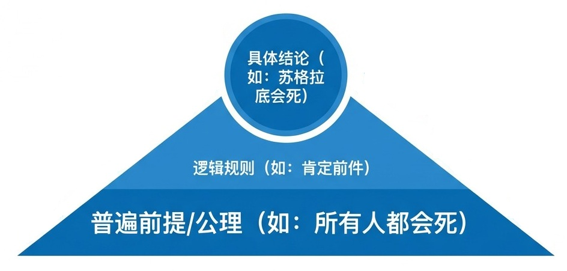
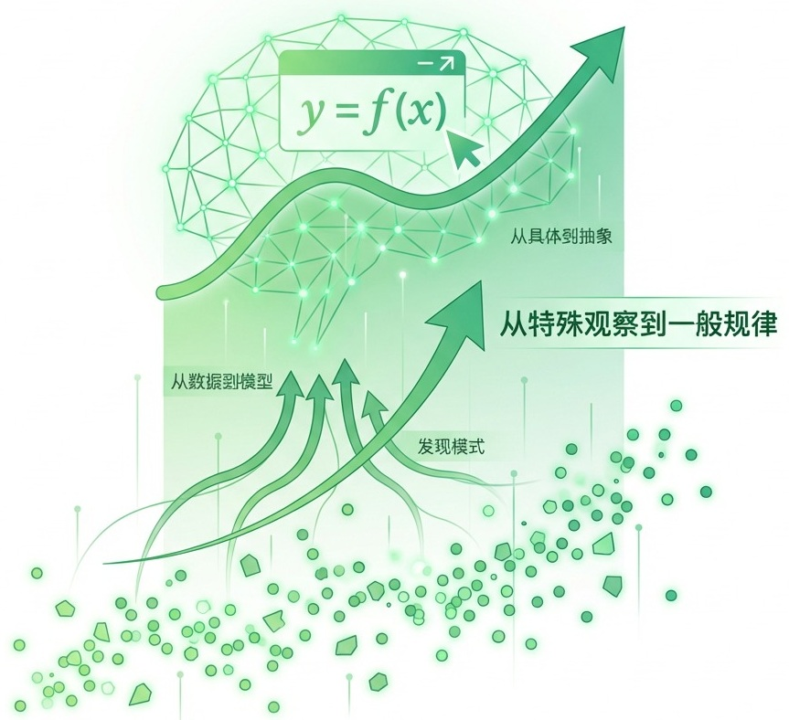
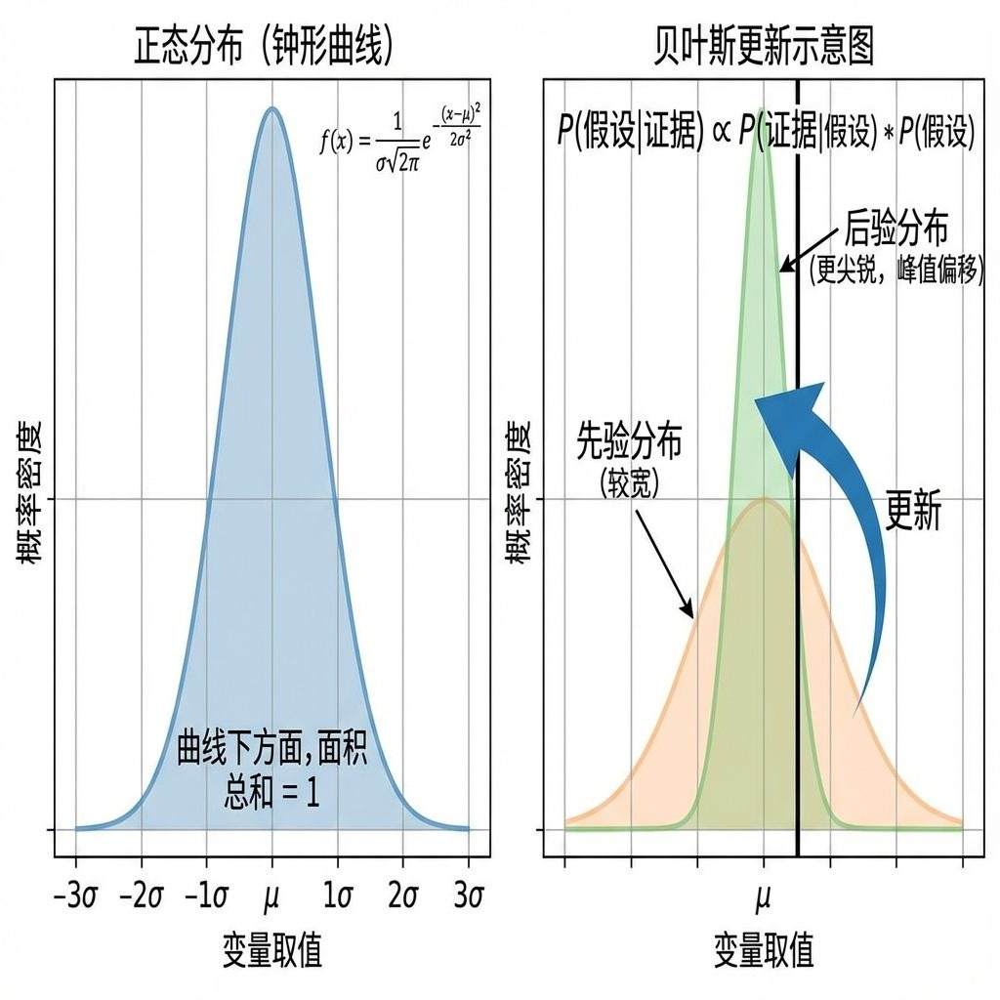
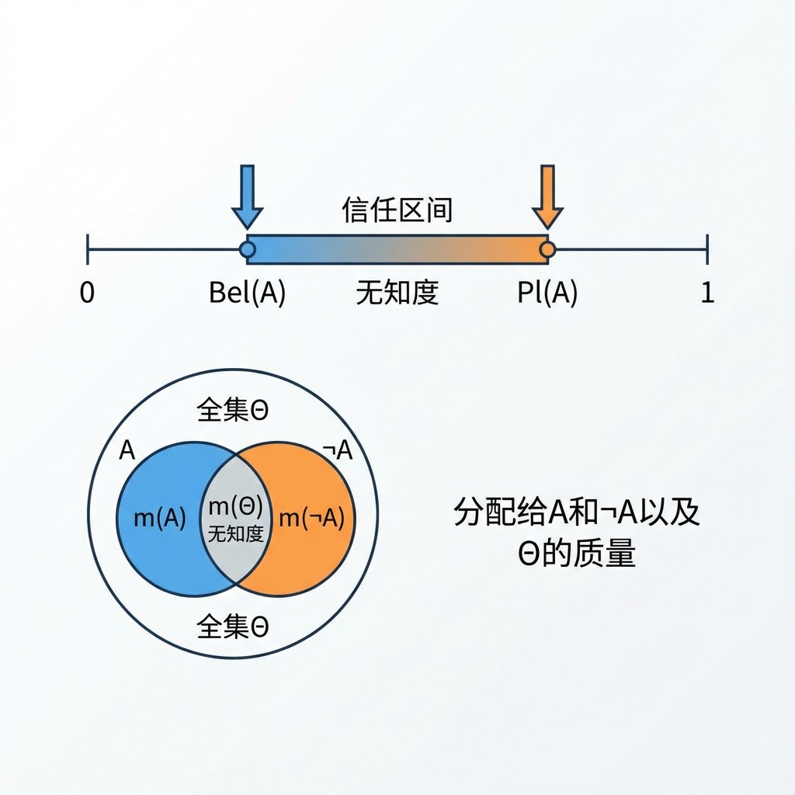
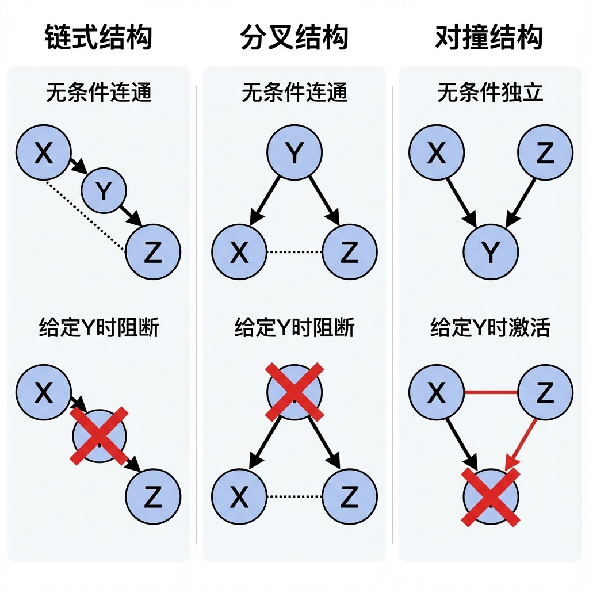
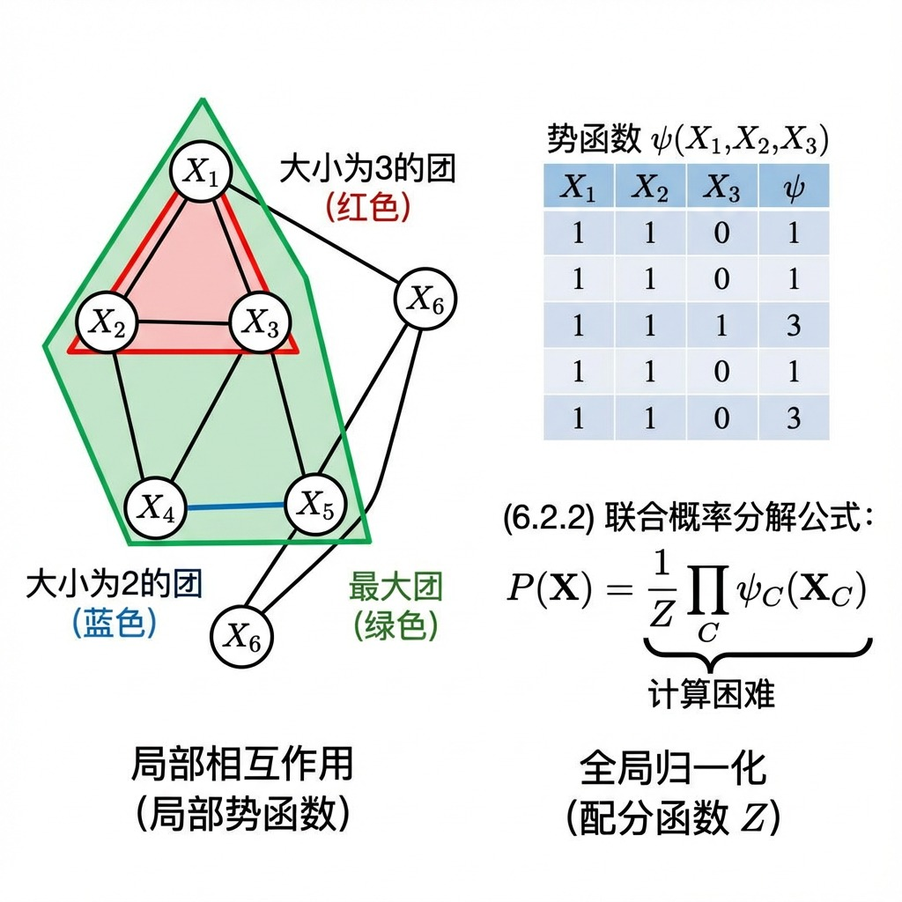
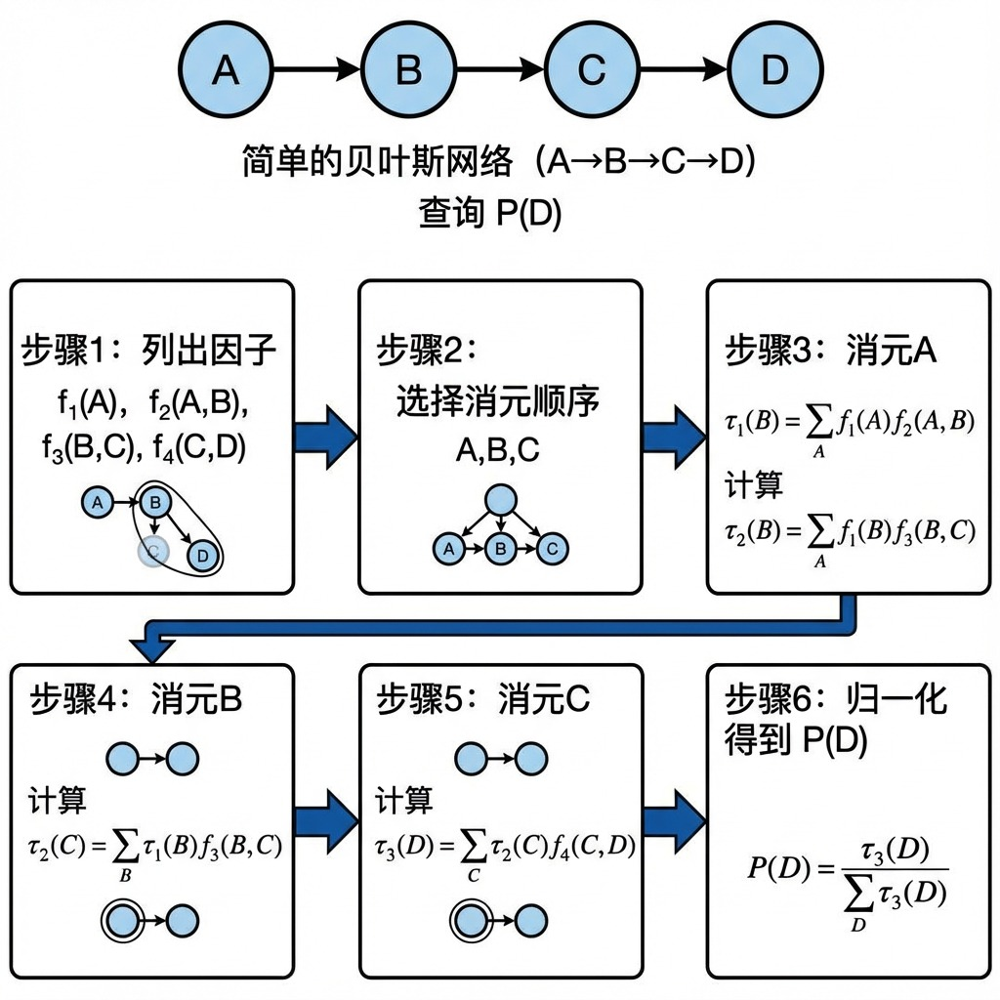
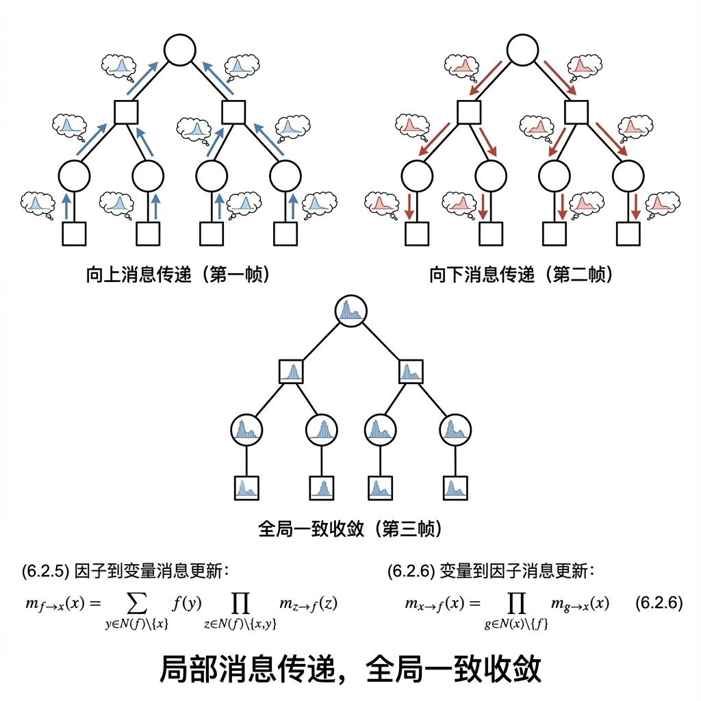
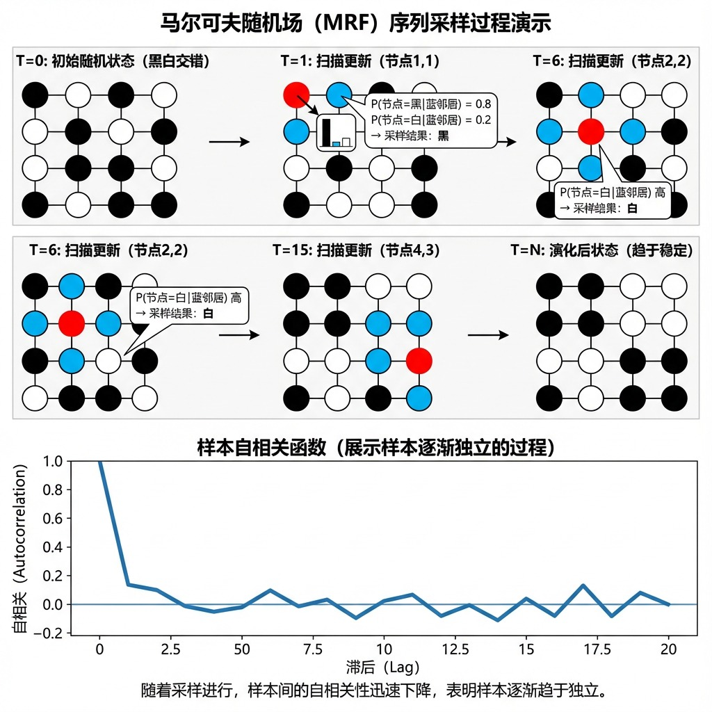

# **第六章 推理的理论基础**

## **6.1 推理基本类型与不确定性表示**

在人类认知、科学探索、逻辑辩证以及现代人工智能系统构建中，推理是连接已知信息与未知结论的核心思维过程。它不仅是哲学和逻辑学的研究重点，更是计算机科学、认知心理学、数据科学等多学科交叉的基础。我们主要依赖三大支柱性推理模式：**演绎推理**、**归纳推理**和**溯因推理**。这些模式并非孤立存在，而是在科学研究与日常决策中形成一个动态闭环：**归纳**从现象中提出普遍假设，**演绎**从假设中推导可检验的具体结论，**溯因**则根据观察结果修正或生成新的假设。理解这三种推理的本质、形式化表示及其相互关系，对于构建稳健的智能系统、进行严谨的科学研究以及做出明智决策至关重要。

与此同时，现实世界充满了不完整、不精确和不确定的信息。因此，如何**表示和处理不确定性**成为推理过程中的关键环节。概率论、模糊逻辑和证据理论等数学框架为我们提供了量化和管理这些不确定性的工具，使得推理过程更加贴近复杂多变的现实。

本文将系统阐述三种基本推理类型的定义、形式化表示、思维过程、实例应用及其局限性，并深入探讨不确定性的主要表示方法。通过跨学科视角和丰富实例，揭示这些推理模式如何协同工作，驱动科学发现与人工智能进步。

---

### **6.1.1 演绎推理 (Deduction)**

1） **定义与哲学基础：从普遍到特殊的确定性路径**  

演绎推理是一种追求**必然性真理**的推理过程。它从一组被普遍接受或预设为真的**前提**（如公理、定理、规则或假设）出发，通过应用严格的**逻辑规则**，推导出蕴含在前提之中的具体**结论**。其核心哲学思想是：结论的真值完全由前提的真值和推理形式的有效性所保证。如果前提为真且推理形式有效，则结论不可能为假。这意味着演绎推理的结论在信息量上不会超过前提的总和，它不创造新的经验知识，而是通过逻辑必然性将前提中隐含的知识明确化、具体化。

> **逻辑哲学表述**：在形式逻辑系统中，演绎的有效性完全取决于论证的形式结构。一个有效的演绎论证，其前提的真值会**强制性地传递**给结论。

2） **形式化表示：逻辑规则的骨架**  

演绎推理的严谨性体现在其高度形式化的结构上，其中最经典的形式包括：

*   **肯定前件**：
    \[
    P \implies Q, \quad P \ \vdash\ Q
    \]
    解读：如果 \(P\) 成立能推出 \(Q\) 成立，并且已知 \(P\) 确实成立，那么 \(Q\) 必然成立。
*   **否定后件**：
    \[
    P \implies Q, \quad \neg Q \ \vdash\ \neg P
    \]
    解读：如果 \(P\) 成立能推出 \(Q\) 成立，但观察到 \(Q\) 不成立，那么 \(P\) 必然不成立。
*   **假言三段论**：
    \[
    P \implies Q, \quad Q \implies R \ \vdash\ P \implies R
    \]
*   **选言三段论**：
    \[
    P \lor Q, \quad \neg P \ \vdash\ Q
    \]

这些规则构成了命题逻辑和谓词逻辑的基础，是数学证明和形式化验证的基石。

3） **思维过程解析**  

1.  **确立普遍前提**：接受或设定一个或多个普遍性的陈述（如“所有人都会死”、“三角形的内角和为180°”）。
2.  **识别具体案例**：将一个特定对象或情境归类到普遍前提的范畴内（如“苏格拉底是人”、“这是一个三角形”）。
3.  **应用逻辑规则**：通过有效的推理形式（如肯定前件），将普遍前提应用于具体案例。
4.  **得出必然结论**：推导出关于该具体案例的确定性陈述（如“苏格拉底会死”、“这个三角形的内角和是180°”）。

4） **优势与局限**  

| 优势（科学性与严谨性） | 局限（知识性边界） |
| :--- | :--- |
| **结论具有逻辑必然性**，只要前提为真，结论就无可辩驳。 | **不产生新的经验知识**，结论的信息已完全包含在前提中。 |
| **过程可完全形式化**，便于机器自动执行和验证。 | **极度依赖前提的正确性**。若前提有误（“天鹅都是白色的”），则结论可能完全错误。 |
| **是构建严密理论体系的基石**，如数学和逻辑学。 | **对现实世界的复杂性和不确定性适应力弱**，现实中的完美前提很少见。 |
| **能够发现前提中的隐含矛盾**（通过推导出矛盾结论）。 | **无法处理概然性真理和模糊概念**。 |

**图6-1：演绎推理示意图**

风格：简洁现代的信息图，蓝白主色调。 画面：一个坚实的、宽阔的三角形底座，上面标有“普遍前提/公理（如：所有人都会死）”。从底座顶点向下延伸出数条笔直、确定的箭头线，汇聚到一个位于三角形下方的焦点，该焦点标有“具体结论（如：苏格拉底会死）”。箭头线条清晰、无分叉。在三角形内部可标注“逻辑规则（如：肯定前件）”。整体传达出“从一般到特殊”、“收敛”、“确定”的感觉。

---

### **6.1.2 归纳推理 (Induction)**

1） **定义与哲学基础：从特殊到一般的概率性飞跃**  

归纳推理是**知识扩展**和**科学发现**的核心引擎。它从对有限数量**特定实例、观察数据或实验结果**的分析出发，旨在提炼和概括出关于整体或未来事件的**一般性规律、模型或假设**。与演绎推理的必然性不同，归纳推理的结论是**概然的**（probable）或**可能成立的**。其哲学基础是“自然齐一律”，即我们相信未来会与过去相似，未被观察到的实例会与已观察到的实例遵循相同的规律。然而，无论观察了多少支持性实例，总存在一个逻辑上的可能性——下一个观察会推翻当前的概括（“黑天鹅”问题）。

2） **形式化表示：统计与学习的语言**  

现代归纳推理高度依赖统计学和机器学习提供量化工具：

*   **参数估计**：使用样本统计量估计总体参数。
    *   样本均值：\(\bar{x} = \frac{1}{n} \sum_{i=1}^n x_i\) 用于估计总体均值 \(\mu\)。
    *   样本方差：\(s^2 = \frac{1}{n-1} \sum_{i=1}^n (x_i - \bar{x})^2\) 用于估计总体方差 \(\sigma^2\)。
*   **区间估计与假设检验**：量化结论的不确定性。
    *   置信区间：\(P\left( \bar{x} - z_{\alpha/2} \frac{\sigma}{\sqrt{n}} < \mu < \bar{x} + z_{\alpha/2} \frac{\sigma}{\sqrt{n}} \right) = 1 - \alpha\)，表示我们对总体参数落在该区间内的信心程度。
    *   P值：在零假设下，观察到当前或更极端数据的概率，用于判断是否拒绝原假设。
*   **机器学习模型**：从数据 \(D = \{(x_i, y_i)\}\) 中学习一个函数 \(f: X \rightarrow Y\)，使得 \(f\) 能够对未来未见数据 \(x_{new}\) 做出预测 \(y_{pred}\)。这本质上是基于训练数据归纳出输入与输出之间的映射关系。

3） **思维过程解析**  

1.  **观察与收集**：系统性地观察和记录特定现象的大量实例或数据。
2.  **寻找模式**：分析数据，寻找重复出现的特征、关联或趋势。
3.  **提出概括**：基于观察到的模式，提出一个能解释所有或大多数实例的普遍性假设或模型。
4.  **评估与验证**：使用统计方法（如交叉验证、假设检验）评估该概括在未观察数据上成立的可能性（置信度、准确率）。新的观察可能**确证**、**削弱**或**推翻**该概括。

4） **优缺点**  

| 优势（实用性与创造性） | 局限（科学性与风险） |
| :--- | :--- |
| **能产生新的知识、规律和预测模型**，是科学进步和技术创新的源泉。 | **结论不具有逻辑必然性**，始终存在被未来证据推翻的可能性（“归纳问题”）。 |
| **能够处理现实世界中的经验数据**，并做出关于未来的预测。 | **严重依赖数据质量和代表性**。样本偏差（如选择性偏差）会导致错误归纳。 |
| **通过概率和统计量化不确定性**，使我们能够理性地评估结论的可靠性。 | **从有限样本到无限总体的“飞跃”缺乏逻辑保障**，基于不同的哲学预设（如简单性原理）。 |
| **是机器学习得以实现的基础**，使计算机能从数据中“学习”。 | **容易产生过度拟合**：归纳出的模型过于复杂，完美解释了训练数据但泛化能力差。 |

**图2-1：归纳推理示意图**

风格：数据可视化风格，绿色渐变色调。 画面：底部是许多散乱但呈现一定趋势的离散数据点（如呈上升趋势的散点）。从这些数据点中，向上“生长”出一条平滑的曲线或一个抽象的模型结构（如一个网状大脑或一个公式框），该曲线/模型很好地拟合了数据点的整体趋势。箭头从分散的数据点指向统一的模型。旁边可配有“从特殊观察到一般规律”的标注。整体传达“从具体到抽象”、“从数据到模型”、“发现模式”的感觉。

---

### **6.1.3 溯因推理 (Abduction)**

1） **定义与哲学基础：从结果到原因的最佳解释推理**  

溯因推理，又称**最佳解释推理**或**假设推理**，是根据观察到的令人惊讶或需要解释的**结果（E）**，逆向寻找能导致该结果的**最合理的原因或假设（H）**。它是科学探究的起点和诊断思维的核心。哲学家C.S.皮尔士将其与演绎、归纳并列为第三种基本推理形式。溯因并不保证找到的原因就是真实的，它旨在生成一个或多个**候选假设**，这些假设如果为真，能够很好地解释观察到的现象。其选择标准通常包括解释力、简洁性、一致性与先验知识兼容性等。

2） **形式化表示：从逻辑形式到贝叶斯推断**  

*   **基本逻辑形式**：
    $1. \quad H \implies E \quad \text{(如果假设H为真，则可推导出现象E)}$
    $2. \quad E \quad \text{(现象E被观察到)}$
    $3. \quad \text{因此，H是可能的（或是值得进一步调查的解释）}$

    *注意：这不是一个有效的演绎形式，因为从 \(H \implies E\) 和 \(E\) 不能演绎出 \(H\)（肯定后件谬误）。但它是一个合理的启发式推理。*

*   **贝叶斯量化形式**：溯因推理与贝叶斯定理天然契合，后者提供了在给定证据下更新假设概率的严格数学框架。
    \[
    P(H|E) = \frac{P(E|H) \cdot P(H)}{P(E)}
    \]
    *   \(P(H)\)：**先验概率**，在看到证据E之前，对假设H为真的初始相信程度。
    *   \(P(E|H)\)：**似然度**，如果假设H为真，观察到证据E的可能性有多大。
    *   \(P(E)\)：证据E的边际概率。
    *   \(P(H|E)\)：**后验概率**，在看到证据E之后，假设H为真的更新后的相信程度。
    溯因的目标就是找到使后验概率 \(P(H|E)\) 最大的那个假设 \(H\)。

3） **思维过程解析**  

1.  **遭遇意外现象**：观察到一个需要解释的、令人困惑或异常的结果（E）。
2.  **生成候选假设集**：基于背景知识、经验和创造力，头脑风暴出一系列可能的假设 \(\{H_1, H_2, ..., H_n\}\)，其中每一个 \(H_i\) 都能逻辑上蕴涵或导致 E。
3.  **评估与筛选**：根据解释的充分性、简洁性、与其他知识的一致性以及（若可能）贝叶斯后验概率等标准，对候选假设进行排序，选出“最佳”解释。
4.  **测试与迭代**：将选出的最佳假设作为新的前提，演绎出可检验的预测，并通过实验或进一步观察进行验证。验证结果可能支持该假设，也可能要求回溯到步骤2，生成新的假设。

4） **优缺点**  

| 优势（实用性与启发性） | 局限（科学性与挑战） |
| :--- | :--- |
| **能够处理信息不完备和模糊的情境**，是面对未知问题时的起点。 | **结论不具有唯一性**，通常存在多个竞争性假设能解释同一现象。 |
| **驱动新假设的创造性生成**，是科学理论创新的关键环节。 | **推理过程高度依赖先验知识 \(P(H)\)**，先验偏见可能导致忽略正确的假设。 |
| **与贝叶斯推断结合，能定量评估不同解释的可能性**。 | **存在“肯定后件”的逻辑风险**，即使 \(H \implies E\) 且 \(E\) 为真，\(H\) 也可能为假（其他原因也能导致E）。 |
| **是诊断类问题求解的核心方法**，广泛应用于医学、工程、司法等领域。 | **最佳解释的标准（如简洁性）具有一定的主观性和语境依赖性**。 |

**图3-1：溯因推理示意图**

风格：侦探风格的信息图，黄褐色调，可有放大镜、问号等元素。 画面：中央是一个显著的、带有问号的“观察到的结果/现象”（如一个破碎的窗户）。从这个中心现象向外发散出多条箭头线，每条箭头指向一个可能的“假设/原因”（如：球击碎、盗窃、风暴破坏）。这些假设框大小或亮度可略有不同，暗示其中一个可能是“最佳解释”。箭头是反向的，从结果指向原因。整体传达“从结果反向寻找原因”、“发散性思考”、“假设生成”的感觉。

---

### **6.1.2 不确定性表示**

推理几乎总是在信息不完备、测量有误差或世界本身具有随机性的背景下进行。因此，发展精确的数学工具来**表示和度量不确定性**至关重要。以下是三种主流的表示框架。

#### 1）概率表示法

**定义**：基于柯尔莫哥洛夫公理体系，使用介于0和1之间的数值来表示某个事件发生的**可能性**。它可以解释为长期频率（频率学派）或主观相信程度（贝叶斯学派）。

**数学形式**：
*   离散随机变量：概率质量函数 \(P(X=x_i)\)。
*   连续随机变量：概率密度函数 \(f(x)\)，满足 \(P(a \le X \le b) = \int_a^b f(x) dx\)。
*   条件概率与贝叶斯定理：处理证据更新的核心。

**特点与应用**：
*   **成熟完善**：拥有强大的数学理论支撑（大数定律、中心极限定理等）。
*   **贝叶斯推理的载体**：完美支持将先验知识与新证据结合，进行溯因和归纳。
*   **应用广泛**：从物理学（量子态）、统计学（推断）到金融（风险评估）、AI（概率图模型、不确定性量化）。

**局限**：
*   **需要数据或先验**：频率解释需要大量重复数据；主观解释需要合理的先验。
*   **对语义模糊不直接**：难以直接表示“高个子”这类没有明确边界的概念。

**图6-4：概率分布表示**

风格：标准的科学图表风格。 画面：左侧是一个正态分布（钟形曲线）图，横轴为变量取值，纵轴为概率密度，曲线下方面积总和为1。右侧是一个简单的贝叶斯更新示意图：一个先验分布（如较宽的正态曲线）在接收到证据（一个竖线表示的观测值）后，“更新”为一个更尖锐、峰值偏移的后验分布。箭头标明“更新”过程。

---

#### 2）模糊逻辑表示法

**定义**：用于处理“模糊概念”，即那些边界不分明、具有渐进过渡性的类别。它通过**隶属度函数** \(\mu_A(x) \in [0,1]\) 来表示元素 \(x\) 属于模糊集合 \(A\) 的程度，而不仅仅是0（不属于）或1（属于）。

**数学形式**：
*   隶属度函数：\(\mu_{\text{高个子}}(身高)\)。例如，\(\mu(175cm)=0.6\), \(\mu(185cm)=0.95\)。
*   模糊运算：定义了模糊集的交（取小）、并（取大）、补等运算规则。

**特点与应用**：
*   **贴近人类认知**：能自然表示“有点热”、“速度很快”等语言描述。
*   **易于集成专家经验**：专家可以用语言规则定义系统行为（如“如果温度较高，则风扇转速中等”）。
*   **应用场景**：模糊控制系统（空调、洗衣机）、初步的决策支持、需要处理语义输入的简单AI。

**局限**：
*   **缺乏统一的频率解释**，与概率论结合需要额外框架（如模糊概率）。
*   **推理规则相对简单**，处理复杂高维问题的能力有限。

**图6-5：模糊逻辑与清晰逻辑对比**

风格：对比图示。 画面：分上下两部分。上部“清晰逻辑”：一个垂直的虚线将身高轴分为两半，左边标“矮”，右边标“高”，隶属度是0或1的阶跃函数。下部“模糊逻辑”：一条S形曲线从左下（0）平滑上升到右上（1），横轴是身高，纵轴是“高”的隶属度。在某个身高点（如180cm）画一条垂线，与S曲线相交，显示出隶属度为0.7。形象展示“灰度”概念。

---

#### 3）证据理论（D-S）

**定义**：由Dempster和Shafer提出，用于处理比概率更一般的不确定性，其核心是能够明确表示对命题的**无知**。它引入**基本概率分配**函数 \(m\)，将信任质量分配给识别框架 \(\Theta\) 的幂集（即所有子集的集合）中的元素。

**数学形式**：
*   基本概率分配：\(m: 2^\Theta \rightarrow [0,1]\)，满足 \(m(\emptyset)=0\) 且 \(\sum_{A \subseteq \Theta} m(A) = 1\)。\(m(A)\) 表示对命题A的**直接支持程度**，但不一定分配给单点。
*   信任函数：\(Bel(A) = \sum_{B \subseteq A} m(B)\)。表示对A的总信任度（所有支持A的子集的信任质量之和）。
*   似然函数：\(Pl(A) = 1 - Bel(\neg A)\)。表示对A不怀疑的程度（所有与A相交的子集的信任质量之和）。
*   信任区间：\([Bel(A), Pl(A)]\) 表示对命题A的信任范围，区间大小反映了**无知**的程度。

**特点与应用**：
*   **能显式表达“无知”**：可以将信任质量分配给整个识别框架 \(\Theta\)，即 \(m(\Theta) > 0\)，表示“我不知道具体是哪一个，但答案就在其中”。
*   **融合冲突证据**：通过Dempster组合规则，可以将来自不同信息源的证据进行融合。
*   **应用场景**：多传感器信息融合、目标识别、风险评估、需要处理高度冲突或无知信息的决策系统。

**局限**：
*   **计算复杂度高**：识别框架的子集数量随元素增加呈指数增长。
*   **组合规则的争议**：当证据高度冲突时，Dempster规则可能产生反直觉的结果。

**图6-6：D-S理论的信任区间表示**

风格：抽象图示。 画面：一条从0到1的水平概率线。线上方有两个箭头，分别指向线上的Bel(A)点和Pl(A)点。Bel(A)在左，Pl(A)在右，两者之间有一段距离。用阴影或高亮突出显示Bel(A)和Pl(A)之间的区间，并标注“信任区间”和“无知度”。旁边可以有一个文氏图示意，显示命题A和它的补集¬A，以及分配给它们的质量和分配给全集Θ的质量。

---

### **6.1.3 推理的协同**

三种基本推理类型与不确定性处理工具并非孤立运作，而是相互交织，形成一个强大的认知与问题求解循环。

#### 1) 科学方法论闭环

1.  **归纳阶段（发现）**：科学家观察自然现象，收集数据（E1, E2, ...）。通过归纳推理，提出一个尝试性的普遍理论或模型（H）。*（例如：从行星观测数据归纳开普勒定律）*
2.  **演绎阶段（预测）**：从理论H出发，结合特定初始条件，通过演绎推理，推导出可被实验检验的具体预测（P）。*（例如：从牛顿力学和天文数据演绎预测哈雷彗星回归日期）*
3.  **实验与观察**：设计实验或进行观察，检验预测P是否成立。
4.  **溯因阶段（修正）**：
    *   若观察结果与预测**一致**，则理论H得到一次确证（但非证明）。
    *   若观察结果与预测**不一致**，则启动溯因推理：基于新证据（E_new）和旧理论H的失败，生成新的、更佳的解释性假设（H‘）。*（例如：水星近日点进动与牛顿力学预测不符，溯因催生了广义相对论的假设）*
5.  **循环迭代**：新假设H‘进入下一轮演绎-检验循环，推动科学知识的不断逼近与革新。

#### 2) 智能系统（如AI诊断系统）的决策循环

1.  **感知/输入**：系统接收原始数据（如患者主诉、检查指标图像）→ 存在**不确定性**（噪声、模糊）。
2.  **特征提取与归纳**：从数据中提取特征，并基于历史大数据训练好的模型（一个归纳的产物），对当前情况进行初步分类或生成概率分布 → **归纳推理**。
3.  **假设生成（溯因）**：根据初步结果和知识库（包含因果规则），系统生成一系列可能的诊断假设（H1, H2...） → **溯因推理**。
4.  **计划与演绎**：为验证最可能的假设，系统规划下一步信息收集行动（如“建议做CT检查”）。这基于“如果疾病是H1，则CT结果应表现为P”的规则 → **演绎推理**。
5.  **行动与更新**：执行计划（或由人类执行），获得新证据。使用**贝叶斯更新（概率）** 或**D-S组合规则**，更新对各假设的置信度。
6.  **决策输出**：当某个假设的置信度超过阈值，或信息收集成本过高时，系统输出最终诊断和建议 → 结合了**不确定性量化**的决策。

### 6.1.4 推理方式对照表

| 维度 | 演绎推理 | 归纳推理 | 溯因推理 |
| :--- | :--- | :--- | :--- |
| **思维方向** | 一般 → 特殊 | 特殊 → 一般 | 结果 → 原因 |
| **逻辑本质** | 必然性推理（保真） | 扩展性推理（概然） | 解释性推理（最佳） |
| **数学工具** | 形式逻辑（命题、谓词） | 统计学、机器学习 | 贝叶斯定理、因果模型 |
| **结论确定性** | **必然正确**（前提真则结论真） | **概率正确**（基于置信水平） | **最可能解释**（基于后验概率/解释力） |
| **主要功能** | **验证、证明、应用**已知规则 | **发现、概括、预测**新规律 | **诊断、创意、生成**新假设 |
| **不确定性角色** | 通常规避不确定性，要求清晰前提 | 核心任务就是**量化不确定性**（置信区间、方差） | 核心任务是在不确定性中**选择最佳假设** |
| **典型应用领域** | 数学证明、程序验证、法律推理 | 科学实验、数据建模、市场预测 | 医疗诊断、故障排查、历史研究、侦探破案 |
| **在AI中的体现** | 知识图谱推理、定理证明器、业务规则引擎 | 所有机器学习模型（CNN, Transformer）、统计分析 | 贝叶斯网络、诊断专家系统、根因分析算法 |
| **关键局限** | 无法产生新知，依赖绝对正确前提 | 结论可被新证据推翻，存在归纳风险 | 结论不唯一，易受先验偏见影响 |
| **与不确定性表示结合** | 可与模糊逻辑结合处理模糊规则前提。 | 天然与概率论结合（统计学习）。 | 天然与贝叶斯概率结合；也可用D-S理论处理高度无知的假设空间。 |

### 6.1.5 小节与展望

演绎、归纳和溯因是三位一体、不可分割的基本推理范式。演绎确保思维在既定框架内的严谨，归纳驱动知识疆域的拓展，溯因为探索未知提供跳板。而概率、模糊逻辑和证据理论等不确定性表示方法，则为这些推理模式在复杂、不完美的现实世界中有效运作提供了数学语言。

在人工智能蓬勃发展的今天，我们对这些推理模式的理解和应用正达到新的高度：
*   **神经符号AI**试图将强大的归纳学习能力（深度学习）与可解释、可推理的符号演绎/溯因能力结合起来。
*   **因果推断**作为溯因推理的深化，正成为机器学习的前沿，旨在让AI不仅能发现关联，更能理解因果关系。
*   **不确定性量化**是可信AI的核心议题，要求AI系统不仅能给出答案，还能清晰说明对这个答案有多大把握。

深入理解这些基础的推理类型和不确定性表示方法，不仅有助于我们更好地进行科学思考和日常决策，更是设计和评估下一代智能系统的关键。未来的智能体，必将是能娴熟地混合运用演绎、归纳、溯因，并能坦然面对、精准度量不确定性的复杂认知系统。

## 6.2 概率图模型与推理算法

在现实世界的人工智能应用中，如医疗诊断、自然语言处理、计算机视觉等领域，我们常常需要处理大量相互关联的随机变量，并进行复杂的概率推理。概率图模型（Probabilistic Graphical Models, PGM）正是为解决这一问题而发展起来的强大数学工具。它将图论与概率论相结合，以直观的图形方式表示随机变量之间的依赖关系，并通过高效的算法进行推理计算。

概率图模型的核心优势在于它能够**显式地表示条件独立性**，从而将高维联合概率分布分解为低维条件概率的乘积，极大地降低了模型的复杂度。根据图中边的方向性，概率图模型主要分为两大类：有向图模型（贝叶斯网络）和无向图模型（马尔可夫随机场）。这些模型不仅为复杂系统的概率建模提供了统一框架，还催生了一系列高效的精确和近似推理算法。

本章将系统介绍概率图模型的基本概念、表示方法以及主要推理算法，并通过实例说明其在实际问题中的应用。

### 6.2.1 概率图模型概述

概率图模型是一种用图结构表示概率分布中条件独立关系的框架。图中的节点代表随机变量，边代表变量之间的概率依赖关系。这种表示方法具有双重优势：一方面，图结构提供了概率分布的直观可视化；另一方面，图论中的概念和算法可直接应用于概率推理。

#### 1）有向图模型（贝叶斯网络）

##### 基本定义与表示

贝叶斯网络（Bayesian Network, BN），又称信念网络（Belief Network），是一种基于有向无环图（DAG）的概率图模型。形式上，一个贝叶斯网络可定义为二元组 \(B = (G, \Theta)\)，其中：
- \(G = (V, E)\) 是一个有向无环图，\(V\) 是节点集合，对应随机变量 \(\{X_1, X_2, ..., X_n\}\)，\(E\) 是有向边集合，表示变量间的直接依赖关系。
- \(\Theta\) 是参数集合，包含每个变量在给定其父变量时的条件概率分布 \(P(X_i | Pa(X_i))\)。

贝叶斯网络的核心假设是**局部马尔可夫性质**：给定一个节点的父节点，该节点条件独立于其所有非后代节点。基于这一性质，联合概率分布可分解为条件概率的乘积：

\[
P(X_1, X_2, ..., X_n) = \prod_{i=1}^n P(X_i | Pa(X_i))
\tag{6.2.1}
\]

这种分解大大减少了建模所需的参数数量。对于n个二值变量，完全联合分布需要 \(2^n - 1\) 个独立参数，而具有稀疏结构的贝叶斯网络可能只需要 \(O(n \cdot 2^k)\) 个参数，其中k是最大父节点数。

##### 条件独立性与d-分离

在贝叶斯网络中，条件独立性关系可通过图结构直接判定，这主要依赖于**d-分离**（d-separation）准则。d-分离描述了在给定一组证据变量的条件下，图中两个节点集是否条件独立。三种基本结构决定了路径是否被"阻断"：

1. **链式结构**（因果链）：\(X \rightarrow Y \rightarrow Z\)
   - 无条件时：\(X\) 和 \(Z\) 可能相关
   - 给定 \(Y\) 时：路径被阻断，\(X \perp\!\!\!\perp Z | Y\)

2. **分叉结构**（共同原因）：\(X \leftarrow Y \rightarrow Z\)
   - 无条件时：\(X\) 和 \(Z\) 可能相关
   - 给定 \(Y\) 时：路径被阻断，\(X \perp\!\!\!\perp Z | Y\)

3. **对撞结构**（共同效果）：\(X \rightarrow Y \leftarrow Z\)
   - 无条件时：\(X\) 和 \(Z\) 独立
   - 给定 \(Y\) 或其后代时：路径被激活，\(X\) 和 \(Z\) 可能相关

**图6.7：贝叶斯网络中的三种基本结构与d-分离**

> 风格：信息图示，简洁清晰的技术图解。 
> 画面：分为三部分并列展示。左：链式结构，三个圆形节点分别标记X、Y、Z，有向边从X指向Y，从Y指向Z。中间状态：上方展示无条件时X与Z连通（用虚线连接），下方展示给定Y时路径阻断（在Y节点上加红色阻断符号）。 
> 中：分叉结构，Y节点在上方，X、Z在下方，有向边从Y指向X和Z。类似展示无条件连通与给定Y时阻断。 
> 右：对撞结构，X和Z在上方，Y在下方，有向边从X和Z指向Y。展示无条件时X与Z独立（无连接），给定Y时路径激活（用红色连接线连接X和Z）。 
> 配色：节点用浅蓝色，激活路径用红色，阻断符号用红色"X"。

##### 应用实例与优势

**医疗诊断系统**是贝叶斯网络的经典应用。考虑一个简化的呼吸系统疾病诊断模型：
- 变量：季节(Season)、过敏(Allergy)、感冒(Cold)、流感(Flu)、打喷嚏(Sneeze)、咳嗽(Cough)、发烧(Fever)
- 依赖关系：季节影响过敏和感冒概率；感冒和流感引起相关症状
- 诊断推理：观察到打喷嚏、咳嗽、发烧等症状后，推断患感冒或流感的概率

贝叶斯网络的**主要优势**包括：
- **因果语义清晰**：有向边常被解释为因果关系，便于领域专家理解和构建
- **参数效率高**：利用条件独立性减少参数数量
- **可解释性强**：推理过程可沿因果路径解释
- **灵活处理不完全数据**：可进行各种条件概率查询

#### 2）无向图模型（马尔可夫随机场）

##### 基本定义与表示

马尔可夫随机场（Markov Random Field, MRF），又称马尔可夫网络，是基于无向图的概率图模型。与贝叶斯网络不同，MRF不要求边有方向，适合表示变量间的对称关联关系。

形式上，一个MRF由无向图 \(G = (V, E)\) 和定义在团（clique）上的势函数（potential function）组成。图G满足**全局马尔可夫性质**：给定任意两个节点集A和B被节点集C分离时，A和B条件独立于C。这里的"分离"指图中所有连接A和B的路径都经过C。

MRF的联合概率分布通过**吉布斯分布**表示为：

\[
P(X_1, X_2, ..., X_n) = \frac{1}{Z} \prod_{C \in \mathcal{C}} \psi_C(X_C)
\tag{6.2.2}
\]

其中：
- \(\mathcal{C}\) 是图中所有团（完全子图）的集合
- \(\psi_C(X_C) > 0\) 是团C的势函数，衡量该团变量各种取值的"亲和度"
- \(Z\) 是配分函数（归一化常数）：

\[
Z = \sum_{X_1, ..., X_n} \prod_{C \in \mathcal{C}} \psi_C(X_C)
\tag{6.2.3}
\]

##### 团与势函数的含义

在MRF中，团是图中完全连接的节点子集。最大团是不能再添加节点而保持完全连接性的团。通常只需考虑最大团，因为较小团的势函数可融入较大团中。

势函数 \(\psi_C(X_C)\) 不是概率，而是非负的实值函数，表示团内变量取特定值的"兼容性"或"能量"的负指数。在统计物理学中，常使用**能量函数** \(E_C(X_C)\)，使得 \(\psi_C(X_C) = \exp(-E_C(X_C))\)，此时联合分布变为玻尔兹曼分布：

\[
P(X) = \frac{1}{Z} \exp\left(-\sum_{C \in \mathcal{C}} E_C(X_C)\right)
\]

**图6.8：马尔可夫随机场中的团与势函数**

> 风格：无向图与公式结合的示意图。 
> 画面：左侧是一个无向图，包含6个节点（圆形）和连接边，用不同颜色高亮标出几个团：一个大小为3的团（红色三角形），一个大小为2的团（蓝色边），以及整个图中的最大团（绿色多边形）。 
> 右侧展示对应势函数：对于红色团，展示一个表格形式的势函数ψ(X₁,X₂,X₃)；下方展示联合概率分解公式(6.2.2)，其中配分函数Z用大括号标注"计算困难"。 
> 整体传达"局部相互作用"和"全局归一化"的概念。

##### 应用实例与特点

**图像去噪与分割**是MRF的典型应用。考虑一个二值图像去噪问题：
- 观测变量：每个像素的噪声观测值 \(Y_i\)
- 隐变量：每个像素的真实值 \(X_i\) (0或1)
- 势函数设计：
  - 一元势函数：\(\psi_i(X_i, Y_i) = \exp(-(X_i - Y_i)^2 / (2\sigma^2))\)，鼓励 \(X_i\) 接近观测值 \(Y_i\)
  - 二元势函数：\(\psi_{ij}(X_i, X_j) = \exp(-\lambda \cdot I[X_i \neq X_j])\)，鼓励相邻像素取值相同
- 推理目标：找到最可能的真实图像 \(X\)，即最大化 \(P(X|Y)\)

马尔可夫随机场的**主要特点**包括：
- **对称建模**：适合表示相互影响、无明确方向的关系
- **局部特性**：每个变量只直接依赖于其邻居变量
- **配分函数难题**：Z的计算需要对所有可能状态求和，通常非常困难
- **广泛应用**：计算机视觉（图像分割、立体匹配）、自然语言处理（词性标注）、空间统计等

### 6.2.2 精确推理算法

概率图模型中的推理任务主要分为两类：1) **边际推理**：计算部分变量的概率分布；2) **最大后验概率（MAP）推理**：找到最可能的变量赋值。精确推理算法能在有限时间内给出精确解，但通常仅适用于结构简单的图。

#### 1）变量消元法

##### 算法原理与步骤

变量消元法（Variable Elimination, VE）是概率推理的基本算法，通过系统性地"消去"非查询变量来计算边际概率。其核心思想是利用分配律将求和（或积分）尽可能向内移动，避免枚举所有可能组合。

考虑计算边际概率 \(P(X_q)\)，其中 \(X_q \subseteq \{X_1, ..., X_n\}\)：

\[
P(X_q) = \sum_{X \setminus X_q} P(X_1, ..., X_n)
= \sum_{X \setminus X_q} \prod_{i=1}^n P(X_i | Pa(X_i))
\]

算法步骤：
1. **因子表示**：将每个条件概率表视为一个因子（函数）
2. **消元顺序**：选择非查询变量的消元顺序
3. **逐步消元**：按顺序将包含该变量的因子相乘，然后对该变量求和，生成新因子
4. **归一化**：最后得到的因子即为未归一化的边际分布，需进行归一化

##### 复杂度分析与优化

变量消元法的复杂度取决于消元顺序。定义**消元宽度**为消元过程中产生的最大因子所涉及的变量数。最优消元顺序问题对应着寻找图的**树宽**（treewidth），这是一个NP难问题，但存在有效的启发式算法：
- **最小度启发式**：每次选择邻居最少的变量消元
- **最小填充启发式**：每次选择消元时添加最少边的变量

对于树状结构，存在最优消元顺序使宽度为1；对于完全图，宽度为n-1，此时VE退化为暴力求和。

**图6.9：变量消元法执行过程**

> 风格：分步骤的算法演示图。 
> 画面：上方展示一个简单的贝叶斯网络A→B→C→D，查询P(D)。 
> 下方分步骤展示：步骤1：列出因子f₁(A), f₂(A,B), f₃(B,C), f₄(C,D)。步骤2：选择消元顺序A,B,C。步骤3：消元A：计算τ₁(B)=∑_A f₁(A)f₂(A,B)。步骤4：消元B：计算τ₂(C)=∑_B τ₁(B)f₃(B,C)。步骤5：消元C：计算τ₃(D)=∑_C τ₂(C)f₄(C,D)。步骤6：归一化得到P(D)。 
> 每个步骤用箭头连接，展示因子的变化过程。

##### 实例演示

考虑一个简单报警网络：
- 变量：入室盗窃(B)、地震(E)、报警响(A)、邻居电话(N)
- 网络结构：B和E是A的父节点，A是N的父节点
- 查询：给定接到邻居电话(N=1)，发生入室盗窃的概率P(B=1|N=1)

使用变量消元法：
1. 联合分布：\(P(B,E,A,N) = P(B)P(E)P(A|B,E)P(N|A)\)
2. 目标：\(P(B|N=1) \propto P(B, N=1) = \sum_{E,A} P(B)P(E)P(A|B,E)P(N=1|A)\)
3. 消元顺序：先E后A
4. 消元E：\(\tau_1(B,A) = \sum_E P(E)P(A|B,E)\)
5. 消元A：\(\tau_2(B) = \sum_A \tau_1(B,A)P(N=1|A)\)
6. 结果：\(P(B|N=1) \propto P(B) \cdot \tau_2(B)\)

#### 2）信念传播算法

##### 算法原理与消息传递

信念传播（Belief Propagation, BP），也称为和积算法（Sum-Product Algorithm），是一种基于消息传递的精确推理算法，特别适用于树状结构图。BP通过在因子图上传递消息，最终使每个节点都能计算出自己的边际信念。

**因子图**是表示概率分布的二分图，包含变量节点（圆形）和因子节点（方形）。每个因子节点连接其依赖的变量节点。

消息传递规则：
- **变量到因子消息**：
  \[
  m_{x \to f}(x) = \prod_{h \in \text{nb}(x)\setminus\{f\}} m_{h \to x}(x)
  \tag{6.2.5}
  \]
- **因子到变量消息**：
  \[
  m_{f \to x}(x) = \sum_{\mathbf{x}_f\setminus\{x\}} f(\mathbf{x}_f) \prod_{y \in \text{nb}(f)\setminus\{x\}} m_{y \to f}(y)
  \tag{6.2.6}
  \]
- **边际信念计算**：
  \[
  b(x) \propto \prod_{f \in \text{nb}(x)} m_{f \to x}(x)
  \tag{6.2.7}
  \]

对于树状因子图，BP算法经过两次消息传递（一次向上，一次向下）即可收敛到精确边际概率。

##### 在树结构中的精确性证明

在树状图中，BP算法的精确性可通过归纳法证明。关键观察是：在树中，当从叶子节点开始消息传递时，每个节点接收到的消息来自互不重叠的子树，因此节点处的信念正比于整个联合分布对该变量的边际。

**前向-后向算法**是BP在链式结构（隐马尔可夫模型）中的特例：
- 前向消息：\(\alpha_t(x_t) = P(x_t, y_{1:t})\)
- 后向消息：\(\beta_t(x_t) = P(y_{t+1:T} | x_t)\)
- 边际：\(P(x_t | y_{1:T}) \propto \alpha_t(x_t) \beta_t(x_t)\)

**图6.10：树状因子图上的信念传播**

> 风格：树状图上的消息传递动画帧示意图。 
> 画面：一个树状因子图，根在顶部，变量节点为圆形，因子节点为方形。第一帧：展示从叶子节点向上的消息传递（蓝色箭头）。第二帧：展示从根节点向下的消息传递（红色箭头）。第三帧：展示所有消息传递完成后，计算每个变量的边际信念（节点内部显示概率分布）。 
> 下方配以消息更新公式(6.2.5)和(6.2.6)。 
> 整体传达"局部消息传递，全局一致收敛"的概念。

##### 应用实例：低密度奇偶校验码译码

BP算法在通信领域的**Turbo码和LDPC码译码**中取得了巨大成功，这被认为是其最著名的应用。在LDPC码中：
- 变量节点：编码比特
- 因子节点：奇偶校验约束
- 消息：变量节点到因子节点传递"我倾向于0/1的信念"
- 因子节点到变量节点传递"根据其他变量，你应该倾向于0/1"
- 迭代过程逐渐收敛到最可能的原始比特序列

这一应用推动了BP算法理论和实践的重大发展，也催生了对其在带环图上行为的研究。

### 6.2.3 近似推理方法

对于复杂图结构（如有环图、高树宽图）或连续变量，精确推理往往计算不可行，此时需要近似推理方法。近似方法以一定的精度损失换取计算效率。

#### 1）基于采样的方法

##### 重要性采样

重要性采样（Importance Sampling）通过从一个容易采样的提议分布 \(Q(X)\) 中抽取样本，来估计目标分布 \(P(X)\) 下的期望。对于函数 \(f(X)\)：

\[
\mathbb{E}_P[f(X)] = \sum_X f(X)P(X) = \sum_X f(X) \frac{P(X)}{Q(X)} Q(X) \approx \frac{1}{N} \sum_{i=1}^N f(X^{(i)}) w^{(i)}
\]

其中 \(X^{(i)} \sim Q(X)\)，权重 \(w^{(i)} = P(X^{(i)})/Q(X^{(i)})\)。为保证估计无偏，常使用自归一化权重：

\[
\mathbb{E}_P[f(X)] \approx \frac{\sum_{i=1}^N f(X^{(i)}) w^{(i)}}{\sum_{i=1}^N w^{(i)}}
\]

**关键挑战**：
- 提议分布选择：应尽可能接近目标分布，特别是在高概率区域
- 权重方差：如果 \(Q(X)\) 在 \(P(X)\) 的高概率区域概率很小，权重会非常大，估计方差大
- **粒子退化**：少数样本主导权重和，有效样本数减少

**自适应重要性采样**和**序列重要性采样**是改进方法，通过迭代调整提议分布。

##### 马尔可夫链蒙特卡洛方法

MCMC方法通过构建一条马尔可夫链，使其平稳分布为目标分布 \(P(X)\)，然后从链中抽取样本。最常用的MCMC方法是**吉布斯采样**（Gibbs Sampling），特别适用于概率图模型。

吉布斯采样算法步骤：
1. 初始化所有变量 \(X^{(0)}\)
2. 对于每次迭代 \(t = 1, 2, ...\)
   - 对于每个变量 \(X_i\)
     - 从条件分布采样：\(X_i^{(t)} \sim P(X_i | X_1^{(t)}, ..., X_{i-1}^{(t)}, X_{i+1}^{(t-1)}, ..., X_n^{(t-1)})\)
3. 丢弃前若干次迭代（燃烧期），用后续样本进行估计

在概率图模型中，条件分布简化为：
\[
P(X_i | X_{\setminus i}) = P(X_i | MB(X_i))
\]
其中 \(MB(X_i)\) 是 \(X_i\) 的马尔可夫毯（Markov Blanket）：父节点、子节点、子节点的其他父节点。

**图6.11：吉布斯采样在网格MRF上的执行过程**

> 风格：序列图像展示采样过程。 
> 画面：一个4×4的网格MRF，每个节点表示二值变量（黑/白）。第一帧：初始随机赋值（黑白交错）。后续帧：按扫描顺序（从左到右，从上到下）更新每个节点。正在更新的节点用红色高亮，其邻居用蓝色高亮。展示条件概率分布P(节点|邻居)，并根据该分布采样新值。多帧展示状态逐渐演化的过程。 
> 下方可绘制样本自相关函数，展示样本逐渐独立的过程。

##### MCMC的收敛诊断与改进

MCMC方法的实际应用需要解决两个关键问题：
1. **收敛诊断**：链是否已达到平稳分布？
   - 可视化方法：轨迹图、自相关图
   - 统计检验：Gelman-Rubin统计量（多链比较）、Geweke检验
2. **混合时间**：链探索状态空间的速度
   - 改进方法：Metropolis-Hastings算法（更灵活的提议分布）、哈密顿蒙特卡洛（利用梯度信息）、切片采样等

#### 2）近似信念传播

##### 环状信念传播

当信念传播应用于带环图时，称为**环状信念传播**（Loopy Belief Propagation）。算法形式上与树状BP相同，但在环状图上迭代更新消息，直至收敛或达到最大迭代次数。

环状BP的特点：
- **不保证收敛**：可能振荡或不收敛
- **收敛时不保证精确**：即使收敛，结果也只是近似
- **但常表现良好**：在许多实际问题中给出有用近似
- **固定点特性**：收敛点对应Bethe自由能的驻点

消息更新可采用同步或异步方式。同步更新（所有消息同时更新）容易振荡；异步更新（按顺序更新）通常更稳定。

##### 收敛性与改进方法

提高环状BP收敛性的策略：
1. **阻尼更新**：\(m^{\text{new}} = \lambda m^{\text{old}} + (1-\lambda) m^{\text{new}}\)，\(\lambda \in (0,1)\)
2. **树重参数化**：将原图分解为多个树，在树上精确推理后组合结果
3. **凸化Bethe自由能**：使用分段线性界或添加正则项确保凸性

##### 广义信念传播与区域图方法

广义信念传播（Generalized Belief Propagation, GBP）将消息传递推广到更大的区域（不仅仅是单条边）。通过构造**区域图**（region graph），其中节点是变量子集，边表示包含关系，在区域图上进行消息传递。

区域图需满足：
- **覆盖性**：每个团至少被一个区域包含
- **连通性**：每个变量出现在连通区域子图中
- **运行交性**：任意两个区域的交集也出现在区域图中

GBP通过考虑更高阶的相互作用，通常能提供比标准BP更好的近似，但计算代价也更高。

### 6.2.4 推理算法综合比较与选择指南

#### 算法选择决策树

在实际应用中，选择推理算法需考虑以下因素：

1. **图结构**：
   - 树状或无环图 → 精确推理（BP、VE）
   - 低树宽图 → 精确推理（结合消元顺序优化）
   - 高树宽或有环图 → 近似推理

2. **查询类型**：
   - 单一边际查询 → 变量消元
   - 多变量边际查询 → 信念传播（避免重复计算）
   - MAP推理 → 最大和算法（Max-Product）或基于采样的方法

3. **精度要求**：
   - 需要精确解 → 精确方法（限于小型问题）
   - 可接受近似 → 采样方法或变分方法

4. **计算资源**：
   - 有限资源 → 简单近似方法
   - 充足资源 → 更精细的MCMC或混合方法

#### 性能与精度权衡

| 算法类别 | 时间复杂度 | 空间复杂度 | 精度保证 | 适用图类型 |
|---------|-----------|-----------|---------|-----------|
| 变量消元 | \(O(n \exp(w))\) | \(O(n \exp(w))\) | 精确 | 任意（w为树宽） |
| 信念传播 | \(O(nk^d)\) | \(O(nk)\) | 树：精确 环：近似 | 树、低环图 |
| 吉布斯采样 | \(O(T \cdot n)\) | \(O(n)\) | 渐进精确 | 任意 |
| 重要性采样 | \(O(N \cdot n)\) | \(O(N)\) | 渐进无偏 | 任意 |
| 环状BP | \(O(T \cdot nk^d)\) | \(O(nk)\) | 无保证 | 任意 |

注：n为变量数，k为变量取值数，d为节点最大度，w为树宽，T为迭代次数，N为样本数。

#### 现代发展趋势

概率图模型推理算法的前沿发展包括：

1. **深度学习与PGM结合**：
   - 使用神经网络学习势函数或提议分布
   - 变分自编码器中的推理网络
   - 图神经网络用于结构化预测

2. **分布式与并行推理**：
   - 大规模图上的分布式信念传播
   - GPU加速的采样算法

3. **在线与增量推理**：
   - 流数据图模型推理
   - 动态贝叶斯网络的高效算法

4. **确定性近似方法的理论突破**：
   - 理解环状BP收敛条件
   - 开发新的变分推理框架

### 6.2.5 实例

考虑一个简单的贝叶斯网络：\(A \to B \to C\)，其中：
- \(P(A=1) = 0.6\)
- \(P(B=1 | A=1) = 0.7\)，\(P(B=1 | A=0) = 0.2\)
- \(P(C=1 | B=1) = 0.9\)，\(P(C=1 | B=0) = 0.1\)

**问题**：计算后验概率 \(P(A=1 | C=1)\)

#### 解法1：直接计算（精确推理）

使用贝叶斯公式：

\[
P(A=1 | C=1) = \frac{P(A=1, C=1)}{P(C=1)}
\]

计算分子：

\[
\begin{aligned}
P(A=1, C=1) &= \sum_{b \in \{0,1\}} P(A=1, B=b, C=1) \\
&= P(A=1) \left[ P(B=1|A=1)P(C=1|B=1) + P(B=0|A=1)P(C=1|B=0) \right] \\
&= 0.6 \times [0.7 \times 0.9 + (1-0.7) \times 0.1] \\
&= 0.6 \times [0.63 + 0.03] = 0.6 \times 0.66 = 0.396
\end{aligned}
\]

计算分母：

\[
\begin{aligned}
P(C=1) &= \sum_{a \in \{0,1\}} P(A=a, C=1) \\
&= P(A=1, C=1) + P(A=0, C=1) \\
&= 0.396 + P(A=0) \left[ P(B=1|A=0)P(C=1|B=1) + P(B=0|A=0)P(C=1|B=0) \right] \\
&= 0.396 + 0.4 \times [0.2 \times 0.9 + (1-0.2) \times 0.1] \\
&= 0.396 + 0.4 \times [0.18 + 0.08] = 0.396 + 0.4 \times 0.26 = 0.396 + 0.104 = 0.5
\end{aligned}
\]

因此：

\[
P(A=1 | C=1) = \frac{0.396}{0.5} = 0.792
\]

**解释**：观察到 \(C=1\) 后，\(A=1\) 的概率从先验0.6提高到0.792。这是因为 \(C=1\) 更可能由 \(B=1\) 引起，而 \(B=1\) 又更可能由 \(A=1\) 引起。这是一个**解释远离**（explaining away）的反向推理示例。

#### 解法2：信念传播

将网络转为因子图：
- 变量节点：A, B, C
- 因子节点：f_A(A) = P(A), f_B(A,B) = P(B|A), f_C(B,C) = P(C|B)

消息传递：
1. 从叶子开始：
   - \(m_{f_A \to A}(A) = [0.4, 0.6]\)（对A=0,1）
   - \(m_{C \to f_C}(C) = [I(C=1)]\)（观测C=1的指示函数）

2. 向上传递：
   - \(m_{f_C \to B}(B) = \sum_C f_C(B,C) m_{C \to f_C}(C) = [P(C=1|B=0), P(C=1|B=1)] = [0.1, 0.9]\)
   - \(m_{B \to f_B}(B) = m_{f_C \to B}(B)\)
   - \(m_{f_B \to A}(A) = \sum_B f_B(A,B) m_{B \to f_B}(B) = \sum_B P(B|A) m_{f_C \to B}(B)\)
     - 对A=0：0.2×0.9 + 0.8×0.1 = 0.18+0.08=0.26
     - 对A=1：0.7×0.9 + 0.3×0.1 = 0.63+0.03=0.66

3. 计算A的信念：
   \[
   b(A) \propto m_{f_A \to A}(A) \cdot m_{f_B \to A}(A) = 
   \begin{cases}
   0.4 \times 0.26 = 0.104 & \text{for } A=0 \\
   0.6 \times 0.66 = 0.396 & \text{for } A=1
   \end{cases}
   \]
   归一化：0.104+0.396=0.5，因此 \(P(A=1|C=1)=0.396/0.5=0.792\)

两种方法结果一致，验证了BP在树状图中的精确性。

**图6.12：贝叶斯网络推理例题的图形化解法**

> 风格：分步骤推理过程图解。 
> 画面：左侧展示网络结构A→B→C，其中C节点被高亮为红色（表示已观测C=1）。 
> 右侧分两部分：上半部分展示直接计算的公式推导过程，包括贝叶斯公式展开、分子分母计算步骤。下半部分展示信念传播的消息传递过程，用箭头展示消息流向，每个消息用具体数值标注。 
> 最下方展示最终结果对比：先验P(A=1)=0.6，后验P(A=1|C=1)=0.792，并标注"证据支持A=1"。

### 6.2.6 总结与展望

概率图模型提供了一个强大的框架，用于表示和推理复杂系统中的不确定性。通过图结构显式编码条件独立性，PGM能够高效地表示高维概率分布，并支持各种推理任务。

精确推理算法如变量消元和信念传播为树状或低树宽图提供了有效解决方案，而近似推理方法如MCMC采样和变分推断则能够处理更复杂的图结构。这些算法在实际应用中取得了巨大成功，从医疗诊断到通信系统，从计算机视觉到自然语言处理。

未来，随着数据规模和模型复杂度的不断增加，概率图模型推理算法的发展将面临新的挑战和机遇。深度学习与概率图模型的融合、大规模分布式推理、在线自适应算法等方向将是研究的重点。同时，理论上的突破也将推动更高效、更稳定的推理方法的发展，进一步扩展概率图模型在人工智能各领域的应用范围。

---

## **6.3 特定推理模型与方法**

本节介绍几类在概率图模型和统计推断中常用的特定推理模型与方法，包括动态模型（如 HMM、卡尔曼滤波）、条件随机场、共轭分布族与贝叶斯推断，以及变分推理等。

---

### **6.3.1 动态模型与推理**

动态模型主要用于处理时间序列数据，显式建模随时间变化的隐藏状态与观测值之间的关系。

#### **1） 隐马尔可夫模型（HMM）**

- **时间序列概率图结构**  
  在 HMM 中，每个时间步包含：
  - **状态节点** \(X_t\)：不可直接观测的隐藏状态  
  - **观测节点** \(O_t\)：由状态生成的可观测数据  
  HMM 是一种特殊的动态贝叶斯网络（DBN），满足一阶马尔可夫链假设和条件独立性：  
  \[
  P(X_t | X_{t-1}, X_{t-2}, \dots) = P(X_t | X_{t-1})
  \]
  \[
  P(O_t | X_t, X_{t-1}, \dots) = P(O_t | X_t)
  \]

- **参数定义**  
  1. 初始状态概率：\(\pi_i = P(X_1=i)\)  
  2. 状态转移矩阵：\(a_{ij} = P(X_{t+1}=j \mid X_t=i)\)  
  3. 观测概率分布：\(b_j(o_t) = P(O_t = o_t \mid X_t = j)\)

- **前向-后向算法**（计算边缘概率）  
  前向变量：
  \[
  \alpha_t(i) = P(o_{1:t}, X_t=i) = \left[ \sum_{j} \alpha_{t-1}(j) a_{ji} \right] b_i(o_t)
  \]
  后向变量：
  \[
  \beta_t(i) = P(o_{t+1:T} \mid X_t=i) = \sum_j a_{ij} b_j(o_{t+1}) \beta_{t+1}(j)
  \]

- **维特比算法**（最优路径解码）  
  动态规划求最可能的隐藏状态序列：
  \[
  \delta_t(i) = \max_j \delta_{t-1}(j) a_{ji} b_i(o_t)
  \]

- **动态贝叶斯网络（DBN）**  
  将时间序列展开为多层图，每个时间片内可有复杂结构，HMM 是其简单特例。

- **例题**  
  给定 2 状态 HMM：  
  \(\pi=[0.6,0.4]\)，  
  \(A=\begin{bmatrix}0.7 & 0.3 \\ 0.4 & 0.6 \end{bmatrix}\)，  
  \(B\) 为高斯分布，观测序列 \(o=[o_1,o_2]\)，求 \(P(o)\)。  
  **解**：用前向算法递推计算即可。

---

#### **2） 卡尔曼滤波与粒子滤波**

> 注：原材料未给出具体公式，这里补充简要说明，保持教程连贯。

- **卡尔曼滤波**：适用于线性高斯状态空间模型，通过递推更新状态估计和协方差矩阵，实现最优线性估计。
- **粒子滤波**：适用于非线性、非高斯系统，用一组加权粒子近似状态分布，通过重要性采样与重采样更新估计。

---

### **6.3.2 条件随机场（CRF）与结构化预测**

- **背景**  
  当输出变量之间存在结构依赖时（如序列标注、图像分割），需要建模输出间的关系，CRF 是一种判别式概率图模型。

- **线性链 CRF 定义**  
  条件分布形式：
  \[
  P(\mathbf{y}|\mathbf{x}) = \frac{1}{Z(\mathbf{x})} \exp\left( \sum_{t,k} \lambda_k f_k(y_{t-1},y_t,\mathbf{x},t) \right)
  \]
  其中 \(Z(\mathbf{x})\) 为配分函数，\(f_k\) 为特征函数，\(\lambda_k\) 为权重。

- **训练方法**  
  最大化条件对数似然：
  \[
  \ell(\lambda) = \sum_i \log P(y^{(i)}|x^{(i)})
  \]
  梯度：
  \[
  \frac{\partial \ell}{\partial \lambda_k} = \sum_i f_k(y^{(i)},x^{(i)}) - \mathbb{E}_{P_\lambda}[ f_k(Y,X=x^{(i)}) ]
  \]
  优化方法：L-BFGS、拟牛顿法等。

- **推理方法**  
  - **线性链**：前向-后向算法求边缘概率，维特比算法求最优路径  
  - **一般图结构**：Loopy BP 近似推理

- **应用案例**  
  - 中文分词  
  - 命名实体识别（NER）  
  - 图像分割

---

### **6.3.3 共轭分布族与贝叶斯推断**

- **共轭先验**  
  若先验分布 \(p(\theta)\) 与后验分布 \(p(\theta|D)\) 属于同一分布族，则称该先验为共轭先验。

- **常见共轭族**  
  - Bernoulli–Beta  
  - Multinomial–Dirichlet  
  - Normal–Inverse Gamma

  **例**：Bernoulli 成功概率 \(p\)，Beta(\(\alpha,\beta\))先验。观测 \(k\) 次成功，\(n\) 次试验：
  \[
  p(p|D) = \text{Beta}(\alpha+k, \beta + n - k)
  \]

- **指数族分布**  
  一般形式：
  \[
  p(x|\eta) = h(x) \exp(\eta^T T(x) - A(\eta))
  \]
  其中 \(\eta\) 为自然参数，\(T(x)\) 为充分统计量，\(A(\eta)\) 为对数配分函数。

---

### **6.3.4 变分推理**

- **目标**  
  用可解析的近似分布 \(q(z)\) 去逼近复杂的后验分布 \(p(z|x)\)，通过最小化 KL 散度：
  \[
  \mathcal{L}(q) = \mathbb{E}_q[\log p(x,z)] - \mathbb{E}_q[\log q(z)]
  \]
  最大化 ELBO 等价于最小化 KL(q‖p)。

- **均值场假设**  
  假设变量相互独立：
  \[
  q(z) = \prod_i q_i(z_i)
  \]
  坐标上升法更新：
  \[
  \log q_i(z_i) \propto \mathbb{E}_{q_{\setminus i}}[\log p(x,z)]
  \]

- **随机变分推断 (SVI)**  
  使用随机梯度优化变分参数，适合大规模数据。

- **ABC（Approximate Bayesian Computation）**  
  当模型似然难以写出时，从先验采样生成模拟数据，与真实数据比较匹配度，高匹配则接受样本。

---

## **6.4 高级推理主题**

在概率图模型与贝叶斯推断等基础推理方法的掌握之后，高级推理主题旨在应对更加复杂的真实问题——包括因果推理（Causal Inference）以及信息融合/多源推理的贝叶斯框架。这些方法不仅依赖于统计建模，还结合了推理的逻辑约束、观测机制、以及多来源信息的整合策略。

### **6.4.1 因果推理**

#### **1） 因果图模型**
  
**背景与动机**  
概率建模能够捕捉变量间的统计依赖关系，但**相关性不等于因果性**。要回答 “如果做了某件事，会发生什么结果？” 这样的反事实问题，需要引入因果推理框架。

因果图模型（Causal Graphical Models）以 **有向无环图（DAG）** 为基础，结合 **干预算子** 与 **结构方程模型（SEM）**，刻画变量间的因果机制。常见表示法包括：

- **结构方程模型（Structural Equation Model）**：
  \[
  X_i = f_i(Pa(X_i), U_i)
  \]
  其中 \(U_i\) 为外生噪声变量，\(Pa(X_i)\) 为因果父节点。
  
- **Pearl 因果图**  
  节点表示变量，边表示因果关系；通过 **d-分离** 判定条件独立性。

**关键元素**：
1. **因果假设**：用图结构体现。
2. **反事实定义**：变量在某种干预条件下的值。
3. **干预记号**（do算子）：
   \[
   P(Y \mid \text{do}(X=x))
   \]
   表示我们外部强制赋值 \(X=x\)，断开与 \(X\) 的所有上游因果联系。

---

#### **2） 因果效应估计**

**因果效应**就是对一个变量进行干预时另一个变量的变化量。例如，治疗–结果场景中“治疗效应”定义为：
\[
\text{ATE} = \mathbb{E}[Y \mid \text{do}(T=1)] - \mathbb{E}[Y \mid \text{do}(T=0)]
\]
  
常用估计方法：

**(a) 随机实验 (RCT)**  
通过随机分配干预，消除混杂变量影响，是因果效应的金标准。

**(b) 倾向评分方法 (Propensity Score)**  
当不能随机分配时，计算个体接受干预的概率：
\[
e(x) = P(T=1|X=x)
\]
通过匹配、分层或加权控制混杂偏差。

**(c) 回归与调整**  
在回归模型中控制混杂变量：
\[
Y = \beta_0 + \beta_1 T + \beta_2 X + \varepsilon
\]
若因果假设成立，系数\(\beta_1\) 即为因果效应估计。

**(d) 工具变量法 (IV)**  
当存在难以观测的混杂时，使用只影响处理变量且不直接影响结果的工具变量Z：
\[
T = \gamma_0 + \gamma_1 Z + \nu,\quad Y = \beta_0 + \beta_1 T + \epsilon
\]

---

**图模型中的因果推理**  
因果推理在图模型中往往结合以下三个核心推理规则（Pearl的“因果三要素”）：
1. **条件独立性分析（d-separation）**：用于识别可调整的变量集合。
2. **do-演算（do-calculus）**：当图结构复杂时，提供转换 \(\mathrm{P}(Y|\text{do}(X))\) 到可观测概率的规则。
3. **反事实计算**：基于结构方程模型，计算假设世界中变量值。

---

**例子：吸烟与肺癌**
1. 如观测到相关性 \(P(\text{Cancer}| \text{Smoke}) > P(\text{Cancer}| \neg\text{Smoke})\)。
2. 如果存在混杂变量（比如基因），单纯的相关性并不意味着因果关系。
3. 构建因果图：Gene → Smoke，Gene → Cancer，Smoke → Cancer。
4. 通过控制 Gene 或使用 do-算子，可识别真实因果效应。

---

**因果效应的计算公式举例**  
假设变量集合为 \(\mathbf{V} = \{X,Y,Z\}\)，满足因果图 \(X \leftarrow Z \rightarrow Y\)，且同时 \(X \to Y\)，Z是混杂。则：
\[
P(Y|\text{do}(X=x)) = \sum_z P(Y|X=x, Z=z) P(Z=z)
\]
即对混杂变量求边缘化。

---

### **6.4.2 信息融合与多源推理的贝叶斯框架**

**背景**  
在真实世界的许多场景中，决策需要来自多个不同来源的信息：例如传感器网络（温度、压力、湿度）、多模态数据（文本、图像、语音）、或多专家意见。这些信息可能存在不一致性、不完全性与不确定性。

贝叶斯框架为信息融合提供了自然的概率式建模途径：通过联合后验分布综合多源信息，显式刻画不确定性。

---

#### **1） 多源贝叶斯融合的基本思路**

假设我们有 \(M\) 个信息源 \(S_1, S_2, \dots, S_M\)，它们对同一潜在变量 \(\theta\) 给出观测/证据。

如果各源条件独立，则：
\[
P(\theta | \mathbf{S}) \propto P(\theta) \prod_{m=1}^M P(S_m | \theta)
\]
其中 \(P(\theta)\) 是先验分布，\(P(S_m|\theta)\) 是源 \(m\) 对 \(\theta\) 的似然。

**例：多传感器温度检测**  
\(\theta\)：真实温度  
各传感器的观测模型：\(S_m \sim \mathcal{N}(\theta, \sigma_m^2)\)。融合后后验：
\[
P(\theta|\mathbf{S}) \propto \exp\left[ -\frac{1}{2} \sum_{m=1}^M \frac{(S_m-\theta)^2}{\sigma_m^2} \right] P(\theta)
\]
可解析为加权平均。

---

#### **2） 不独立源的贝叶斯融合**

如果信息源之间存在依赖，需引入联合似然 \(P(S_1,\dots,S_M|\theta)\)，可用图模型（如因子图、马尔可夫随机场）表示源间关系。

**协方差建模**：  
令 \(\mathbf{S} \sim \mathcal{N}(\theta \mathbf{1}, \Sigma)\)，其中 \(\Sigma\) 捕捉源间相关性。则：
\[
P(\theta|\mathbf{S}) \propto \exp\left[ -\frac{1}{2} (\mathbf{S}-\theta\mathbf{1})^\top \Sigma^{-1} (\mathbf{S}-\theta\mathbf{1}) \right] P(\theta)
\]

---

#### **3） 多模态数据的贝叶斯推理**

多模态往往意味着不同的信息类型：
- 文本描述（语言模型）
- 图像特征（卷积特征）
- 声音波形（频谱表示）

贝叶斯融合可采用**层次贝叶斯模型**：
\[
P(\theta|\text{Text},\text{Image},\text{Audio}) \propto P(\theta) P(\text{Text}|\theta)P(\text{Image}|\theta)P(\text{Audio}|\theta)
\]
各模态的似然可由对应的专用模型提供（如BERT、CNN、声学模型）。

---

#### **4） 专家意见融合**

在专家系统或决策支持系统中，多位专家提供关于 \(\theta\) 的概率分布 \(P_k(\theta)\)。  
典型融合方法：
- **线性意见池（Linear Opinion Pool）**：
  \[
  P(\theta) = \sum_{k} w_k P_k(\theta), \quad w_k \ge 0,\,\sum_k w_k=1
  \]
- **对数意见池（Logarithmic Opinion Pool）**：
  \[
  P(\theta) \propto \prod_k P_k(\theta)^{w_k}
  \]
后者等价于假设专家独立且各自权重为 \(w_k\) 的贝叶斯似然。

---

#### **5） 不确定性与冲突处理**

多源信息可能存在冲突，需要权衡：
- **鲁棒贝叶斯推断**：放宽先验/似然假设，或者引入厚尾分布减少极端值影响。
- **Dempster-Shafer 证据理论**：在贝叶斯外的另一体系，直接刻画置信质量分配，适合高冲突信息整合。

---

#### **6） 应用案例**
1. **自动驾驶感知系统**：摄像头、雷达、激光雷达融合定位目标。  
2. **医学诊断**：不同检查手段（化验、影像、病理）信息融合得到诊断概率。  
3. **金融预测**：融合市场数据、社交媒体情绪、宏观经济指标对资产价格建模。

---

#### **7） 小结**

多源推理的贝叶斯框架优势：
- 能统一处理不同类型的证据
- 显式表示不确定性，提供后验分布而不仅是点估计
- 灵活地表达依赖结构（通过图模型）

挑战：
- 依赖建模准确性
- 成本与复杂度随源数目迅速增加
- 在强依赖/冲突情况下须慎用标准独立假设

---

